7月29日的十二星座日运关键词是“做有效选择”。下面按四象星座整理今天更适合抓住的一件小事。

## 火象星座

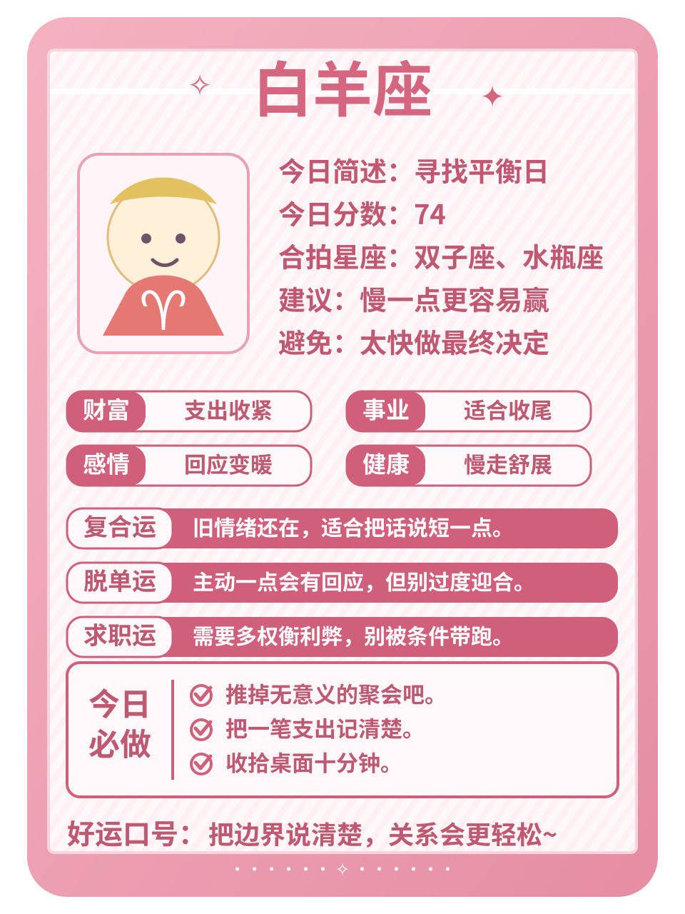
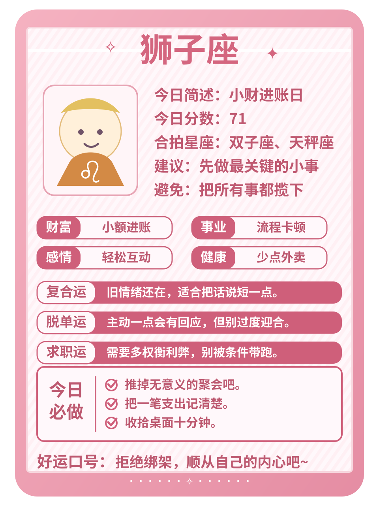
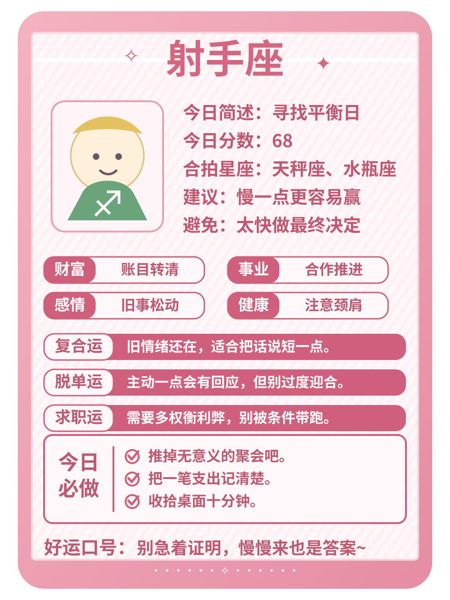

**白羊**：表达是今天的关键词。你们适合先把决定做小，先用简洁的话说出自己的需求，再决定要不要加码。不需要急着证明每一个判断。好运动作：收回一项不必要的支出。

**狮子**：今天更适合多看一眼能积累资源的安排。愿意扛事会让你对外界反馈格外敏感，别为了热闹接下所有事情。好运动作：把未完成的事标出截止点。

**射手**：适合把真实想法放到台面上。你本来心气会动，今天用简洁的话说出自己的需求会更顺。不需要急着证明每一个判断。好运动作：收回一项不必要的支出。

## 土象星座

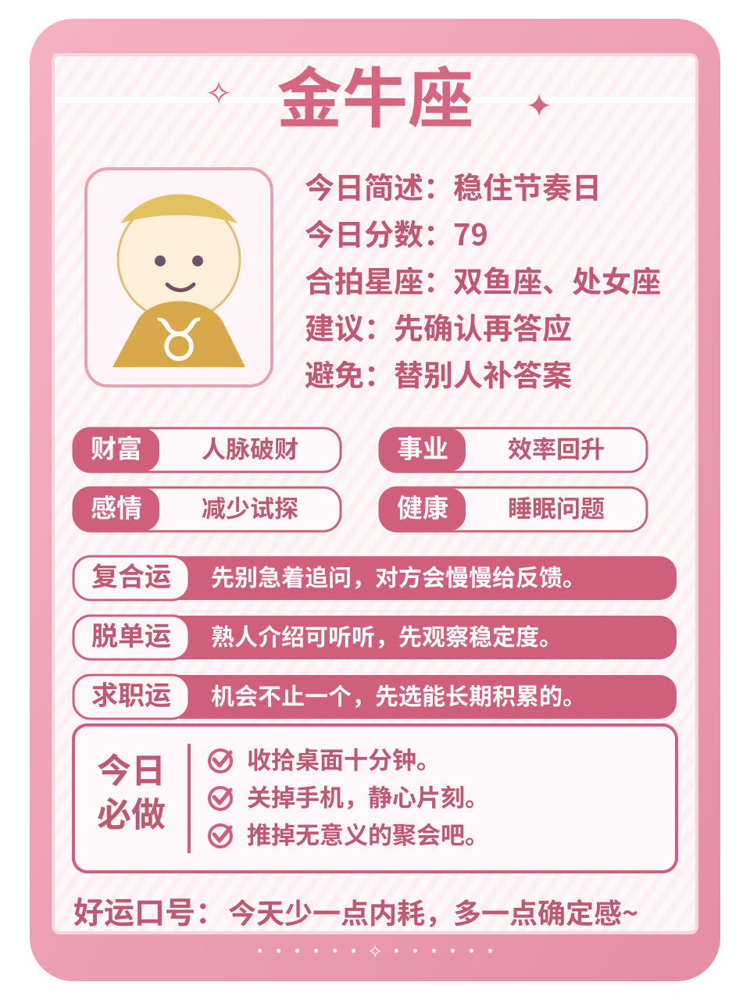
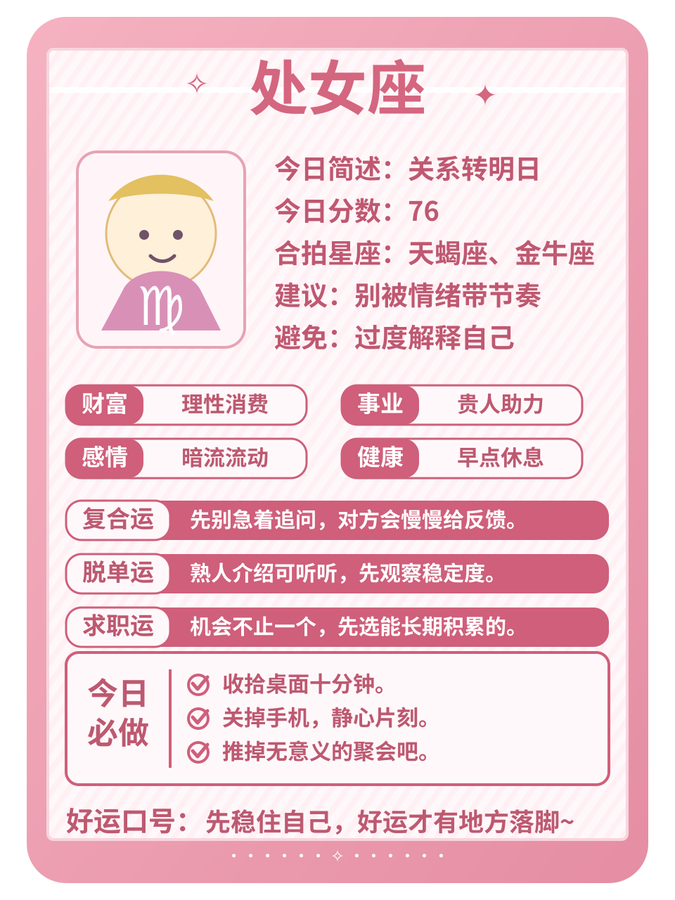
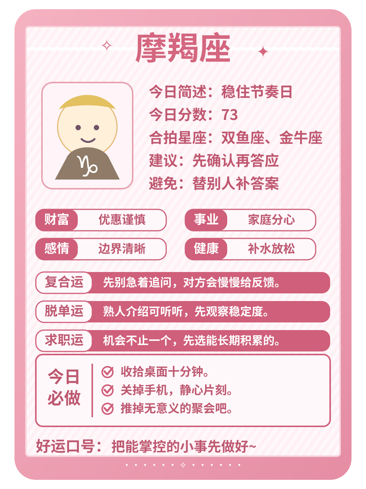

**金牛**：今天更适合把支出、分摊或回款理清。在意实际回报会让你对外界反馈格外敏感，不必为了面子把账算得含糊。好运动作：把一个小邀约认真听完。

**处女**：人际距离需要跟着真实感受微调。你本来重视细节，今天把回应稳定的人放在前面会更顺。别把照顾所有人的期待变成任务。好运动作：发出那句需要确认的话。

**摩羯**：财务是今天的关键词。你们适合守住边界，先把支出、分摊或回款理清，再决定要不要加码。不必为了面子把账算得含糊。好运动作：把一个小邀约认真听完。

## 风象星座

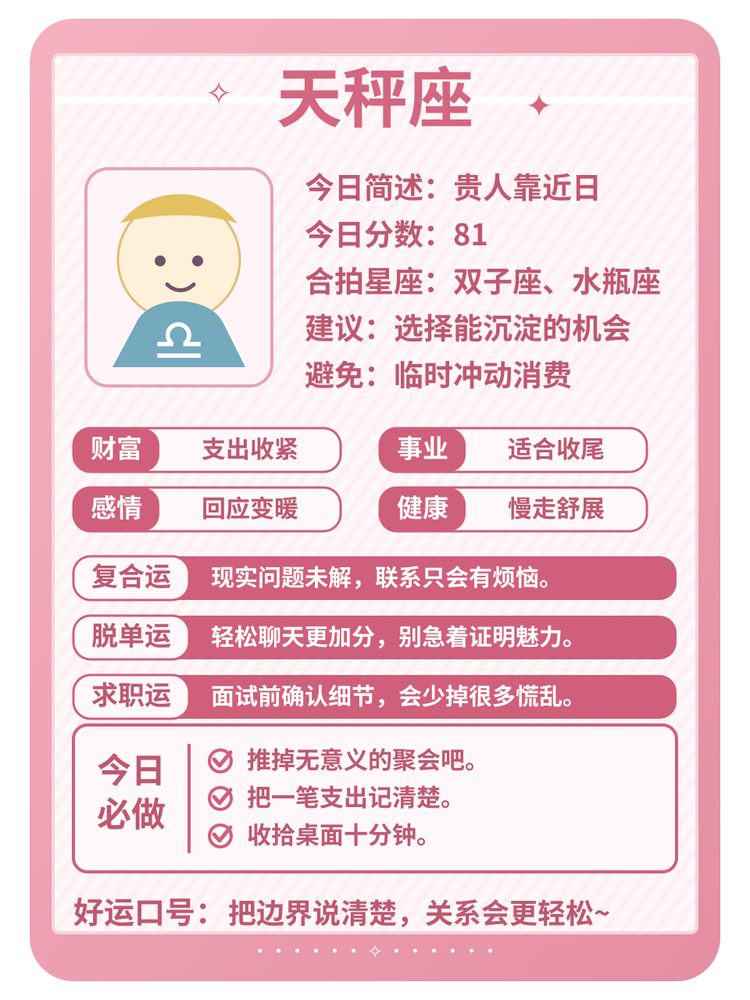
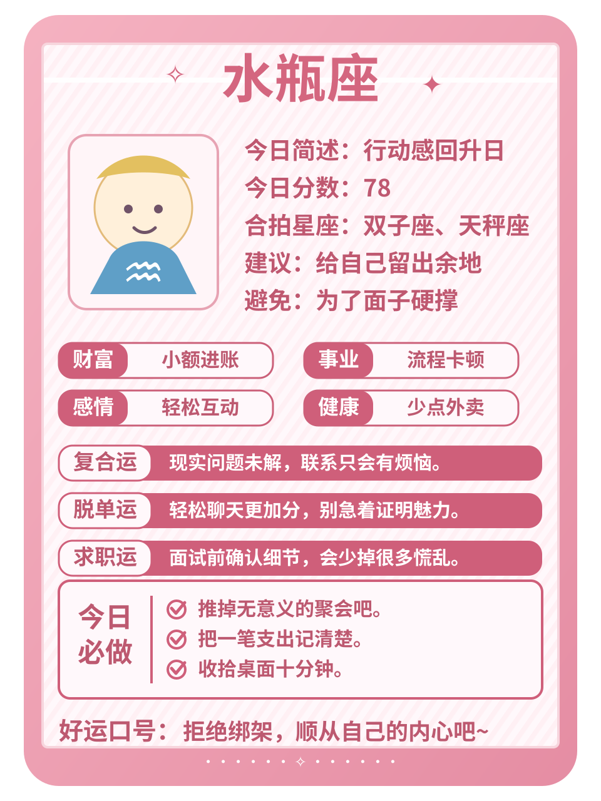

**双子**：手上的关键任务适合往前推一点。你本来反应快，今天先完成最卡的一步会更顺。别让临时消息替你决定优先级。好运动作：先写下今天最重要的一件事。

**天秤**：减法是今天的关键词。你们需要减少无效照顾，先删掉一件低回报的消耗，再决定要不要加码。别把忙碌误当成进展。好运动作：给自己留二十分钟安静整理。

**水瓶**：今天更适合先完成最卡的一步。不喜欢被催会让你对外界反馈格外敏感，别让临时消息替你决定优先级。好运动作：先写下今天最重要的一件事。

## 水象星座

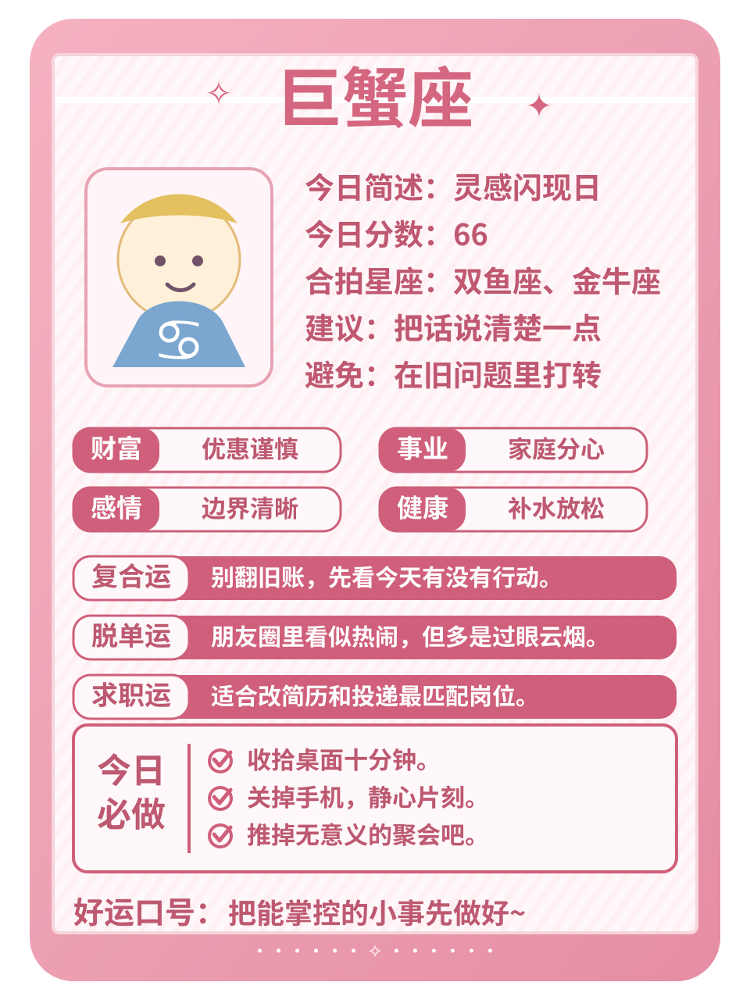
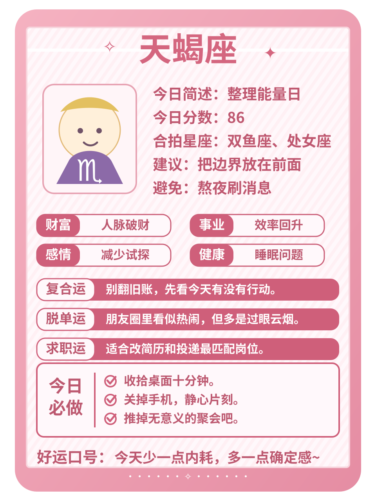
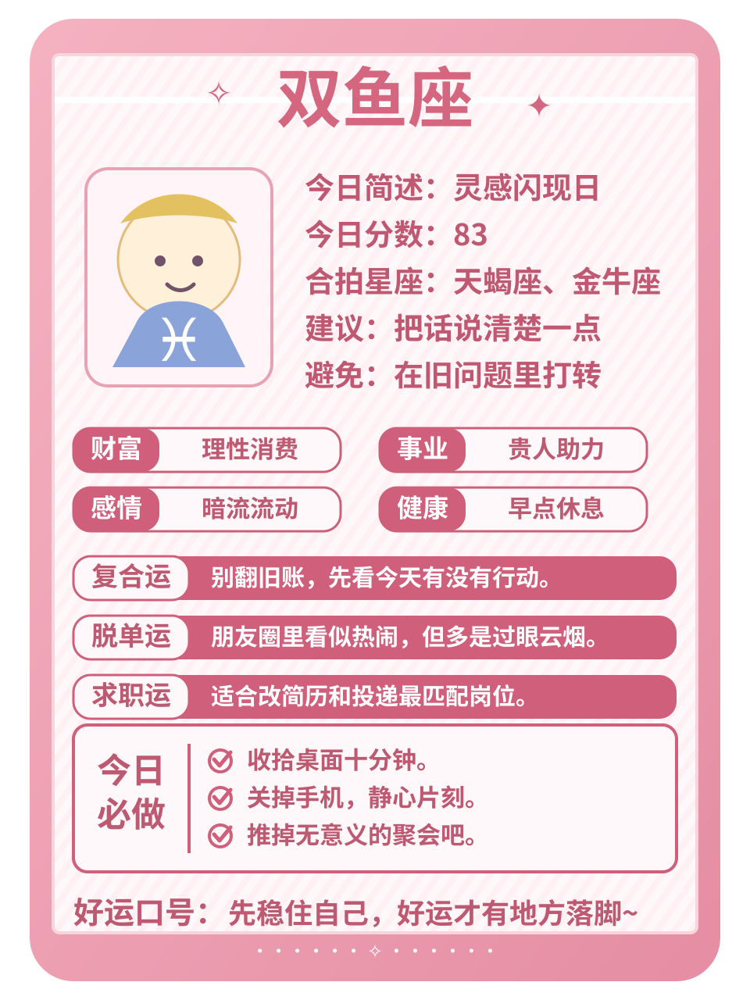

**巨蟹**：收尾是今天的关键词。你们容易被旧习惯影响，先把搁置的沟通或流程定下来，再决定要不要加码。少让拖延把情绪越拉越长。好运动作：结束一段重复沟通。

**天蝎**：今天更适合把需要确认的话说清楚。不爱说破会让你对外界反馈格外敏感，不必替沉默找太多理由。好运动作：把注意力从比较里收回来。

**双鱼**：反复出现的旧问题需要一个明确收口。你本来感受细腻，今天把搁置的沟通或流程定下来会更顺。少让拖延把情绪越拉越长。好运动作：结束一段重复沟通。

今日收束：让小动作慢慢沉淀成收获。把注意力放回可以行动的部分，稳定一点，今天的状态就会更容易接住。
