7月31日的十二星座日运关键词是“看清反馈”。下面按四象星座整理今天更适合抓住的一件小事。

## 火象星座

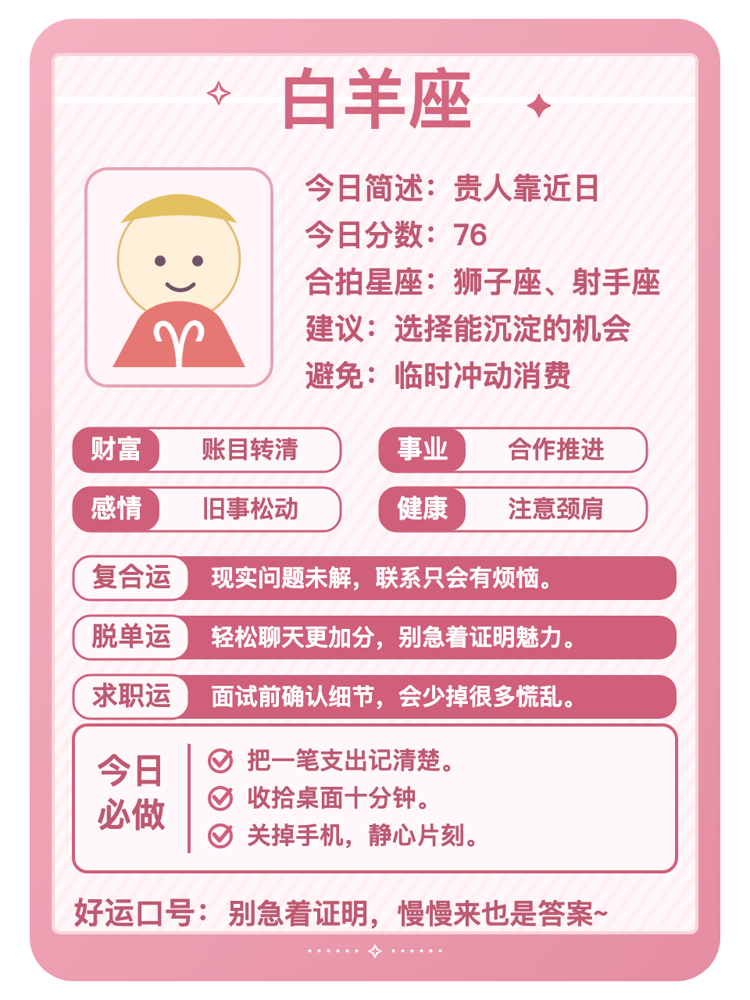
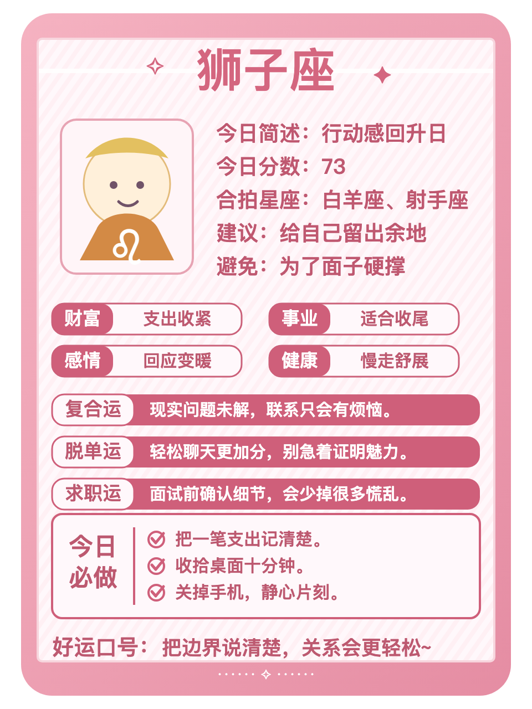

**白羊**：减法是今天的关键词。你们适合先把决定做小，先删掉一件低回报的消耗，再决定要不要加码。别把忙碌误当成进展。好运动作：给自己留二十分钟安静整理。

**狮子**：今天更适合先完成最卡的一步。愿意扛事会让你对外界反馈格外敏感，别让临时消息替你决定优先级。好运动作：先写下今天最重要的一件事。

**射手**：今天更需要从忙乱里收回一点注意力。你本来心气会动，今天删掉一件低回报的消耗会更顺。别把忙碌误当成进展。好运动作：给自己留二十分钟安静整理。

## 土象星座

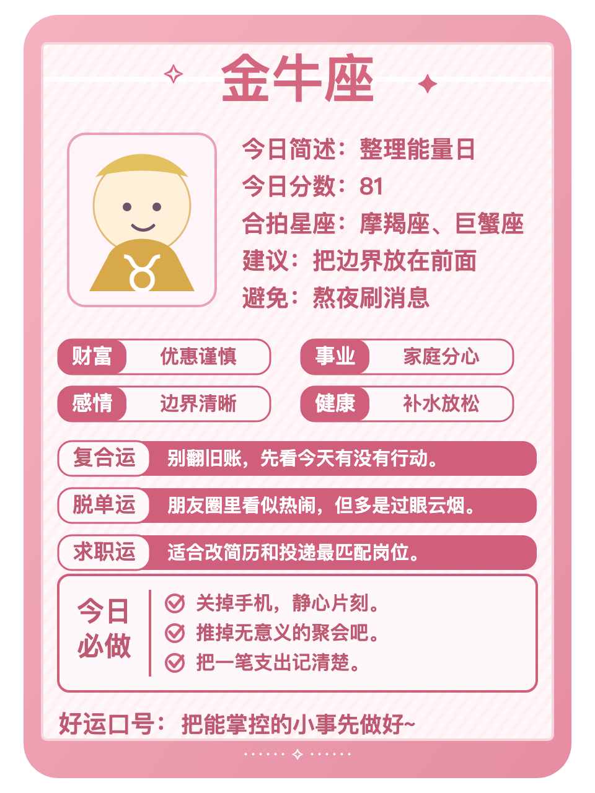
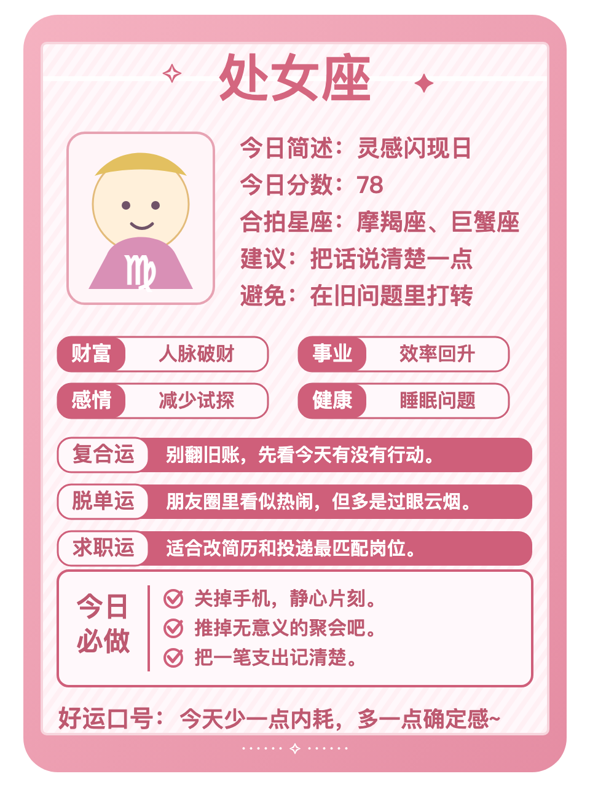
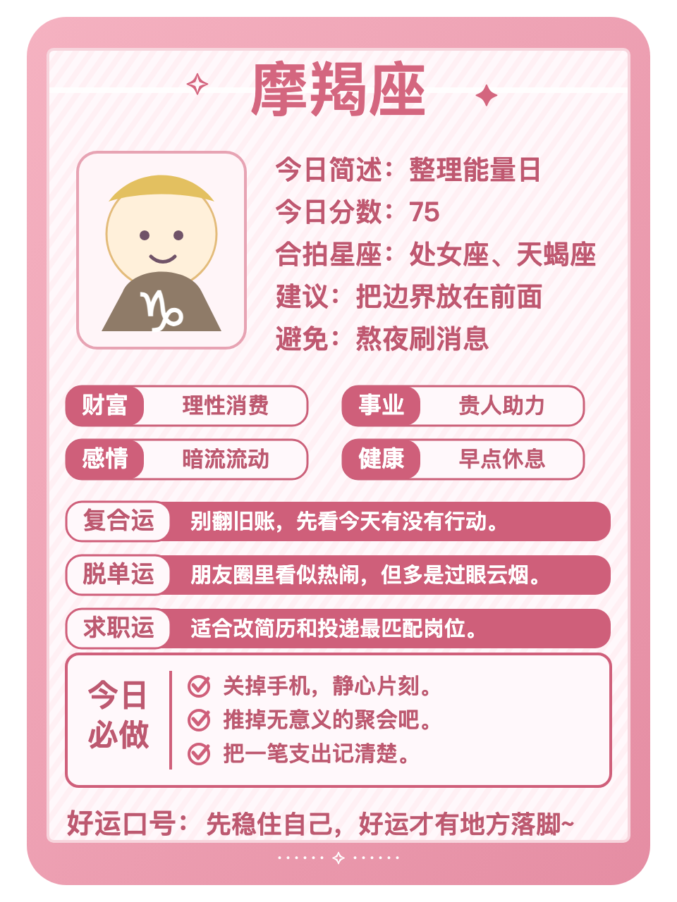

**金牛**：今天更适合把需要确认的话说清楚。在意实际回报会让你对外界反馈格外敏感，不必替沉默找太多理由。好运动作：把注意力从比较里收回来。

**处女**：反复出现的旧问题需要一个明确收口。你本来重视细节，今天把搁置的沟通或流程定下来会更顺。少让拖延把情绪越拉越长。好运动作：结束一段重复沟通。

**摩羯**：沟通是今天的关键词。你们适合守住边界，先把需要确认的话说清楚，再决定要不要加码。不必替沉默找太多理由。好运动作：把注意力从比较里收回来。

## 风象星座

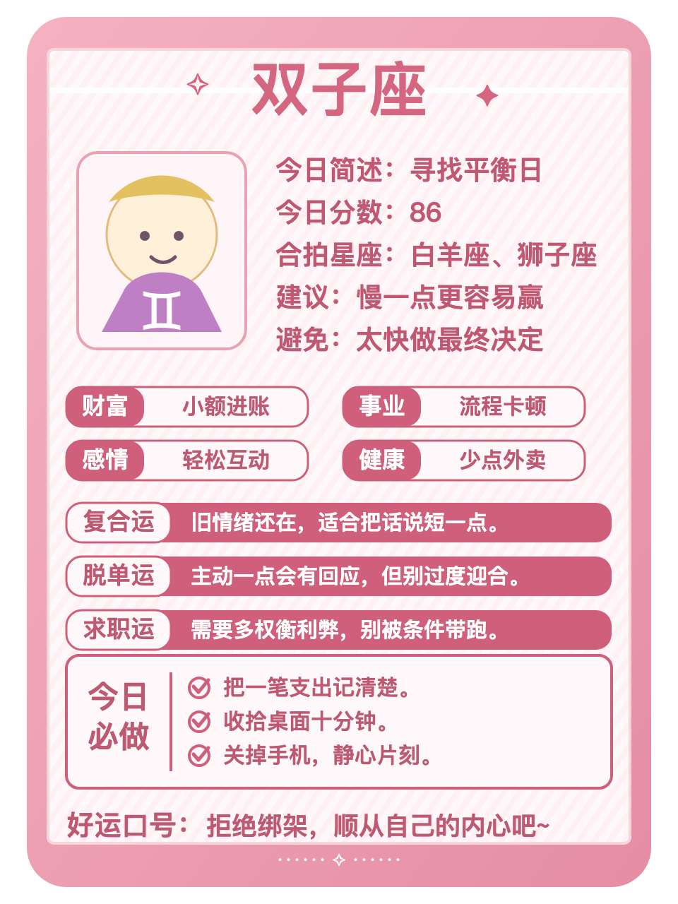
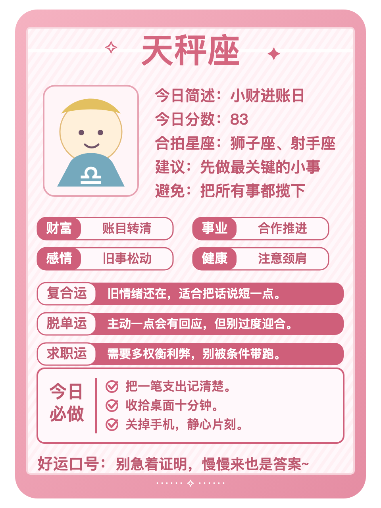
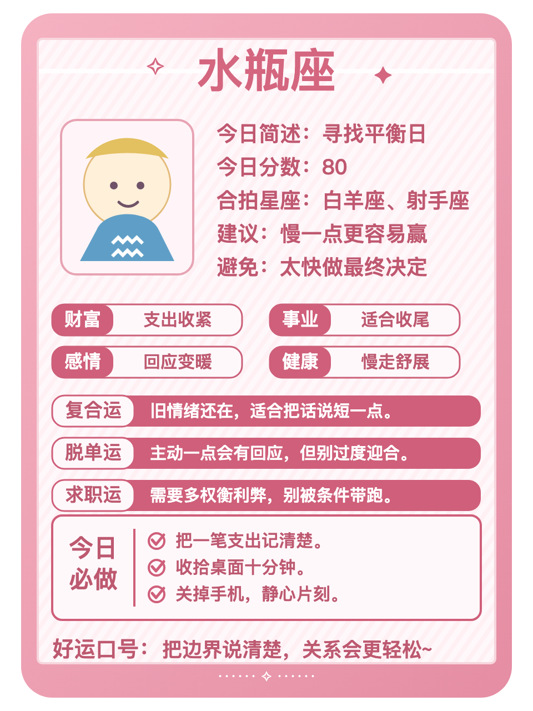

**双子**：适合把真实想法放到台面上。你本来反应快，今天用简洁的话说出自己的需求会更顺。不需要急着证明每一个判断。好运动作：收回一项不必要的支出。

**天秤**：机会是今天的关键词。你们需要减少无效照顾，先多看一眼能积累资源的安排，再决定要不要加码。别为了热闹接下所有事情。好运动作：把未完成的事标出截止点。

**水瓶**：今天更适合用简洁的话说出自己的需求。不喜欢被催会让你对外界反馈格外敏感，不需要急着证明每一个判断。好运动作：收回一项不必要的支出。

## 水象星座

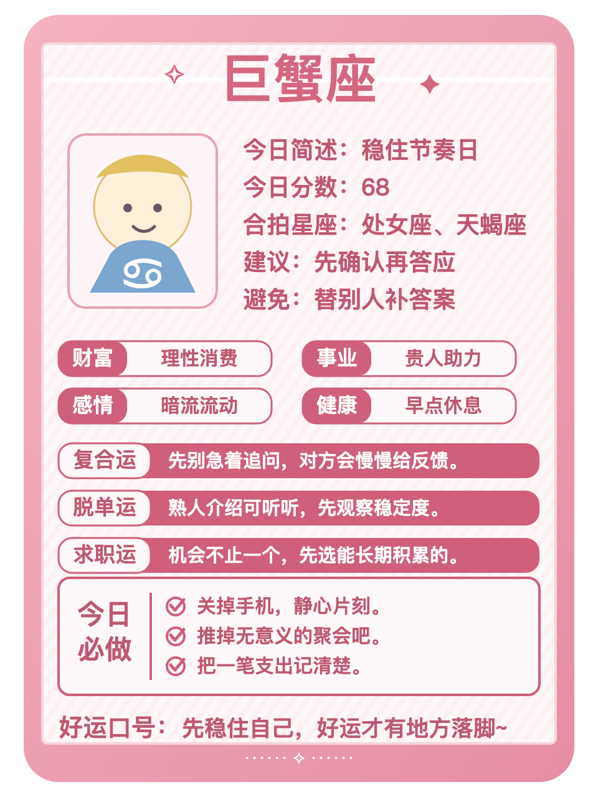
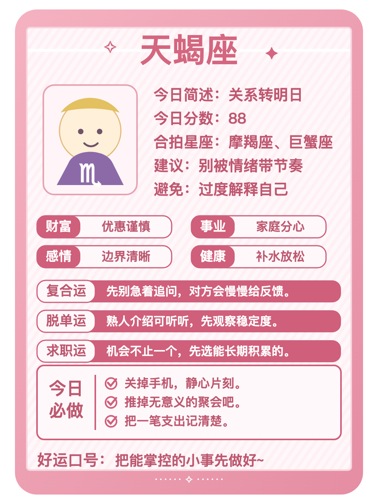
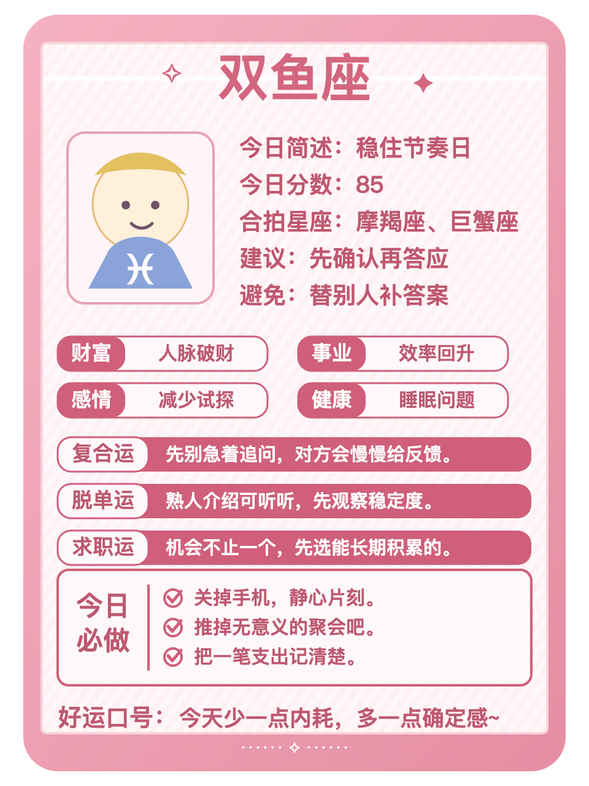

**巨蟹**：财务是今天的关键词。你们容易被旧习惯影响，先把支出、分摊或回款理清，再决定要不要加码。不必为了面子把账算得含糊。好运动作：把一个小邀约认真听完。

**天蝎**：今天更适合把回应稳定的人放在前面。不爱说破会让你对外界反馈格外敏感，别把照顾所有人的期待变成任务。好运动作：发出那句需要确认的话。

**双鱼**：钱和资源的边界值得提前确认。你本来感受细腻，今天把支出、分摊或回款理清会更顺。不必为了面子把账算得含糊。好运动作：把一个小邀约认真听完。

今日收束：把精力留给稳定的关系和安排。把注意力放回可以行动的部分，稳定一点，今天的状态就会更容易接住。
