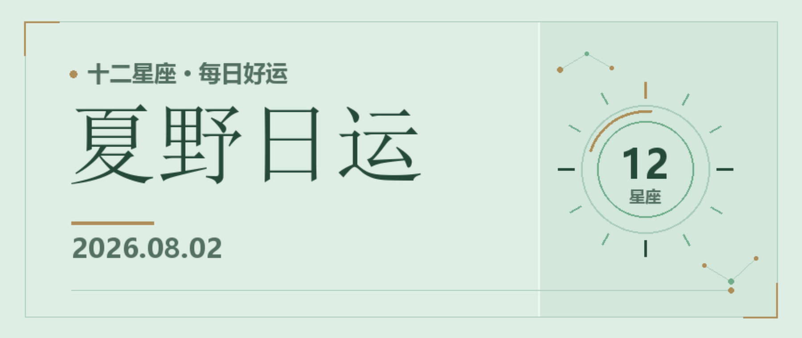

8月2日的十二星座日运关键词是“先稳后动”。下面按四象星座整理今天更适合抓住的一件小事。

## 火象星座

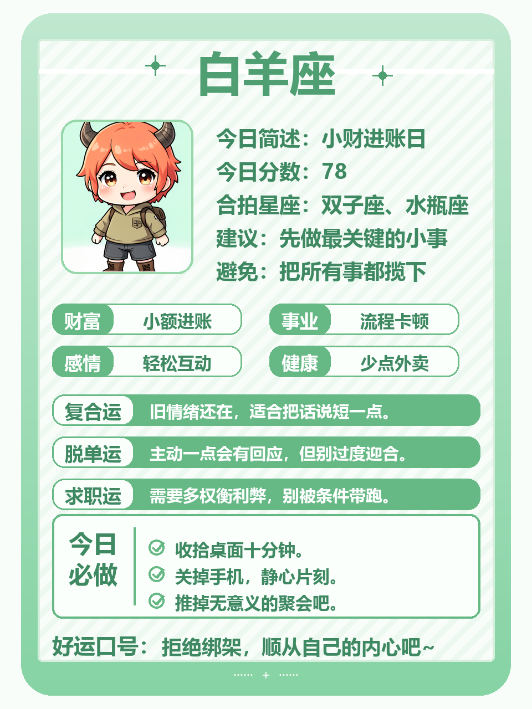
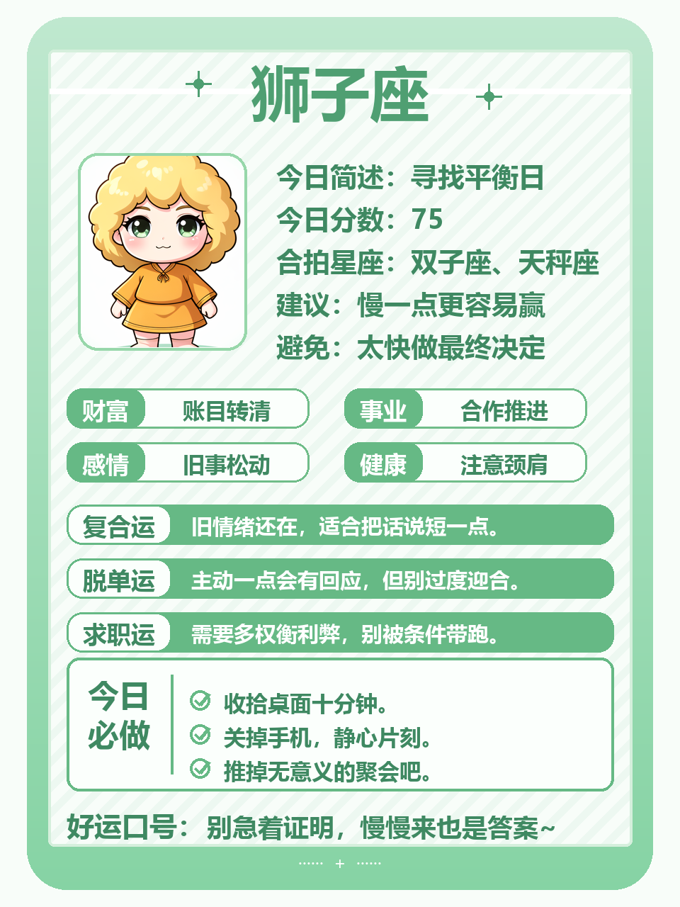
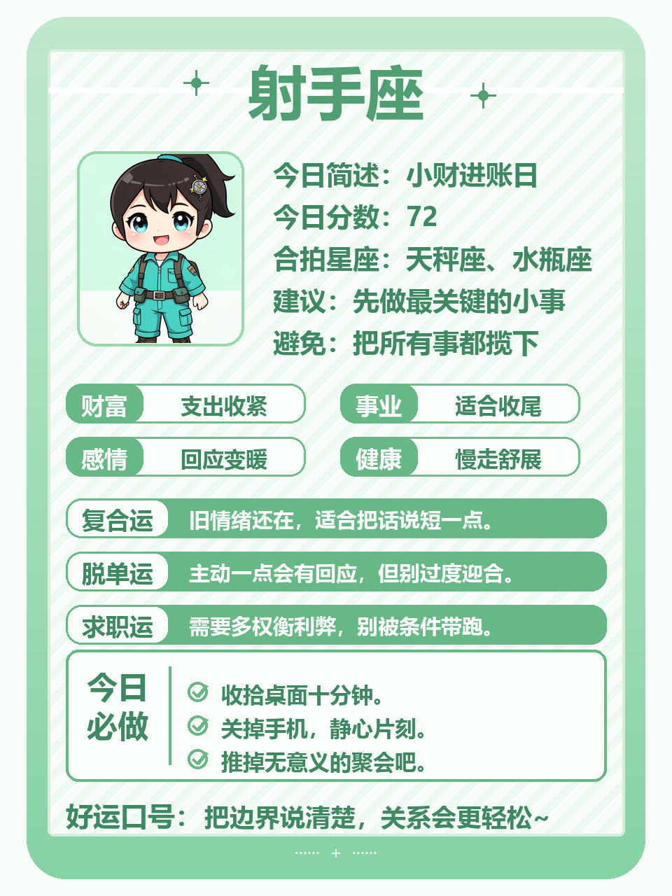

**白羊**：小机会更可能藏在日常邀约里。你本来行动快，今天多看一眼能积累资源的安排会更顺。别为了热闹接下所有事情。好运动作：把未完成的事标出截止点。

**狮子**：表达是今天的关键词。你们适合主动争取资源，先用简洁的话说出自己的需求，再决定要不要加码。不需要急着证明每一个判断。好运动作：收回一项不必要的支出。

**射手**：今天更适合多看一眼能积累资源的安排。喜欢新方向会让你对外界反馈格外敏感，别为了热闹接下所有事情。好运动作：把未完成的事标出截止点。

## 土象星座

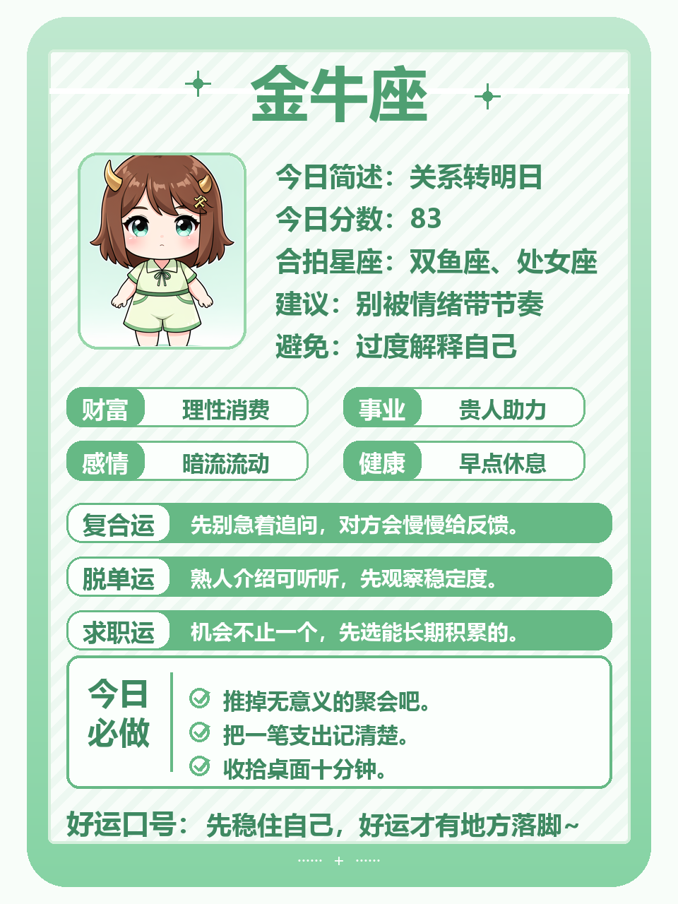
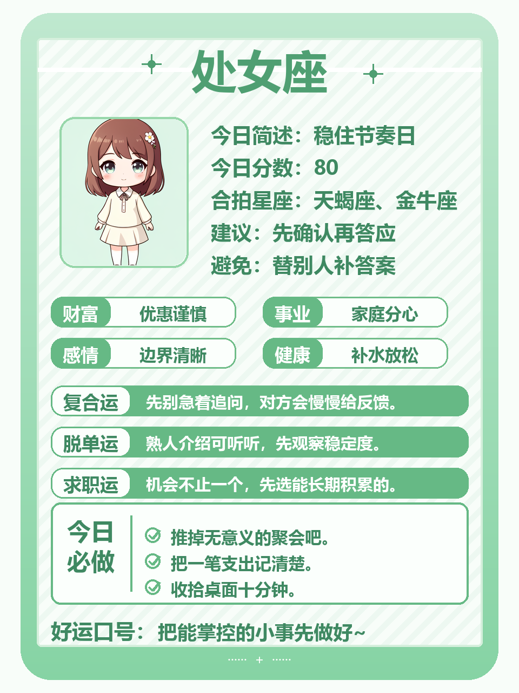
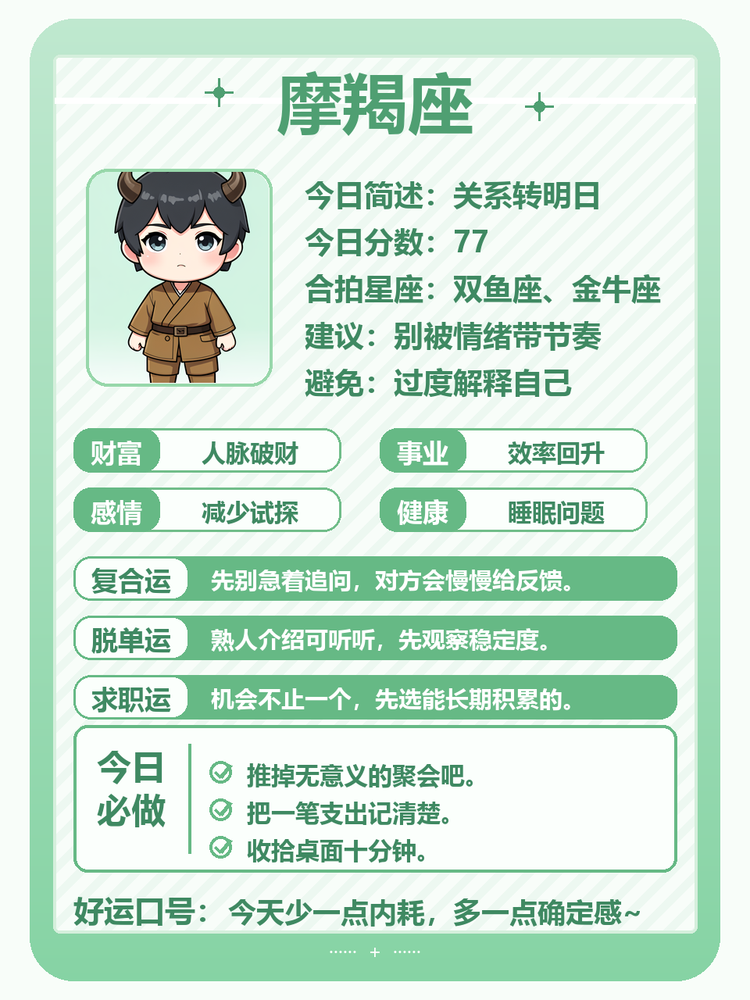

**金牛**：关系是今天的关键词。你们适合把账算清楚，先把回应稳定的人放在前面，再决定要不要加码。别把照顾所有人的期待变成任务。好运动作：发出那句需要确认的话。

**处女**：今天更适合把支出、分摊或回款理清。怕失控会让你对外界反馈格外敏感，不必为了面子把账算得含糊。好运动作：把一个小邀约认真听完。

**摩羯**：人际距离需要跟着真实感受微调。你本来目标感强，今天把回应稳定的人放在前面会更顺。别把照顾所有人的期待变成任务。好运动作：发出那句需要确认的话。

## 风象星座

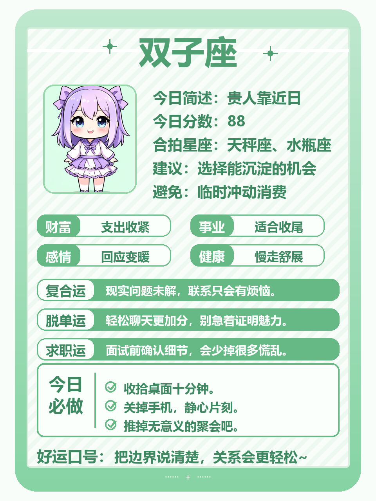
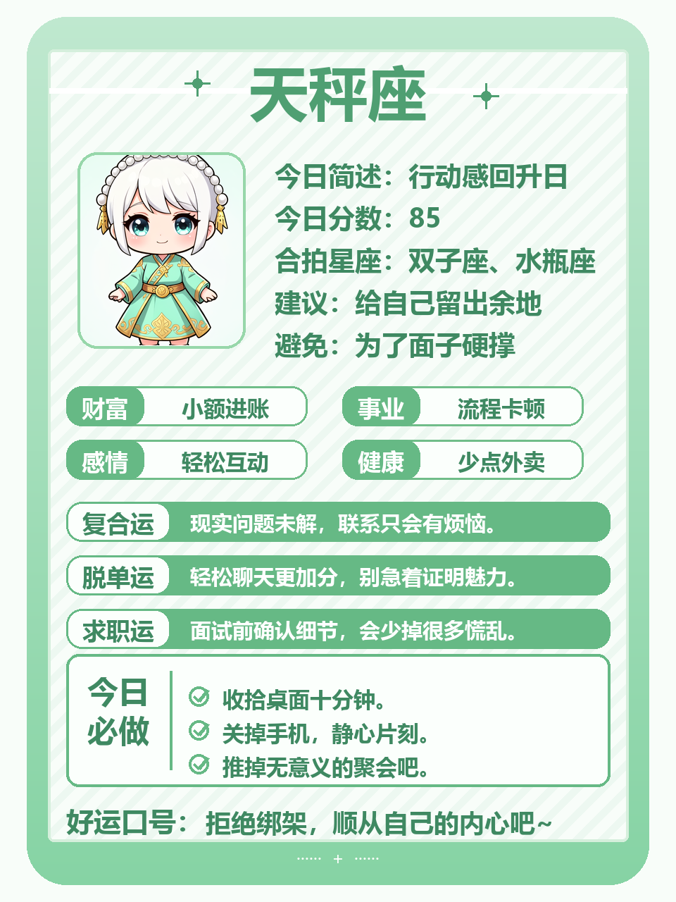
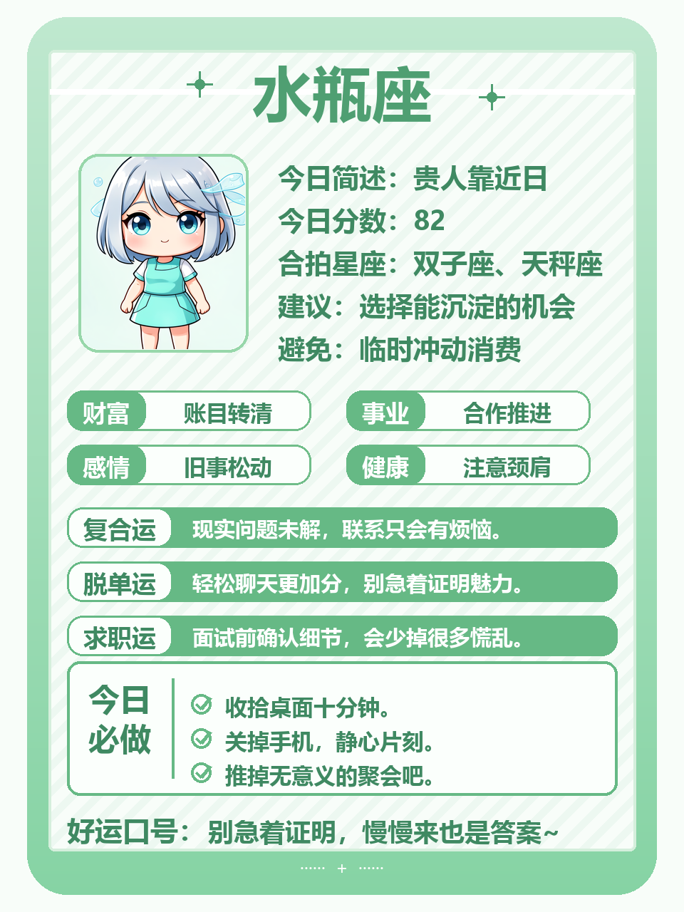

**双子**：今天更适合删掉一件低回报的消耗。信息很灵会让你对外界反馈格外敏感，别把忙碌误当成进展。好运动作：给自己留二十分钟安静整理。

**天秤**：手上的关键任务适合往前推一点。你本来看重关系平衡，今天先完成最卡的一步会更顺。别让临时消息替你决定优先级。好运动作：先写下今天最重要的一件事。

**水瓶**：减法是今天的关键词。你们容易从变化里找到出口，先删掉一件低回报的消耗，再决定要不要加码。别把忙碌误当成进展。好运动作：给自己留二十分钟安静整理。

## 水象星座

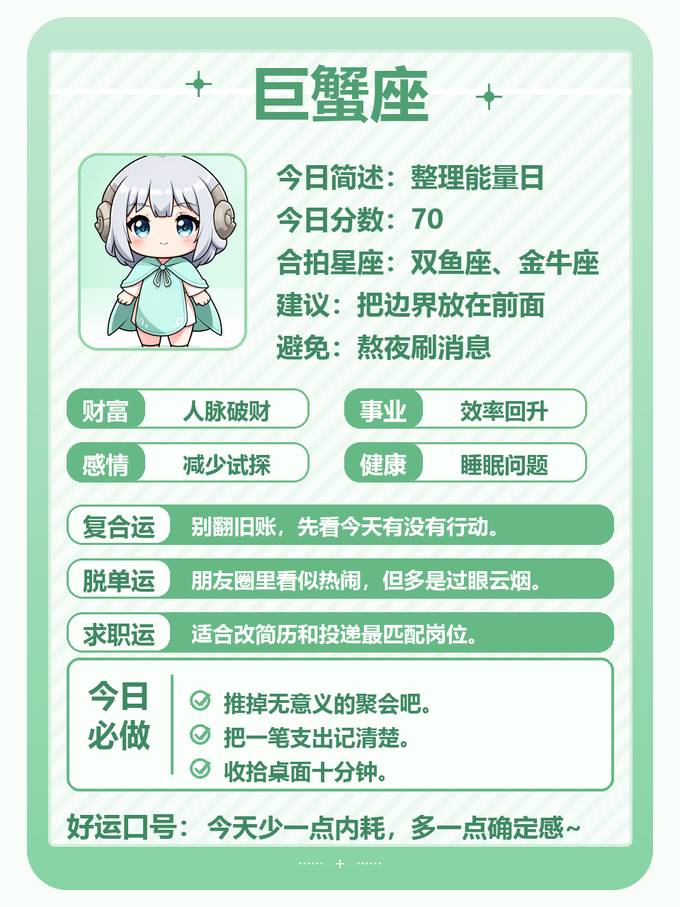
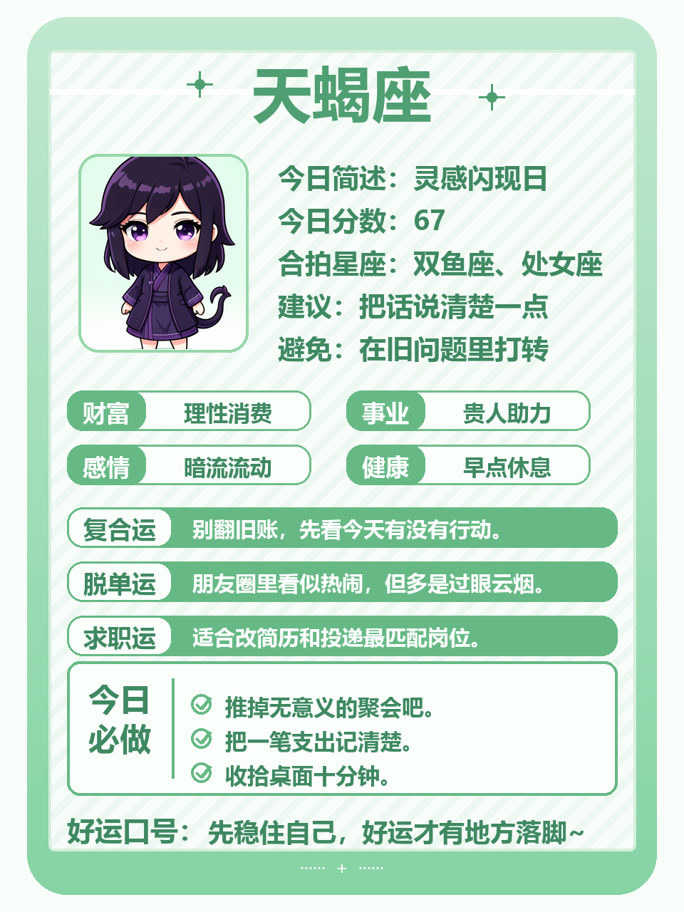
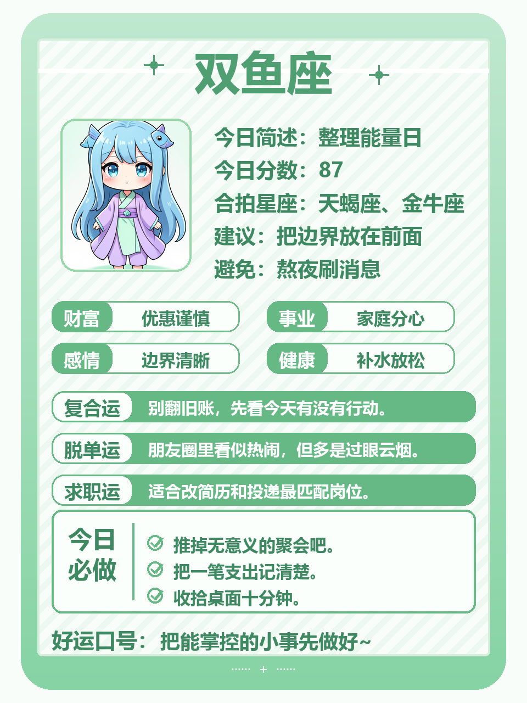

**巨蟹**：关系里的真实反馈比猜测更重要。你本来人际敏感，今天把需要确认的话说清楚会更顺。不必替沉默找太多理由。好运动作：把注意力从比较里收回来。

**天蝎**：收尾是今天的关键词。你们适合看清真实动机，先把搁置的沟通或流程定下来，再决定要不要加码。少让拖延把情绪越拉越长。好运动作：结束一段重复沟通。

**双鱼**：今天更适合把需要确认的话说清楚。共情很强会让你对外界反馈格外敏感，不必替沉默找太多理由。好运动作：把注意力从比较里收回来。

今日收束：把能控制的事情往前推一点。把注意力放回可以行动的部分，稳定一点，今天的状态就会更容易接住。
