新的一周，先看清哪些日子适合推进，哪些日子更需要留出余地。下面的内容可结合太阳星座和上升星座阅读。

## 本周星象日历

**8月4日 周二｜凯龙星在金牛座逆行**

与安全感、价值感和资源安排有关的旧问题，适合重新检查，而不是急着证明已经解决。

**8月6日 周四｜下弦月**

一周进入整理和删减阶段，适合收尾、复盘及调整已经不再匹配当前目标的安排。

**8月7日 周五｜金星进入天秤座**

关系与合作更强调平等、分寸和审美表达，适合商量规则，也适合改善相处氛围。

**8月9日 周日｜月亮与火星相合**

行动速度和情绪反应同时加快，适合处理短任务，但重要决定需要给自己一次复核。

先记住和自己当前计划最相关的一两个节点，不必把每一条都当成确定结果。

## 火象星座

**点击查看大图**

| 白羊座 | 狮子座 | 射手座 |
| :---: | :---: | :---: |
| 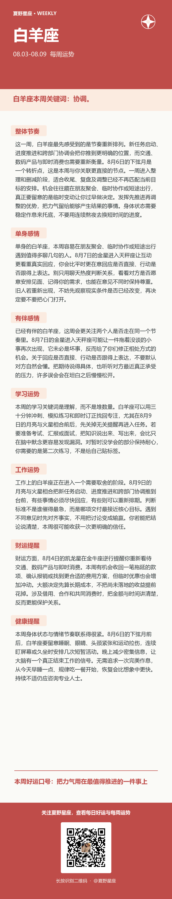 | 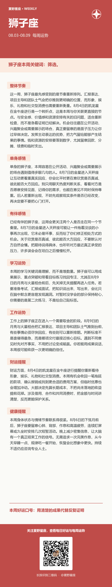 | 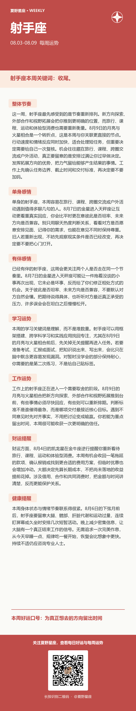 |

## 土象星座

**点击查看大图**

| 金牛座 | 处女座 | 摩羯座 |
| :---: | :---: | :---: |
| 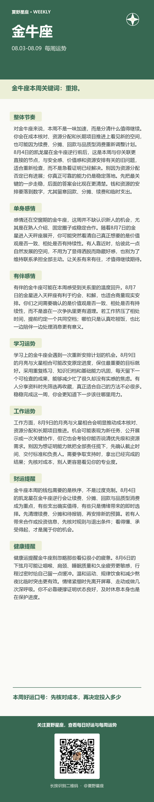 | 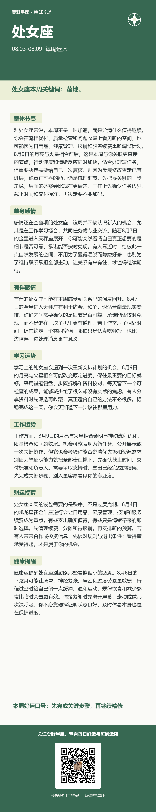 | 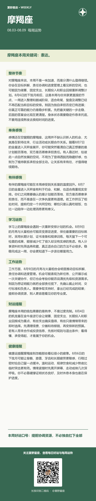 |

## 风象星座

**点击查看大图**

| 双子座 | 天秤座 | 水瓶座 |
| :---: | :---: | :---: |
| 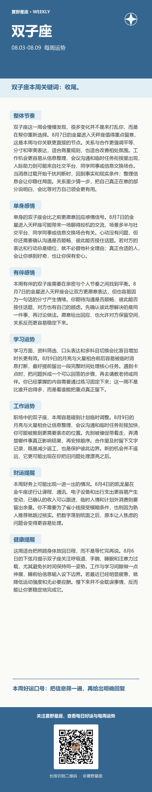 | 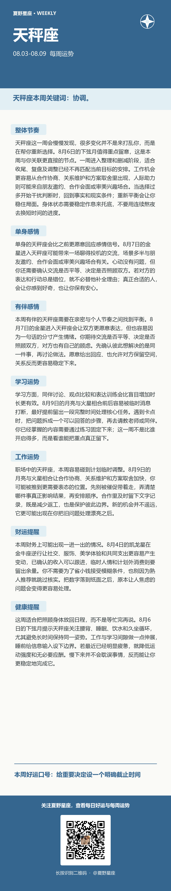 | 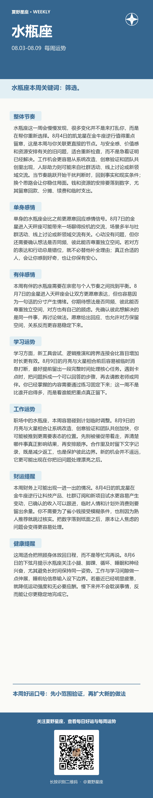 |

## 水象星座

**点击查看大图**

| 巨蟹座 | 天蝎座 | 双鱼座 |
| :---: | :---: | :---: |
| 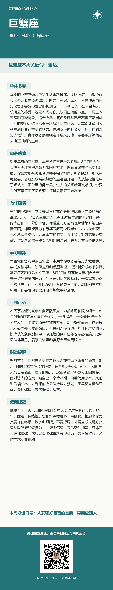 | 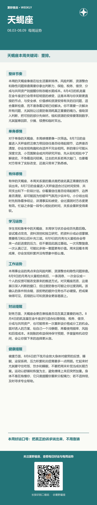 | 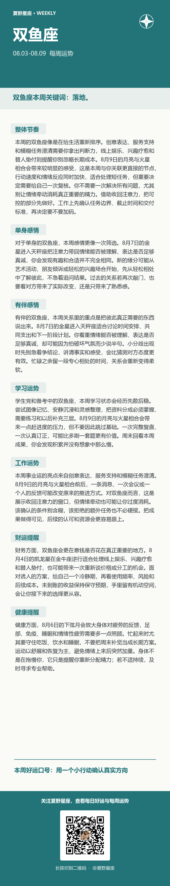 |

## 重点日期展开

本周相对更值得留意的是白羊座、双子座、天秤座、水瓶座；关键节点集中在8月4日、8月6日、8月7日、8月9日。先看与自己现实计划最相关的部分，不需要把所有提示同时套在身上。

**周二｜凯龙星在金牛座逆行**

这次逆行更像一次内部复盘：过去怎样看待自己的能力，怎样用金钱、物品或稳定关系换取安心，可能再次成为关注点。遇到熟悉的不安时，先分清它来自现实压力，还是旧经验留下的条件反射。工作上可以重新核对报价、职责与长期投入，关系里则适合说清真正需要的支持，不必用过度付出来换确定感。相对更值得留意的是金牛座、天蝎座、狮子座、水瓶座。

**周四｜下弦月**

下弦月适合把注意力从不断增加任务，转向检查哪些事情值得继续。已经有结果的项目及时归档，反复消耗却没有进展的沟通可以先暂停。若计划与现实出现偏差，不必把调整理解成失败；删掉低优先级事项，反而能给真正重要的工作留出空间。身体状态也需要减负，连续熬夜、饮食混乱和过密日程都应在这几天主动修正。相对更值得留意的是巨蟹座、摩羯座、白羊座、天秤座。

**周五｜金星进入天秤座**

金星进入天秤座后，人际互动会更看重彼此是否愿意倾听，以及付出能否保持平衡。适合处理合作邀约、关系确认、形象调整和需要协商的事项，但礼貌不等于回避立场。单身者可以观察对方是否有稳定行动，有伴者适合讨论共同时间和费用安排；工作合作则要把好听的设想落到交付、期限和责任人，避免只维持表面和谐。相对更值得留意的是天秤座、白羊座、双子座、水瓶座。

**周日｜月亮与火星相合**

月亮与火星靠近时，执行力会被迅速调动，原本拖着的事情可能突然想一次做完。它适合运动、清理积压任务和直接解决具体问题，却不适合在情绪最满时发长消息或做不可撤回的决定。沟通中先确认事实，再表达态度；出行和操作设备时留意急躁导致的小疏忽。把力量用在明确行动上，比争一时输赢更容易得到结果。相对更值得留意的是双子座、射手座、处女座、双鱼座。

星座运势是娱乐化的自我观察视角，不替代对工作、财务、关系和健康问题的专业判断。

