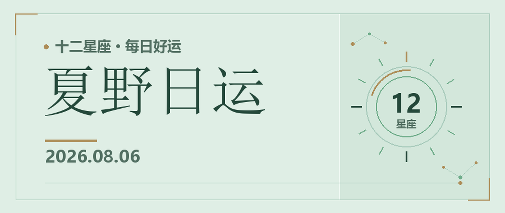

8月6日，很多答案藏在实际回应里。与其揣测别人怎么想，不如看他有没有行动；自己的事，也从最容易落地的一步开始。

## 火象星座

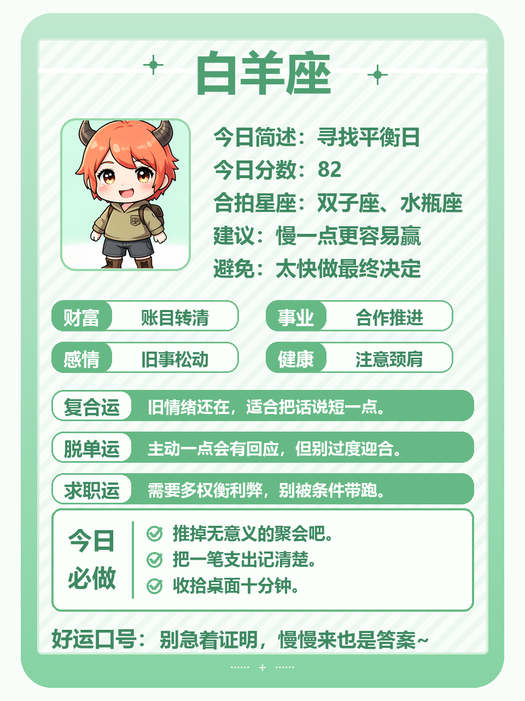
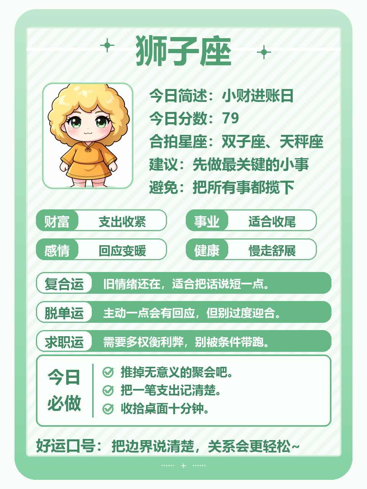
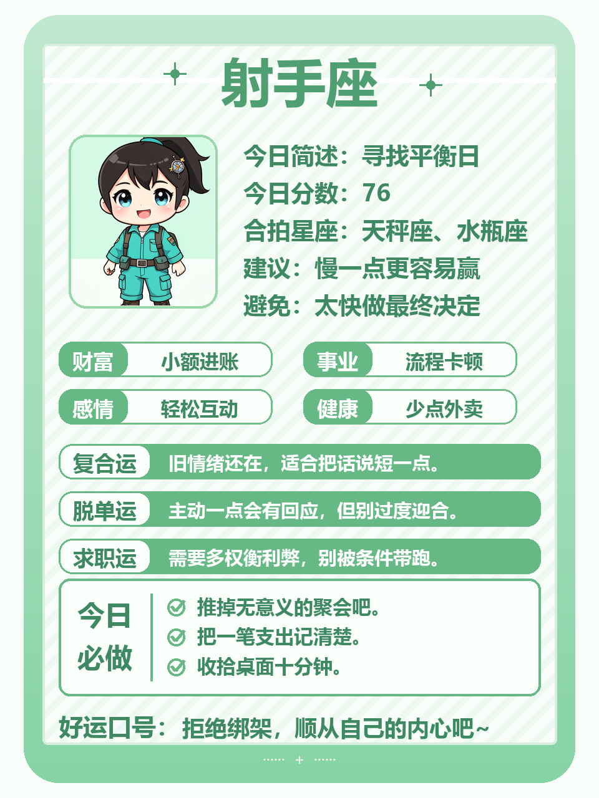

**白羊**：早上的脾气来得快，先喝口水再回消息，事情没有你第一眼看到的那么糟。下午适合处理需要拍板的任务。今日小事：删掉一句带情绪的话再发送。

**狮子**：今天有人认真听你的想法，别只讲漂亮的结果，也说说需要什么支持。穿一件让自己精神的衣服，会带来不错状态。今日小事：主动确认一次分工。

**射手**：外出或临时调整的概率高，钥匙、证件和充电线提前放进包里。一个老朋友带来的消息值得听，但先别急着下注。今日小事：为周末留一笔机动预算。

## 土象星座

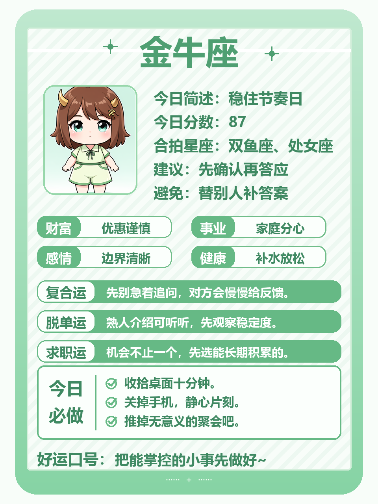
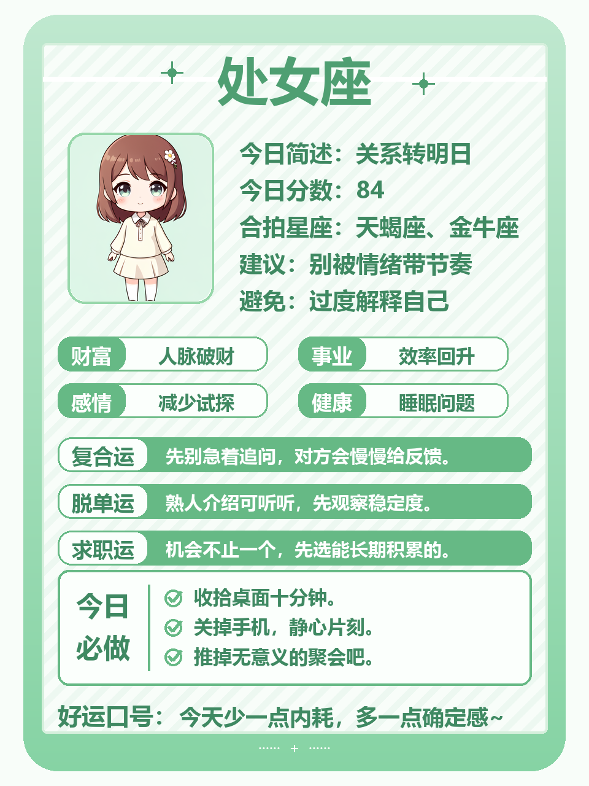
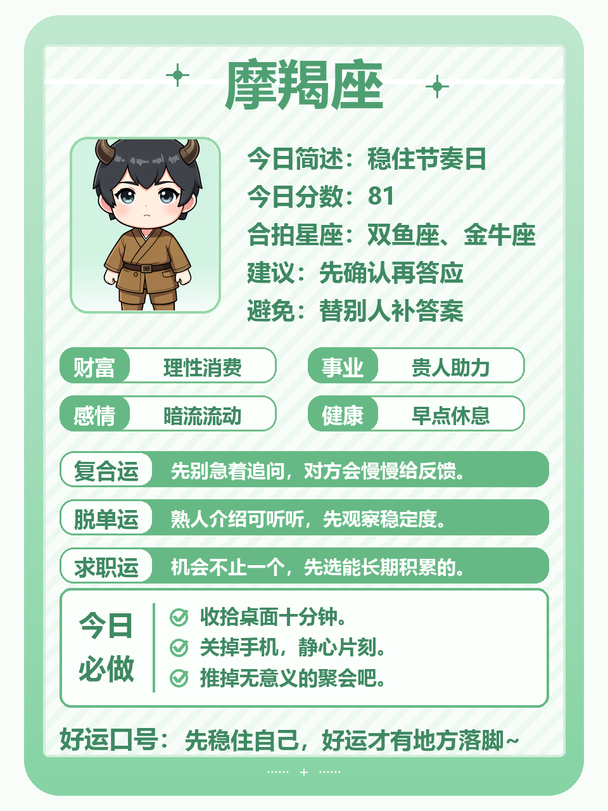

**金牛**：熟悉的办法今天依然管用，不必因为别人催得急就突然换方向。下午可能有一笔计划外开销，先问用途。今日小事：把下周要交的东西提前准备一半。

**处女**：一份材料或聊天记录里有你要找的线索，慢慢看会发现。别替粗心的人反复收拾残局，该提醒就提醒。今日小事：把常用文件重新命名归档。

**摩羯**：工作上会遇到一句模糊要求，追问清楚标准，能省掉后面的返工。晚上适合聊家庭安排，别只报结论。今日小事：把自己的顾虑也说出来。

## 风象星座

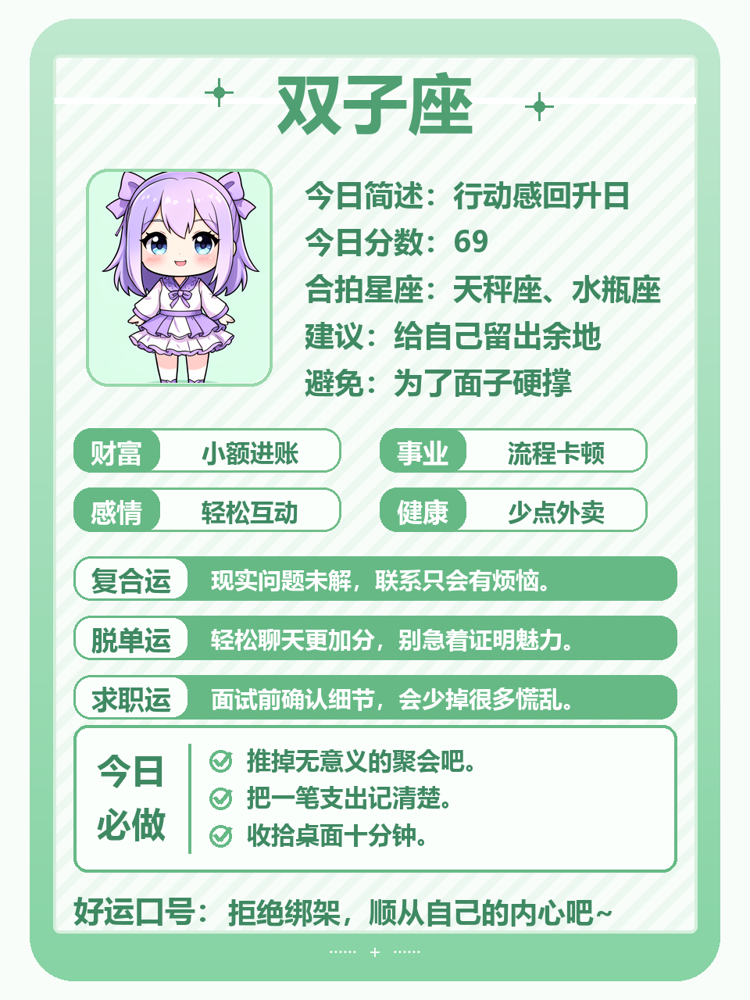
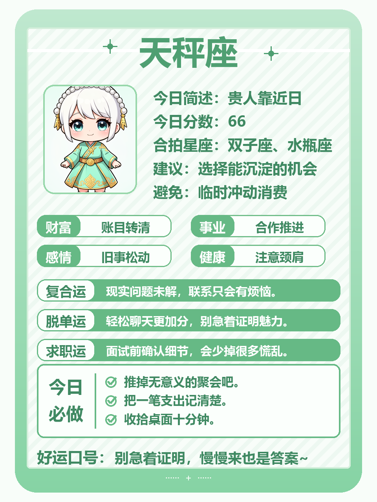
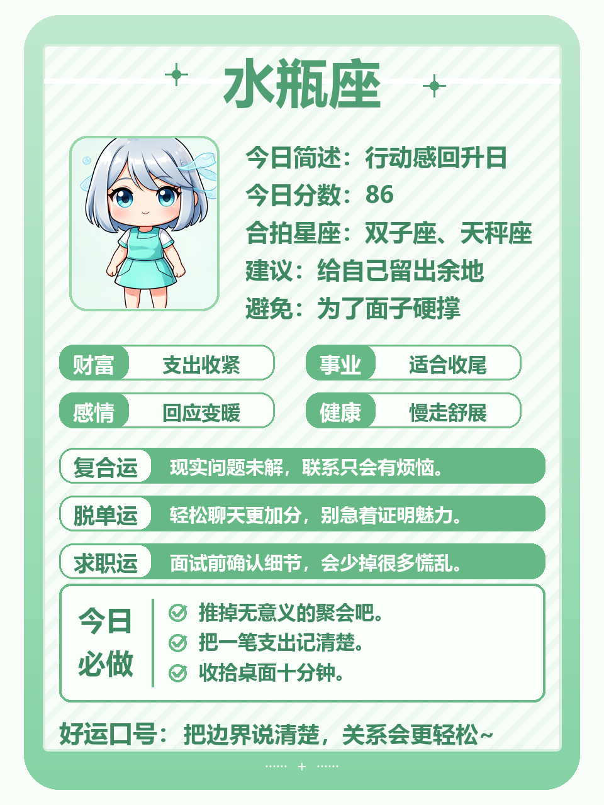

**双子**：今天说话很有感染力，适合汇报、提议或约人见面。只是别同时开太多话题，重要那件容易被淹没。今日小事：先完成一段完整表达，再看新消息。

**天秤**：一个人是否可靠，今天会通过小事表现出来。答应你的时间有没有做到，比好听的话更重要。消费方面不跟风。今日小事：把犹豫很久的小决定定下来。

**水瓶**：脑子转得快，上午适合想方案，下午再补细节。有人不理解你的跳跃思路，不必争，给他看一个简单示例。今日小事：把灵感写成三行可执行步骤。

## 水象星座

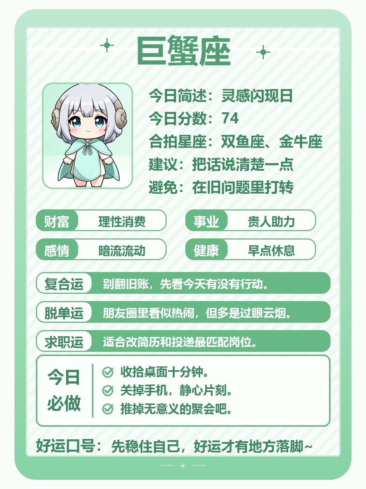
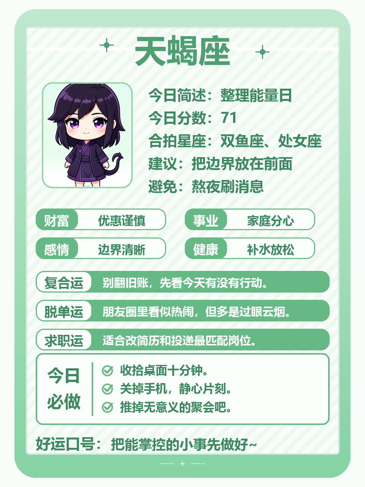
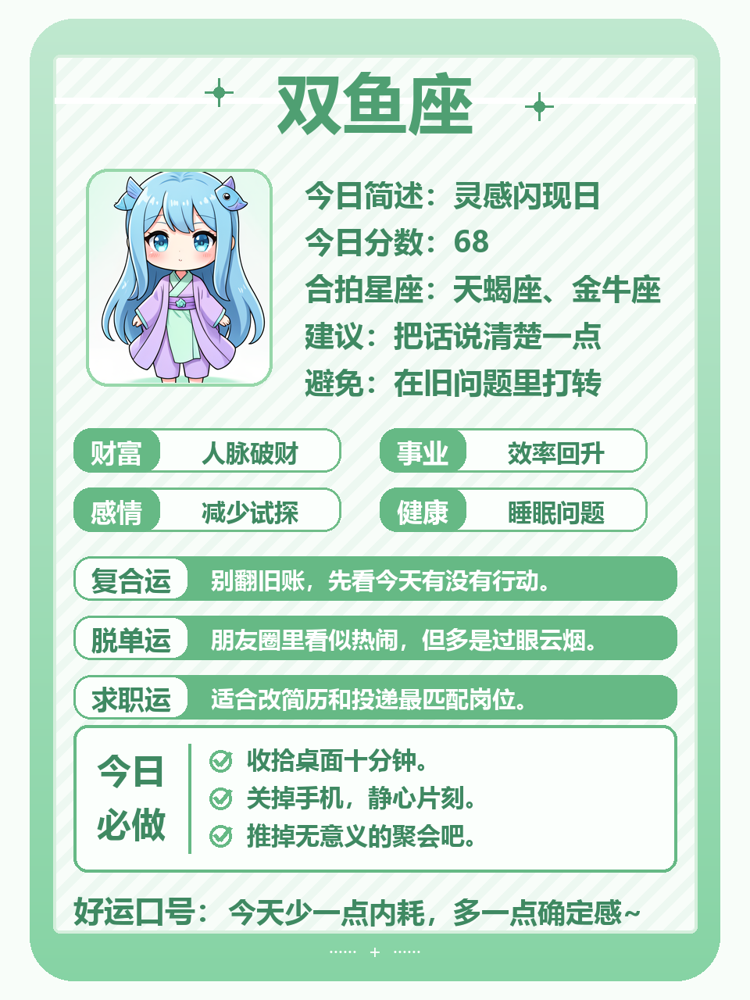

**巨蟹**：你牵挂的一件事会有新进展，未必完美，但足够让人松口气。别把家人的沉默理解成不满。今日小事：问一句“你需要我怎么帮”。

**天蝎**：今天适合核对账目、合同或重要约定，数字里藏着答案。关系上少做试探，对方的自然反应已经很说明问题。今日小事：收好一份重要凭证。

**双鱼**：上午稍微散漫，午后会逐渐找到手感。把耳机摘下来和身边人聊几句，可能听到有用建议。今日小事：先做那件十分钟能结束的小事。

今天的关键词是“有来有回”。愿意回应的人认真珍惜，没有回音的事先放一放，你的时间也需要被好好对待。

