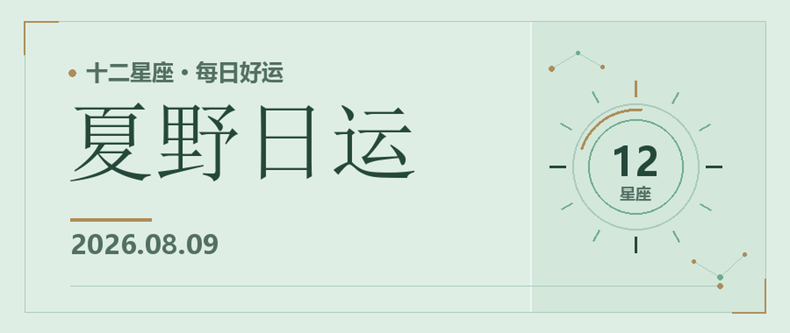

8月9日适合把一周轻轻收回来。今天不追进度，先看看哪些事已经够好了，哪些念头只是累的时候冒出来的。

## 火象星座

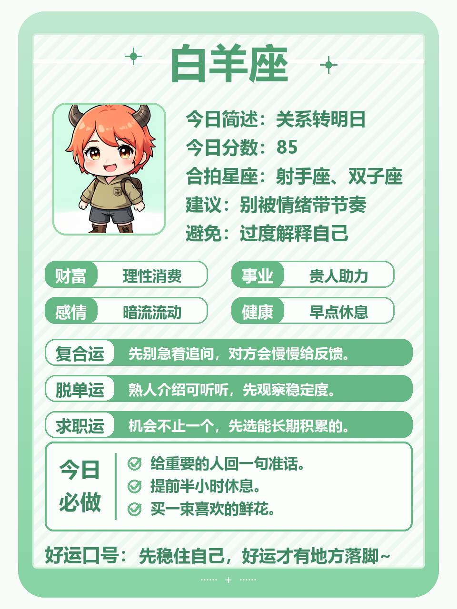
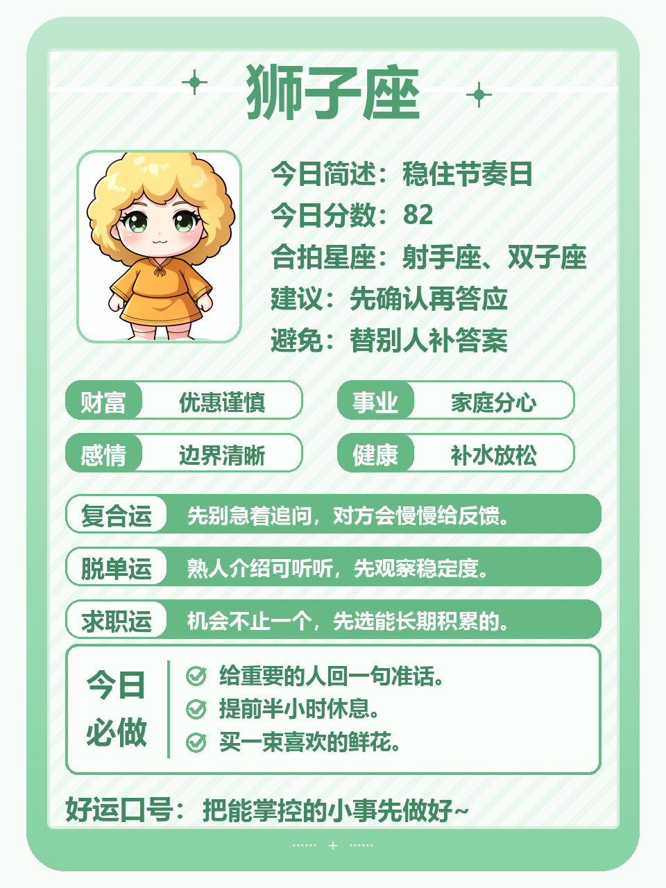
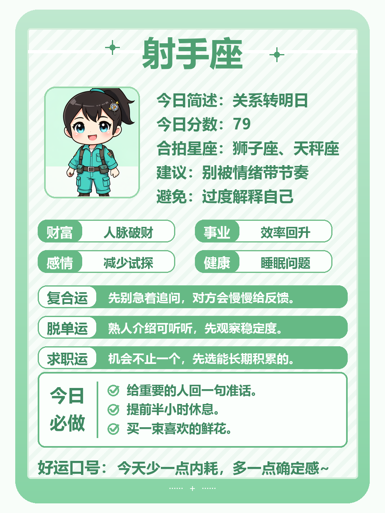

**白羊**：醒来后别立刻处理工作消息，先吃饭。一个误会在中午前有机会说开，语气放软一点即可。今日小事：认真听完对方，再讲自己的部分。

**狮子**：今天需要安静胜过热闹。有人临时起意约你，不想去就直说，别编复杂理由。今日小事：收拾床边，换一套干净舒服的床品。

**射手**：远方的计划又在心里冒头，可以查资料，但今天先不付款。下午适合和家人出门走走。今日小事：记下三个真想去的地方，删掉跟风选项。

## 土象星座

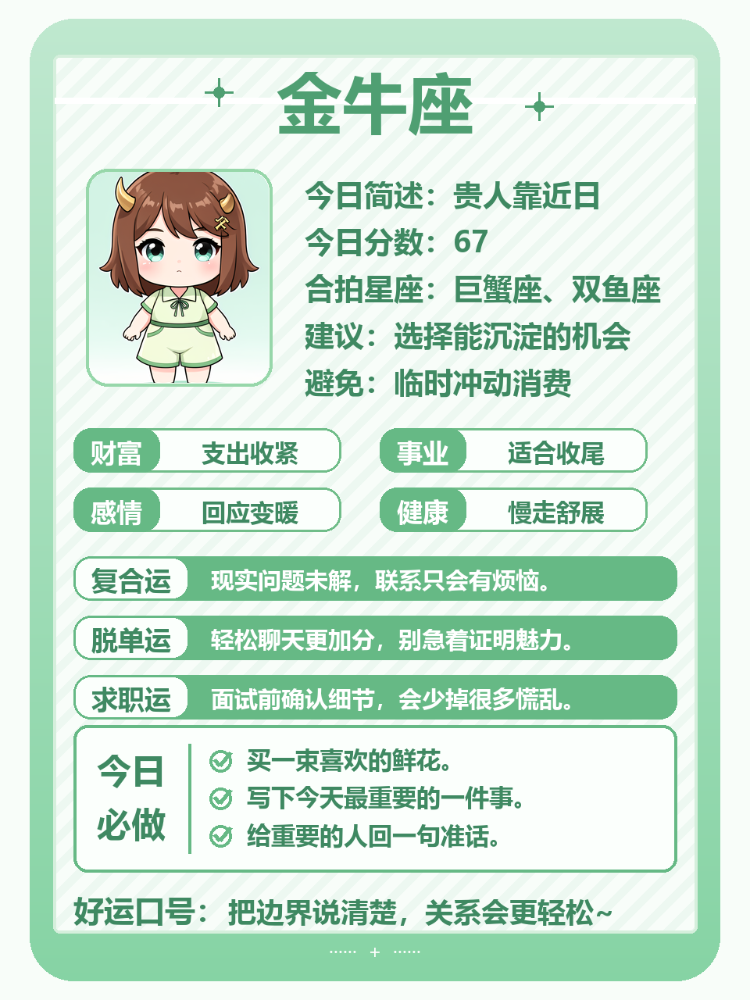
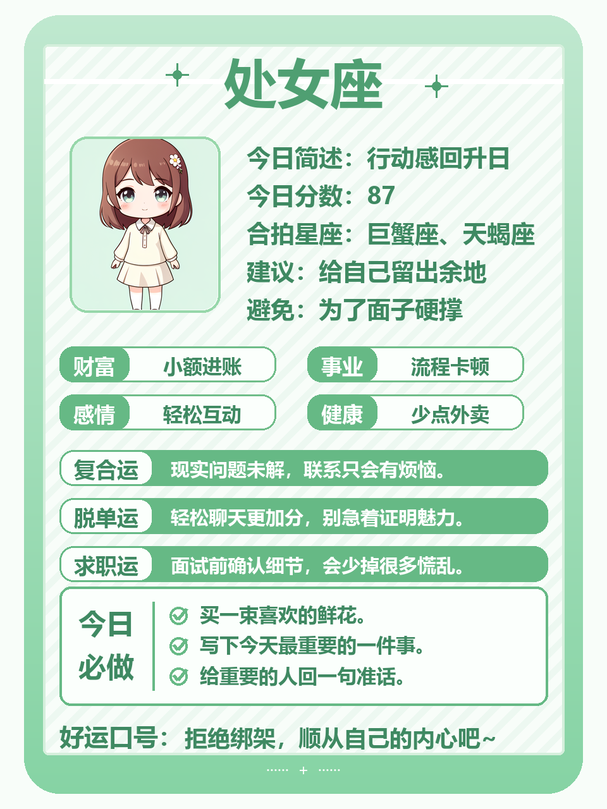
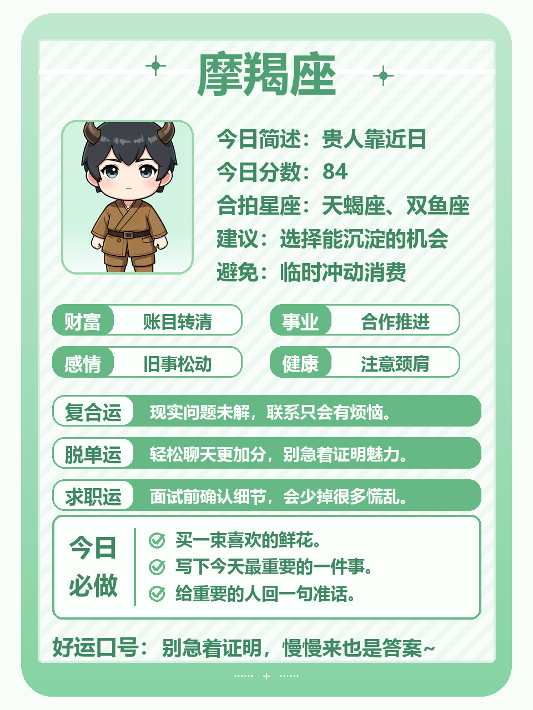

**金牛**：身体会诚实告诉你最近累不累，困就多睡一会儿。别用甜食代替正餐。今日小事：把下周早餐提前准备好，周一会轻松许多。

**处女**：脑子里列了很长清单，真正必须今天做的没有几件。挑两件，其余移到下周。今日小事：把“应该做”改成具体日期，不再反复惦记。

**摩羯**：你可能又想提前进入工作状态，先忍住。家里有件实际事情值得今天处理。今日小事：陪家人办一件小事，过程中少看手机。

## 风象星座

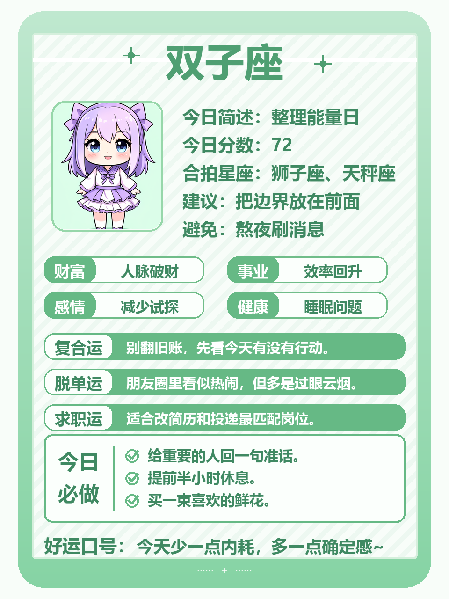
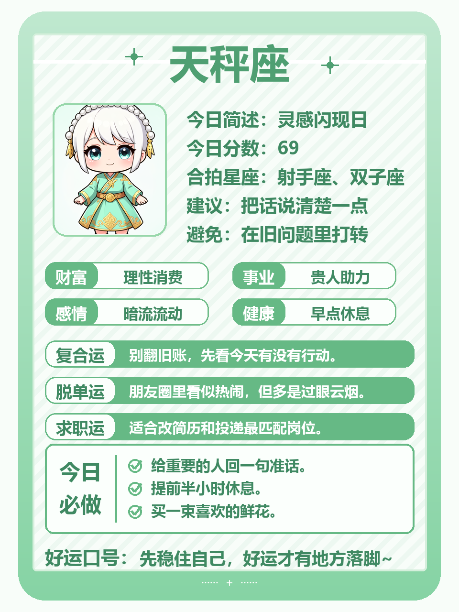
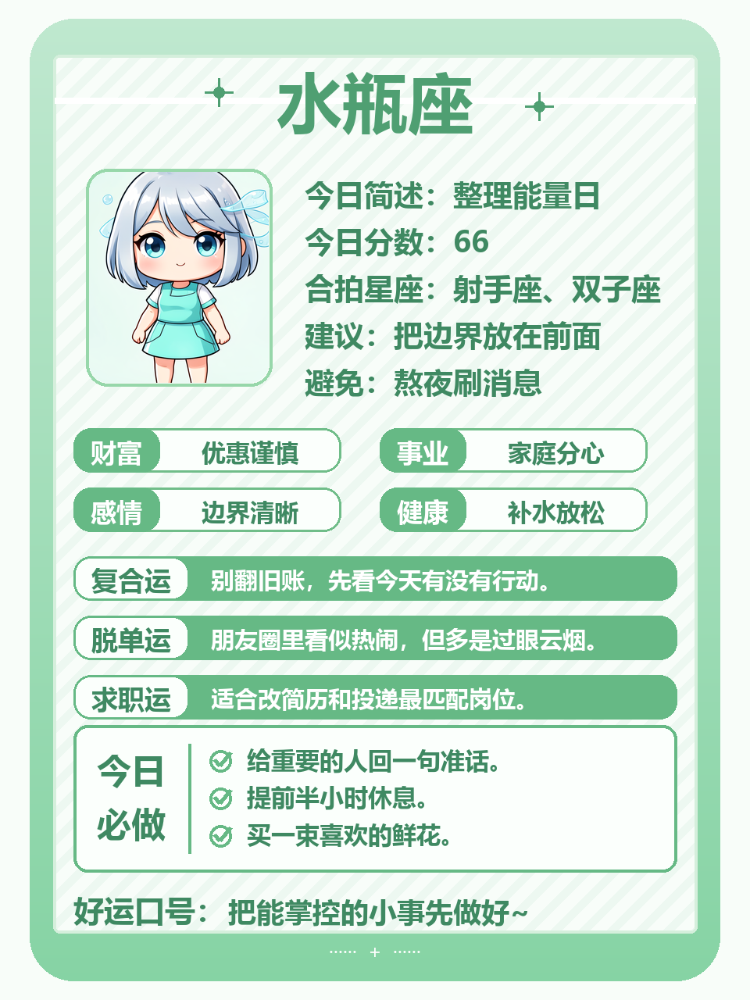

**双子**：今天适合把零散消息集中回复，别让手机响一整天。一个旧话题不必再争输赢。今日小事：退出一个已经没有内容的群聊。

**天秤**：关系里的小别扭会慢慢过去，你不需要承担全部调和责任。有人愿意先走一步，就给他回应。今日小事：为下周选好一套省心的通勤衣服。

**水瓶**：独处时容易想明白一件事，先写下来，周一再行动。别因为一时厌倦就推翻长期计划。今日小事：整理收藏夹，只留下真正会看的内容。

## 水象星座

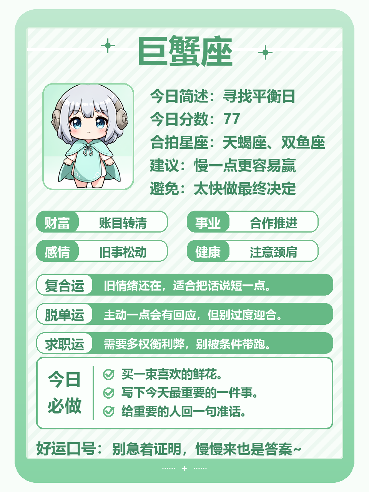
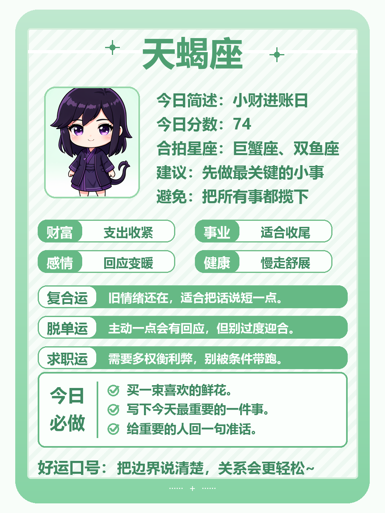
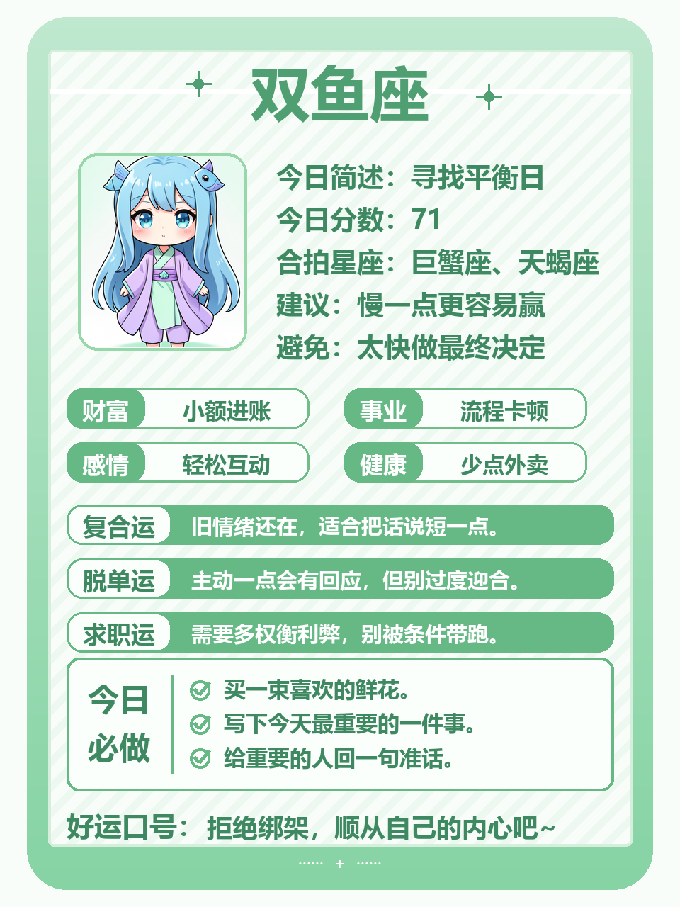

**巨蟹**：今天很适合待在熟悉的环境里恢复电量。别人一句无心的话不用反复想。今日小事：把冰箱里快过期的食物处理掉，心里也会清爽。

**天蝎**：你对下周已有打算，暂时不用公开。先确认资源和时间，再告诉别人。今日小事：核对一次余额与待办，做到心中有数。

**双鱼**：梦多或情绪起伏都不奇怪，午后会平稳。少看让人焦虑的内容，多接触真实生活。今日小事：洗好下周要穿的衣服，然后早点休息。

今晚把闹钟定好就可以了，不需要在睡前预演整个星期。把今天过得松一点，明天醒来，自然会有新的力气。

