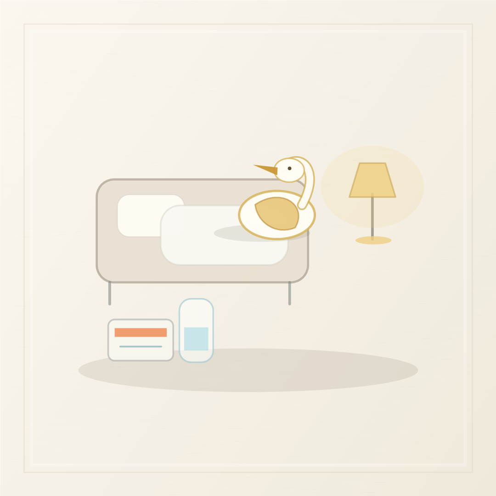
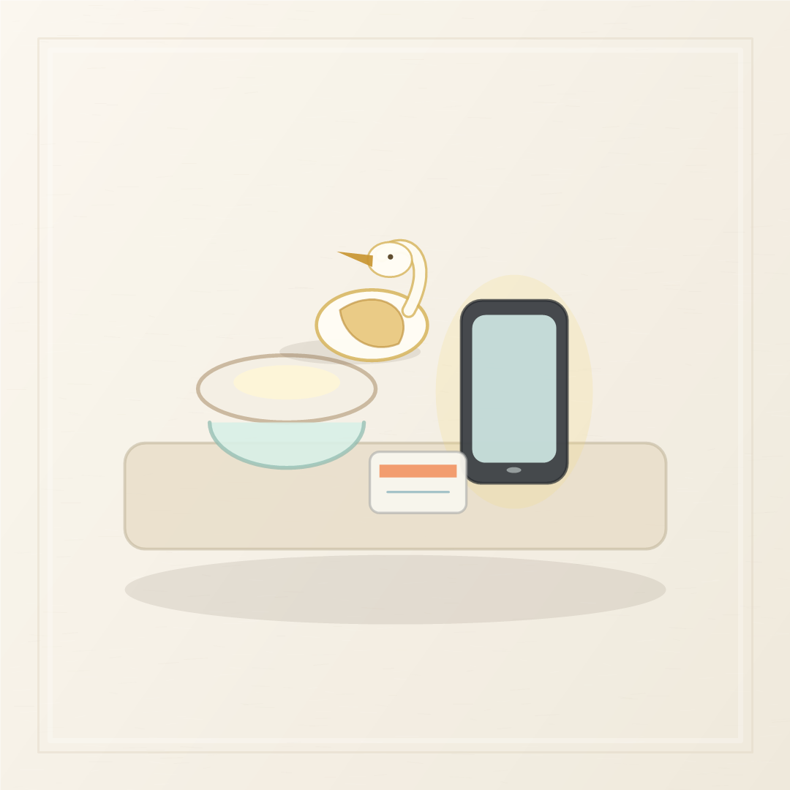
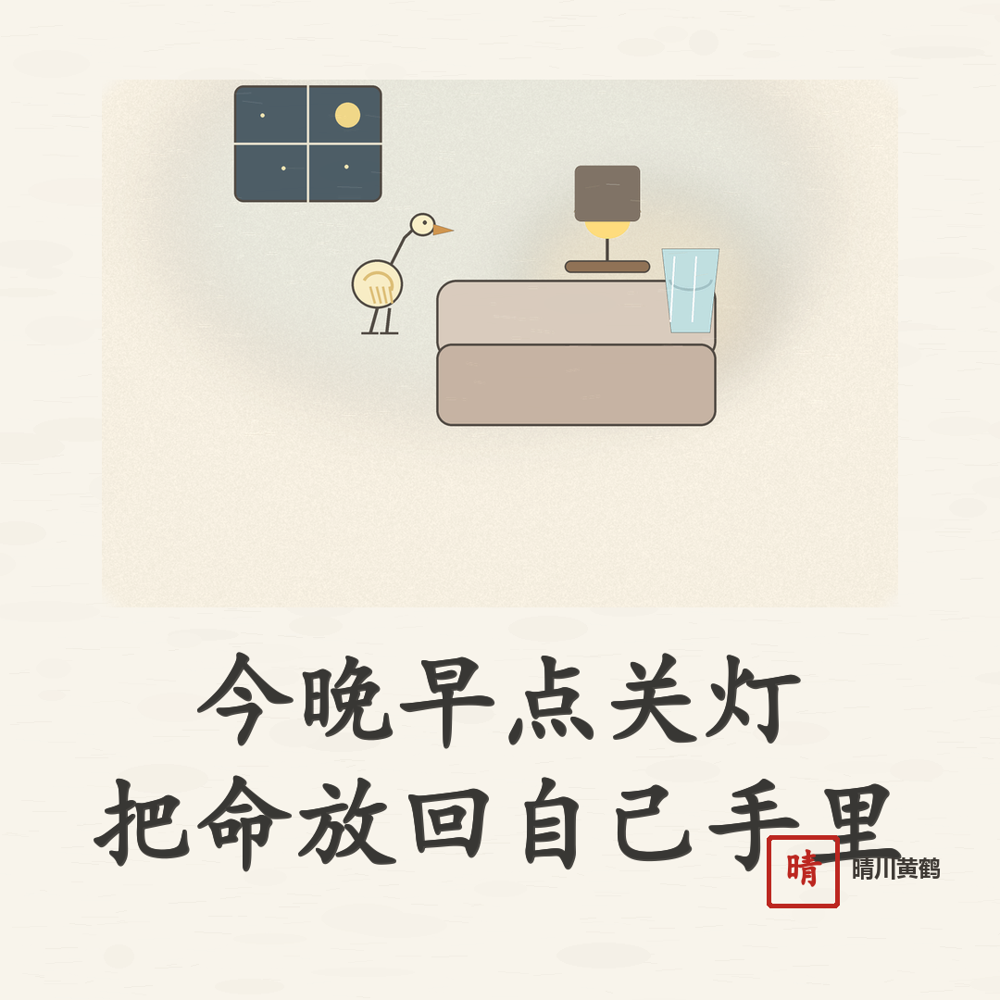

# 人到后半生，别再把身体借给别人

人到后半生，最怕的不是忙一点，累一点，而是你明明已经撑不住了，还总觉得别人比你更要紧。

<!-- qingchuan-illustration-slot: 01 opening -->

孩子一句“妈，你帮我一下”，亲戚一句“就这一次”，朋友一句“你别想太多”，你心一软，又把自己的睡眠、力气、情绪，全都让出去了。

可身体不是仓库，不能总往外搬。

## 身体会先替你喊停

很多人年轻时习惯了硬扛。家里有事你先上，孩子有事你先掏钱，亲戚有事你先出面。白天忙完，夜里躺在床上，脑子还在转。

床头的药盒越放越满，水杯里的水凉了又热，手机亮一下，你还是忍不住拿起来看。

你以为自己只是睡得浅，饭吃得少，胸口偶尔堵一下。其实身体已经提醒你很久了。

它不是一下子垮的。它是一次次被你忽略以后，才用疼、累、失眠、没胃口来叫你停一停。

到了这个年纪，最不该逞强的，就是身体。

有些忙可以缓一缓，有些电话可以明天再回，有些人的不高兴，也不用你连夜去哄。

你不是谁的万能药。

## 别把命用在不值得的事上

<!-- qingchuan-illustration-slot: 02 conflict -->

人最亏的地方，是把自己累坏以后，还觉得自己做得不够。

孩子的日子，你替不了一辈子。亲戚的难处，你也背不完。朋友的一句话，让你堵心半夜，那个人第二天可能照样吃饭睡觉，只有你坐在厨房小灯下面，心口发闷。

这时候你要清醒一点。

你的身体，是后半生最大的本钱。能自己下楼买菜，能自己把饭吃到嘴里，能夜里醒来摸到床头的水杯，这些看起来平常，其实就是晚年的底气。

别等到体检单放在桌上，医保卡攥在手里，才想起那些让你整夜睡不着的人和事，根本不值得。

真正该放在前面的，是你今天有没有吃好饭，今晚能不能早点睡，明天醒来身体有没有轻一点。

## 把自己慢慢收回来

后半生，要学会把身体从别人那里收回来。

少替别人着急，少接让你堵心的电话，少为了面子去撑场面。累了就坐一会儿，不舒服就休息，话说不动就不说。

这不是冷漠，是你终于知道，自己的命也很贵。

今晚就先做一件小事：把手机放远一点，药该吃就吃，灯早点关。睡不着也别再反复想那些人的脸色。

<!-- qingchuan-illustration-slot: 03 closing -->

明天早上起来，给自己煮点热乎的。饭吃下去，人才有力气，把后半生慢慢过稳。
