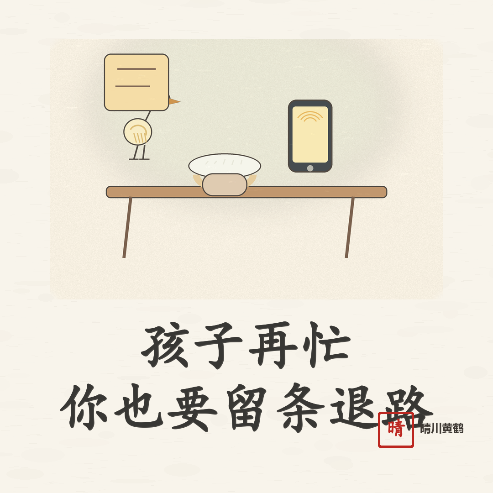
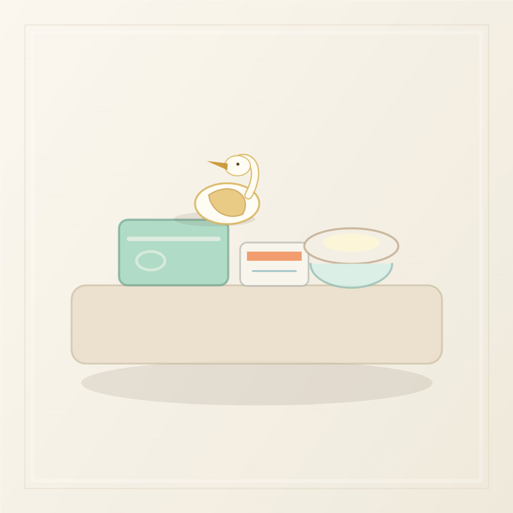
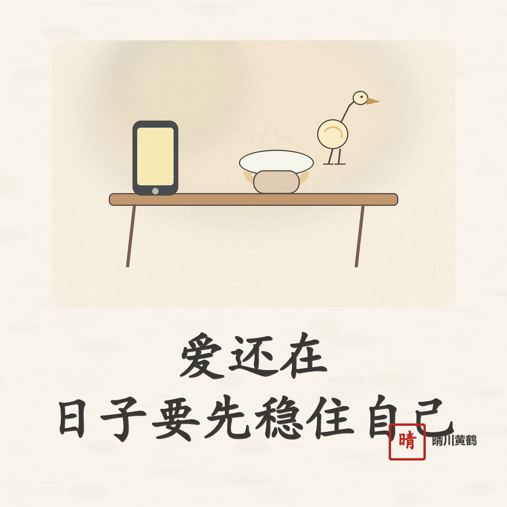

# 孩子再忙，你也要给自己留条退路

人老了以后，最容易难过的，不是孩子真的不爱你，而是你突然发现，孩子的生活里，已经没有那么多位置留给你。

<!-- qingchuan-illustration-slot: 01 opening -->

电话打来得越来越短。不是问你睡得好不好，就是问一件事能不能帮。你嘴上说“没事，我挺好的”，电话一挂，心里还是空了一下。

这口气，很多老人都咽过。

## 爱孩子，也要有分寸

做父母的人，最怕孩子过得难。

孩子房贷紧，你想补一点；孩子带娃累，你想过去帮几天；孩子语气急了，你还替他解释，说年轻人压力大。

这些都不是错。

可到了后半生，你要慢慢明白，爱孩子不是把自己掏空。你把退休金一笔笔转出去，把自己的检查往后拖，把饭随便对付，把身体累到腰酸腿疼，最后苦的是谁？

很多时候，孩子不是故意忽略你。他有他的家、工作、孩子和压力。问题是，你不能因为理解他，就把自己的晚年全都交出去。

门钥匙要留在自己手里，银行卡也要留在自己手里。更重要的是，心里的主心骨，也要留在自己这里。

## 你也需要一条退路

真正舒服的亲子关系，不是你随叫随到，也不是孩子事事围着你转。

<!-- qingchuan-illustration-slot: 02 conflict -->

是彼此都知道分寸。

你可以帮孩子，但帮之前要先问一句：我自己的身体吃不吃得消？我手里的钱够不够以后看病、买药、打车？我这次答应了，会不会让自己接下来好几天都睡不好？

这些问题不自私。

人到晚年，最怕的不是少帮一次孩子，而是把自己帮到没有退路。等你真需要人照顾时，才发现钱给出去了，身体累坏了，话也不好开口了。

所以，有些事能帮就帮，不能帮就慢一点说。孩子急，你也别跟着急。你可以爱他，但不必替他把一辈子的风雨都挡完。

## 把日子过回自己手里

以后孩子打电话来，你可以先听完，再答应。别急着掏钱，别急着出门，别急着把自己的计划全打乱。

你的晚饭也要吃，你的药也要按时吃，你楼下那两圈路也要慢慢走。

一个家里，父母和孩子最好的样子，不是谁欠谁，也不是谁拖着谁，而是各自把日子过稳，彼此有事时还能好好说话。

今天晚上，把手机放在桌上，不用一直等下一通电话。该吃饭吃饭，该休息休息。

<!-- qingchuan-illustration-slot: 03 closing -->

孩子有孩子的路，你也要给自己留一条安稳的退路。
