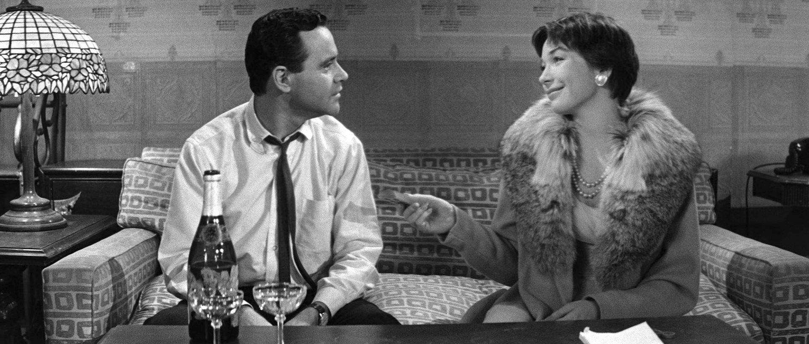

我认识一个女孩，叫阿May。

她男朋友加班，她提前两小时炖好汤，坐地铁横穿大半个城市送过去。到了公司楼下，男朋友说"你怎么来了，我食堂刚吃过"。

她愣在原地，汤还是热的，心却凉了。

回家路上她发了条朋友圈：有些人啊，你对他掏心掏肺，他连一口都不领情。

配图是那盒没动过的汤。

我看到这条，心里咯噔一下。因为我太熟悉这种委屈了——它不是被辜负的委屈，是**"我明明付出了，为什么没有得到回报"的委屈**。

而这种委屈，恰恰是关系里最隐蔽的一种毒。

## 一、你以为你在爱，其实你在记账

心理学上有个不那么好听的词，叫"付出感"。

说白了就是：你做一件事的时候，心里默默开了一张发票。金额是你的时间、精力、牺牲；抬头写着对方的名字；到期日是——他必须以同等的感激、顺从、愧疚来还。

阿May送的不是汤，是发票。所以男朋友那句"我吃过了"，在她听来不是一句实话，是一张退票单。

真正让人难受的从来不是那盒汤，而是这个念头："我为你做了这么多，你却……"

你注意到了吗，"付出"这个动作里，一旦掺进了"感"字，它就变味了。付出是给予，付出感是索取。前者松弛，后者拧巴。前者说"我愿意"，后者说"你欠我"。

## 二、三个信号，看看你中了几条

我不是要审判谁。这些坑我自己也踩过。你对照着看，别对号入座地骂自己，只是照照镜子。

**信号一：付出完，你会等一个"谢谢"。**

买了他爱吃的水果削好端过去，他没抬头说声谢，你就开始不高兴。那一刻你要的不是水果被吃掉，是你被看见。可爱本身，是不该挂着收据的。

**信号二：你嘴上常挂着"要不是为了你"。**

"要不是为了你我早升职了""要不是为了你我至于这样吗"。这句话一出口，付出就成了筹码，关系就成了债务。你把自己活成了债主，那对方只能活成欠债的人。谁愿意跟债主谈恋爱呢。

**信号三：你把委屈憋着，憋成了怨。**

你不说。你觉得"他应该懂"。可他不是你肚子里的蛔虫。于是小委屈攒成大怨恨，某天为一件鸡毛蒜皮的事总爆发，你哭着数落他这半年欠你的所有账。他一脸懵：你怎么突然翻这么多旧账。

## 三、最扎心的真相：很多付出，对方根本没求你

我要说一句可能会得罪人的话。

阿May的汤，男朋友求了吗？没有。是她自己决定送的。

我们太容易陷入一种自我感动：**我替你做了主，再拿这个"牺牲"回来问你要愧疚。**

你熬夜给他改简历，他没让你熬。
你推掉朋友聚会陪他打游戏，他没拦你去。
你放弃了外地的好offer留在他身边，那也是你自己签的字。

这些决定，都是你替对方做的。可账，你却记到了他头上。

这不公平。对他不公平，对你更不公平——因为你把自己人生的方向盘，硬塞进了别人手里，然后责怪他开得不是你想去的方向。

**真正的爱不留存根。** 你给出去的那一刻，就该是干干净净的给，不惦记回声，不等待回报。惦记回报的那部分，不叫爱，叫投资。而投资是会亏的，一亏你就恨。

## 四、怎么破？先分清两句话

别急着自责"原来我这么自私"。付出感不是坏，它常常来自一个太想被爱的人。破解它，也不用把自己修炼成无欲无求的圣人。

你只要在每次想付出的时候，先在心里问自己两句话。

**第一句：这件事，是"我想做"，还是"我为你牺牲"？**

如果是"我想做"——我就是想给他炖汤，炖的过程我也开心，那你送出去，他吃不吃都不影响你的好心情。这叫爱。

如果是"我为你牺牲"——我不想跑这一趟，但我逼自己去，去了就要求个说法，那请你**停下来，别做**。憋着的牺牲，迟早变成账单砸回关系里。

**第二句：我做这件事之前，问过他要不要吗？**

送汤之前发条消息："我炖了汤，要给你送去吗？"他说要，你再去，皆大欢喜；他说不用我吃过了，你就省了力气也省了委屈。

一句"你需要吗"，能挡掉关系里八成的自我感动。

还有最关键的一步：**把爱自己的那部分，先留出来。**

你想给他炖汤，那就多炖一碗，自己先喝了。你想陪他，那也给自己留一个不必陪任何人的夜晚。当你自己是满的，你溢出来的那些才是爱；当你自己是空的，你给出去的每一滴，都在等着被填回来。

## 写在最后

阿May后来跟我说，她想通了。

现在她还炖汤，但送之前会问一句。男朋友说不用，她就自己喝了，配着剧，挺香。她说："原来我以前不是爱他爱得累，是记账记得累。"

我特别喜欢这句话。

爱一个人，可以拼尽全力，但别拼命记账。你付出的每一分，若都指望着回本，那这场关系从一开始就成了生意。而生意里没有深情，只有清算。

**把发票撕了吧。** 真正丰盛的爱，是给完就忘，是我给你不是因为你欠我，是因为我心里有，满出来了，正好流到你这儿。

你不欠我的，我也不图你还。这样的爱，才养人。

—

说说看，你有没有过那种"感动了自己、对方却没领情"的瞬间？是送错了汤，还是等错了一句谢谢？评论区讲给我听，我陪你一起复盘。

如果这篇让你想起了那个总在关系里憋委屈的自己，点个赞吧——不是认输，是决定以后要给得更松弛、活得更舒展。

也转给那个总把"要不是为了你"挂嘴边的姐妹，告诉她：撕掉发票，你会轻很多。
