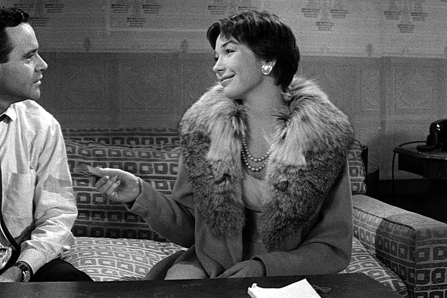

很多女人不是被家务压垮的。

是被“什么都要她想着”压垮的。

一个家里最累的人，往往不是做得最多的人，而是脑子里装着所有事的人。

## 她坐着没动,但已经累了一天

周末晚上，宁姐坐在沙发上发呆。

电视开着，孩子在旁边拼积木，丈夫刷着手机问她：“明天早餐吃什么？”

就这么一句话，她突然火了。

丈夫很委屈：“我就问一句，你至于吗？”

至于吗？

她也觉得自己好像有点过分。可那一瞬间，她脑子里不是早餐，而是明天孩子要穿校服、冰箱里鸡蛋只剩两个、婆婆下周体检还没预约、家里纸巾快没了、幼儿园手工作业还差一张彩纸、丈夫那件衬衫周一要用。

这些事没人提醒她。

但只要哪一件漏了，最后被问的还是她。

“你怎么没买？”
“你怎么不早说？”
“孩子作业你没看见吗？”

宁姐说，她最崩溃的不是洗碗拖地，而是她永远像一个家庭后台系统，不能关机，不能宕机，还不能抱怨。

> 有些婚姻里的累，不在手上，在脑子里。

## 情绪劳动最容易被当成应该

很多男人会说：“我也做家务啊。”

是，他可能会倒垃圾，会接孩子，会洗碗。

但你有没有发现，很多事依然需要女人开口安排。

“你去倒一下垃圾。”
“你记得给孩子带水杯。”
“你爸妈周末过来，你提前买点水果。”
“煤气费该交了，你别忘。”

表面上看，他也参与了。

但真正承担管理压力的，还是她。

这就像一个人是执行员工，另一个人是项目经理。执行的人做完一件事可以休息，项目经理要一直盯着进度、风险、时间表和所有人的情绪。

可家庭里最讽刺的地方是，项目经理没有工资，没有署名，甚至不被承认。

**女人在婚姻里最隐形的付出，是她一直替所有人提前想一步。**

她记得每个人的喜好，调和每个人的情绪，安排每个节日，处理每个突发状况。她不是天生爱操心，她只是太清楚，一旦她不操心，这个家马上就会乱给她看。

然后别人还会说：“你看，你就是太焦虑。”

## 不是她脾气差,是没人接住她

宁姐后来跟丈夫吵过一次。

她把手机备忘录打开，里面密密麻麻写着这个月的家庭事项。孩子疫苗时间、老人复诊日期、缴费提醒、购物清单、亲戚生日、家政预约、学校通知。

丈夫看完沉默了几秒，说：“你怎么不告诉我？”

宁姐笑了。

这句话本身就是答案。

为什么还要她告诉？为什么一个家的事，默认需要她先看见、先判断、先分配？

很多女人在婚姻里变得暴躁，不是因为她们天生脾气差，而是她们长期处在一种“没人兜底”的状态里。

她不能病，不能忘，不能累，不能不高兴。

一旦她情绪不好，别人第一反应不是“你是不是太辛苦了”，而是“你又怎么了”。

**真正让人寒心的，不是没人帮忙，是你连累都要先证明。**

所以别再轻飘飘地说“你别想太多”。

她想得多，是因为有人想得太少。

## 家不是她一个人的工作

后来宁姐做了一个改变。

她不再做家庭总客服。

孩子学校群，她让丈夫也置顶。老人复诊，她把预约流程教给丈夫。家里采购，她不再列清单给他，而是让他自己打开冰箱看缺什么。

一开始当然乱。

丈夫买错过纸巾，忘过孩子手工作业，也把体检时间记错过。

以前宁姐会立刻补救，现在她忍住了。

她说：“他必须真的承担后果，才会真的承担责任。”

这句话太重要了。

很多女人之所以永远累，是因为她们一边抱怨没人分担，一边又在最后一刻把所有漏洞补上。久而久之，别人只看见她能干，看不见她快撑不住。

家不是一个人的公司。

婚姻也不是让女人当免费运营。

**好的伴侣，不是等你开口才帮忙，而是主动把这个家也放进自己的脑子里。**

如果一个男人真的想分担，第一步不是问“你要我做什么”，而是开始自己看见。

看见孩子的鞋小了，看见家里的米快没了，看见你最近没睡好，看见你坐在沙发上不说话的时候，其实已经很累。

如果你也在婚姻里承担了太多看不见的事，留言说说：家里最常被你记住、却没人感谢的一件小事是什么？觉得这篇说中了，就点个赞，转给那个总说“我也没做什么但就是很累”的女人。她真的不是矫情，她只是太久没人替她想一步了。
