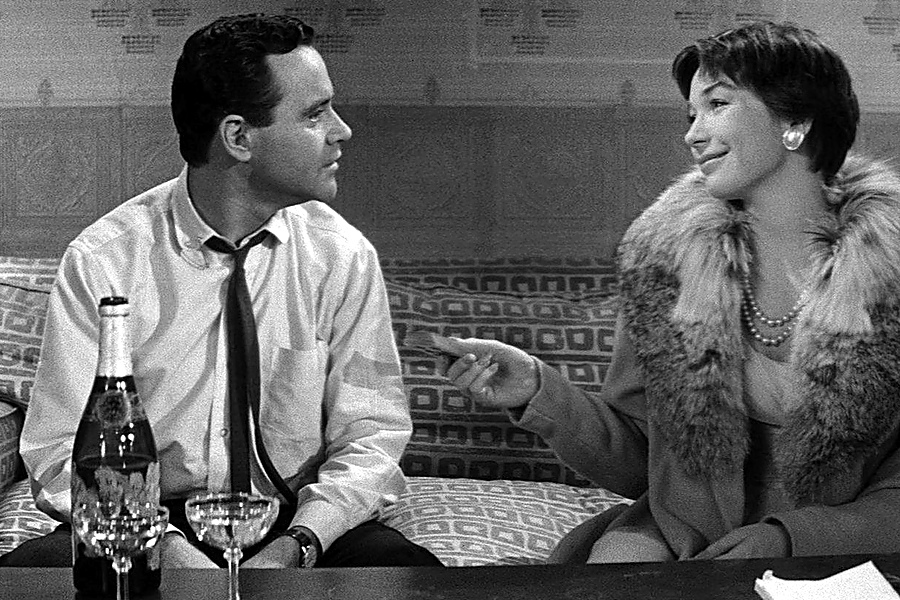

人到中年，很多女人最怕的不是变老。

是突然发现，家里所有人的生活都压在自己身上。

父母要照顾，孩子要操心，伴侣要沟通，工作不能丢，情绪还要稳。你明明不是超人，却被所有人默认成不会倒下的那一个。

## 她不是能干,是没人允许她掉链子

梅姐四十二岁，白天在公司做行政，晚上回家像切换到另一个岗位。

孩子作业、老人复诊、丈夫出差行李、冰箱采购、亲戚人情，她都记得清清楚楚。

有次她在公司开会，手机震了十几次。

爸爸问医保卡放哪，儿子问数学卷子签字没有，丈夫问家里有没有感冒药。

她盯着屏幕，突然有点想笑。

这个家好像每个人都长大了，又好像每个人都没长大。

他们不是完全不会做。

他们只是习惯先找她。

梅姐说：“我有时候不是累，是烦。烦自己像一个永远在线的客服。”

**女人到中年最隐形的消耗，是她成了全家人的默认答案。**

谁的问题都可以丢给她。

可她的问题呢？

她累了找谁，她害怕找谁，她也想有人替她想一步的时候，谁在？

## 你越能扛,别人越忘了你也会疼

很多女人都有一个误区：只要我再坚持一下，家就不会乱。

于是她们一边抱怨没人分担，一边又在最后一分钟把所有漏洞补上。

孩子忘带资料，她立刻送；丈夫记错时间，她替他圆；父母体检没人陪，她请假去；家里一团乱，她熬夜收拾。

久而久之，别人只看见她能干，看不见她的极限。

梅姐有一次低血糖，蹲在厨房门口缓了很久。

丈夫看见后第一句话是：“你是不是又没吃晚饭？”

她没有力气吵。

她只是想，如果今天倒下的是别人，她一定会立刻倒水、拿糖、问哪里不舒服。可轮到她，第一反应却是她自己没照顾好自己。

这就是很多中年女人的寒心。

不是她们没有被爱过，而是她们太久没有被当成需要照顾的人。

**你把自己训练得太可靠，别人就容易忘记，可靠的人也会碎。**

所以别再把所有事都扛成习惯。

习惯有时候不是美德，是关系里的失衡。

## 家不是靠一个人硬撑出来的

后来梅姐做了一件事。

她把家里的事分成三类，写在冰箱上：孩子的、老人的、日常采购的。

丈夫负责老人复诊和药，孩子负责自己的书包和作业提醒，她只保留自己必须处理的部分。

一开始当然乱。

丈夫忘了挂号，孩子漏带一次资料。

以前梅姐会立刻补救，这次她没有。

她说：“他们总要学会承担后果，我不能替他们活一辈子。”

这句话很硬，也很清醒。

真正健康的家，不是一个女人把所有事情做得滴水不漏。

是每个人都知道，这个家和自己有关。

你可以爱家，但不要把自己活成家里的耗材。你可以照顾别人，但不能把自己的身体、睡眠、情绪都排到最后。

**中年以后，女人最该收回的不是脾气，是那个“什么都我来”的位置。**

如果你也总在替全家扛，今天先放下一件小事。

让该负责的人去负责，让该看见的人去看见。

留言说说：家里哪件事最常默认由你处理？觉得这篇说到了心里，就点个赞，转给那个总说“没办法，我不管谁管”的女人。她不是天生能扛，她只是太久没人接手。
