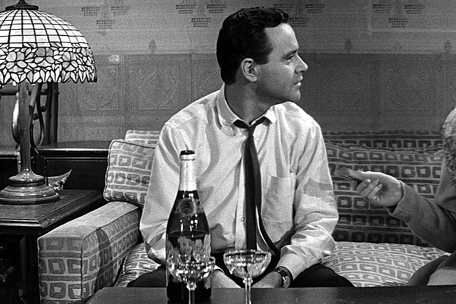

年轻的时候，我们总以为浪漫要很大。

花、礼物、旅行、朋友圈官宣，最好还要有一点让别人羡慕的戏剧感。

后来才明白，成年人真正缺的不是仪式，是有人把你放在心上。

## 她想要的不是惊喜,是你记得

小满和男朋友在一起三年。

他不算坏，也不吝啬。节日会转账，生日会订蛋糕，吵架后也会说“别生气了”。

可小满总觉得哪里空。

有次她胃疼，在微信里随口说了一句：“最近不能喝冰的。”

男朋友回了个“那你注意点”。

第二天一起吃饭，他照旧给她点了冰奶茶。

小满看着那杯奶茶，突然不知道该说什么。

不是因为一杯饮料。

是她发现，自己说过的话，在他那里像风一样过去了。

后来她去朋友家吃饭，朋友的丈夫端出一碗热汤，说：“她这两天胃不舒服，我给她留了清淡的。”

那一刻，小满心里很酸。

**被惦记不是多贵的东西，是你说过的小事，有人真的放进了心里。**

很多女人不是物质。

她们只是太久没有体验过“我不用重复，你也会记得”。

## 成年人的心动,藏在细枝末节里

你会发现，过了某个年纪，很多漂亮话都不太有用了。

“我爱你”当然好听。

但如果你每次加班回家，他都不知道你有没有吃饭；你每次生理期难受，他都只会说多喝热水；你提过三遍不喜欢被开玩笑，他下次还是当众拿你取乐。

那些话就会慢慢变轻。

小满说，她不是一定要男朋友多会制造浪漫。

她只是希望有一天，自己不用把所有需求说得像说明书。

冷了有人递外套，累了有人少问一句责备，忙到忘记吃饭时有人提醒，情绪不对时有人先放下手机看看她。

这些事看起来很小。

但亲密关系就是靠这些小事长出来的。

**一个人有没有把你放在心上，不看他说得多满，看他记得多细。**

真正的惦记，往往不热闹。

它很安静，像回家路上顺手买的药，像冰箱里给你留的一份饭，像他知道你见完某个亲戚会不开心，所以提前问一句“要不要我陪你”。

## 别拿粗心替不在意开脱

当然，人不可能什么都记住。

谁都会忙，谁都会忘。

但长期的“记不住”，背后常常不是记性差，是优先级低。

小满后来跟男朋友认真聊过一次。

她没有控诉，也没有翻旧账，只说：“我不想再靠提醒换来被照顾。”

男朋友沉默了很久。

他说：“我以为你没那么在意。”

这句话让小满一下子清醒了。

很多关系的问题就在这里：你以为对方不在意，是因为你从来没有认真在意过她的在意。

**爱不是猜中所有答案，而是愿意把对方的小事当回事。**

如果一个人真的想靠近你，他会慢慢学习你的生活。

你怕冷，你胃不好，你不喜欢在外人面前被调侃，你压力大时不想听大道理，你嘴上说没事的时候其实需要一个拥抱。

这些都不是矫情。

这是一个人进入另一个人世界的路标。

如果你正在一段关系里，总觉得自己被忽略，先别急着怀疑自己是不是要求太多。你只是想被认真放在心上。

留言说说，你收到过最小却最打动你的惦记是什么？觉得这篇温柔地说中了，就点个赞，转给那个总觉得自己“不该要求太多”的人。她要的从来不多，只是被记得。
