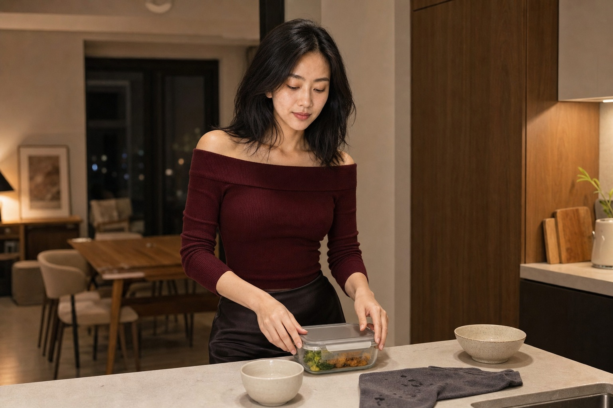

第四天晚上，周岚把两碗面端上桌，丈夫陈屿仍戴着耳机。他们争吵的起因很小：周末去谁家吃饭。周岚说这个月已经陪他父母两次，陈屿回了一句“你就是爱计较”，从那以后，两个人只用冰箱上的便签交流。

“燃气费交了”“快递在门口”“周六我加班”。家里没有摔门声，连碗筷都放得很轻。可周岚每次经过客厅，肩膀都会不自觉绷紧。她以前总会在第二天买杯奶茶放到陈屿桌边，这次没有。

## 两碗面只剩一碗冒热气

陈屿看见面，摘下一边耳机，说自己不饿。周岚没劝，把另一碗倒进保鲜盒。十分钟后，他在厨房翻柜子，故意把门关得很响。她坐在阳台回工作消息，穿堂风吹得窗帘贴在腿边，谁也没有问对方冷不冷。

第二天原本约好去给猫打疫苗。陈屿没有起床，周岚独自打车，排队时护士问另一位主人怎么没来。她替他找了句“临时有事”，说完才觉得熟悉：过去每次冷战，她都负责维持生活正常，好像只要水电不断、猫粮没空，沉默就不算伤人。

回程出租车堵了四十分钟，猫在航空箱里一直叫。周岚给陈屿发定位，请他下楼接一下，他隔了半小时只回“在忙”。她一手提箱一手开门，猫砂撒在玄关，也没有人从卧室出来。

回家后，陈屿问猫怎么样。周岚把缴费单放在桌上。

**“我可以先开口，但不能每次都替你把沉默收拾干净。”**

陈屿说自己只是需要冷静，不是惩罚她。周岚问：“冷静需要四天吗？需要把我当空气吗？”他没回答，转身去洗杯子。水声响了很久，那晚他们仍分房睡。

## 她先说话，却没有先认错

周日午后，周岚把两个人叫到餐桌前，给谈话定了二十分钟。她承认自己争执时翻了旧账，也说明以后需要暂停，可以直接说几点再谈，不能无限消失。陈屿听到一半起身，说这种谈话像开会。

周岚没有拦他，也没追进卧室。她取消了晚上替两个人订的电影票，只留下一张。陈屿发现后问她是不是故意报复，她说不是，那场电影她仍想看，而他拒绝完成刚才的谈话。

电影散场已近十点。周岚回家时，餐桌上摆着那只保鲜盒，面被热过，旁边多了一张便签：“明晚八点，继续说。”她把便签压在猫咪的疫苗本下面，没有立刻原谅，也没有撕掉。卧室门缝里透出一线灯光，陈屿这次没有反锁。
