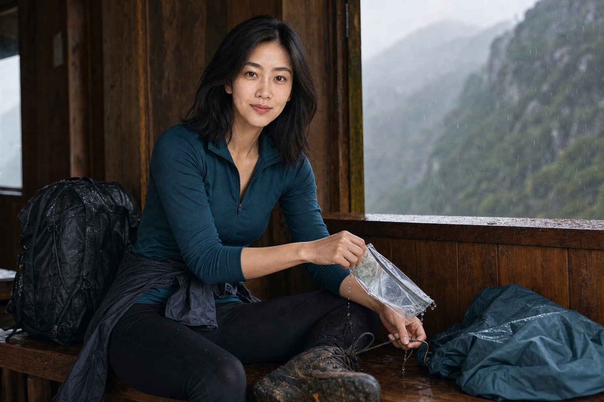
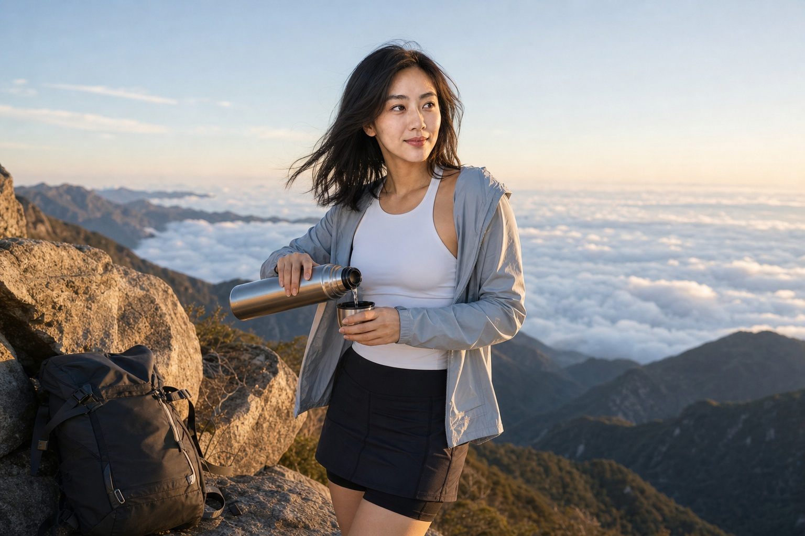

爬到第三小时，乔宁的鞋底开始进水。天气软件明明写着多云，山腰却落起密雨。同行朋友已经走到前面拐弯处，回头喊她：“还有四十分钟就登顶，现在下撤太亏了。”

乔宁扶着石阶喘气。为了这次爬山，她新买了贴身速干衣，前一晚还把“轻松登顶”的配文存在备忘录里。朋友圈里别人爬山都在云海前笑，她不想发一张躲雨的照片。

这趟行程是她提议的。民宿、包车和门票都由朋友先垫付，她也在群里保证路线不难。前一天司机说可能下雨，她怕改期要损失订金，只转发了天气软件里降水概率最低的那一页。

## 木棚下，她先脱掉湿袜子

山路拐角有个旧木棚。乔宁进去时，朋友已经坐下喝水，却仍催她别休息太久。她解开鞋带，脚后跟磨出一块红皮。朋友递来创可贴，说贴上还能走，登顶后再处理。

**“我今天不拿伤口换那张山顶照片。”**

朋友皱眉，说两个人难得约一次，她半途退出会打乱计划。乔宁承认自己准备不足，也说可以在木棚等，朋友独自登顶后再会合。最后朋友没有继续走，怕雨更大，两个人一起下撤，一路几乎没说话。

下撤也不轻松。乔宁每走二十级就要停，朋友先到一个转弯，再折回来确认她没滑倒。缆车因为雷雨暂停，她们多走了四公里，原订的返程包车也多收了一小时等待费。那笔钱两人平分，谁都没有说客气话。

回到民宿，雨在傍晚停了。山顶云层散开，群里其他游客发来金色落日。朋友把手机递给乔宁看，叹气说如果再坚持半小时就赶上了。乔宁也遗憾，她没有用“安全最重要”堵住对方，只重新检查了磨破的脚。

## 第二天只走到半山平台

早上乔宁换了干袜子，提议走另一条短线。朋友说脚疼就休息，语气仍有不快。她独自走到半山平台，那里没有云海，只有一排被雨洗亮的松树和两个积水坑。

她在平台煮了杯热水，给朋友发定位。一个小时后，朋友还是上来了，坐下时说自己昨晚也害怕，只是不愿承认行程可能失败。两个人没有补拍假装登顶的照片，原定的山顶章也没盖到。

下山前，乔宁把没用完的创可贴塞进背包外袋。朋友先走了几步，又停在岔路口等她。雨后的石阶很滑，这次谁都没有喊快一点。
