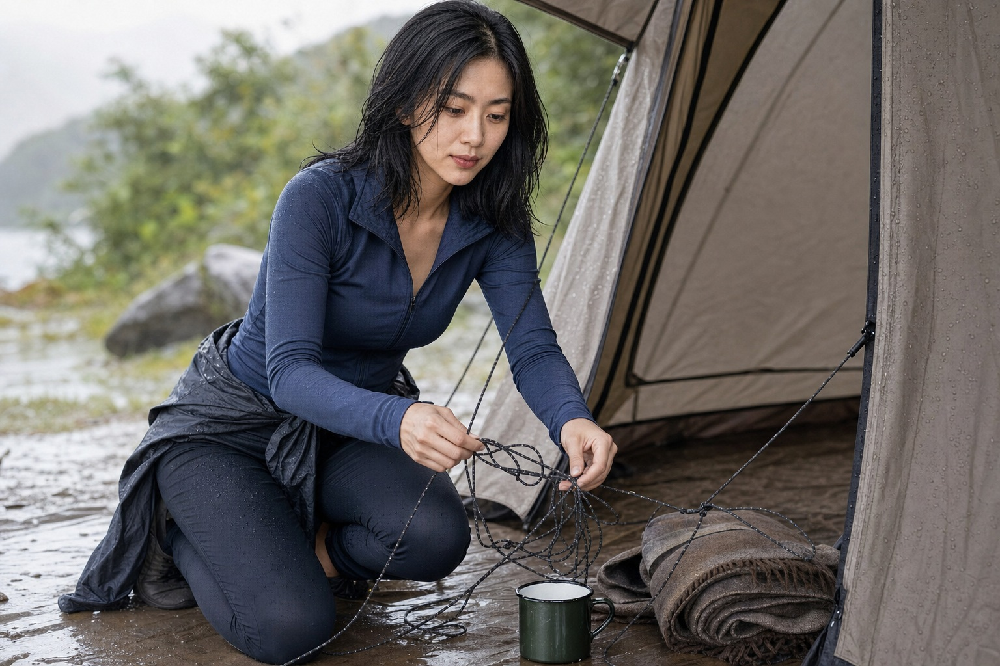

车开到营地时已经下午四点。陆遥负责搬帐篷、天幕和两箱水，闺蜜可欣拿着手机拍“落日开营”。照片里天幕刚好挡住杂物，陆遥半蹲在画面边缘系风绳，只露出一只手。

出发前两人说好平均分工，可欣负责采购，陆遥负责装备。到了现场，采购变成几袋零食和两盒切好的水果，晚饭用的锅、燃料和清水仍由陆遥准备。她提醒一次，可欣说先拍完，天色很快就没了。

类似的事早就发生过。上次旅行，可欣订酒店，陆遥做路线；到了当地，可欣嫌路线赶，临时删掉一半景点。陆遥负责退票和改车次，回来后照片却都由可欣修好发群。她一直把这种差异解释成两个人擅长的事不同。

## 雨落下来，风绳缠成一团

夜里下起小雨，天幕一角开始积水。陆遥穿鞋出去加固，可欣躲在帐篷里问能不能明早再弄。风一吹，积水整片泼下来，打湿了放在外面的毯子和杯子。

**“我不是要你听指挥，我是想让你看见手边有什么活。”**

陆遥把湿毯子拖进棚下，忍不住发火：“这不是住酒店，东西不会自己干。”可欣也恼了，说自己开了三个小时车，还买了食物，不是什么都没做。两个人隔着雨声算油费、装备费和谁起得更早，谁都觉得自己付出更多。

可欣沉默了一会儿，收起睡袋，说雨停就开车回城。陆遥以为只是气话，第二天六点醒来，车和可欣真的不见了，桌上压着一百元现金，手机里只有一句“装备费算我的”。

可欣开走的不只是车。营地离车站十五公里，陆遥回程原本也要搭她的车。她打电话无人接，只能预约第二天下午的顺风车，多花了一百八十元。那张现金被雨气打湿，边角卷了起来。

## 营地空了一半，火还是点着了

陆遥退不了第二晚营位，只能留下。她晒毯子、重新拉绳，又去营地小卖部买了一份热饭。下午可欣发来长消息，承认自己怕冲突，也说陆遥一忙起来就像领队，让人不知道怎么插手。

陆遥没有立即回“没事”。她列出损坏的杯子和湿掉的燃料，也写下下次出行前要把任务分到具体名字。消息发出去后，可欣只回“看到了”，没有约下一次。

傍晚木柴总算烧起来，火不大，烟一直往她这边飘。陆遥把折叠椅挪了三次，独自喝完那杯热水。手机里的合照还在，可欣拍的开营视频已经删了。
