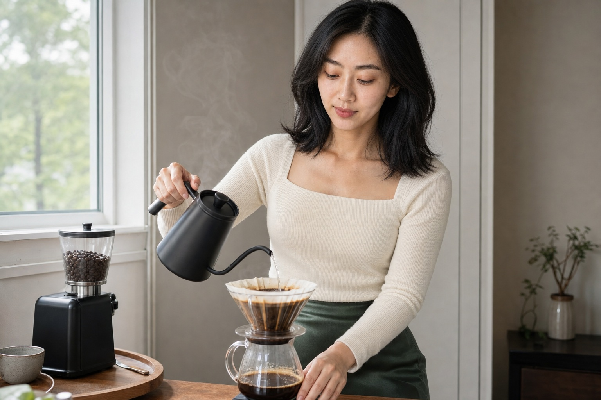
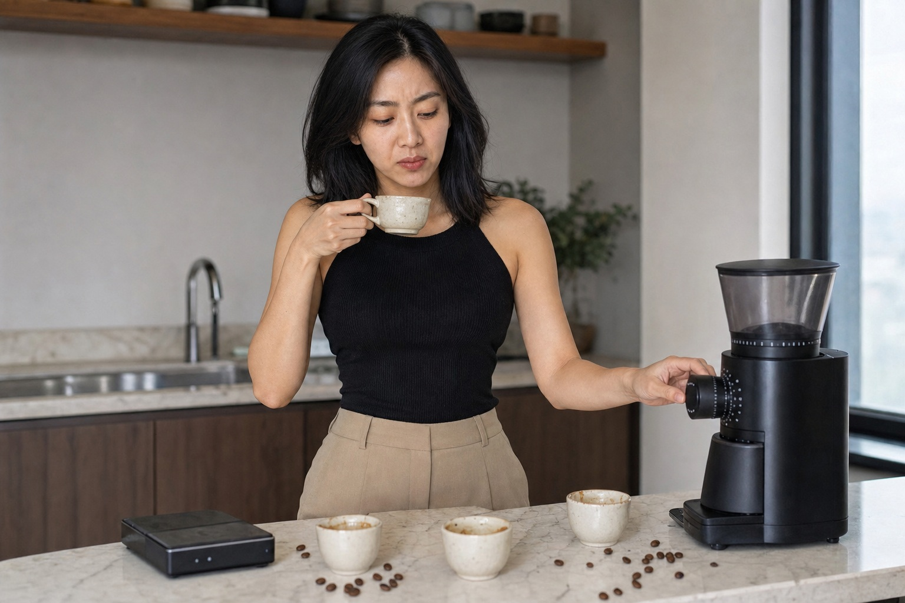

第九杯咖啡入口，林禾还是尝到一股尖锐的苦。她把杯子推到水槽边，重新称豆、调磨度、烧水。电子秤上每个数字都对，注水圈也照着视频走，味道却和咖啡店里那杯差得很远。

她买器具原本只想少点外卖。第一周手冲很新鲜，男友会坐在桌边等；第二周，她开始记录粉水比和流速，不准任何人在计时途中说话。男友有次提前拿走杯子，被她当场抢回来，两个人一早上没说话。

器具越买越细：细口壶、温度计、筛粉器，后来连装豆子的罐子都要避光。她算过账，够在楼下咖啡店喝半年，却告诉自己这是一次投入。真正用完的豆子不多，过了最佳赏味期的袋子倒塞满半个柜子。

## 三只冷杯排在秤旁边

周六，林禾约朋友来吃早饭。朋友到门口时，她还在冲第四版，吐司已经凉了。朋友喝了一口说有点苦，可以加奶。林禾立刻解释豆子的烘焙度，又重新磨了一份，仿佛对方不满意是因为没喝到正确答案。

朋友最后只喝了半杯，走时说下次直接去楼下咖啡店。水槽里排着五只杯子，林禾才发现一早上没人好好吃饭。她拿起最先冲的那杯，已经冷透，苦味反而没那么明显。

她翻开记录本，九杯旁边写满“闷蒸不足”“尾段过萃”“水流不稳”。没有一行记录谁喝了、当时聊了什么。朋友刚才提到准备换工作，她只顾调整磨豆机，甚至没问新公司在哪。

**“我请你来喝咖啡，却把你变成了我的考试评分。”**

她把这句话发给朋友。朋友回了一个笑脸，说下次想喝加很多奶的。林禾看见“很多奶”仍有一瞬间不舒服，最后只回“好”。

柜门一打开，旧咖啡豆的香气还是很浓。

## 第十杯没有记录时间

第二天，林禾没有开电子秤。她凭大概倒豆，水也没有卡在固定温度。冲出来的味道不稳定，前段淡，后段仍苦。她没倒掉，而是加热牛奶，分成两杯。

男友接过杯子，先问这次能不能喝。林禾说可以，但别夸。两个人坐在桌边吃昨天剩下的吐司，咖啡凉了也没人起身重冲。那些昂贵器具没有收起来，记录本也还在。

下周朋友再来，真的往杯里倒了很多奶。林禾看着颜色越来越浅，忍住了讲解。朋友把空杯推回来，说这次刚好。窗边的滤纸还在滴最后几滴，没人去看用了多少秒。
