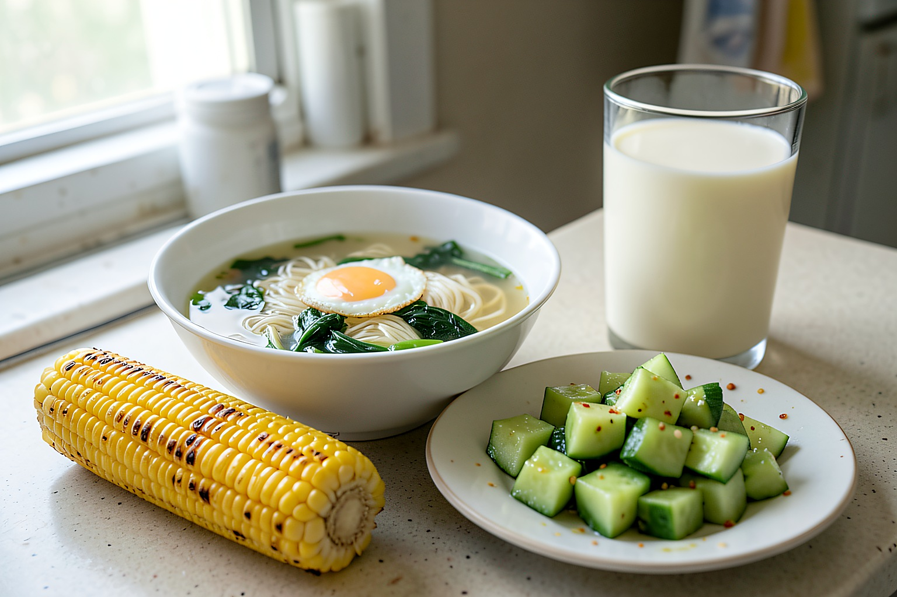

# 晒晒一个人的早餐，12元做4样，20分钟热乎端上桌

今天早上醒得有点晚，外面又闷，原本想随便泡杯牛奶就算了。后来一想，上午还要忙半天，肚子空着不踏实，就翻了翻冰箱，给自己做了一顿简单早餐。

一个人吃饭不用摆得多好看，但也不能太糊弄。今天做了鸡蛋青菜汤面、煎半根玉米、拌黄瓜和一杯豆浆，算下来差不多12元。面条用了昨天剩的一小把，青菜是小区门口菜店买的，20分钟左右就能端上桌。

花费大概记一下：鲜面条两块，鸡蛋一个一块多，青菜两块，黄瓜两块，半根玉米两块，豆浆是家里常备的豆子打的，就不细算了。一个人的早餐吃成这样，我觉得比空着肚子出门舒服多了。

## 一、鸡蛋青菜汤面

这个汤面做得很快，适合早上没太多时间的时候。青菜我用了小白菜，叶子有点蔫，但洗干净以后下锅还是挺嫩的。

【食材准备】：鲜面条一小把、鸡蛋1个、小白菜几棵、葱花、生抽、盐、香油。

1、先把小白菜掰开洗干净，根部有泥的地方多冲两遍，沥一下水备用。

2、锅里加水，水开后先下鲜面条，用筷子搅散，别让面条粘在一起。

3、面条煮到中间还有一点白芯时，把小白菜放进去。青菜不用煮太久，变软就行。

4、碗里放一点生抽、盐和葱花，舀两勺面汤冲开，再把面条和青菜盛进去。

5、鸡蛋我没有直接打进汤里，另起小锅煎了一下。今天火稍微大了点，边缘有一点焦黄，不过放在面上还挺香。

6、最后滴几滴香油，汤面就好了。早上吃这种清汤面，不油腻，胃里也舒服。

## 二、玉米和拌黄瓜

玉米是昨晚煮多的，早上切半根放平底锅里稍微煎一下，表面有点焦香，比直接吃凉的好。

7、平底锅不用放太多油，把玉米切开后放进去，小火慢慢煎两三分钟。

8、黄瓜拍开切小段，加一点盐、醋和蒜末拌一拌。我今天醋放得稍微多了，第一口有点冲，配汤面倒是刚好。

豆浆是用破壁机提前打好的，早上热一下就能喝。一个人吃饭最怕越省事越随便，其实像这样煮一碗面，搭点小菜和玉米，也没多费劲。

这顿早餐不精致，但吃完挺踏实。面条热乎，青菜清爽，鸡蛋有点焦香，黄瓜酸酸的也开胃。你们一个人在家吃早餐时，会认真做一点，还是随便对付两口？

我是玥玥，家常饭慢慢做，日子也慢慢过。感谢你的支持，祝你今天也好好吃饭。
