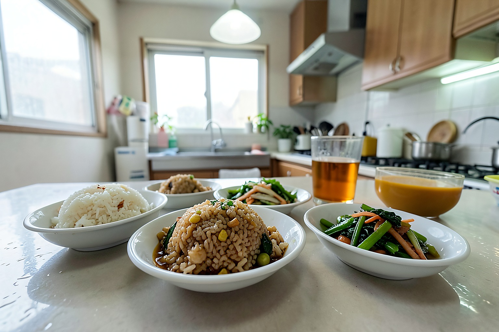
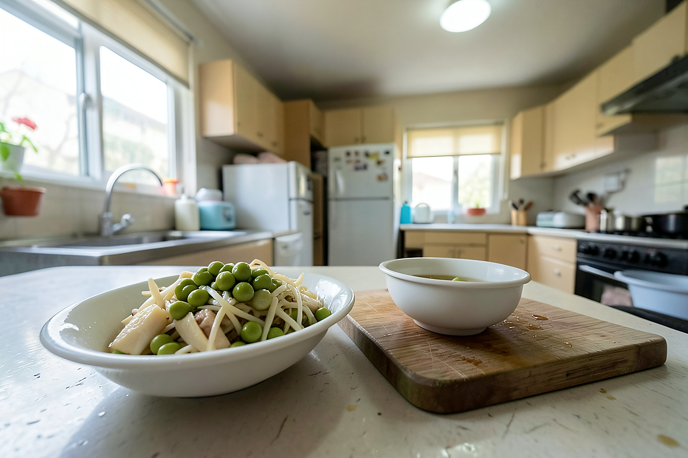
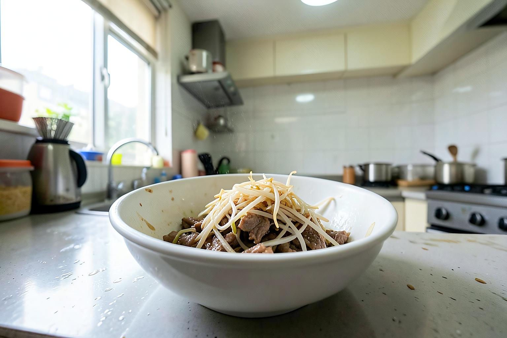
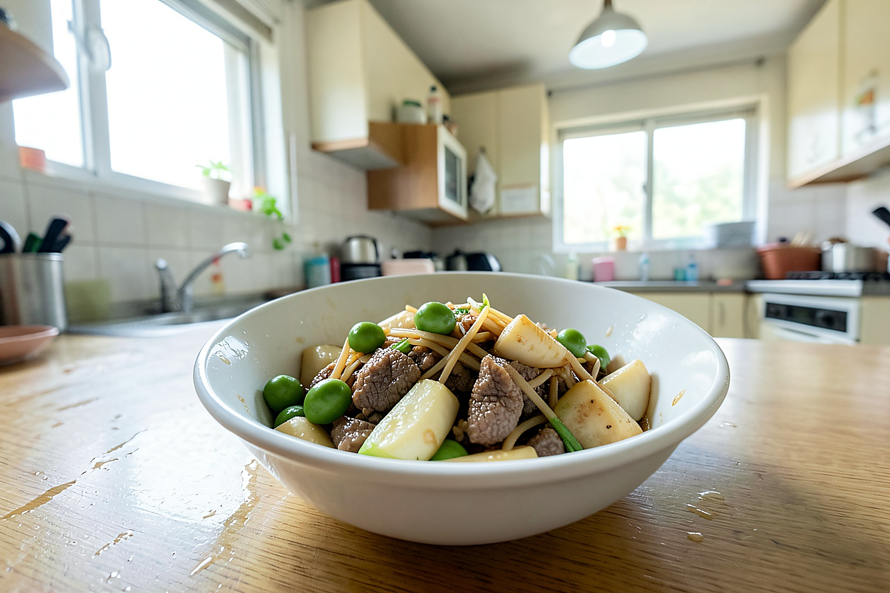
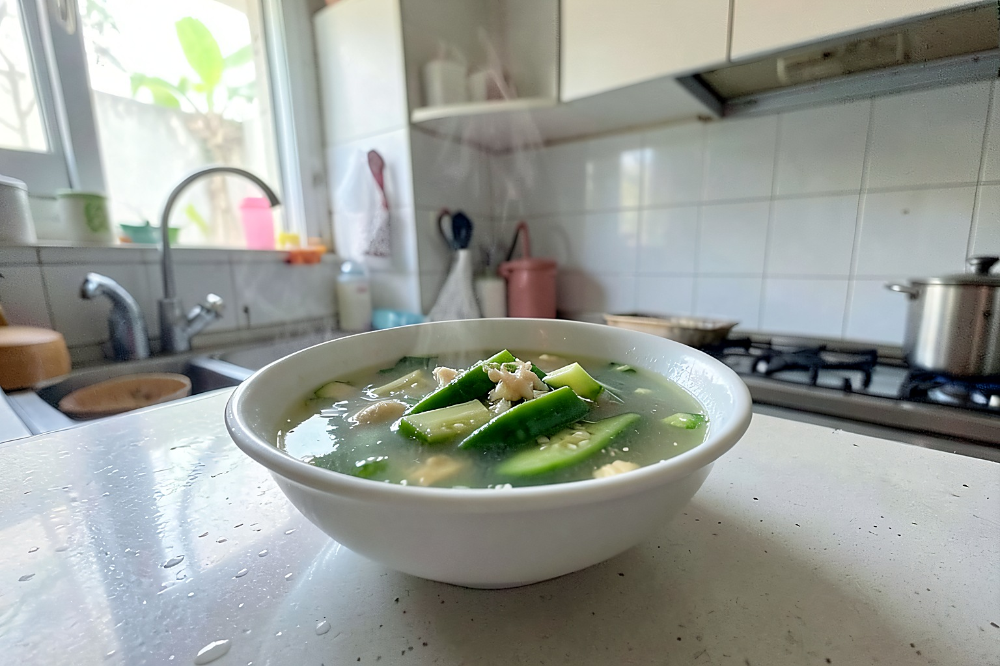
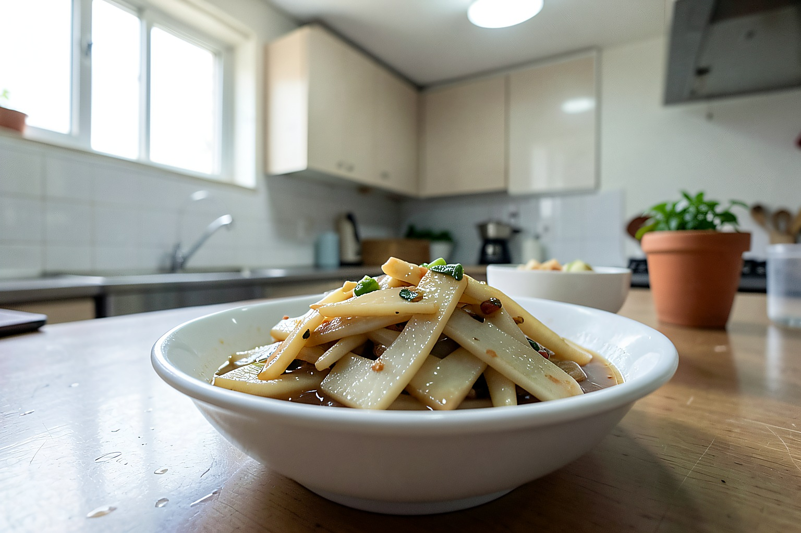

# 梅雨天两个人晚餐，28元做3样，清爽下饭不油腻

这两天江苏这边又闷又潮，下午下了一阵雨，厨房里一开火就觉得热。晚餐我没做重口味的菜，想着两个人吃，清爽一点、汤水多一点就行。

今天晚餐是毛豆茭白炒肉丝、丝瓜鸡蛋汤，再配一盘凉拌藕片。米饭提前煮上，三样菜差不多35分钟做好，花费大概28元。没有大菜，但都是这个季节吃着舒服的家常味。

花费明细也简单说一下：茭白和毛豆一共九块，里脊肉一小块十二块，丝瓜三块，鸡蛋两个两块多，藕片用了半节，算下来三四块。两个人吃刚好，没剩太多。

## 一、毛豆茭白炒肉丝

这道菜是今天晚餐的主菜。茭白切丝以后带点清甜，毛豆吃着香，肉丝不用太多，主要是提个味。

【食材准备】：茭白2根、毛豆一小碗、里脊肉一小块、姜丝、生抽、盐、淀粉、少许白胡椒粉。

1、茭白剥掉外皮，切成细一点的丝。今天有一根茭白底部稍微老了，我把硬的部分切掉了。

2、毛豆先冲洗干净，锅里水开后加一点盐，焯两三分钟。这样后面炒的时候更容易熟。

3、肉丝加生抽、白胡椒粉和一点淀粉抓匀，腌5分钟。肉不多，但处理一下口感会嫩些。

4、锅里放少许油，先把肉丝滑散，变色以后盛出来，别一直炒到发干。

5、锅里留底油，放姜丝，再倒入茭白丝和毛豆，中火翻炒。茭白一开始有点硬，要多炒几下。

6、等茭白变软后，把肉丝倒回锅里，加盐和一点生抽调味。出锅前尝一下，毛豆熟透了就可以盛出来。

## 二、丝瓜鸡蛋汤

丝瓜汤很适合这种闷热天。今天这根丝瓜买得有点大，里面有一点籽，不过还算嫩。

7、丝瓜去皮切滚刀块，鸡蛋打散备用。

8、锅里少放一点油，先把丝瓜炒到微微变软，再加热水。这样汤里会有一点丝瓜的清香。

9、水开后淋入鸡蛋液，等蛋花浮起来，加盐调味就行。我没有放太多调料，喝着清清爽爽。

## 三、凉拌藕片

藕片是临时加的，本来想炒，后来觉得锅已经够热了，就改成凉拌。

10、藕去皮切薄片，水开后焯一分钟左右，捞出来过凉水。

11、加盐、醋、少许生抽和一点香油拌匀。喜欢蒜味的可以放蒜末，我今天怕味道太冲，就只放了一点点。

这顿饭吃完没有负担。毛豆茭白炒肉丝鲜香下饭，丝瓜汤清淡，藕片脆脆的，刚好把闷热感压下去一点。老公说今天这个搭配比红烧菜舒服，米饭也没多添。

梅雨天做饭，我越来越喜欢少油少汤汁浓的菜，清爽但不能没味道。你家下雨天晚餐爱吃热汤，还是更想吃凉拌菜？大家觉得这三样28元贵吗？

这里是玥玥小厨，饭菜不花哨，吃着舒服就好。喜欢家常饭的朋友，咱们明天继续见。
