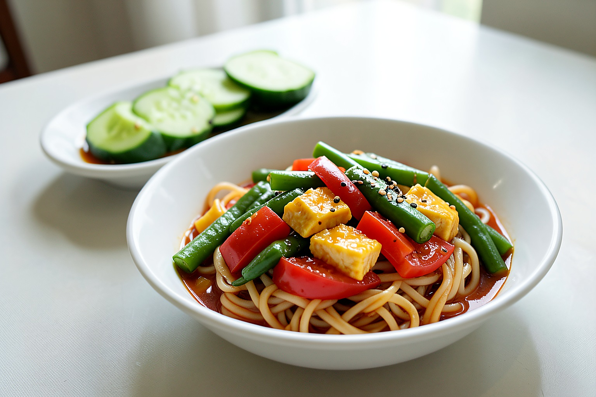
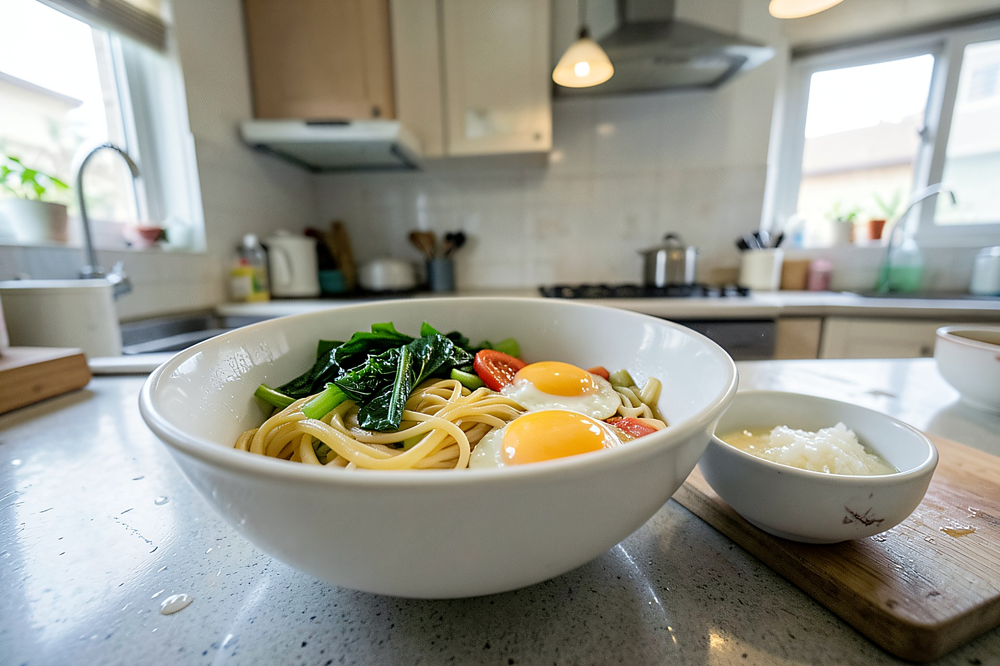
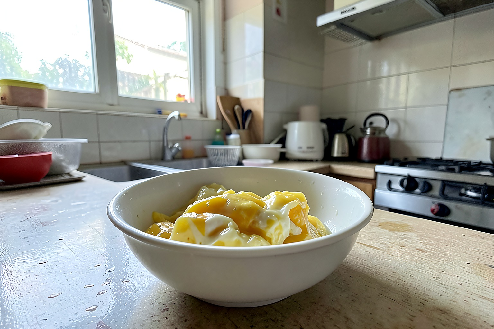
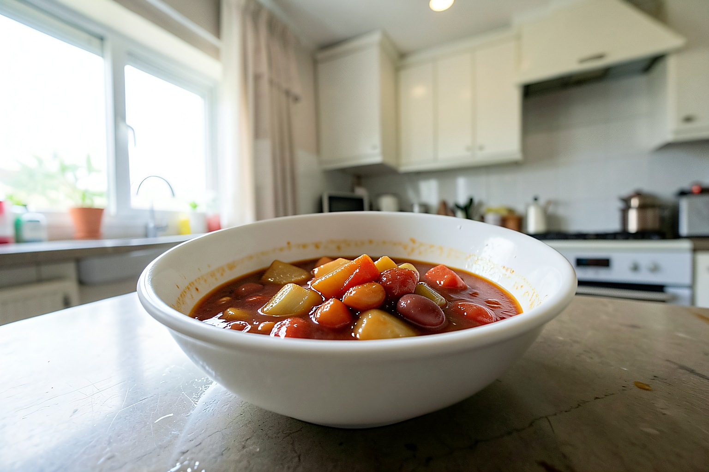
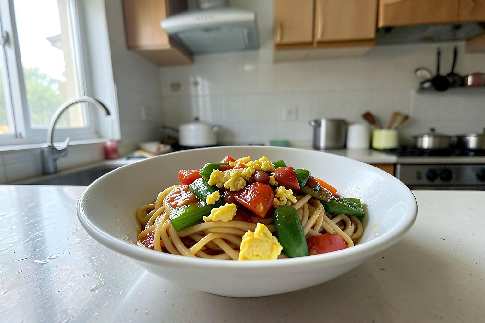
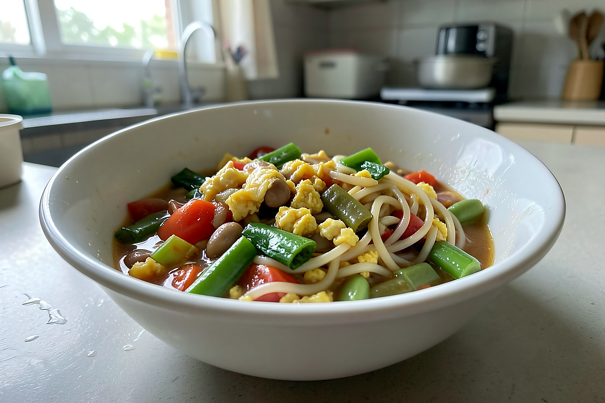

# 晒晒河南人的午餐，18元一碗捞面，天热吃真开胃

天一热，我就容易想吃带点酸香味的面。今天中午不想炒太多菜，正好家里有番茄、鸡蛋和一把长豆角，就做了一碗河南家常捞面条。

这顿午餐两个人吃，主食是番茄鸡蛋豆角卤捞面，旁边配了一小碗蒜汁黄瓜。鲜面条是早上买的，整体花费大概18元，30分钟左右能做好。看着普通，但夏天吃是真开胃。

简单算一下：鲜面条五块，番茄三个三块多，鸡蛋两个两块多，长豆角四块，黄瓜两块，蒜和调料就不细算了。肉没放，靠番茄和鸡蛋出味，吃着反而轻快。

## 一、先做番茄鸡蛋豆角卤

这个卤不用做得太干，带点汤汁拌面才香。番茄要多炒一会儿，豆角一定要炒熟，这两点别省。

【食材准备】：鲜面条、番茄3个、鸡蛋2个、长豆角一把、蒜末、葱花、生抽、盐、少许白糖。

1、番茄洗干净切小块。我没去皮，家里吃饭没那么讲究，炒软以后也不影响。

2、长豆角掐掉两头，切成小段。今天豆角有几根稍微老了，我把筋撕了一下。

3、鸡蛋打散，锅里油热后倒进去，炒成大块先盛出来。鸡蛋别炒太碎，拌面时吃着才有存在感。

4、锅里留底油，放葱花和蒜末炒香，再倒入番茄块。中火多炒几分钟，炒到番茄出红汤。

5、把豆角倒进去一起炒，加一点生抽和盐。豆角不能只靠最后焖一下，我会先翻炒到颜色变深。

6、加半碗热水，盖上锅盖焖6分钟左右。中间打开看一下，豆角熟了、番茄汤汁变浓就差不多了。

7、把炒好的鸡蛋倒回锅里，轻轻翻匀。出锅前我加了一点点白糖，不是吃甜味，是让番茄的酸味更柔和。

## 二、煮面和调蒜汁

8、另起锅烧水，水开后下面条。鲜面条煮到没有白芯就捞出来，喜欢凉一点的可以过一下凉水。

9、我今天过了半盆凉白开，这样面条更利索，不会坨成一团。要是胃不舒服，就别过得太凉。

10、蒜汁也简单，蒜捣碎，加盐、醋、生抽和一点香油，再放几片黄瓜。今天蒜放得有点多，第一口挺冲，但越吃越香。

## 三、拌开就能吃

面条盛到碗里，浇上番茄鸡蛋豆角卤，再舀一点汤汁进去，拌开以后酸香味就出来了。豆角有嚼劲，鸡蛋吸了番茄汁，面条裹着汤汁，吃着不干。

这顿午餐没有肉，但两个人都吃得挺满足。天热的时候，我反而不想吃太厚重的卤，番茄、鸡蛋、豆角这样一拌，有菜有主食，吃完也不觉得腻。

你家夏天吃捞面条，喜欢番茄鸡蛋卤，还是蒜汁芝麻酱那种？大家做豆角卤时，会先焯水还是直接下锅炒？

我是玥玥，记录普通家庭的一日三餐。谢谢你的点赞和在看，愿我们每天都能简单吃好饭。
