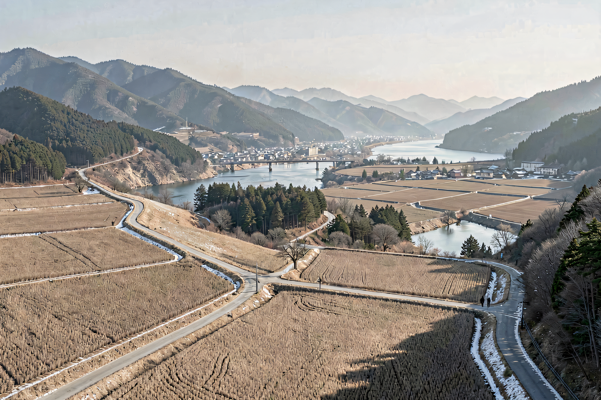

下午4点多，名单发下来。他先搜索自己的名字，没有结果，又把表格从头看了一遍。

隔壁同事问：“有你吗？”他摇了摇头，把文件关了。

有人劝他再等一轮，反正才35岁。可这是他在县直事业单位工作的第8年。上一轮缺的材料已经补了，这次仍然没有结果。

这是一个综合场景，不对应具体人物和单位，也不讨论某地的评审政策。他现在想弄清楚的是，明年还要不要照原来的办法准备。

## 01

第二天中午，他拿了张旧表，把过去一年为这件事花的时间列了一遍。

周末参加学习，晚上整理证明，为了补一段工作经历又接了几项任务。单看都不算大事，凑在一起，差不多占掉了十几个休息日。

他最没底的不是辛苦，而是不知道下一轮该改哪里。同事有人说再多做一个项目，也有人说主要看排序。他翻了现有通知，能确认的条件已经完成，剩下的说法却没有正式依据。

如果明年仍然只是把同一套材料再交一次，这一年等的究竟是机会，还是运气？他以前没有认真算过。

对35岁左右的人来说，这几年通常还挤着别的事。孩子上学、老人看病、房贷支出，或者一次换岗和考试机会。继续准备职称，意味着别的安排要往后放一点。

所以，真正该问的不是“还能不能熬”，而是“下一年的投入，能不能换来更清楚的可能性”。

## 02

决定继续等以前，可以先把三个问题问具体。

第一，下一轮还缺什么。

是明确缺一项资格、一段年限或一份业绩材料，还是所有条件都满足，只能等待排序？前一种情况至少知道力气该往哪里用；后一种情况更要了解，自己能改变的部分到底有多少。

这里不能靠听同事猜。涉及资格和程序的内容，应当以本单位正式通知、公开文件和主管部门答复为准。把确定条件和办公室里的经验说法分开，能少走不少弯路。

第二，评上以后具体改变什么。

有人看重待遇变化，有人需要它打开后续岗位空间，也有人只是觉得同批同事都有了，自己不能落下。原因不同，值得投入的程度也不同。

把期待写清楚很重要。如果它关系到下一阶段的明确安排，可以集中准备；如果更多是不甘心，就要小心别让比较替自己作决定。

第三，继续准备会挤掉什么。

有的人因此放弃一次遴选或考试，有的人推迟照顾家庭，也有人年年接很多“可能有用”的活，最后本职工作和身体都受影响。

机会成本不是劝人放弃，而是提醒自己：投入职称的每一个晚上，本来还可以用在哪里。

## 03

问完这三个问题，选择通常会清楚一些。

如果差距明确、规则可核实、评上后的回报也确实重要，那就再给自己一个完整周期。需要补什么、找谁确认、什么时候完成，列成能执行的安排，不再靠模糊期待支撑。

如果条件已经满足，但决定性因素长期不可预期，可以继续保留资格，同时把主要精力放回更能掌握的事情。把手头业务做扎实，留意合适的考试、岗位和学习机会，不让一种结果占满全部职业生活。

还有一种情况，是评职称已经变成了证明自己没有落后的方式。这个时候，暂停一轮也不等于认输。一个人的专业能力，不会因为名单上暂时没有名字就全部失效。

文章开头的那个下午，他后来没有马上决定再等一年，而是先做了两件事：把本轮公开条件逐项核了一遍，再把接下来两年的家庭和工作安排写在一张纸上。

他发现自己仍然愿意准备，但只愿意再投入一个明确周期。下一轮需要补的材料按时间完成，结果之外，也同步准备另一个可以选择的方向。

这不是给自己留退路，而是不再把所有希望压在一个无法完全控制的结果上。

35岁并不是必须坚持或必须放弃的分界线。真正重要的是，下一次等待要有条件、有期限，也要保留别的可能。
