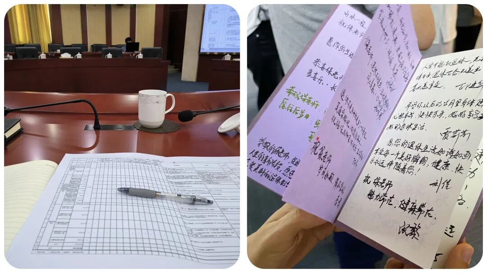

# 公务员有提前退休通道，事业编为什么却不开放呢？

# 公务员有提前退休通道，事业编为什么却不开放呢？

原创 田间烟火 田间烟火 田间烟火

在小说阅读器读本章

去阅读

在小说阅读器中沉浸阅读

公务员有提前退休通道，事业编为什么却卡得紧？

这段时间体制内相关讨论中，关于退休的话题很受关注，同样是在编制内奉献青春，公务员在达到条件后可以申请提前退休，而事业编人员却往往只能继续熬到法定退休年龄？

01

公务员与事业编提前退休的政策差异

公务员能提前退休，背后到底靠的是什么？

最近讨论还挺热，大伙看着身边的体制内人，有的人干满一定年限就可以申请提前退休，有的却还得再熬好几年。

有些人不太明白，这里面到底差在哪？

我们先说说公务员，根据《公务员法》第九十三条，公务员确实拥有法定的提前退休通道（如工作满一定年限等）。

不过需要提醒的是，随着2025年渐进式延迟退休政策的实施，具体的工龄和年龄门槛正在动态调整中，实际审批会结合现行政策与组织人事规定。

如果主管部门批了，退休手续很快就能办。

而这一条，是多少在关键岗位工作多年的公务员所期盼的通道。

回过头一看事业编，情况就不一样了。

虽然同样是在单位做贡献，可人事管理主要依据《事业单位人事管理条例》，2025年后虽然也纳入了弹性退休框架（在满足条件下可申请提前一定年限退休），但其适用条件和范围比公务员的法定通道要严格、有限得多。 

对多数普通事业编人员来说，路径确实没那么“宽松”。

那是不是只要工作年限够了，当公务员的想退就能退？

其实也不全是这样，有些岗位比如基层一线、一时半会没人接班的，还有阶段性关键工程的负责人，就算年头到了，组织上有权暂缓审批。

单位紧要任务是一方面，政策也不可能一刀切让人都立刻离开。

02

事业编提前退休的特殊情况

至于事业编，如果真想提前退休，实际只有几种情况用得上：

-   ①.因身体出问题到完全丧失劳动能力，这得有专业鉴定；
    

-   ②.特殊工种，比如井下、矿山、特教这类，按照相关年限和条件可以申请退休；
    

-   ③.机构改革时遇到人员优化调整，有可能提前退出。
    
-   除此以外，基本无解。
    

03

政策差异的核心原因

有人说这显然不公平，毕竟同样在体制内干活，到了退休口子却差别这么大。

这样想其实可以理解，大家最直观感受到的就是“身份”不同带来的体验差。

但这个设计本来就跟岗位属性和管理需求直接挂钩。

为什么公务员能有法定通道、事业编没那么灵活？

核心问题在于两类岗位的工作目标和组织需求差别挺大。

公务员岗位的管理需求

公务员平时要处理行政管理、政策落地、执法等职责，强度不小。

而且体制内干部队伍年纪越来越大，不开设“提前退休”通道，年轻人上不去，组织新陈代谢也慢。

让符合条件的干部退休，说白了也是为了给年轻干部队伍腾出发展空间。

事业编岗位的特殊性

另一方面看事业编，像医生、老师、科研人员居多，这些岗位可不容易培养。

临床医生、大学教授动辄几十年经验，专业经验需要长期积累，如果骨干人员大规模、过早退休，断层风险很高，专业领域怕是很难快速补齐。

大家静下来仔细想想，一所重点医院、老牌大学，一夜之间老师、专家走一大半，谁敢说公共服务质量不会出问题？

所以，这块政策设计真没法和公务员完全一套。

04

提前退休并非只看工龄

回到实际操作，真正在编制里干过的人都清楚，提前退休不仅取决于年限，还和岗位、工作需要、人事政策密切相关。

再比如国有企业，有些效益好的单位前几年为了“减员增效”，确实有过一次大规模内退潮。

不过今年以来，随着经济环境和用工结构的变化，也能看见不少大国企探索稳就业、延迟退休的办法，大家再想靠“内退”轻松退休，已经没那么容易批了。

我再举一个和公共事业相关的例子。

“日本社会老龄化一直很突出，近几年他们不少地方政府干脆延长了公务员和部分事业编岗位的退休年限，甚至有‘70岁工作法’推出”。看似和国内趋势相反，其实考量的是同一个核心：“社会结构变了，退休政策就得因人、因岗、因时微调，绝不能一刀切”。（注：此案例仅供参考，各国国情与制度不同）

有的人会说，那么多老教师、老医生，工作能力是不是大不如前？

现实其实也有不同体现， 有些专家经验越老、专业能力越强，在团队里不可或缺。

还有些岗位一旦长期高压、年龄稍大，效率和体力会明显下降，这两种情况没法简单合并讨论。

其实，退休政策可以时不时看看国际同行怎么做，但最终怎么安排，还是得根据自己制度环境、岗位属性和社会需求来。

对体制内职工来说，怎么选、怎么走，终归更适合和单位的组织规划、自身生活规划相匹配。

盲目跟风，未必是最好的路和选择。

最后总结一句：

“体制内这口‘提前退休’的门槛，不是只看工龄，更要看身份、看职责、看政策调整目标”。

想明白这层理由，埋头认真修炼自己的岗位本事，倒比天天纠结谁先退休更有意义。

修改于

---

原文：https://mp.weixin.qq.com/s?__biz=MzY4NDI4OTA3NA==&mid=2247483954&idx=1&sn=d9bb1224e2a7d745c39f03371e2ec658&chksm=f3a77f6fc4d0f679c3f717cb2326d2606fd77f7c741e558bec7a7e2e6efff04585eb114bd07e
