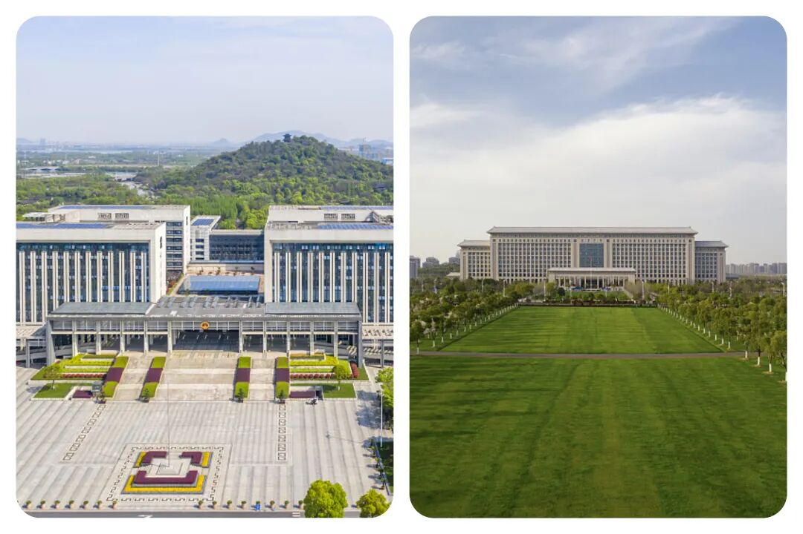
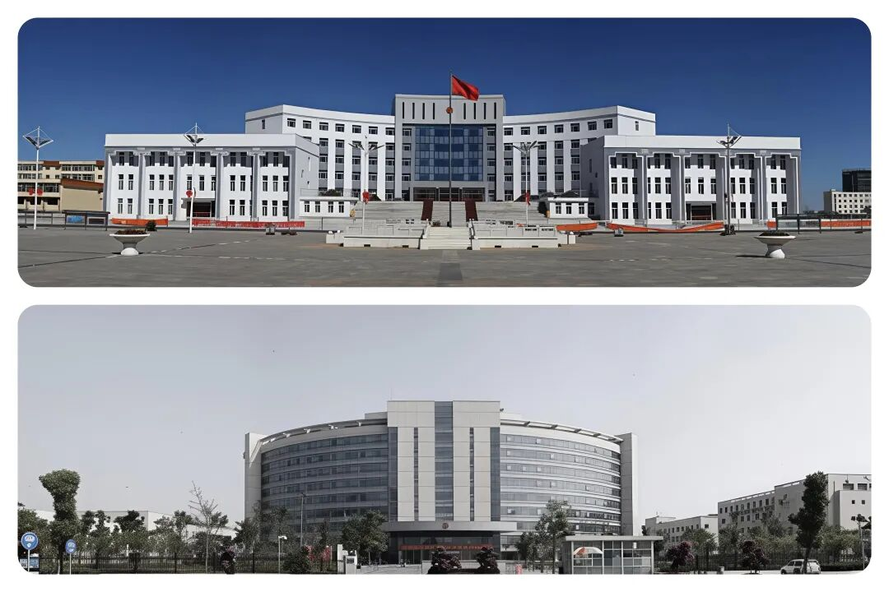
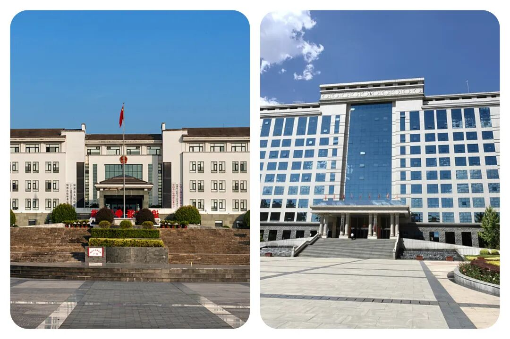
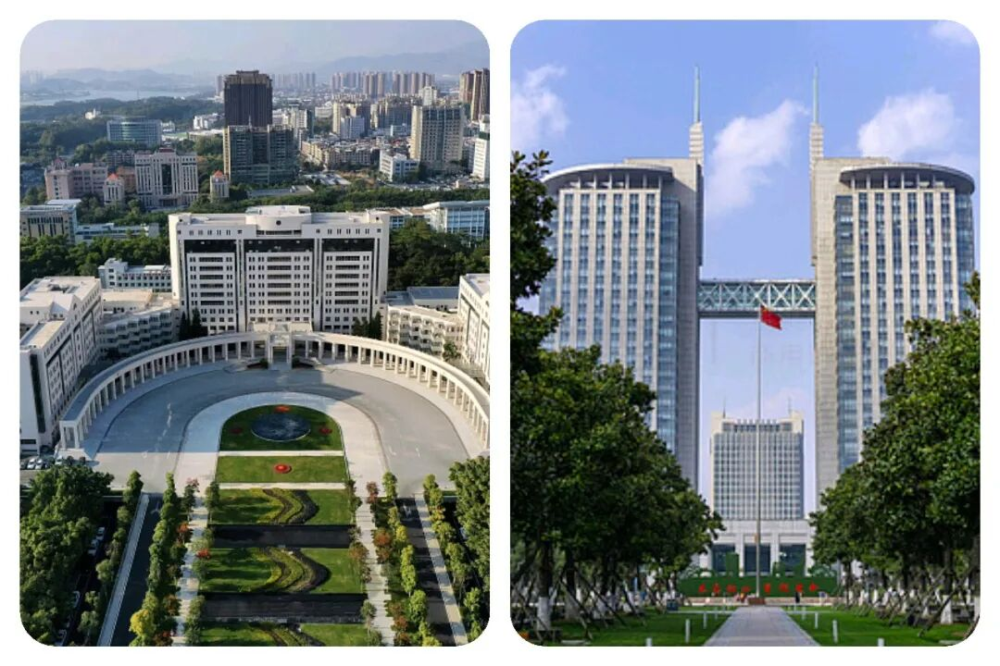

# 省、市、县、乡公务员岗位全面对比：看清差别，再做选择！

# 省、市、县、乡公务员岗位全面对比：看清差别，再做选择！

原创 点击关注👉🏻 点击关注👉🏻 田间烟火

在小说阅读器读本章

去阅读

在小说阅读器中沉浸阅读

聊到体制内工作，一个经典问题是：省、市、县、乡，4个层级到底哪一级最“舒服”？

表面看，省级平台高，乡镇能干事，但真正的区别，往往在那些表格和数据之外。

有一位在省厅工作了快十年的人，是这么形容的：

“在这里，你写的每一份材料，都可能影响全省某个行业的走向。成就感是顶格的，但压力也是”。

他常年和宏观政策、跨部门协调打交道，视野被撑得很开。

但代价是，“白加黑”、“5+2”是项目期的常态，家里的事基本顾不上。

省级岗位，像是职业赛场的高阶副本，给你最大的舞台，也向你索取全部的时间和精力。

01

乡镇岗位⭐

说到乡镇，我个人的体会更深：

“在镇上，你手机里存着几百个村民或村屯队长的电话。谁家土地有纠纷，哪个路段路灯坏了，哪家哪户的鸡鸭牛羊有什么问题，他们会直接找你。你会觉得自己真的在被需要”。

工作极其具体，也极其繁重，动不动就是周末节假日全体成员正常上班，开展防汛防火、医保社保、入户核查走访、矛盾调解，维稳工作、交通安全宣传、燃气安全检查、防溺水安全宣传、迎检、接待活动、耕地图斑核查整改任务等一系列工作。

每一次开个工作例会，最苦的就是包村工作组组长，总能接到这些各种各样的工作，而且还必须要马上开展工作，不然就受批评教育，下次例会点名，事事都要最终落到他们肩上。（注：这里讲的也包含事业编）

这是一种“泥土里长出来”的成就感，疲惫但扎实。

当然，个人生活空间和待遇上的局限，也是实实在在的。

02

县级岗位⭐⭐

那么县城呢？我有一位在县里工作的朋友打了个比方：

“我们像是变压站。省市的电（政策）传下来，电压太高，得把它变成220伏，才能安全供到乡镇、村里去用” 。

这个“变压”的过程最考验功力：既要吃透上级精神，又要摸清基层实情。

工作兼具“文来文往”和“人来人往”，既要写各种部门的材料、还要迎检，也要跑现场、解难题。

03

市级岗位⭐⭐⭐

那传说中的“性价比之王”【市级】呢？

我接触过的不少市级公务员，也听过我的同学说过，状态确实相对从容。他们说：

“我们的核心就八个字：上传下达，督促检查”。

他们不需要像省里那样绞尽脑汁“造句子”（制定政策），也无需像县乡那样“钉钉子”（一线落实）。

工作节奏更有规律，有更多时间陪伴家人、经营自己的生活。

市级岗位，像是一条宽阔平稳的河道，既能承载你稳步向前，又允许你在两岸拥有自己的生活景观。

🌙

待遇与晋升情况

说到大家最关心的待遇和晋升，情况就复杂了。

“同级别不同命”是常态。

一个街道办的公务员或者事业编，收入可能远超中西部某些省厅的干部。

晋升快慢，一半看单位职数、一把手风格，另一半看个人机遇。

简单笼统地说“市级晋升快”，可能会误导人或者是“画大饼”。

🌙

那该怎么选层级？

我个人觉得，选层级，某种意义上是在选一种“城市生活套餐”：

-   省级岗位往往绑定一线或强二线城市的高压高成本生活；
    

-   市级则对应着区域中心城市的相对舒适圈；
    

-   县城提供了一种安定、熟人社会的归属感；
    

-   乡镇则与乡土中国紧密相连。
    

所以，到底怎么选？

1.如果你想在专业领域走到顶尖，参与规则制定，并能承受极高的职业强度，省级是你的赛道。

2.如果你渴望深度融入一方水土，不惧琐碎，从解决一件件具体民生实事中获得巨大满足，县乡能给你无与伦比的锻炼。

3.而如果你追求的是工作与生活的可持续平衡，希望在拥有不错职业发展预期的同时，还能正常下班、陪伴家人、享受城市便利，那么市级往往是那个“最大公约数”。

当然，这也不是绝对的。

一个热门省会城市的市直核心部门，竞争可能惨烈如修罗场；

而一个偏远地市的“冷衙门”，也可能面临事多钱少的窘境。

说来说去，这本来就没有完美的岗位，只有更适合的选择。

在报考前，不妨多问自己几句：

1.  我更能从哪个层面的工作中获得价值感？
    
2.  我理想的生活图景是怎样的？
    
3.  为了职业发展，我愿意在生活上让步多少？
    

公务员这份职业，提供的不仅是一份工作，更是一种生活方式的长期选择。

想清楚自己要什么，比单纯比较“哪级更香”重要得多。

你所在的层级有哪些特点？留言区聊天呗！

---

原文：https://mp.weixin.qq.com/s?__biz=MzY4NDI4OTA3NA==&mid=2247484031&idx=1&sn=63914079b6e32e76edb68842b6691003&chksm=f3a77f22c4d0f634793e099981cbedc12339c2dbbc75682475a637eeb99cd79e0af2c6afaab9
