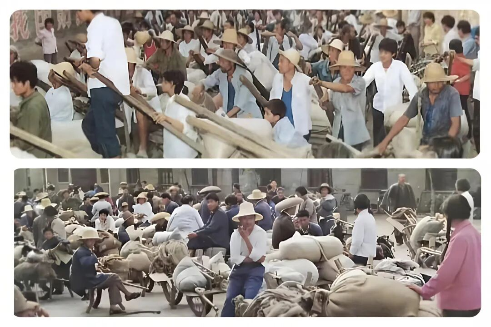
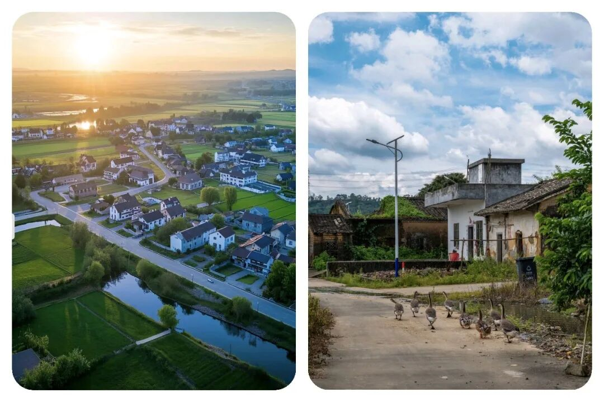
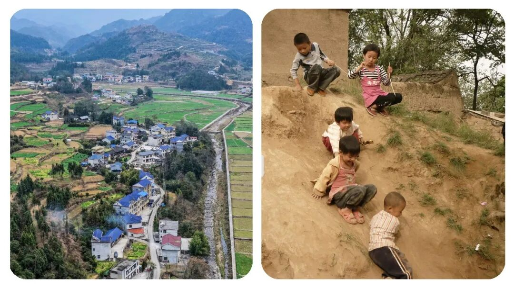
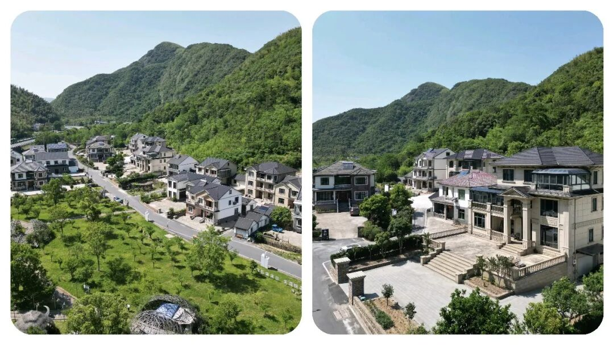

# “不谈大道理，聊聊最真实的农民生存现状”

# “不谈大道理，聊聊最真实的农民生存现状”

原创 点击关注👉🏻 点击关注👉🏻 田间烟火

在小说阅读器读本章

去阅读

在小说阅读器中沉浸阅读

大家好，我们今天来聊聊一个比较有争议的话题：“国家富裕起来了，城市繁华建设起来了，机械化，智能化也发展起来了，那么农民该如何发展呢？”

每当走在城市的街头，看到眼前这些高楼大厦、车辆川流和热闹场景，心里总会产生几分疑问。

城市越来越好，农村呢？村里的农民呢？

那些一直默默付出的农民兄弟大哥，他们的日子到底有没有变得轻松点？

01

农民支撑了国家工业化起步

说起来，现在社会富裕了，可最开始的时候不就是靠着农民一点点撑起来的吗？

上世纪经济还穷得叮当响，搞建设、推工业，钱又从哪来？

无非是农业一点点省出来、挤出来。

农民面朝土地，背朝天，风吹日晒，粮食收上来，却只能低价卖给国家，自己家里留不了多少。

几十年过去，农民攒下了国家工业化的第一桶金，但他们却一直捏着微薄收入，生活并没有因为城市变好而彻底改善。

（注：文中插图仅供阅读，无不良引导，请勿对号入座）

02

城市化进程中的城乡落差

开放以后，城市变得像按下了快进键。

政策支持、资金投入、人才流动，都往城市头扎。

工厂和写字楼拔地而起，不少人发财了。

反观农村，大多像被按住暂停：学校合并、卫生院冷清、年轻人外出打工，剩下老人孩子独守空房。

农民继续靠那几亩薄地，辛苦一年，扣掉各种农资成本，账上一算，几乎剩不下钱。

农产品涨价慢，化肥、农药、种子年年涨，收入和支出不成正比。

农民想让生活宽松些，收入高一些，干脆进城打工。

可城市里的脏活、累活、没人愿意干的事情是不是都落到了农民工肩上？

高楼大厦、宽阔道路、热闹工地，这些城市标志背后，藏着无数农民工的身影，也是实属无奈。

城市光鲜，可他们住的是冷棚热宿，拿着最低工资，没多少保障，还动不动还拖欠工资。

医保、社保、孩子上学这些城市福利，大多跟他们好像已经脱离了关系。

乡下农村老家的父母孩子成了留守一族，村庄越来越空，越来越没有了活气，冷冷清清，一个年轻人都没有，宁可外出打工，都不待在家乡。（目前大多数农村普遍的现状）

城市扩张中的利益分配问题

城市扩张也让农民付出。

土地一到城市规划里，农民世代的根就“说没就没”。

补偿款看起来不少，可土地一旦入市价值翻了好几百倍，农民好像总碰不着增值那一份。

全国不同地方都出现类似情况，许多地方征地补偿，农民个人实际得的补偿远低于市场价格（注：以当地地价等政策为准）。

城乡公共资源的差距

说到底，农村的发展节奏远远赶不上城市。

看看资源分配：城里人的医院、学校设施越来越棒，医疗、教育、养老保障都升级。

回过来看农村，学校一个个合并、关闭，很多卫生院只剩老医生坐诊，遇到急病还得跑几十公里去县城或者市区。

孩子上学也越来越难，离家远还没人照顾，离家近又赚不到什么钱，难满足日常基本开销。

（注：文中插图仅供阅读，无不良引导，请勿对号入座）

03

农村发展的现状

有人说“农村不是都这样”，有些地方的确转型快点，比如昆山、深圳边上，农民赶上了城市化红利，土地入股、参与房地产开发，分红不少，生活改善明显。

但也有多数还在为基本医疗、教育、养老发愁。

全国农村老龄化越来越明显，青壮年外流，土地无人耕种，耕地撂荒，高价农资进一步拉高成本。

就算收入表面上比过去高，可支出同样在涨。

再看农民工这个群体，全国有两亿多，城市建筑、交通、环卫、餐饮一大半靠他们维持。

每年都有拖欠工资、工伤赔付等案例，虽然近几年各地都在加强监管，改善宿舍条件和工资发放，但不少地方依然存在不少漏洞。

城市夜晚最亮的灯光、最热闹的街市，其实不少都是农民工努力搬砖、清扫、施工的成果。

说到与城市居民共享发展成果，现实距离还很远。

城市居民工资上涨、休闲生活漂亮，农民不少却还在为基本生活打拼。

现在国家每年有扶贫、农村振兴政策，但效果有快有慢，只要我们大家一起努力加油就能慢慢改进现在的农村生活，走向共同富裕。

部分地方农村发展产业、乡村特色旅游、合作社推动新经济，农民参与其中收入确实提升。

不过多数传统农区还是靠土地吃饭，日子并没有翻天大变。

（注：文中插图仅供阅读，无不良引导，请勿对号入座）

04

让农民共享发展成果

城市发展越来越快，农村却像被拉在身后，拖着走。

农民用自己的劳动力换取了整个国家的繁荣，却难以参与收获时的分红。

光鲜表象下，很多城市的美好其实建立在农民工的默默付出基础上。

现代社会想要更公平一些，不能只是城市自己热闹。

农村的基础教育、公立医疗、养老保障，需要持续投入。

农民的付出应该被看到，政策红利分配要更合理，让付出了几十年的农民，也能在城市和乡村共同的灯火里，真正享受到属于他们的一份甜头。

这不是只靠一句“共享发展成果”就能解决的现实问题。

每当看到城市灯火明亮，高楼林立，人们安稳生活，不妨想想那些弯腰劳作、默默奔波的农民兄弟。

国家的进步不能永远让最辛苦的人成为“被记得最少”的群体。

如果阳光能照进每扇窗，也要记得照亮每片田地。

（注：文中插图仅供阅读，无不良引导，请勿对号入座）

都说民以食为天，农民是最朴实的守护者。

赞同善待农民、缩小城乡差距的，麻烦点赞收藏，评论区一起聊聊！

注：以上内容均为个人见解，仅供参考，无不良引导，不当之处请批评指正，另有见解可以评论区留言聊聊！

---

原文：https://mp.weixin.qq.com/s?__biz=MzY4NDI4OTA3NA==&mid=2247484046&idx=1&sn=a15deba5dab6b91efc5454516c0401db&chksm=f3a77fd3c4d0f6c50eb6369c055b10f7581a26935b329d4fa6e2d4e3d9174506a022f150cfa1
