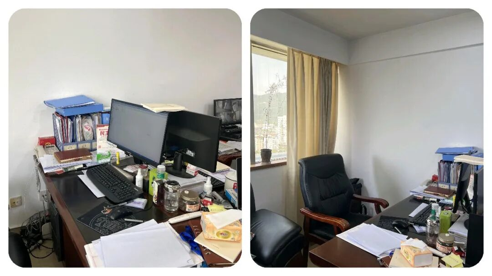
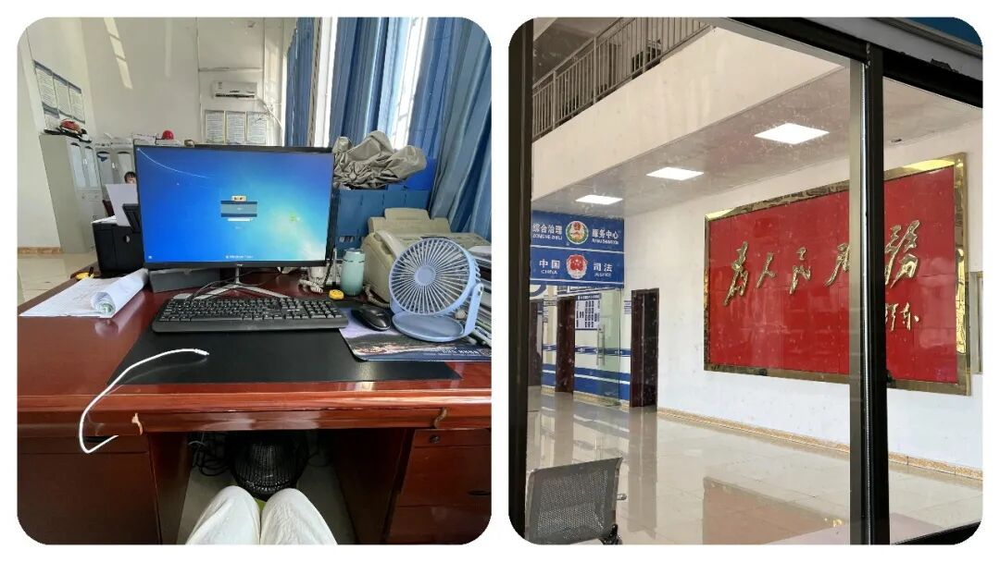

# 为什么越来越多年轻人，宁愿挤编外也不进私企？真相很现实！

# 为什么越来越多年轻人，宁愿挤编外也不进私企？真相很现实！

原创 点击关注👉🏻 点击关注👉🏻 田间烟火

在小说阅读器读本章

去阅读

在小说阅读器中沉浸阅读

很多人默认：没编制、工资不高一个月才两三千的编外岗位，根本没有发展前途。

但现实却是，越来越多普通毕业生，挤破头也要进体制内编外。

明明薪资不算亮眼，为什么偏偏成了普通人的逆袭首选？

有的人只看到表面的工资，却忽略了背后自带的高端平台、行业人脉、空余时间。

那么今天我想和大家来一起深度拆解，普通人如何靠编外，实现人生逆风翻盘！

多数人没有985、211的学历，简历被大公司，大企业秒删，秒划走走；

家里也帮不上忙，大学毕业已经掏空父母钱包，后面的事全靠自己顶着。

能力谈不上天赋异禀，想靠什么逆风翻盘？

其实很多人每个月工资到手就花没了，职场混个几年，发现积蓄几乎为零，想改变命运却看不到路。

不少人觉得，普通人想要逆袭，难度就像中彩票。

可有一种方式，这些年慢慢火了起来：“ 体制内编外人员”。

有人疑惑，这岗位薪资也不高、没正式编制，哪里来的出路？

问题在于，很多人只盯着工资看，忽略了这条路的其他潜力。

01

编外岗位的核心优势

自带高端行业平台

最大的亮点就在“平台”。

体制内部门，多半和整个行业打交道，不管是交通、医疗还是教育。

你说哪个公司能有这么大的平台，能直接接触行业顶层的政策和趋势？

市面上互联网大厂很难做到这一点。

哪怕编外也一样，你待个三五年，锻炼的是认知和分析问题的能力。

大多数小公司，进去了就是螺丝钉，很难学到核心东西。

积累优质行业人脉

再说“人脉关系”这个事。

在机关单位你干着，合作对象都是一批批中高层。

有的岗位，天天和外单位领导打交道，他们要是真的看中了你，往往会主动拉你跳槽，直接给你安排个不错的位置。

身边就有人原本做着编外，后面被行业企业领导相中，简历往人家案头一放，薪资涨了三四倍不止，还直接进了公司管理层或者技术层。

对比一下，很多私企打拼十年二十年也不见得走到这一步。

更宽松的成长空间

再来一个就是，生活节奏也不一样。

体制内虽然工资不算高，但加班相对少，有保障性住房资格。

大伙可以慢慢积攒，再利用空余时间考证、进修，把自己储备起来。

有的人进了某某委，刚开始只是协助工作，每月拿着五六千，后来用了两年考了个研究生，熟了政策流程，被业内企业挖走，直接当上部门主管，工资翻了好几倍。

02

不是所有编外都适合走这条路

当然，也不是所有体制内编外岗位都自动“镀金”。

比如有岗位几乎没机会接触行业人脉，只是做些内务杂活，跳出去未必好用。

这种情况在某些城市的基层岗位上尤为常见，几个同事一起干着，每天琐事缠身，几年后还不如外面跳槽一次。

不过，这条路也不是对谁都管用。

比如研发、设计、市场一类的岗位，有的公司晋升和工资完全能靠业绩堆出来，跳槽快、成长曲线高，体制内未必适合这样类型的人。

还有些大城市公租房、福利发放资源紧张，未必都能享受到。

03

怎么选编外岗位？关键看这几点

接着说怎么选岗位，决定成败的几个点不能忽视：

优先对口专业

首先一定要合自己专业或者兴趣，既然大学学了几年，最好还是对口，不然到了单位只能干杂事，又要重新学习，等于时间白搭。

比如学金融的去金融监管部门，环境工程的选环保局，这都是经验升值最快的领域。

看清部门影响力

还有就是，看清所选部门对行业的影响力。

有的岗位虽然标榜体制，但其实只是机关内部的后勤或行政，根本和行业没多大关系。

比如计财、人事类，有时候人脉资源极为局限，后续跳出去难度会很大。

反而行业管理的岗，哪怕是初级职位，也容易积累“可迁移”的经验。

提前做好职业规划

值得注意的是，体制内编外绝大多数都不会是养老岗位。

有人进去了想着混日子，浑浑噩噩几年混到了三十多岁，等重新换轨就会发现，错失好多成长机会。

高效的方法是提前规划好，比如两三年内积累到哪些资源，后续要不要往行业企业跳，或者努力考进正式编制。

反过来看一些大企业，像某些地方的通信、能源龙头，凭员工培训体系和行业影响力，也打破了不少“学历出身决定上限”的说法。

就有人科班出身，进了上市公司，五六年里换岗、培训走标准流程，最后也能进核心管理圈。

只是这类机会数量有限，碰上大裁员就压力很大。

🦍

结语

说到底，体制内编外就是个跳板。

普通人如果能利用好平台、人脉和时间，在里面修炼几年，出去跳槽，薪酬和岗位都能提升一大截。

别想着一步登天，核心是抓住眼前的成长空间。

有意思的是，最近在江浙、山东、广东这些经济发达大省的省会市中心城市，现在应届毕业生都很清醒，宁愿去体制内做编外、先攒平台和人脉，也不盲目进私企，竞争特别激烈，一个岗位几百个人抢。

对比周边三四线小城市，没那么激烈，有的岗甚至招不到合适人。

所以，你到底该不该选这条路？

如果家底普通、专业一般，平台和资源有限，找清楚自己的定位，合理利用体制内编外这个窗口，未必不能逆转局面。

就看你愿不愿意在这几年做足准备，时机来临敢不敢跳出去。

这份选择或许就是很多人翻身的关键一步。

⚠️都说选择大于努力，如果你刚毕业，会选私企打拼还是编外沉淀？说说你的真实想法～

---

原文：https://mp.weixin.qq.com/s?__biz=MzY4NDI4OTA3NA==&mid=2247484074&idx=1&sn=da4e90cccd4799529fd873196928195f&chksm=f3a77ff7c4d0f6e13d408e5fdafe0d1738428ee4bec082c23c6a98c2cbdd0ab1a55bdd7eae81
