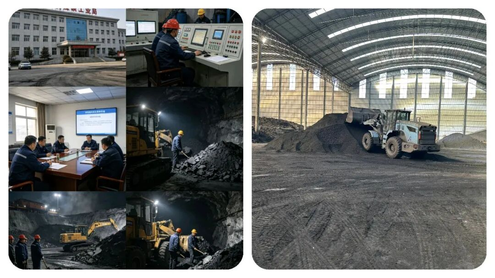
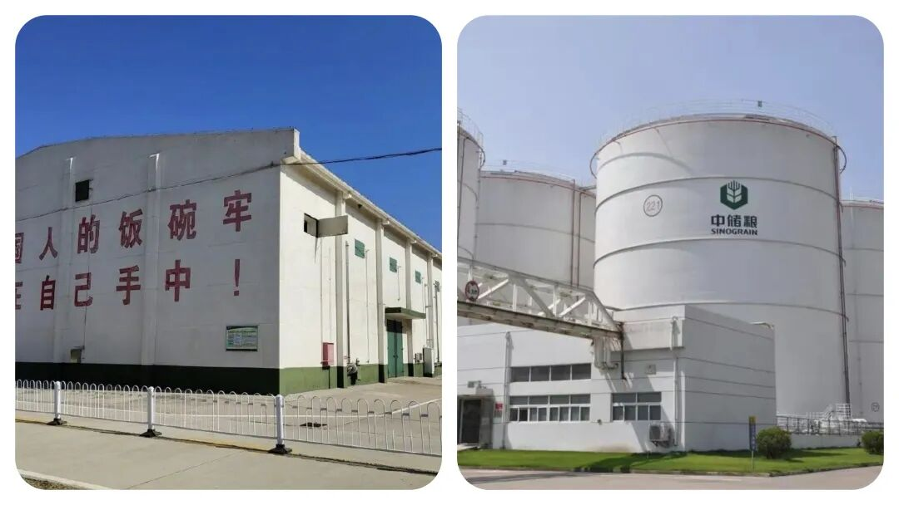
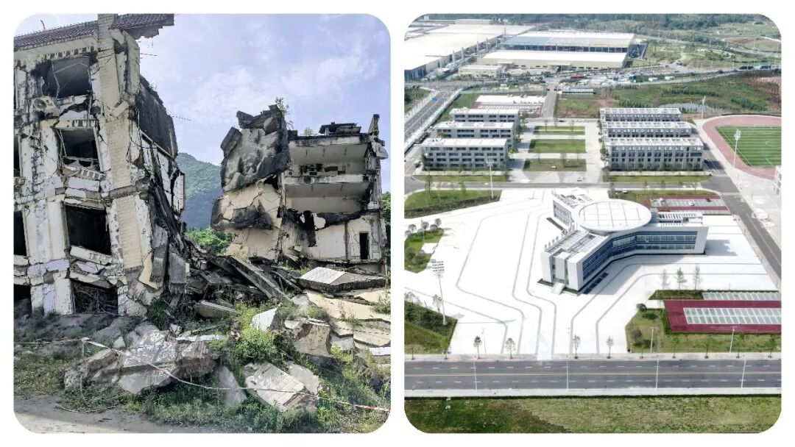
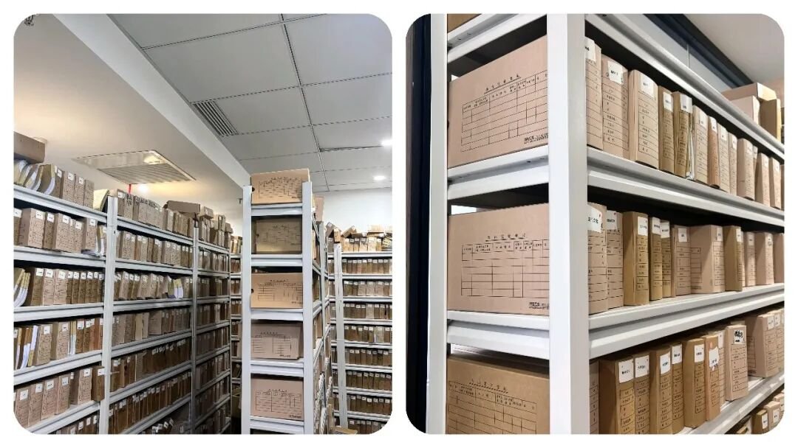

# 体制内逐渐“没落”的5大老牌单位，曾经人人争抢，如今风光早已不在！

# 体制内逐渐“没落”的5大老牌单位，曾经人人争抢，如今风光早已不在！

原创 点击关注👉🏻 点击关注👉🏻 田间烟火

在小说阅读器读本章

去阅读

在小说阅读器中沉浸阅读

田间烟火

嗨喽，大家好，我是【田间烟火】～

作为90后，谁小时候没听过长辈念叨“考个公务员吧，进个大企业，事业单位吧，铁饭碗，一辈子不愁”？

那时候一提体制内，简直是“人生赢家”的代名词～

工资不算顶尖但旱涝保收，福利不算很好但细水长流，退休了还有保障，逢年过节单位发的米面油能堆满阳台。

所以，今天想跟大家聊聊：体制内正走向“没落”的五个单位，曾经手握实权，如今风光不再了～

不少人觉得体制内的单位都很稳定、权力大，进了就稳妥了，其实不少岗位变化很大。

最近几年机构改革频繁，很多单位的权力和工作内容都发生了明显调整，到底有哪些岗位已经不是过去大家眼中的“香饽饽”？

一起来看几个典型例子：

01

  

  

物价局

以前物价局几乎定价所有商品，位置很高。

那时候，买东西、做服务都离不开物价局的审核，价格高低全靠它说了算。

现在情况完全变了，大部分商品价格其实都归市场自己管，物价局只剩下水、电、油、气这些少数民生产品的定价权。

说到底，它现在的存在感比当初低多了，很多年轻人都很难想象物价局曾经的地位。

02

煤炭工业局

煤炭工业局也曾经有过风光期，特别是在煤炭行业黄金十年。

审批项目、监管安全、协调资源，权力不小。

那时候大家都想进煤炭局，觉得有机会帮企业搞资源，直接影响产业发展。

后来随着煤炭行业收缩，煤炭局的主要职能大都并入能源局，实际上只留下一些协调工作。

这也意味着，煤炭工业局早就没了当年的实权，岗位变得冷门。

03

粮食局

粮食局能管全国粮食收购、分配，在计划时代很重要。

那个时期，粮食局见识过什么叫权力巅峰，分配粮食直接关系到全国人的温饱。

市场化之后，粮食局大权被削弱，现在只负责粮食储备和安全，其他工作已经很单一。

想转成实权部门的考生，现在去粮食局可能会有落差，很多人以为还是以前动不动管全国粮食，其实真不是了。

04

地震局

地震局曾经社会关注度高，主要负责地震预报、应急救援、防震减灾。

地震的突发性让这个局长期有曝光度，工作的风险和挑战也不少。

跟着机构改革，应急救援业务已经归入应急管理局，地震局现在只剩下监测和预报。

关注度虽在，但核心权力已经大幅缩水，岗位内容变得细分，也有人觉得没以前热闹了。

05

档案局

档案局在过去属于审批权重单位，所有党政机关的档案查阅、管理都得它批准。

很多业务都要盖章，审批任务多。

现在大部分工作跟档案馆合署办公，主要是服务类工作，审批权锐减。

说白了，现在档案局更像办事窗口，做后台服务，没什么决定权。

很多年轻人进来发现，大部分时间都是做服务类任务。

* * *

职能调整和合并，是这几个单位共同的变化。

以前权力大、地位高，现在逐渐变得低调，成了技术类、服务类部门。

如果还以几十年前的印象选岗，容易踩坑。

这种趋势不止在这些单位出现，像不少地方的邮政系统，曾经是通信和物流的核心，现在业务内容已经以快递和金融为主，传统通信业务萎缩明显。

很多岗位的权力和工作重点都在变化，老一辈眼里的“铁饭碗”可能已经不一样了。

但转过来看，也不是所有单位都走向“边缘化”。

比如税务局、市场监管总局，近年来职能反而越来越重要。

税收征管、市场监督都和经济发展紧密挂钩，业务范围扩大，岗位稳定。

类似的职能变化，反而让一些新兴单位变成热点，比如数据管理部门、人工智能相关岗位最近几年需求大增，吸引了不少年轻人转岗。

这也说明，单看单位名头和“历史光环”并不靠谱。

一个岗位的权力和前景，得看官方职责怎么调整，还要关注经济趋势。

市场越来越挑，改革节奏越来越快，不跟进就容易被“冷落”，像煤炭、粮食、档案这些局就是现成例子。

通常有人喜欢拿过去和现在作对比， 比如企业单位和体制岗位哪个更香？

有的体制岗位确实还具备稳定和社会认同，比如公安、法院，福利待遇和工作强度都不错。

但像物价、粮食、煤炭、地震这些传统实权单位，变化不可小看，甚至有的业务已经沦为“后台辅助”。

06

选岗建议

考公想选岗，一定要打听清楚业务内容和发展方向。

调岗合并不是个别现象，全国范围内都在发生。

有报道指出，机关改革还会继续，一些部门未来还可能调整，有的工作岗位会消失，也有的会扩招，全部由政策和经济趋势决定。

像2021年新设立的数据管理局，就是敏锐抓住了新机遇。

反过来看，传统岗位整体还是有稳定性，但追求权力和资源的人，需关注职能实质。

其实，体制内岗位从来不是“铁打的”位置。

真正稳妥的是及时看清趋势。

有条件去新兴岗位，不妨抓住机会。

经济结构变了，岗位冷热也跟着变。

有些人觉得体制问题就是缺少挑战，其实业务变化正是在给年轻人机会，让大家重新规划职场方向。

选岗位前多打听，职位描述和最近几年改革内容多看看。

别只看单位名字，实际的权力、收益、成长空间才是决定因素。

盲目追逐所谓“稳定”，可能反而没抓住机会。

岗位冷热交替，不变的只有变化。

你身边有人在这五个单位上班吗？说说真实感受～

---

原文：https://mp.weixin.qq.com/s?__biz=MzY4NDI4OTA3NA==&mid=2247484111&idx=1&sn=fb3a3b7f49822db6e1fd12c2c3a76f56&chksm=f3a77f92c4d0f684caee5080fdfbd2bf95ed9c33b958c0f3f402e062cde47ba7ac331a0f282d
