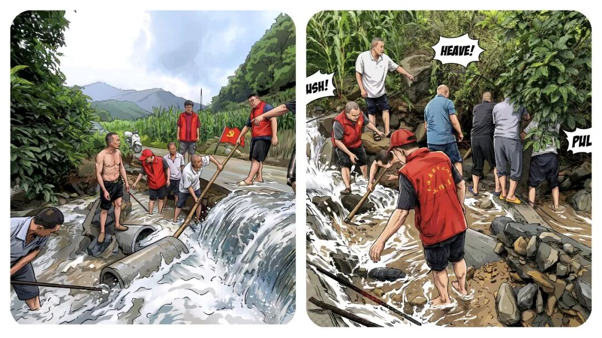
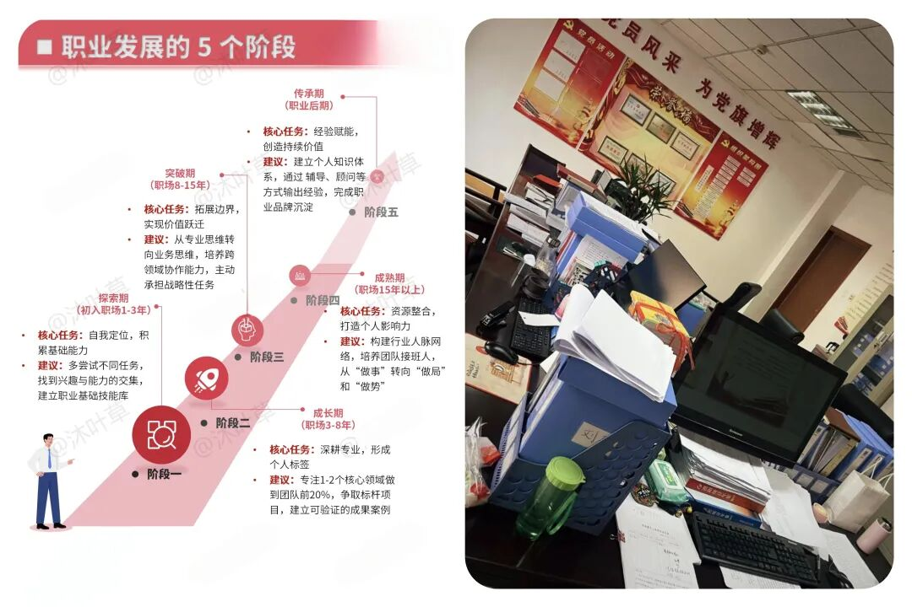

# 为什么越来越多乡镇年轻人，都想往县局走？

# 为什么越来越多乡镇年轻人，都想往县局走？

原创 点击关注👉🏻 点击关注👉🏻 田间烟火

在小说阅读器读本章

去阅读

在小说阅读器中沉浸阅读

点击上方

蓝字

关注更多精彩内容

大家好，我是【田间烟火🔥】～

今天和大家探讨一个话题：“乡镇与县局：事业编青年的两条路径，该如何看待？”

乡镇事业编干满服务期三年，很多人心里都会转一个念头：有机会，要不要去县里？

我见过有这样的同事， 头一年热血沸腾，觉得自己在改变一方水土。

第三年开始，话变少了，烟抽勤了，最常说的是：“等过了服务期到了，找到机会了、说啥也得走”。

01

乡镇事业编的日常状态

先说乡镇的日常状态，事情杂，岗位多，需要成为“多面手”。

民政、社保、信访、禁烧、维稳、防火，工作覆盖面广，与群众联系紧密。

手机需要保持联络畅通，在防汛防火等关键期或应对突发任务时，加班和应急值守是职责所在。

这种高强度的综合锻炼，能快速提升一个人处理复杂问题和群众工作的能力。

当然，长期面对繁杂事务和较高强度的工作节奏，对个人的精力与家庭的兼顾确实提出了挑战。

大家为什么慢慢会考虑县级？

职业发展、生活平衡、平台资源是三个主要考量维度。

这并非简单地评价哪里更好，而是两种不同的职业生活模式。

02

职业发展路径的差异

乡镇事业编的职业路径

再说职业路径，乡镇事业编的定位更侧重于综合执行与一线落实。

工作覆盖面广，能培养极强的适应能力和解决实际问题的本领。

在晋升和职称评定上，通道是存在的，但往往受限于单位层级和总体职数，竞争可能更为激烈。

不少人将此视为宝贵的基层经验积累期。

县局单位的职业路径

县局单位的职能划分通常更为专业和清晰，在特定业务领域能进行更深入的钻研。

由于平台更高，可参与的县域性事务更多，职称晋升的名额和机会在理论上相对更充裕，职业发展的“天花板”也显得更高一些。

这是一个从“横向拓宽”到“纵向深耕”可能出现的路径差异。

03

工作与生活的平衡差异

工作与生活的平衡是另一个现实考量。

乡镇工作“上面千条线，下面一根针”的特点，意味着在任务集中时期工作强度大，对个人时间的挤占较多。

这对于需要兼顾家庭的职工来说，是一个现实的困难。

调到县局，多数岗位的工作节奏更具规律性，通常能保障基本的休息时间，便于安排家庭生活。

县城在医疗、教育、商业等生活配套方面的便利性，也是客观优势。

当然，县局在重大任务期间同样面临加班压力，并非绝对的“清闲”。

04

平台与视野的差异

再一个就是平台与视野。

县局作为县域治理的枢纽部门，接触的政策信息、参与的县域规划、协调的资源范围，相比单个乡镇更为宏观和系统。

这段经历对于理解县域整体运作、培养统筹协调能力更有帮助。

乡镇则提供了最鲜活的基层实践视角，是理解政策落地“最后一公里”的绝佳窗口。

两者的经历各有价值，适合不同阶段的职业发展需求。

⚠️

如何做出选择

当然，情况并非绝对，也有些县局核心部门的工作强度、考核压力非常大。

而部分乡镇通过优化分工、提高待遇等措施，正在改善工作环境，对愿意扎根基层的人才同样有吸引力。

比如，在乡村振兴重点乡镇，干部获得的锻炼机会和成长空间可能非常大。

选择的关键，在于认清自我需求。

如果你渴望在复杂一线中快速成长，不惧挑战，愿意将足迹深深印在基层大地，那么乡镇的经历是无价的财富，是职业生涯厚重的底色。

如果你更倾向于在某个专业领域持续深耕，追求工作与生活更可预测的平衡，那么县局平台可能更契合你的规划。

重要的是，无论选择哪条路，都要通过正规渠道和程序进行。

了解清楚目标单位的编制、岗位、发展前景，做出审慎决策。

乡镇的广阔天地与县局的系统平台，本可以成为职业履历中互补的组成部分。

对于年轻人而言，重要的或许不是急于判断“哪里更好”，而是在当下的岗位上，能否全心投入，汲取养分，让自己获得不可替代的成长。

是金子，在打磨中总会发光。

而当机会来临，无论是向上流动，还是在更广阔的基层坚守，你的选择都将基于扎实的积累和清晰的自我认知，那便是最好的路。

基层工作忙起来，连选纸巾都懒得花时间。

这款纸巾是我用了很久的心头好，原生木浆用着安心，加大尺寸够厚实，不飞絮不掉屑，不管是工位备着还是家里囤货都合适，省心又实用👇

有人说乡镇磨人也育人，县局安稳也内卷，你心中最优选择是什么？

评论区一起交流～

---

原文：https://mp.weixin.qq.com/s?__biz=MzY4NDI4OTA3NA==&mid=2247484192&idx=1&sn=30984402d1e481dbbb7f336348ab3eb2&chksm=f3a77e7dc4d0f76ba86e0847f5a574292f184264d543d221fb3164f5f3a668bcdfcc041ef875
