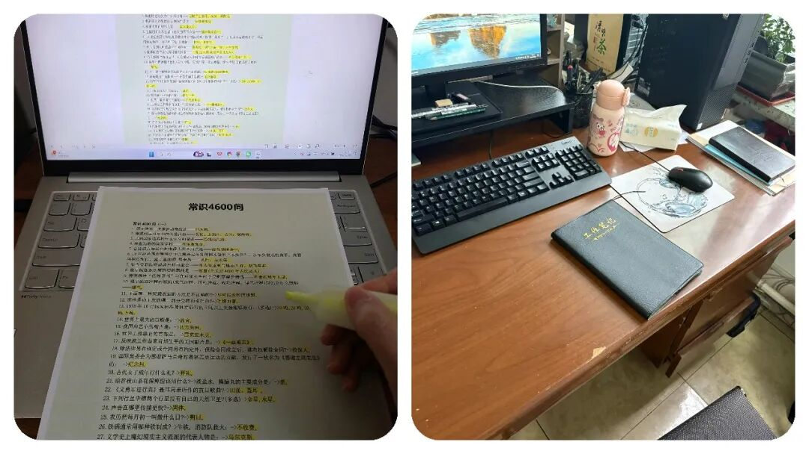
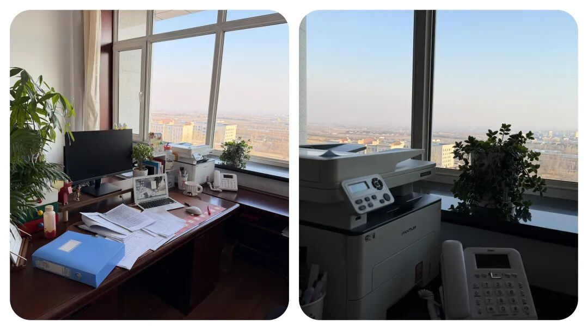

# 一次性说透！公务员与事业编，到底有什么区别？

# 一次性说透！公务员与事业编，到底有什么区别？

原创 点击关注👉🏻 点击关注👉🏻 田间烟火

在小说阅读器读本章

去阅读

在小说阅读器中沉浸阅读

田间烟火🔥

大家好，我是【田间烟火🔥】～

不谈大道理，今天我们来聊聊到底公务员和事业编有什么区别？

如今找工作，“考编上岸”成了无数人的首选，人人都向往体制内的安稳，可真正懂体制内的人却没几个。

到底什么是体制内？编制又分哪些门道？

这份人人争抢的“铁饭碗”，远没有想象中那么简单，今天就一次性说透。

01

为什么那么多人都盯着体制内的岗位？

不少人在找工作时，最看重的还是稳定、安全这些关键词。

可说起体制内到底是怎么一回事，很多人其实只是一知半解。

体制内，听起来高大上，实际说白了就是吃财政饭。

钱从哪儿出？国家财政兜底。

生意好不好，经济波动大不大，这些人日子都不会动摇太多

只要国家还收得了税，发得出工资，就基本不愁温饱。

相比很多市场拼搏、行业变更快的领域，体制内无疑多了份安稳感。

大家常说的“铁饭碗”，其实和“编制”分不开。

编制有点像国家给上的“长期饭票”，认定了就是一辈子财政保障，自己不犯大错，工作也不会轻易丢。

这也是不少父母热衷让孩子考编的原因，说白了就是求个安生。

02

体制内编制的主要分类

现在社会上议论最多的体制内人员，主要分三类：公务员、参公事业编和事业编。

公务员

普通人最熟的是公务员，全国有大约800万人，占总人口不到百分之零点六。

少，不代表影响小。

政府、公安、法院这种部门，基本就是典型的行政编，也就是正儿八经的公务员。

事业编

而事业编就复杂多了，就只谈到 老师这个职业，全国公办中小学教师就1800多万，再加上医生，这两个职业撑起了公立事业单位的大头。

老师、医生这么多人，为什么都算体制内？

很简单，他们领的工资、福利主要来源于国家财政，背后也是吃财政饭。

不过，光有个“事业编”名称不代表一切都一样。

事业编还分参公和普通事业编， 前者其实是“准公务员”，工作内容很多和公务员没太大差别。

比如一些政策执行、行政监督岗位，虽然头上写着事业单位，实际操作流程和公务员非常接近。

只要有机会调动，分分钟就能变成真正公务员。

至于普通事业编，分布领域就宽得多了。

各级公立学校、医院，还有像图书馆、青少年宫、研究院等，都是常见的事业编。

细分下去还分公益一类和公益二类：

1.  公益一类多是全额拨款，像义务教育公立学校、乡镇卫生院、科研机构，全靠财政供养，日子相对清闲、压力小。
    
2.  公益二类更灵活点，比如不少公立高校，还有很多大医院，他们赚钱能力强一些，财政只补部分，其余得靠自身运营来撑。所以很多高校、医院倒是越做越像企业。
    

说到底，吃财政饭始终是体制内的一道分水岭。

所有和市场打交道、要争取利润的岗位，哪怕打着国企、央企的招牌，从严格意义上已经半只脚出了体制“安乐圈”。

不少热门岗位，比如军队文职、国有企业、银行员工等，其实和真正“吃财政饭”的编制职工还是有些距离。

虽说稳定性不差，但遇到体制改革或者行业调整，岗位变化难以避免。

在近几年房地产行业人事频繁调整后，也有部分大国企职员选择辞去原有岗位，转向城市建设、交通等更有“铁饭碗”色彩的编制岗位。

不过也不是所有体制内岗位都舒适， 一些基层事业单位，岗位压力、晋升空间可能不如城市行政岗位。

县级医院、乡镇小学这些编制岗位常有人员流动，吸引力有限。

其实世界各地对于“体制内”的定义也有区别。

03

普通人怎么分辨不同编制？

问题来了，这么多种编制，普通人要怎么分辨？

其实看收入谁发钱， 全部国家财政养活，靠编制职称晋升的，基本就属于狭义体制内。

混合经营、自负盈亏参与市场竞争，定位已经“出圈”。

04

对体制内选择的思考

要说体制内让人追捧的原因，无非就是稳定。

哪怕外头市场风雨再大，只要在岗，工资准时到手，养老有安全保障。

这个魅力，让无数人年年挤破头去考编。

前几年，有一个地方招录5个事业单位岗位，报名人数飙到3700多个，有多难，大家一眼就能看明白。

其实这些年也有变化，有些地方尝试“能进能出”，通过考核辞退不适任的编制员工。

虽然数量很少，但说明铁饭碗也在悄悄生锈。

就我们身边就有发生，因连续几年考核不合格被劝退。

这一波调整，引发了不少关注。

说白了，体制内编制依旧有很强的吸引力，但“铁饭碗”正在经历一轮轮考验。

传统稳定优势还在，过程却越来越讲效率和能力。

当下这个时代，选择体制内路更多靠权衡，未必人人都适合“守编制过一生”。

至于要把体制内和市场化单位绝对对立起来，倒也不必。

有的人喜欢拼劲头、讲绩效，有的人更看重生活安稳，怎么选还是看自己。

下一次看到有人说“考编是上岸”，或许可以多点思考，这份稳定和舒适，其实都有自己的代价和不确定。

真正的“铁饭碗”，到底硬不硬，每个人心中标尺都不一样吧。

> “这款纸巾是我用了很久的也挺心头好，原生木浆用着安心，加大尺寸够厚实，不飞絮不掉屑，不管是工位备着还是家里囤货都合适，省心又实用👇”

你挤破头想考的体制内，真的是最佳出路吗？

⭐评论区说说你对体制内的真实看法！

---

原文：https://mp.weixin.qq.com/s?__biz=MzY4NDI4OTA3NA==&mid=2247484491&idx=1&sn=89d1ef12184028403274ca9d57752cf5&chksm=f3a77916c4d0f000756b86c958def94aa8902a0dcf3e96e69fcbd46c0a25070e90117bdf1741
