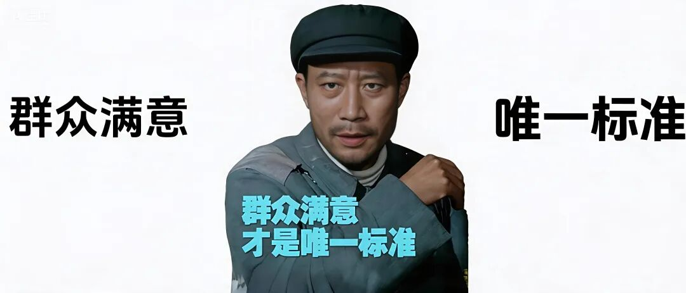
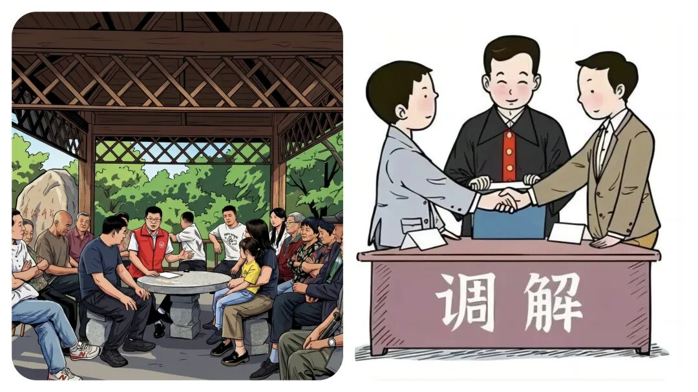
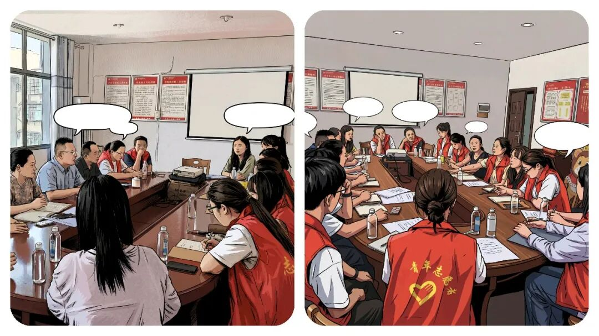
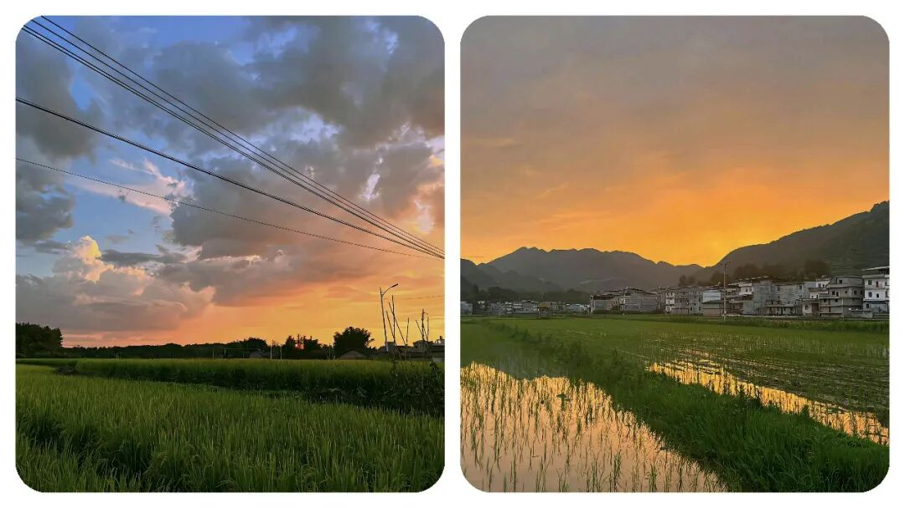

# 乡镇“霸道”干部消失了，你注意到了吗？十几年前镇村干部靠气场摆平一切，现在为什么不行了？

# 乡镇“霸道”干部消失了，你注意到了吗？十几年前镇村干部靠气场摆平一切，现在为什么不行了？

原创 点击关注👉🏻 点击关注👉🏻 田间烟火

在小说阅读器读本章

去阅读

在小说阅读器中沉浸阅读

点击上方蓝字关注我们

田间烟火🔥

嗨喽，大家好，我是【田间烟火】～

走进乡镇田间一线，最能看清基层治理的真实模样。

有一次乡镇暗访，目标是检查一个重点建设项目。

遇上施工单位负责人，刚见面就满脸愁苦，说村里矛盾多又有阻工，工地连门都进不去。

村支书听了火气上头，语气硬，一提阻工直接抱怨派出所都叫过三次却没人敢抓，还说不抓几个典型，以后谁都不听他们。

镇书记一听情况，直接用地方话表态，让派出所严厉打击，把场面镇住。

短短几分钟，现场气氛很不一样。

说到底就是遇到难题，几位基层干部直接用硬手段应对，要么靠吼，要么拼气场，活脱脱一股“霸道气息”。

这种作风，在镇村治理里其实有历史。

01

强硬作风的过往背景

往前推十几或几十年，镇村干部大都是本地人，做事风格很直白。

征地拆迁、维稳调处、防汛抗旱，哪一样不是硬骨头？

那时对干部最直接的评价就是“能扛事、能办事”。

遇到难缠群众或卡壳工作，靠拍板、敢得罪人、敢闯。

说话嗓门大，气场足，遇到棘手事干脆“直接拍板”，不墨迹，不带虚套。

强势作风变成实用工具，甚至成了“能力担当”的象征。

很多村支书、镇干部，都是靠这种霸气吃得开站得稳，队伍里谁能镇场就最受认可。

02

强硬作风减少的深层原因

现在去基层跑一圈，嗓门拔高、行事强硬的干部反而少了。

也有人觉得这是干部变温和了，其实背后有更深原因。

（1）基层工作方法彻底转轨

前些年只看任务完成，方式能灵活，急事多靠强硬。

现在不同了，依法依规办事成新常态。

征地、调解、执法有流程、有政策。

光靠强势只会新增矛盾，甚至惹来投诉和问责。

规定越来越多，硬来只会钻进红线，时代不再认这种硬作风。

有过类似的先例，2023上海郊区一处拆迁，干部坚持用强势手段，结果被舆论曝光后直接被问责，舆情监控成了常态，干部更警惕。

（2）干部队伍结构改变

另一方面，队伍结构也在发生改变。

以前镇村干部多是本地人，环境中什么沟通方式都能用。

现在年轻大学生、公考人才进村组，学历高、规矩意识强。

他们习惯用方法解决问题，耐心原则第一，不再靠强硬拍桌子。

像山东某县2024年新晋基层干部，七成本科以上学历，沟通更细致，做事更循规蹈矩，慢慢“霸道气息”就散了。

（3）监督压力持续增大

还有就是监督压力大。

现在纪委、群众、网络舆论都盯着干部，言行随时可能被曝光。

过去强势蛮横还能让事成，今天这叫粗暴作风。

被举报，迎接的可能就是处分和批评，甚至丢掉工作。

干部考核也更注重群众满意度，作风温和才是加分项。

如果硬气，只会扣分。

还有一个例子就是，浙江某村2022年因干部态度粗暴被网络曝光，直接影响了下年晋升，温和成了组织首选。

（4）群众环境发生变化

群众环境也变了。

以前群众多听干部安排，现在法治意识、维权意识普及，诉求各式各样。

干部要变服务型，贴心沟通、依法办事才能赢信任。

硬压只会加剧矛盾，做不成事。

先例：广西某县2023年征地推进，遇到村民质疑政策，干部主动开说明会，耐心解释，结果方案顺利落地。

靠拍桌子的作风反而频频碰壁。

03

  

新旧作风的现状与趋势

不过，偶尔也能看到部分老干部还用“霸道气息”应对。

有些难事遇上特殊情况，还是得靠一点魄力，必要时拍板才能推进。

但大多数时候，这种硬气已经不被推崇，年轻干部用耐心换取认可。

现在干部更讲方法，注重规矩，慢慢转变为服务型。

还有另一个现象值得注意，部分基层岗位“温和作风”成主流，但遇到突发事件、小范围紧急纠纷，村书记、老干部还会临时扛起强势气场。

先例：去年河南某地洪水后抢险，临时成立应急小组，老书记直接协调、吼场管事，用传统强势应对危机，事后又恢复日常温和，却不是常态。

时代不停变，基层治理方式跟着调整。

干部不再和群众硬碰硬，更多靠制度、服务、沟通解决问题。

说白了，不是干部没了胆量，而是规则更细更明确，更规范化，更贴近民心，更和谐。

硬气作风在特殊条件下还会登场，但大的趋势是规范化、法治化、服务化。

基层干部成了勤务员，群众才信得过。

你身边干部，是不是也变得越来越有温度、越来越能说话？

这变化，有人喜欢，有人怀念，但时代只认更成熟的方法。

老作风快要淡出，新的规则正在稳稳地生根。

你在基层见过靠气场、靠魄力办事的老干部吗？

一起来聊聊身边真实的基层现状～

点赞

转发

推荐

评论

修改于

---

原文：https://mp.weixin.qq.com/s?__biz=MzY4NDI4OTA3NA==&mid=2247485036&idx=1&sn=a52d88a5739b75b2d6c269718c0851f1&chksm=f3a77b31c4d0f22784bd21a7372107b4c98dd5fef00c2a2f0d246117883579a5cac325ab428d
