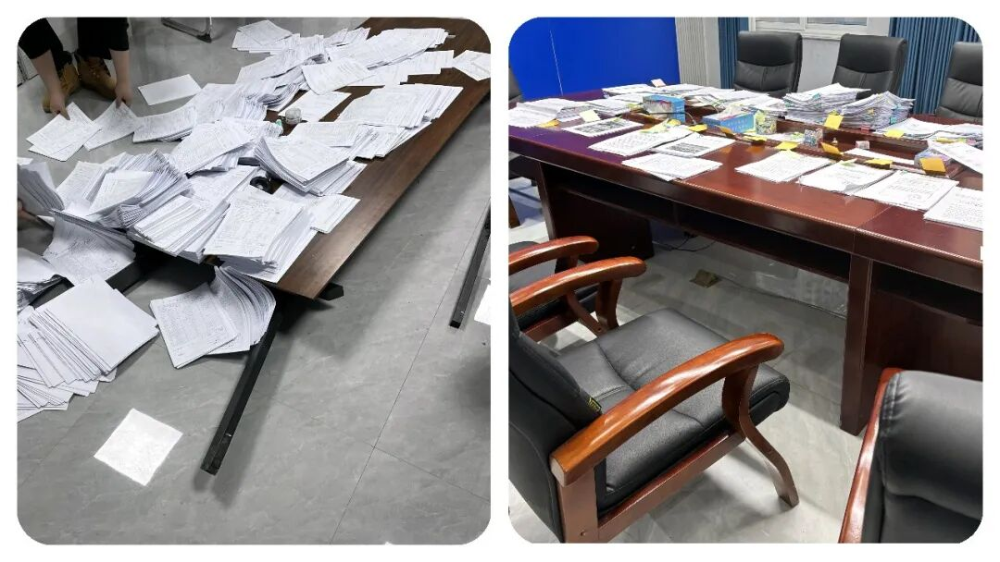
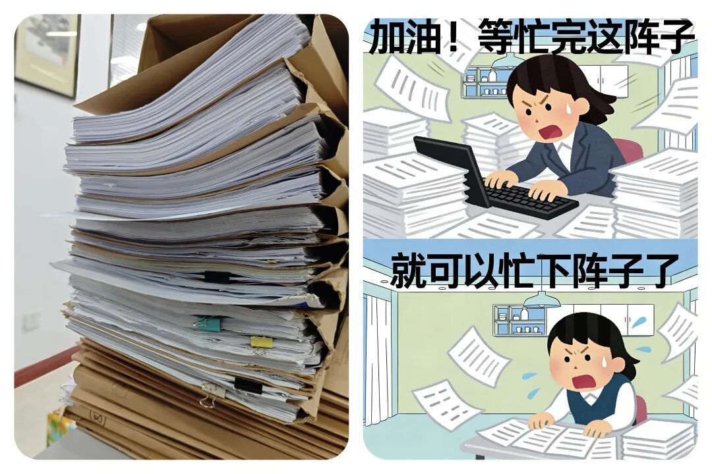
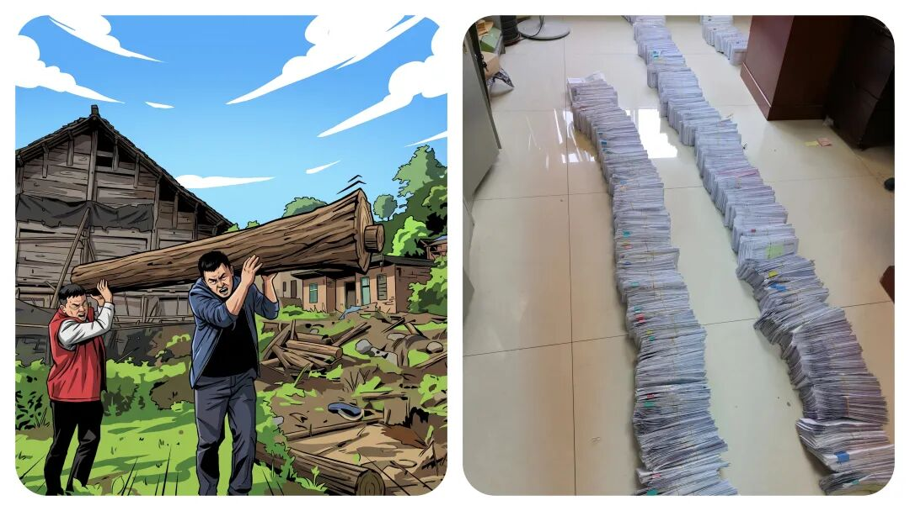

# 你注意到了吗？乡镇“办个事”复杂化了！本来是3分钟能搞定的小事，却搞出一大串流程，事没干多少，台账堆成山。

# 你注意到了吗？乡镇“办个事”复杂化了！本来是3分钟能搞定的小事，却搞出一大串流程，事没干多少，台账堆成山。

原创 点击关注👉🏻 点击关注👉🏻 田间烟火

在小说阅读器读本章

去阅读

在小说阅读器中沉浸阅读

田间烟火🔥

嗨喽，大家好，我是【田间烟火】～

我相信不少人都有这样类似的体验：

本来是一件几分钟能搞定的小事，结果牵扯出一大串流程，只见干部在各类系统和报表间来回忙活，佐证材料一大叠，手机照片一大堆，事却没见快多少。

到底是什么原因导致这样？

回过头来找原因，很多时候并不是基层人员故意这样做的，而是不敢冒险。

流程和留痕成了自保工具，让进程变成“流水线”悄然成为不少地区的基层日常。

01

流程繁杂的基层日常

现实中，这种流程繁杂的现象到处都是。

最近有干部反映，发放烟感报警器，从“下发即可”变成要“安装、拍照、绑定手机号”，哪家群众不配合还得拍视频留证。

往返折腾几个月，最终大部分时间花在证明工作合规上。

不只是这一个例子。

例：某县城的城管说，他们整改路面卫生，必须严格拍照，从“有树叶”到“清扫中”再到“清扫后”，三张照片一个不能少。

这才算整改闭环，台账齐全，检查通过，有人相信才可以。

有些民事纠纷调解，本来村干部上门说合几句，问题就能解决。

现在文件一条条来，申请书、调查笔录、调解协议、回访回执，调解现场拍照，最好外加全程录音录像。

村民不爱配合，工作人员自己也嫌麻烦，能调的矛盾也拖着，有的干脆建议大家直接去法院。

不少基层干部坦言，最头疼的不是不会做事，而是不敢做减法。

有时候上面考核细到照片时间戳、台账页数，一旦出了问题，责任一下子压到具体人头上，想干点实事，先得防得住可能追责。

02

复杂流程真的有必要吗？

有人可能会问，这些复杂流程，真的有必要吗？

要说一点用处都没有也不准确。

层层分工后，确实能查清到底是谁负责、谁执行，如果出了问题，就是追那个负责的人，反正就是追责有据。

但流程越细，反而带来新问题。

表面规范了，实效却未必提升不少。

数字化变成新负担

数字化本是增效率的好工具，结果在实际落地中，很多地方成了新的负担。

有这种情况：有个省推行数字化督查平台，本来他的目的是线上一站式管控、全流程指挥。

但有的干部反馈，实际工作要“线上填、线下补”，数据重复录入，照片、视频、电子版，甚至还要签字盖章纸质版全要。

平台填不全，直接驳回，反而增加“证明自己”的时间。

有时候完成一件小事，一套流程下来“出场打卡、上传数据、签到。

效率初看高级了，提升了，但出现场实际效果谁也没直观体验，报表成绩却年年满格。

回头一查，大量数据造假、重复填报，反而掩盖了实际短板。

流程复杂化的核心推手是信任缺失

流程复杂化，另一头的推手其实是信任。

上级担心下级不干事，下级怕出错又被追责，最后监督手段就变成一层又一层“留痕，佐证”，社区、村里、办事员通通裹进体系里。

从材料到照片、从线上到线下，真正落地到服务群众时，反而效率大打折扣

03

破局的尝试与方向

当然，也有地方走出了另外一条路。

有个城市，有几个街道把数字化平台和实际调研结合，让干部直接用手机小程序采集现场信息，系统后台自动分析匹配，省下了不少纸质台账。

检查不是天天来看材料，而是以成效为主，群众反映满意就是核心标准。

这种尝试，虽然有待完善，但起码回归了最初“治理为人民”的思路。

流程不是越全越好，合理才是关键

也不是所有流程都应该一刀切地砍掉。

像这种在突发公共事件、应急安全管理等领域，分工和留痕就是必要的。

一味追求“快干快办”，有时会留下漏洞。

问题不仅在于有没有流程，而在于流程是不是合理、是不是服务目标。

真正有效的治理，是把该精细的事情精细做好，不该复杂的别自找麻烦。

考核指挥棒要回归实效

还有一个老问题，考核指标怎么设、怎么查，总体导向是什么。

反正还是有很多地方把“材料是否齐全、照片是否标准”当作干部能力的第一考核，其实本末倒置。

群众问题解决得好不好、矛盾有没有源头化解，才是治理水平的真实反映。

搞得太虚，前线再努力，大家都是在证明自己“没出错”，并不真正靠近老百姓的需求。

在实际操作中，一个10来人的小办公室，背后可能要对接几十个上级部门。

汇报标准、材料要求各不一样，基层要不是不留痕，就是不敢不留，毕竟“自我佐证”成了保命线。

这是流程困局的根本。

要让简单的事简单办，归根结底还是要让考核“指挥棒”回归实效。

有时候突击检查与常态督导结合、群众满意度和实际问题解决率纳入评级，既有灵活度，也有可衡量标准。

新考核模式允许小错、鼓励快速响应，既给基层减压，也让制度真正起效果，也更好体现基层减负工作。

数字化治理要服务于人

在数字化治理方面，技术能让管理提速，但不能让干部变成“打卡机器”。

开发时，得有实际操作者参与设计，平台精简到一屏操作，后台多部门数据打通，一线干部填写一遍就够，这才是真正提升效率的办法。

其他领域的参考

流程困局不只发生在治理领域，企业内部管理也有类似问题。

也有不少500强企业推行过“流程革命”，专门踢掉一些无用环节，让一线部门主导流程设计，倒逼总部改变考核和授权模式。

有一年某知名互联网公司发现项目审批流程太长，干脆取消了三级审批，直接让项目组对老板负责，项目周期立刻缩短三分之一。

这给治理领域同样带来了启示：“放权和精简同样需要决心，但不会一开始就一劳永逸”。

04

结语

纠结流程、苦于证明，并不是基层干部的最佳选择和意愿。

真正的善治，是能省则省，能快就快，把事情做“对”放在前、把事情做“全”放在后。

指望靠一套海量材料让风险绝迹，恐怕只是把本应解决的问题无限搁置。

说到底，制度和技术只是工具，根子还在信任和目标导向。

回归问题本身，流程困局自然会有破解的那一天。

希望不要让基层干部心寒：“事没干多少，台账堆成山”。

身边是不是也遇到过小事被流程拖慢、干活只剩填表和佐证材料的情况？

欢迎在评论区聊聊你的真实感受～

---

原文：https://mp.weixin.qq.com/s?__biz=MzY4NDI4OTA3NA==&mid=2247485486&idx=1&sn=608fa6aa00f8fc942a8cb9c4936ef599&chksm=f3a77573c4d0fc65a81d7df9806f3a9e881eb8240352d1f6e5add329b7173463f9ee0b89c9a0
