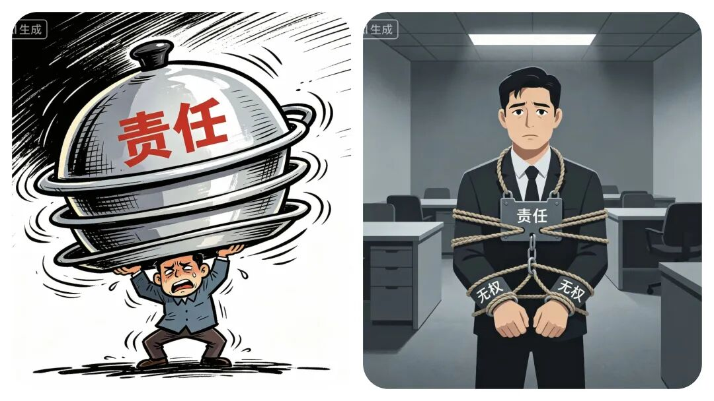
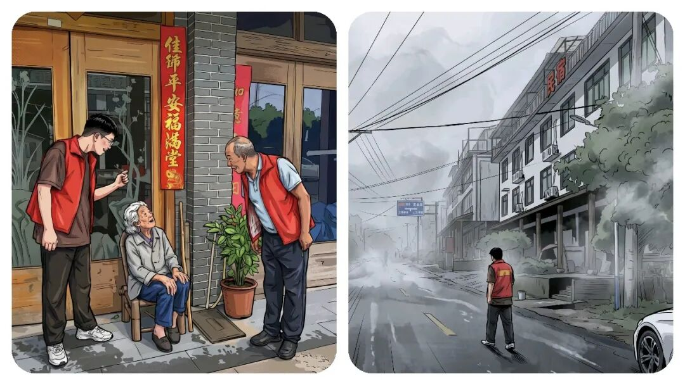
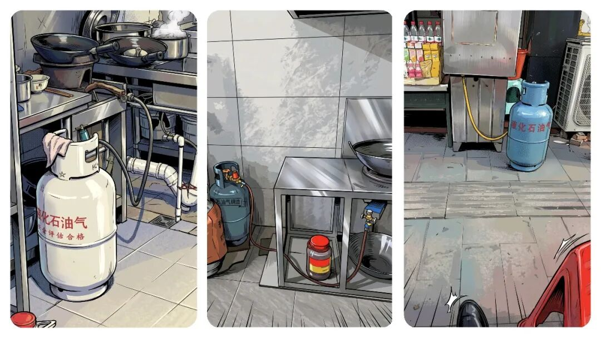
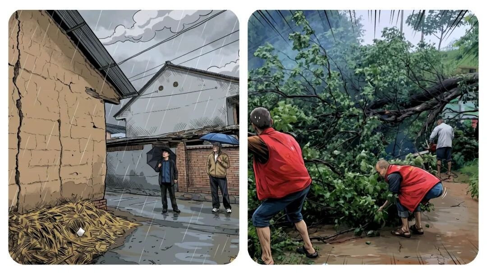
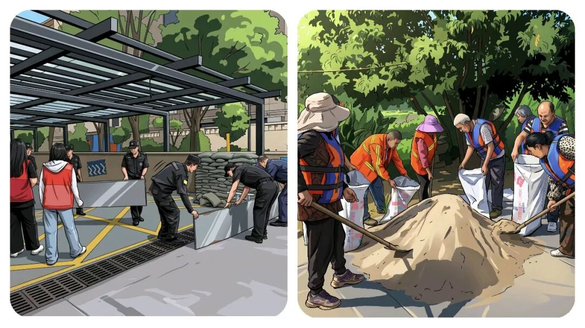

# 你知道“乡镇干部”到底有多累吗？灾害预警一响，全员原地待命，节假日没有了，家也都回不了。

# 你知道“乡镇干部”到底有多累吗？灾害预警一响，全员原地待命，节假日没有了，家也都回不了。

原创 点击关注👉🏻 点击关注👉🏻 田间烟火

在小说阅读器读本章

去阅读

在小说阅读器中沉浸阅读

点击蓝字，关注我们吧！

大家好我是【田间烟火】～

今天我们来聊一个话题：你有没有发现在乡镇工作，一到雷雨天气预警，就开始放弃各种节假日，紧急召回，进入紧张待命值守，开展各种动员和排查工作。

①防汛工作：暴雨刚有苗头，气象台蓝色预警一下发，很多地方的干部心里就开始打鼓了。

别看这级别不高，按文件要求，预警每传一道，级别还得跟着往上跳。

省里蓝色，轮到县里，镇里就是红色。

只要有预警，就得开会，一层接一层，从市到县，县再到乡镇。

大多时候会议都不挑时候，晚上、半夜电话声就能把人叫醒。

调度不停，每一级都怕自己出事，要责任分明，结果就是责任不断往下压，你说不是“甩锅”还真不好解释？

等开完会，乡镇全体干部得全部待命，所有人都被要求呆在镇上守着，家都不能回。

预警信息还要精准传下去，家家户户通知，入户动员及时撤离，特别是村子里靠近一点山体的户，一个不能落。

光转发预警还不行，上级说“应转尽转”，到了乡镇就成了每个可能有风险的地方都得动员人转移。

碰上配合的村民还好，要是遇到老住户，说自己大半辈子都住这儿，什么天没见过，非要动员，嘴上功夫真没少下。

其实仔细一想，说这些人固执倒也不全对。

你要求大家只要一有预警就转移，可有时候雨点下不到几分钟，甚至光是预警，压根没落下雨来。

村民就会觉得，这折腾有点瞎忙活。

有的老百姓为安全，汛期被动员来回转移五六次，搞到最后全家索性搬进了安置点，水退了再回家。

这种操作到底有没有必要？

遇上真暴雨，提前转移肯定对。

但是有些小雨，也让大家折腾一整宿。

为什么会这样？

办法也不多，干部们憋着一股劲，要是不做万一出事，村镇干部不但背锅，还负责到底，别到头来弄个失职，处分。

做了呢，多数时候却又有人觉得没那个必要，这其实是基层“有责无权”的真实写照。

01

基层工作的共性问题

像这样情况远远不止是防汛工作。

②燃气安全检查工作：比如前两年有个煤气爆炸事件，搞得大家人心惶惶。

爆炸以后，乡镇干部接到通知，必须挨家挨户摸底，每一户用不用煤气，有没有装防泄阀、燃气泄漏报警器、灭火器等设施，连路边摊、夜宵摊子用没用煤气都要查。

人力物力搭上去，结果数据层层上报，实际作用却没人敢保证到底多大。

再比如垃圾分类，街道办、社区弄得风风火火，宣传、劝导、培训一套接一套，有的地方居民还真能分清怎么丢。

但问题在于，垃圾车来了一收，还是全都倒一起拉走。

老百姓一看，前面辛苦细分，后面一车拉走，谁还乐意较真？

02

形式背后的现实矛盾

说到底，基层干部其实心里也非常清楚，一些流程做得有点形式主义，也不全是，有好有坏，思考的层面不一样。

但形式上的动作是不是就没用？

真的不能这么简单下结论：

有些地方因为历年预警提前动员，确实避免了大的危险。

例：像广西，广东某市2022年连续大暴雨，提前安排转移，的确救下不少人；

这些经验让有些干部对流程重视起来。

可同时，也有北方部分区域，预警发了不少，实际全程小雨，折腾一大圈村民很有意见。

有人抱怨“不下雨比下雨还累”，也是现实写照。

再举个别的例子，比如前几年江苏某地卫生安全整治，搞过地毯式入户查燃气、查电源，名单上层层叠叠的数据，结果最后整改真正落地的只有一部分。

其实这里说的，大多地区都有可能出现这样的情况。

用人力去跑全流程，表上看谁都兢兢业业，实际落实下来效果各有不同。

还要考虑“责任甩锅”本身也是有隐形风险的。

因为压力确实一层一层传导下来，到头来最末端的乡镇干部既有责任又没有选择权。

赔本买卖只能硬着头皮做，遇上真事故没做够就要担，一系列工作就形成了自上而下的自保链条。

你说有没有解决方法？

现实摆在眼前，动员归动员，执行却悬着心。

03

基层的探索与现存困境

有些干部也试图创新。

比如在一些受灾风险高的区县，基层组建了专门劝导小分队，直接在村里常驻，既方便沟通，又省去多次无效动员。

还有的，借助微信群、广播直接发预警，能减少一部分骚扰和反复转移的麻烦，不过碰上没微信、信号不好的村，还是得人工挨家走。

有人说，这都是形式主义。

是不是一刀切地给行政工作贴标签，是值得琢磨的问题。

像前几年有些地方遇到暴雨，也提前安排危险区居民转移，有的措施细致入微；

但最后统计下来，光动员、没灾情的比例也有，大家日常仍然选择严格照章办事。

焦虑、被动、本能自保，基层干部越到细处越不容易。

既要满足上级要求，还要安抚百姓情绪，每天连轴转。

工作做得多，有时成效却不明显。

真正难题并不在于干部有没有责任心，而在于怎样把握分寸，既不流于走形式，又不能让微小的疏漏酿成大祸。

面对这一连串琐碎又不容疏忽的小事，谁都觉着累。

更智能、符合实际的预警和响应机制，其实有不少人都在期待。

没出事，大家说折腾；

要真遇上灾情，没人能承受责任。

一半是流程的压力，一半是真实的顾虑。

这就是很多一线干部工作中的日常，也是真的辛苦！

分享

收藏

点赞

在

修改于

---

原文：https://mp.weixin.qq.com/s?__biz=MzY4NDI4OTA3NA==&mid=2247486030&idx=1&sn=09414d70d392dd84d168af95194c8515&chksm=f3a77713c4d0fe0599f32e882279799f323dd5ed4807668319774122b51b06c16f2e00d2ec70
