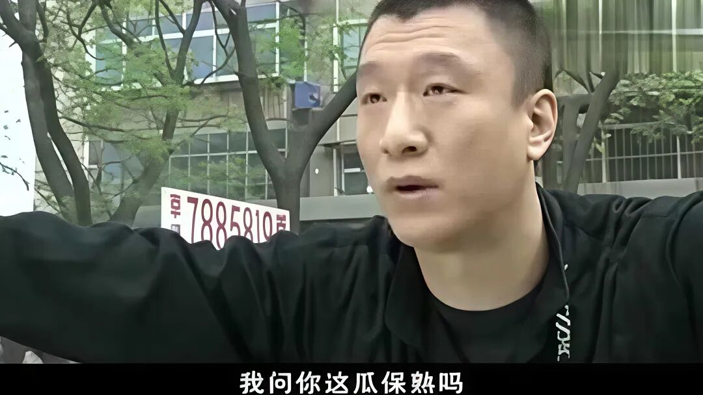
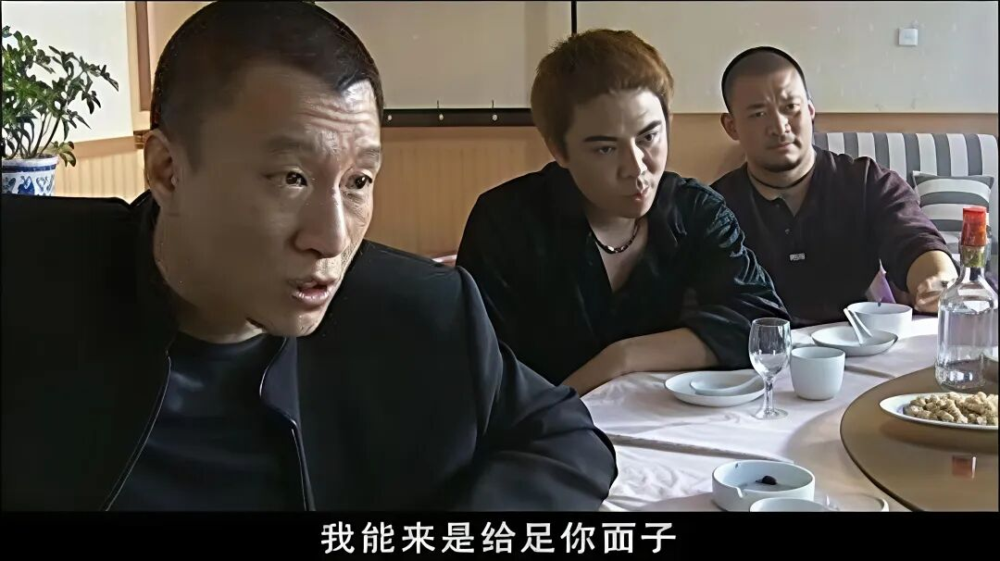
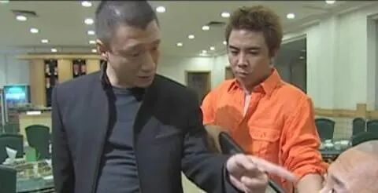
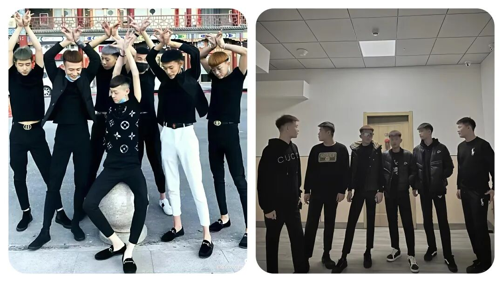

# 你们有没有发现，哪些“社会小混混”突然消失了？他们都去干啥了！

# 你们有没有发现，哪些“社会小混混”突然消失了？他们都去干啥了！

原创 点击关注👉🏻 点击关注👉🏻 田间烟火

在小说阅读器读本章

去阅读

在小说阅读器中沉浸阅读

点击上方蓝字关注我们

田间烟火🔥

大家好，我是【田间烟火】～

你们有没有发现，这几年，曾经那些街头巷尾的“小混混”好像突然就不见踪影了。

曾经那些一身社会气质、染发纹身、金链子大裤衩、逮着就喊“哥们仗义”、“地头蛇”自居的人，似乎一下子神秘消失，给夜行的路人都多了点安全感。

可这到底是真的他们洗心革面、安分守己了吗？

（注：文中插图仅供娱乐，无不良引导，请勿模仿）

01

  

消失的原因：社会治安治理收紧

说起这个原因啊，还得从社会治安环境的变化说起。

近十年来，公安部门治理越来越严，信息全覆盖，监控遍地都是。

聚众闹事、开赌场拉保护费，这些过去天天冒头的勾当，现在动不动进去蹲几年，一旦留案底，大半生就废了。

做灰色生意的风险高于回报，比起上世纪末的随意横行，现在一不小心就掉坑里。

但混过社会的人，真就能安安心心进厂打工、回乡买地种田干活？

那种困苦日子让他们心甘情愿做“老实人”，可能吗？

真拿他们从前的胆量也用错了方向。

大多数人还是想找点门道、投机取巧，过点“自由自在”的日子。

（注：文中配图仅供娱乐，无不良引导，请勿模仿）

02

没有真消失，只是完成了身份切换

表面上看，这些人是消失了，其实他们大多完成了身份切换。

想靠老套路闯社会肯定行不通，于是目标全部转到“隐蔽地带”，很多混混摇身一变，钻进了各种高纠纷、跑边缘地带的行业里。

比如市面上常见的小额贷款中介、二手车贩、黑导游、打擦边球的夜生活场所，这些新行业都成了他们的大舞台。

更出格的还有网络诈骗团伙、地下运作的赌场、甚至虚假医院、美容院和新型洗钱渠道。

以前看一个人穿貂戴大金链子、染黄头发、大胳膊文身，路人都能躲得远远的。

可放在现在，这些装扮早就不算稀奇，各种文身展、个性造型，普通人也来两下，比气势早没有了社会特殊身份。

这种新形象让之前的“混混”们变得更难分辨。

有时候你以为看着顺眼、客气得很的人，说不定就暗藏“江湖身份”。

  

（注：文中配插图仅供娱乐，无不良引导，请勿模仿）

03

更懂伪装，专钻法律边界

现在的“混混”更深谙转型和伪装，表面温文尔雅，讲话彬彬有礼，干净利落，甚至连合同协议都捣鼓得头头是道。

一些转行做劳务公司、公会、物业、包工程的小老板，就是这些人的新版本。

他们不仅懂行情，还会专研各种法律边界，碰到纠纷时，把条款玩得精明极了。

比如很多人遇到黑中介的房屋合同、劳务合同，明明权益受损，却发现细节全被琢磨得全是坑。

你想找麻烦，对方看起来啥毛病都没有。

明面上讲规矩，背后却踩着红线，钻空子，真想让你吃闷亏又无话可说。

（注：文中插图仅供娱乐，无不良引导，请勿模仿）

04

往外拓展，瞄准海外灰色地带

本以为这些灰色行业局限在国内，其实不少同行早就看准了国外的灰色地带。

比如缅北网络诈骗、非法借贷团伙，很多骨干成员就是转型后来淘金的混混。

这些人的逻辑就是“留得青山在，不怕没门路”，只要哪里有缝哪就有人钻。

05

并非所有人都能转型，部分早已被淘汰

当然，整个社会也不是说人人都能像他们一样轻松地换个身份继续走偏门。

现实中也有混混因过去那些案底、社会关系被卡得动弹不得，最后只能回老家做点最基础的买卖。

比如部分地方出现了一些早年混社会后来彻底无门路，只能在菜市场、五金市场一角摆摊守摊，过着小富即安的生活。

这类人群和新一代城镇青年创业者混在一起，说起来“混过社会”，实际上早被时代淘汰。

而那些真正做灰色产业的，往往极其低调，力求避免显露原本的痕迹。

其实很多老百姓生活中都会遇到一类“坑蒙拐骗”式的公司，像那些假冒房屋中介、三无小贷、擦边教育、黑车运营，甚至包括部分高仿保险销售，暗地里环环相扣，维权难如登天，都是有组织化操作。

相关数据显示，这一条灰色经济链在不少城市年均纠纷投诉量增长三成多，但真正能钻法律空子的“职业玩家”，维权路上总透着精明。

（注：文中插图仅供娱乐，无不良引导，请勿模仿）

06

不同区域的差异

不同城市的情况也有差异。

有些一线城市，市场更规范，新型灰色地带的生存空间开始被大力挤压，相关行业监管更严。

比如深圳某次对非法劳务公司的清剿，就一次性查办上百家“黑派遣”，不少负责人有混社会背景。

反过来，部分人口流动大的小城镇，灰色行业反而更隐蔽，普通人察觉不到。

但无论在哪，只要跟钱纠葛密不可分，纠纷总有新花样。

（注：文中插图仅供娱乐，无不良引导，请勿模仿）

07

给普通人的提醒

对于普通人来说，大多数人一辈子难撞见真正的“大社会人”，但灰色行业的陷阱其实无处不在。

银行卡诈骗、虚假信贷、美容养生、美股炒作群，很多骗局背后都有一波经验老到、专钻规则的玩家。

万一是真的被盯上了，报警解决未必立刻能抓个现行，更多时候只能用“自己多留个心眼”的法则避险。

说到底，混社会的人变脸很快，套路也在升级。

过去是胆子硬横行，今天却更会钻规则玩“合法擦边”。

敢于守底线的人，才真的有底气活得久一点。

真正安稳的办法，从来不是看别人换了什么身份，而是自己遇事不贪、不钻、不被迷惑。

这个社会，光鲜外表未必等于心地善良，见招拆招才是硬道理。

你们身边还能见到早年街头混混吗？

评论区聊聊你见过的真实情况～

点赞

转发

推荐

评论

修改于

---

原文：https://mp.weixin.qq.com/s?__biz=MzY4NDI4OTA3NA==&mid=2247486141&idx=1&sn=5234c067ab0491d8e77b2cd11eb99863&chksm=f3a777e0c4d0fef6f36d1850751668c3b439d5aa66af838242fb585b54c1d0424b1b4114b79e
