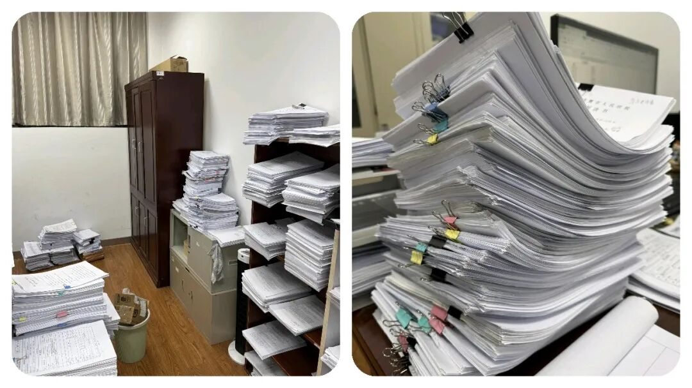
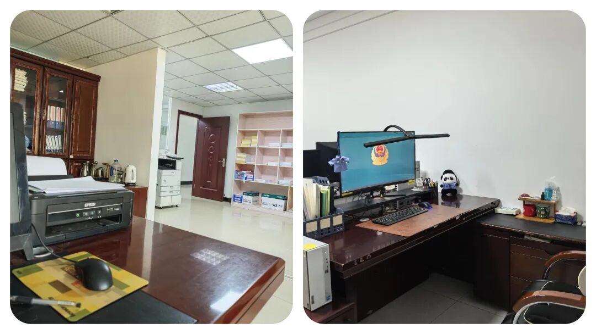
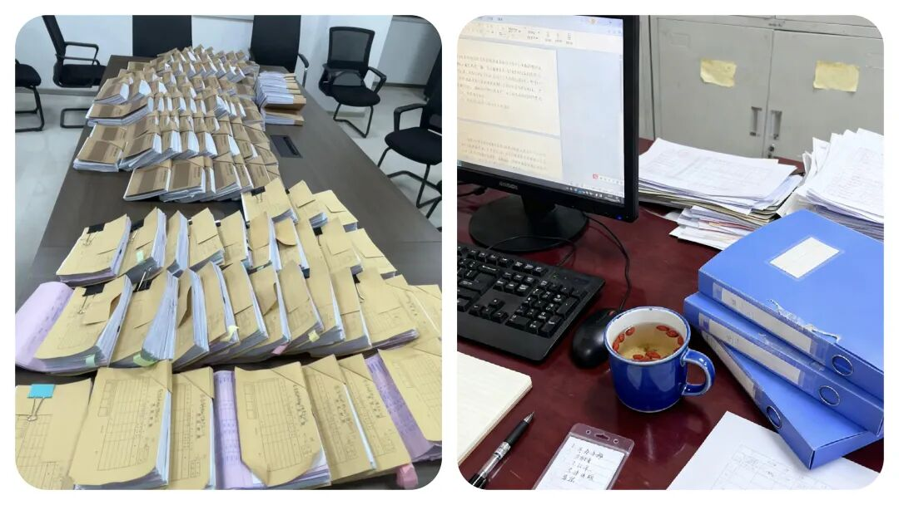
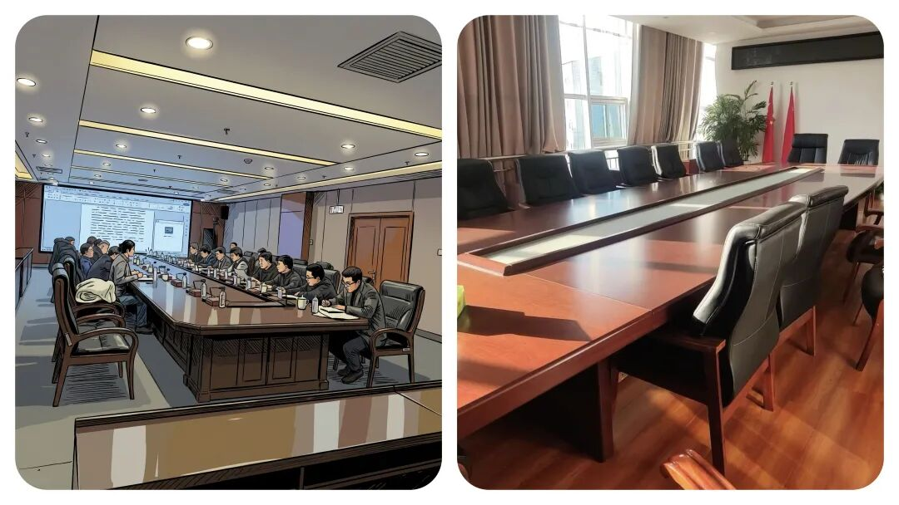

# 让乡镇干部“头疼”的不是领导？看似不起眼的 3 个部门，拿捏整个乡镇工作

# 让乡镇干部“头疼”的不是领导？看似不起眼的 3 个部门，拿捏整个乡镇工作

原创 点击关注👉🏻 点击关注👉🏻 田间烟火

在小说阅读器读本章

去阅读

在小说阅读器中沉浸阅读

点击上方蓝字关注我们

田间烟火🔥

大家好，我是【田间烟火】～

我们一说到乡镇工作的难处，外人总以为干部们日常就是完成县里的任务、应付各种会议，其实真让大家头疼的根本不是领导的批评，而是那些动不动就“下沉”督查、查账、问情况的上级部门。

01

县纪委：干部心里的“紧箍咒”

县纪委是大家心里的“紧箍咒”。

只要有风吹草动，像一些群众反映了一件小事或者上面随机检查，纪委的人立马就飞到乡镇。

到了现场，先是查作风、谈情况，回答不到点子上，随时都有被点名的可能。

有的干部把会议记录整理错了细节，被纪委盯上，半天时间都得忙着解释说明，工作节奏全乱。

纪委的特点就是毫不含糊，谁都怕。

（注：文中插图仅供阅读，无不良引导，理性观看）

02

县督查办：压力更直接的催办者

这个和纪委比，县督查办的压力甚至更直接。

他们不等出事，每项工作、每个指标都分解到具体人头。

催报进度的时候，不断发信息，发邮箱、打电话，滞后了马上督办通报。

像那这种一项基础数据报送，人手少，时间又紧，任务更重，耽搁一天，第二天就全县通报。

这样的高强度节奏, 让不少乡镇负责人直言“宁愿多干点，也别被督查办点到名字”。

（注：文中插图仅供阅读，无不良引导，理性观看）

03

县审计局：每年一次的“期末大考”

县审计局每年都会“抽查”乡镇。

听说要来查账，办公室气氛一下子凝重。

财务台账、项目资金、工程合同，审计人员一样一样过。

有一年，某乡镇因为一个几十块钱的误差，解释了大半天才理清，所有人松口气。

对财务不是特别熟练的干部来说，审计就像期末大考，既担心遗漏，更怕账目出错。

（注：文中插图仅供阅读，无不良引导，理性观看）

04

  

监督压力带来的改变

很多人觉得，上级领导说话比这些部门厉害。

其实，在实际工作里请示、汇报反倒简单明了，最多被指导再来一次。

而纪委、督查办、审计局一旦发力，纯粹按标准操作，不带情绪也不讲情面，查到哪里算哪里，让人硬气不起来。

在这些压力的影响下，乡镇干部做事更讲流程，更追求台账规范。

以前的人都是习惯“先办后补”，现在大家都知道流程走全。

像人家隔壁一个市县，前几年因为督查压力减小，乡镇报表质量下降，最终出现信息混乱，反而累了自己。

对比下来，多一点压力，有时候也是不得不的选择。

当然，并不是所有地方的县级纪委、督查办、审计局都这么“紧张”。

也有些地方，督查过程注重指导帮扶，会提前打招呼、具体到人，帮助干部把短板补上。

和那种“谁出错谁挨批”相比，路线温和不少。

这种差异其实很大程度上影响了基层干部的心态，有的地方干部更愿意主动报情况，压力没那么大。

（注：文中插图仅供阅读，无不良引导，理性观看）

05

监督收紧的现实原因

不过站在上级角度，不断收紧监督手段也有现实压力。

考核、问责、舆情防控，乡镇出点问题容易扩大，层层加码，督查力度自然越来越大。

像去年某地因为扶贫项目账目不清，导致上级通报问责，相关人员被免，县级部门从此对台账要求提高一级。

类似情况不仅仅是在扶贫，民生、农村项目、财务规范都在变严。

和那些城市比，乡镇工作节奏慢一点，但监督、考核频率越来越快。

干部们必须在细节里“扣分”，不出错才能稳住。

有人说，现在的乡镇干部越来越像“数据员”，天天查台账、对数字，现场事务都得先过表格关。

这种转变，有人觉得繁琐，有人觉得规范，什么样的说法都有，各有各的道理和理解。

（注：文中插图仅供阅读，无不良引导，理性观看）

06

不同的监督模式

还有说法认为，严厉的纪委、督查和审计，是为了系统帮干部“校准”。

因为只有底线管得住，工作才不容易滑坡。

现实中，部分基层问题确实来源于放松了标准，合同随意、账目不清、流程跑偏，最后全都得靠查处倒查来兜底。

这种情况下，铁面部门存在的意义就体现在“宁可多查一遍，也不能放过一个漏洞”。

但也有省份在尝试“柔性督查”，像一些宁波、苏州等地，县级部门下乡以业务咨询指导为主，实打实提供方案。

干部反馈压力轻一些，也更愿意求教和补短。

对乡镇来说，日子难过一点，但至少不用天天担惊受怕。

（注：文中插图仅供阅读，无不良引导，理性观看）

07

最后想说的话

说到底，纪委、督查办、审计，这三匹“黑马”对乡镇干部来说，就是一道“碰不得”的红线。

你干得再起劲，只要被他们关注，立刻要投入大量精力查流程、补材料、理账目，疏忽不得。

也正因为他们铁面无私，才让基层工作流程规范、数字准确、大事不出纰漏。

没错，压力是大了一点，不过也让乡镇干部更有敬畏感。

毕竟不是对上负责那么简单，每一笔账、每一份表、每一项小节都藏着风险，过于轻松反倒问题更多。

“怕”三大部门，怕得对，也怕得值。

你觉得现在基层台账多、报表繁，是规范必要，还是过度形式化？

一起来评论区交流讨论～

---

原文：https://mp.weixin.qq.com/s?__biz=MzY4NDI4OTA3NA==&mid=2247486528&idx=1&sn=4a28a25dc8351c89265ef6ff82917776&chksm=f3a7711dc4d0f80bcb3108bbac7673bf0e8bb7329155c7f34944cb12d7a9f24997510c14964c
