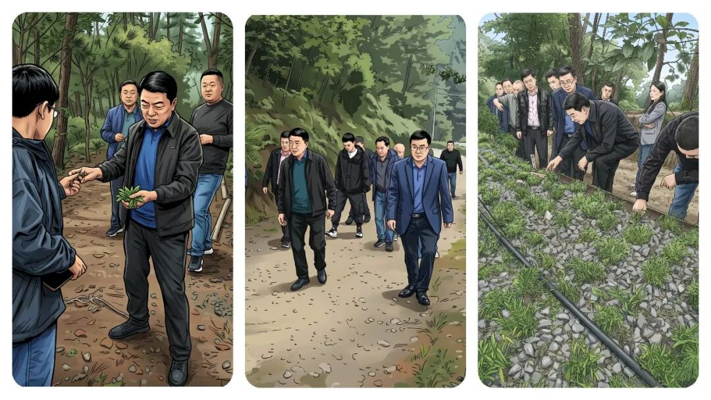
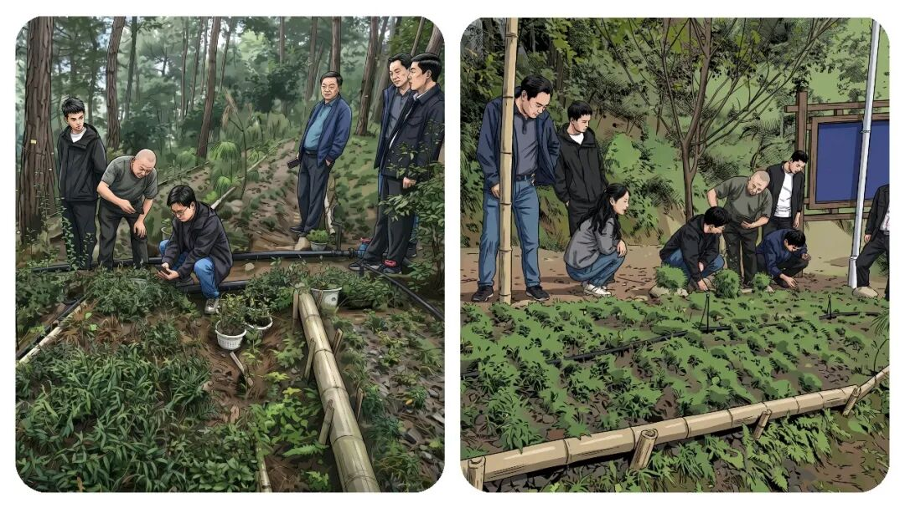
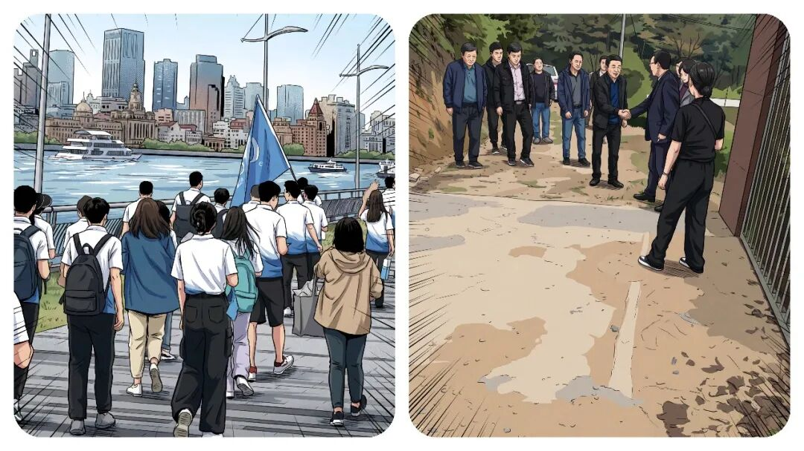
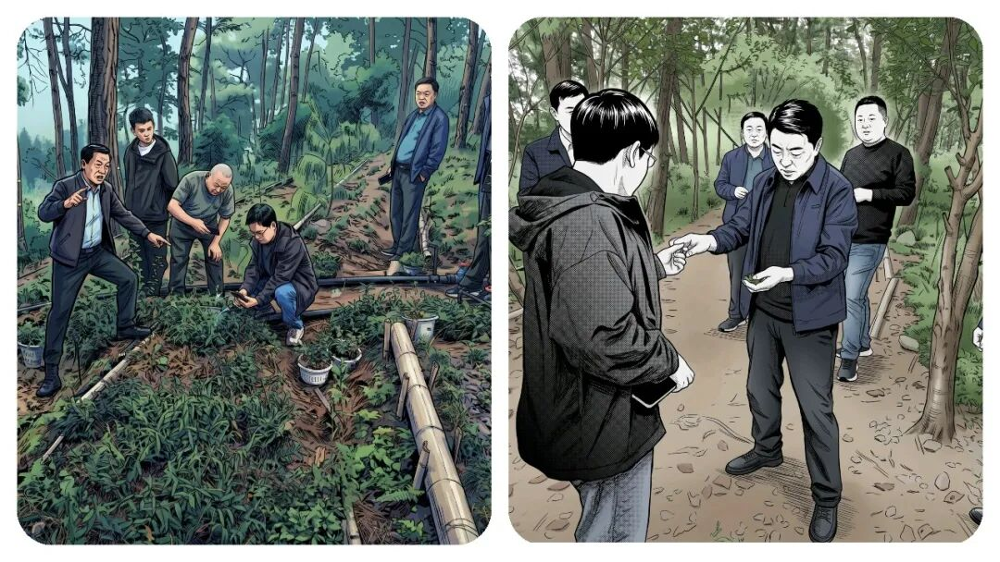
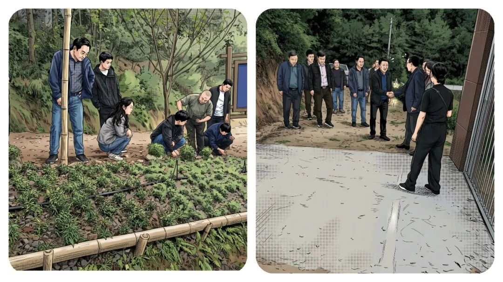

# 事业编听劝：年轻人，千万不要待在乡镇太久！答案，比想象中现实。

# 事业编听劝：年轻人，千万不要待在乡镇太久！答案，比想象中现实。

原创 点击关注👉🏻 点击关注👉🏻 田间烟火

在小说阅读器读本章

去阅读

在小说阅读器中沉浸阅读

点击上方**蓝字**关注我～

田间烟火🔥

“乡镇工作能不能成就年轻人？特别是事业编”。

这个问题，很多刚进体制的小伙伴都琢磨过。

确实，基层的锻炼机会不少，但如今一线形势早就变了。

每天要应对的琐碎任务，和几年前的情况完全不一样。

早上刚到单位，压在肩上的不是一两件事，什么数据报表、临时督查、应急演练、台账更新，一个接一个，信息表、材料整理只能加班或者挤周末去做。

真想静下心搞点创新，把事儿弄明白？

想都别想，好多年轻人连喘息都成问题。

除了办公室里的数据工作，领导还要大家下村走访。

村民家长里短、矛盾调解、民情摸排，哪样都不能马虎。

你有热情，肯钻研，但碰到实际问题就容易碰壁，尤其群众诉求太多太碎，稍微没应和好，马上有人抱怨甚至投诉。

书本知识在教室里时有用，下到村头巷尾，面对左邻右舍的琐事，发现理论往往无力。

一边讲政策要原则，一边群众盼着你能共情，处理时得会变通。

这种两难，刚开始谁遇到都头疼，情绪一天比一天紧张。

有时候，村里的小冲突，闹到最后需要你把所有人都劝住，还不能落下谁的心。

01

消磨锐气的工作氛围

压力大的结果是什么？

有人咬牙扛下来，有人慢慢就消磨了锐气。

旁边不少“师傅级”前辈，做着做着选择得过且过，时间久了，他们总结出最“安全”的模式：按时打卡，到点有人走人，必要的活一点不多做，也不讲究出成绩。

难的事、麻烦事，推的就推过去，能混就混，领导见惯了反而不再强求。

久而久之，基层里愿意冲的人越来越少。

谁又喜欢天天加班还挨批评，不如宽心过日子。

这种氛围，最影响刚来的新人。

你初来乍到，可能还披荆斩棘，时间长了也容易觉得，拼死拼活不如“平稳混一混”。

02

狭窄扎心的晋升渠道

别说提拔和晋升问题了，那就更让人扎心了。

乡镇事业编制，升迁渠道太窄。

不是成绩不好，是机会实在太少。

同一期入职的同学，有背景，有人推一把的已调走，有的考去城市，有的靠各种关系升得快，没路子的只能扎根在原地。

一批又一批新人进来，你成了最熟悉的学长。

身边同龄人流动快，留下来的总觉得没有希望、不容乐观、前途一片渺茫。

有种说法挺扎心，如果进乡镇基层五年还留在原岗，可以说是这辈子也许就要在这待到退休了。

不是没有激情，而是环境让很多理想慢慢变成了现实考量。

03

少数例外的正向情况

有人可能会问，那是不是所有基层岗位都混日子？

其实也不全是这样的。

有些偏远县区或一些特色的乡镇，为了抓住发展机遇，干部队伍有更大自主权，年轻人反而能主导项目，发挥空间大的多。

像那些沿海小镇，边境乡镇，因发展任务重，重视年轻干部成长，实打实锻炼，不少人几年就能轮岗调动，甚至参与重大项目。

这类正向反馈其实能激发奋斗动力。

问题在于，这样的例子，始终只是极少数。

浪潮更普遍的现象还是事务主义，头重脚轻。

大部分乡镇，事务负担压得人抬不起头，身心真的很累。

现实约束远没书本上说得那样光鲜，实际中不认真不负责的少吗？

在一些考核不太严的地方，混日子反而不易被清退，认真的人有时还落埋怨。

比较那些发达城市的基层治理，模式完全都不一样。

很多城市社区用数字化手段搞数据报送，大大减少了无效重复劳动。

青年干部有时间搞创新项目、参与社区各种治理，反倒吸引了不少人才报考。

同样体制、同样队伍，就是因为流程创新和激励机制做到了位，正反馈出来了，人才稳定性高。

不过转念想，在经济欠发达、社会发展相对缓慢的区域，光靠年轻人个人热情，并不会真正改变大环境。

乡镇事务本身千头万绪，群众需求没那么容易满足，工作节奏长年高压，不出差错就难得了，还想干一番大事业难度非常高。

也是有人熬出头的，但是还是极少数人的。

有的年轻干部用两三年就争取到调动名额，晋升很快进入区县机关单位。

完全不奋斗也说不上，关键是选对方向和适应得快不快。

04

选择在个人

说到底，年轻人到基层，既有现实压力，也有锻炼机会。

有人看重稳定和生活节奏，愿意慢慢熬下去；

有人觉得受不了，想尽办法跳到别的岗位。

走哪种路，都有挑战，关键得了解清楚内情，再思考选不选择。

基层不再是过去那个理想化的热土，但它依然是碰撞现实与理想的第一线。

有些事走过才懂，机遇和挑战就在那里，不会因为你是新人或老人而简单变好。

到底是去，还是不去？

每个人心里都得有自己的答案。

你在基层待了多久？

最让你想放弃的瞬间是什么？

评论区聊聊～

点赞

转发

推荐

评论

---

原文：https://mp.weixin.qq.com/s?__biz=MzY4NDI4OTA3NA==&mid=2247487106&idx=1&sn=4a30d9671939221a04095c6e19fecccc&chksm=f3a773dfc4d0fac9756e6f3f6dffa23d84f070bc54c09de9cc0c08503245579b3fb6ef710e65
