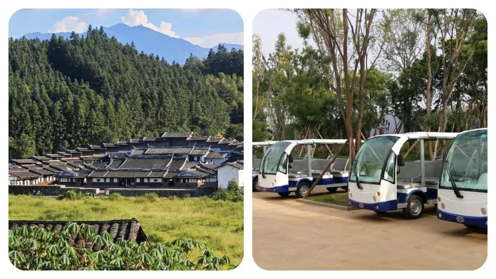
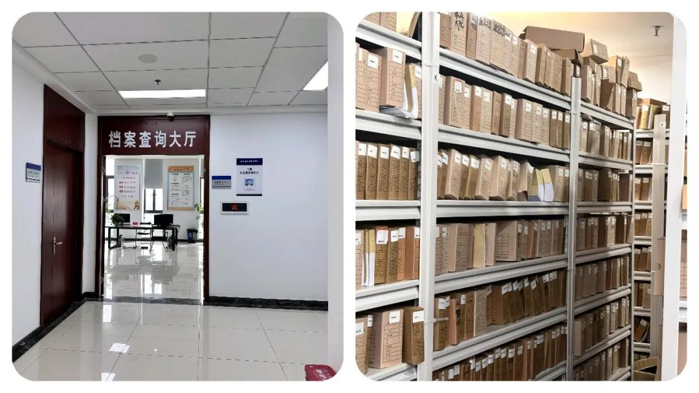
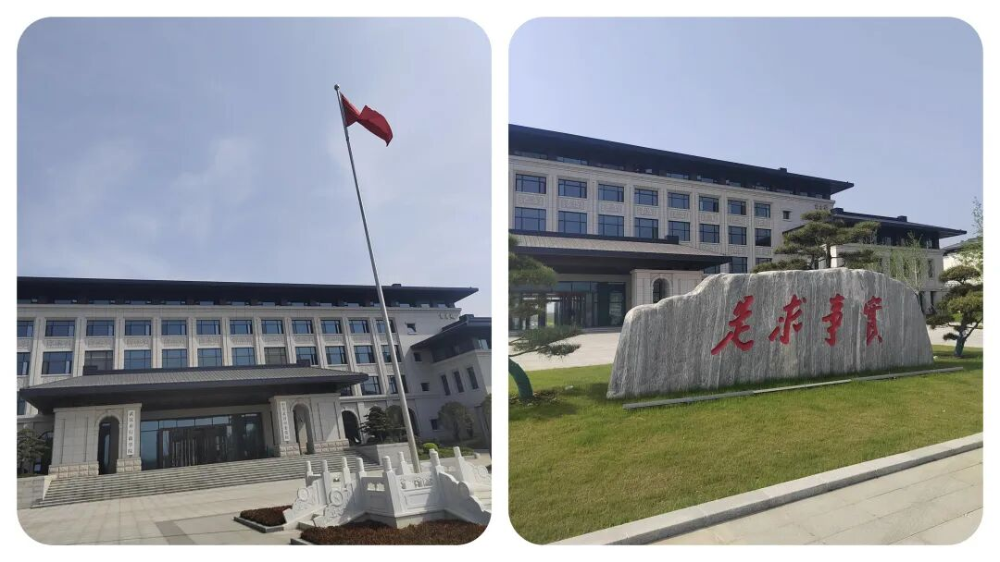
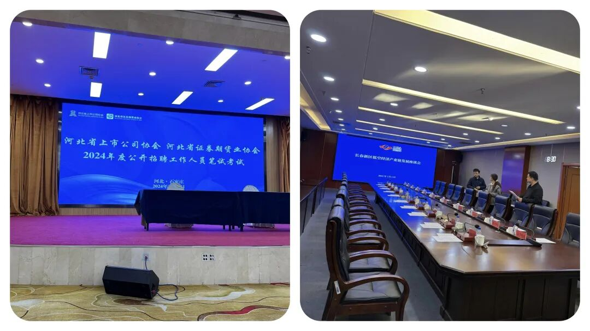
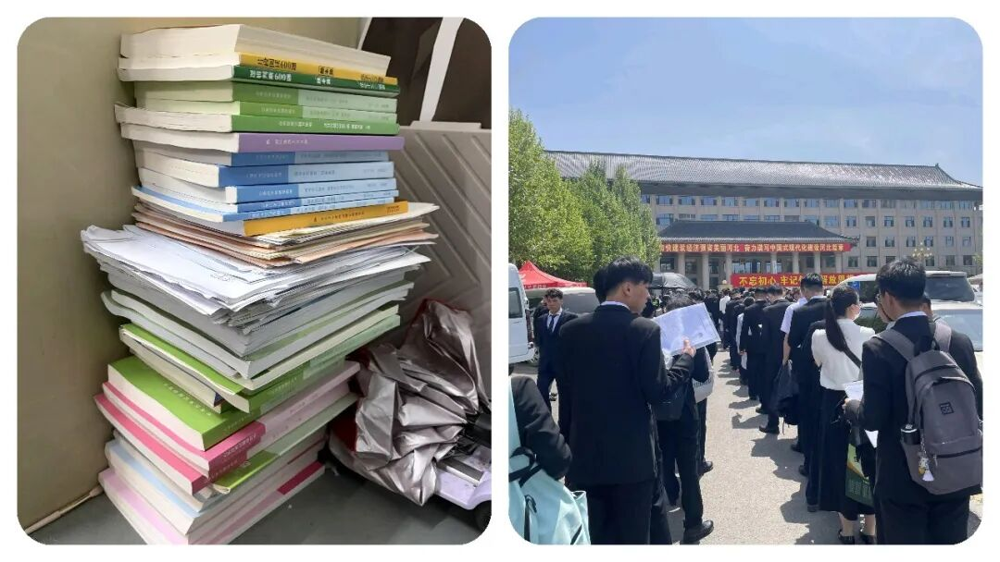

# 你注意到没？为什么现在的年轻人，都不愿报考“老牌”体制单位了！

# 你注意到没？为什么现在的年轻人，都不愿报考“老牌”体制单位了！

原创 点击关注👉🏻 点击关注👉🏻 田间烟火

在小说阅读器读本章

去阅读

在小说阅读器中沉浸阅读

点击上方蓝字关注我们

田间烟火🔥

大家好，我是田间烟火🔥～

这几年，体制内岗位在不少人眼里还是稳，但稳和有发展，往往不是一回事。

真要细看就会发现，有些单位牌子还在，编制也还在，但是呢，手里的事、钱、权，已经和过去不是一个量级了。

岗位看着安静，实际也可能意味着边缘化，这事该不该提前看明白？

先把话说直白点，这类单位有个共同点，名字不算陌生，听着也挺正规，可实权缩水，业务被分流，资源拿不到，慢慢就成了清水岗。

你进去了，也不一定会吃亏，但想靠它打开局面、跑出上升线，难度确实不小。

01

文旅局

文旅局就是一个典型。

以前提到地方文旅，不少人会觉得这是个有想象空间的口子，景区、活动、项目，看着都热闹。

可现在不少地方的文旅开发，真正拍板和推进的，往往是城投平台、国企或者专门的项目公司，局里更多是在做统筹、宣传、材料、协调。

问题就在这儿，表面上是参与了，关键资源却不一定在手里，项目落地时能说了算的环节少了，年轻人自然会掂量，这地方到底值不值得冲？

而且文旅这条线还有个明显变化，很多地方都在追求文旅和商业、基建、夜经济打包推进，谁掌握资金和建设主体，谁的话语权就更大。

局里如果只是做活动方案、报送总结、接待检查，日常忙归忙，含金量却不一定高。

像一些热门旅游城市，文旅部门因为景区密集、活动频繁，存在感仍然不低，可这种情况并不普遍，普通地区差别挺大。

02

供销社

供销社更容易看懂。

它曾经有过自己的时代，但零售格局变了，超市、便利店、电商、社区团购都起来了，过去那种进货卖货的独特位置，早就松动了。

很多基层供销社现在是什么状态？

门店空着，或者干脆租出去，挂着牌子，真正能做的主营业务不多。

单位还在，人也在，可工作内容越来越薄，发展空间自然跟着收缩。

当然，供销社也不是所有地方都一个样。

前些年有些地区把供销体系重新接回农资、冷链、农产品上行，和乡村流通结合得比较紧，业务量反而比想象中活跃。

可这更看地方基础和资源整合能力，不能简单拿个别样本当普遍趋势。

大多数普通基层岗位，还是很难回到当年那种位置。

03

档案馆

档案馆，冷门属性就更明显了。

整理档案、修志编史，这些工作当然有价值，而且价值不小，只是它更偏长期、偏基础，也更难在日常行政运转里形成强存在感。

说白了，事情不能说不重要，但离核心事务远，离决策链条也远。

没有项目牵引，没有审批权，没有资源调配空间，岗位就容易变成安稳有余、活力不足。

有人会问，安静一点不好吗？

有的人说是“养老岗位”😁

这要看你图什么。

你要的是规律、稳定、少折腾，那确实适合。

可如果你想多接触综合业务、扩大人脉、争取晋升，这种单位的通道通常就窄。

很多人进去后，很快会发现，日常不算太累，但成长速度也慢，熬年头未必换来位置变化。

04

基层党校分校

基层党校分校这几年也在经历类似变化。

过去线下集中培训多，党校的地位比较直观。

后来培训形式变了，行政学院、网络课程、联合办班都在分流，基层单位的大班次减少，师资稳定性也在下降。

课程照样上，牌子照样挂，可培训密度、影响范围、资源吸附能力，和以前比有差距，这种变化大家都看得到。

这里还有个细节值得注意，单位一旦业务减少，最先受影响的往往不是日常运转，而是新人吸引力。

为什么有些地方的基层党校招人难，留老师也难？

因为年轻人会比较，同样在体制内，一个岗位能不能接触核心事务，能不能形成专业积累，差别很大。

你总不能只看清闲，不看三五年后的路径吧？

05

行业协会

行业协会也差不多。

以前一些挂靠体制内的协会，能做审批相关事务，能搞评优评级，还有一定行业组织力。

现在不少权限收回去了，收费、摊派这些灰色空间也被压缩，协会日常更多成了发通知、做统计、办活动。

企业如果觉得没实际帮助，配合度也会下降。

没有抓手，没有硬权限，协会就容易变成存在但不强势的组织。

06

报考体制内不能只看“上岸”

这类变化，不只是某个单位衰落的问题，更像是整个行政分工在调整。

哪些职能被市场接走了，哪些被平台公司接走了，哪些被更高层级、数字系统、专业机构接走了，结果就是，一些老牌单位还在运转，可已经不再是资源入口。

我们应该考虑的是，不只是名字好不好听，而是岗位有没有抓手，有没有成长场景，有没有持续积累的空间。

说到底，报考体制内，不能只看上岸两个字。

你考进去以后，十年怎么走，五年能不能动，平时接触什么事，这些都要提前算。

热门核心部门当然竞争更大，但至少路径更清楚。

冷门边缘单位未必不能去，可你得接受它的现实，别抱着旧印象做判断。

07

在岗也不必灰心

已经在岗的人，也别急着灰心。

路不是没有，关键是别长期原地不动。

能争取借调就争取借调，反正就是能调走就尽量调走，能参加轮岗就别错过，能补业务能力就尽快补，尤其是写材料、项目协调、数据分析这类通用能力，放到很多口子都能接得上。

江苏一些基层干部这几年通过借调到专班、巡察组、重点项目组，后续岗位变化就比长期守着原单位的人快得多，这就是现实差距。

还有人会说，清水岗至少稳，为什么要折腾？

这话也没错。

问题不在于稳不稳，而在于你自己想要什么。

想图稳定，就接受它的上升慢。

想要发展，就别把边缘岗当成终点。

单位的冷热会变，个人的选择也该跟着变，这才更实际。

进体制圈后才懂的体制内真相，你还悟到了哪些？

评论区一起交流～

  

点点赞，你最好看～

---

原文：https://mp.weixin.qq.com/s?__biz=MzY4NDI4OTA3NA==&mid=2247487273&idx=1&sn=e99c227af06034e3cde81d8ac1bf4cef&chksm=f3a77274c4d0fb62afdff592e00198ae561e2b4fd543c7ecc4abf1f1507d7ff9724c584436ae
