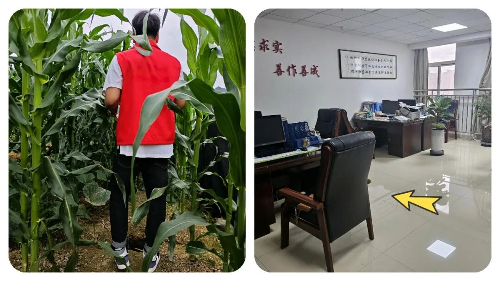
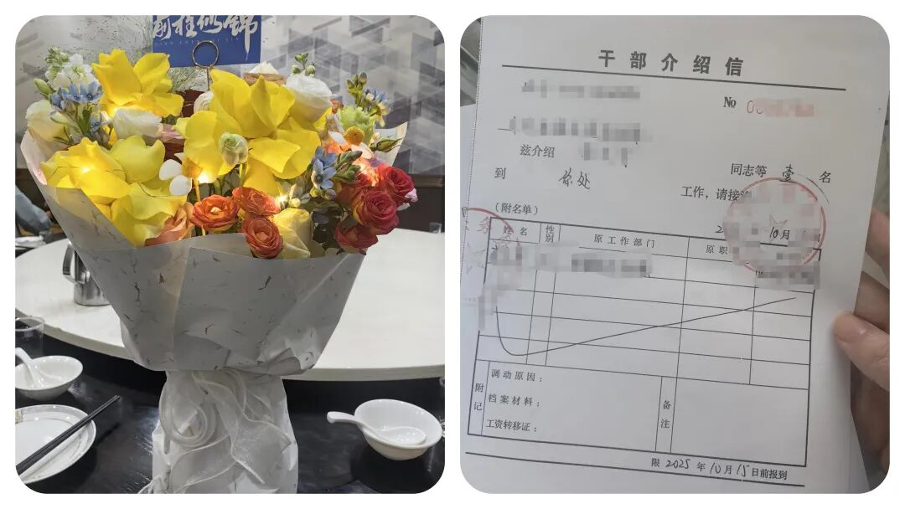
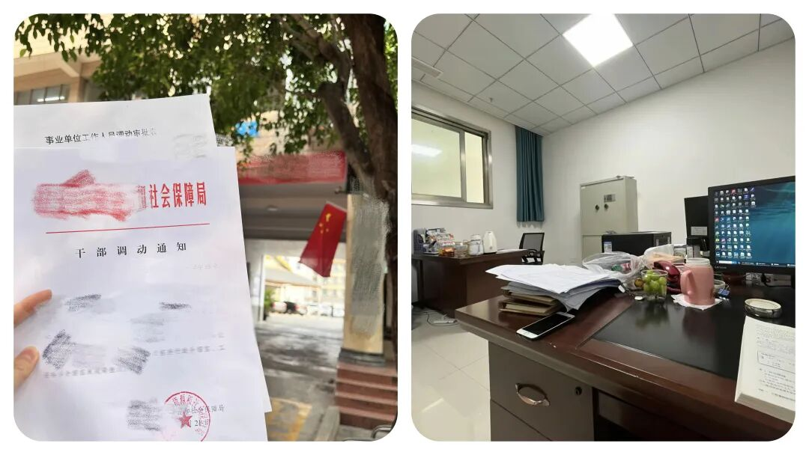
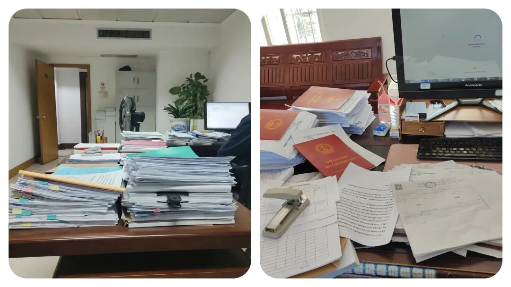

# 为了让“乡镇干部”老实待在乡镇，组织部竟用这种“歪”办法！

# 为了让“乡镇干部”老实待在乡镇，组织部竟用这种“歪”办法！

原创 点击关注👉🏻 点击关注👉🏻 田间烟火

在小说阅读器读本章

去阅读

在小说阅读器中沉浸阅读

点击上方蓝字关注我们

田间烟火🔥

大家好，我是【田间烟火】～

我发现了，最近一段时间，不少乡镇干部私下议论，有的人天天都在想着怎么调去县直部门去，现在这条路好像变得越来越难走了。

过去只要年限和业绩达标，调动程序走一走，还不算太复杂。

可现在，组织上的“差额竞选”方式一实施起来，大家全都绷紧了神经。

01

老问题是什么？

现在很多人都灰心了，说白了，就是大家都想离开乡镇。

基层压力大，任务又杂，有没有什么太大的前途，假期动不动就没有了，还动不动面临责任追究。

相比之下，县直单位批任务少，制度规范，岗位稳定，薪酬绩效也不差，谁不想去个清闲点、环境好点的地方工作？

之所以，每年有资格的乡镇干部，脑子里早就琢磨着怎么搭上转岗顺风车，哪还有多少心思真踏实干？

调动之路一直被视为“逃离乡镇”的主要途径。

本地干部大都奔着县直岗位去，县直反而成了终点站。

就是这种心思，全被组织部盯上了。

02

差额竞选的内容

组织部其实也明白干部的心理，直接把调动通道设了道门槛，进一步升级，差额竞选方式上马。

说是优胜略汰，说穿了，就是想挤挤水分，不让大家都一窝蜂地往外跑。

具体怎么竞选

现在想进县直部门，已经不是对号入座或者熟人介绍就能成。

即便有人情、有成绩，第一步也是要找到和自己业绩条件接近、且同样想调走的人一起“差额竞选”，实际就是竞争上岗。

组织部要看，有本事你比竞选的同事更突出，才能挑出来。

甚至，为了强化竞争，竞选干部还得符合高标准，规定在几年内拿到各种优秀，没有处分，还过遴选条件。

这一组合拳下来，调动不再是走形式。

差额竞选执行的难点

可问题在于，竞选并非“搭档帮忙”，大家心思各不相同，哪里有那么容易凑个“合拍”的搭子？

乡镇老干部基本稳定不动，但多半都是躺平，优秀评价很难拿到。

年轻同志本身就急着跳出基层，生怕被拖慢节奏，哪肯帮你做陪衬？

有的干部尝试动员身边同事，“你看你家里在这儿，打算长干，这次跟我去竞选成不？”

一来是人情难还，二来大家都担心，真去考评，竞选的分数比自己高，反而把机会拱手相让；

还有更厉害的人，怕评定流程中为了突出自己，互揭短处，两败俱伤。

竞选的干部要是不走心，考核分数落后；

若是冲劲十足，主选人反而没戏。

这局面，怎么进也不是，怎么退也难。

03

过往宽松调动政策的教训

实际上，全国不少地方前几年调动程序还有更宽松的窗口期。

有些县区曾经推行“积分制”流动，工作效益优异+年限自动晋升县直，结果三年内超半数新晋干部涌向县直单位，基层岗位瞬间空了大半，补岗忙得焦头烂额。

后来也是临时收紧政策，一道大门关上，流动马上降温。

还有部分西部县区，早些年强推“轮岗换防”，直接让乡镇干部无条件轮流到县直和乡镇之间流动。

一开始听着不错，等实际操作就发现，真正愿意到乡镇扎根的干部还是少数，一到轮换周期马上递辞职报告，缺人反而更严重。

再反过来看，有些县直单位因为岗位有限，从内部提拔和外调都抓得紧，反倒出现低流动、干部年轻化不足的新问题。

这种地方就算放宽了乡镇流动比例，现实里还是僧多粥少，末端优胜劣汰，留不下人才。

反差鲜明，看似给机会实际上竞争压力更大。

所以有干部感叹，过去琢磨怎么“人脉”竞选，现在全靠真本事和业绩说话，一不小心还可能被随行竞争对手反超，调岗变成了“高风险投资”。

有人索性不再折腾，安心等政策风向。

04

影响和争议

组织部这样做，表面上堵住了干部“扎堆出走”，基层岗位稳定不少。

可暗地里，干部们调动愿望被压抑，反而形成了一种“躺平情绪”。

既然走也走不掉，那就守着原地，不再多想未来。

任务来了随便应付一下，综合工作评优也不再那么积极。

有的人说，这种“差额竞选”模式能不能给大多数地区延用？

答案还真不好说。

毕竟各地干部情况不同，岗位设置、奖励激励、流动窗口都是因地制宜，哪里都不一样。

眼下有的地方还保留早期流动政策，还是凭年限加业绩晋升到县直，还能顺利调动。

而这种政策下，无论是调岗方式复杂化，还是评优落实名单收紧，目的都是让乡镇岗位“缓兵稳阵”，防止好不容易培养出的基层干部一下子流失殆尽。

到底是积极留住人还是制约合理流动，各有利弊。

现在干部们看得更看重了：遇上调动放松窗口，抓紧去县直，错过就怕以后再无机会。

等这种“优胜略汰的竞选”方式真铺开，乡镇干部只能把心思收一收，等行情有变化再谋出路。

时代确实变了，干部队伍流动也越来越讲究平衡。

到底哪一边的路会越走越宽，也还有待观察。

评论区聊聊，你现在在乡镇？还是已经调走的？

  

修改于

---

原文：https://mp.weixin.qq.com/s?__biz=MzY4NDI4OTA3NA==&mid=2247487468&idx=1&sn=0a1d881704338afc6cceb635945007f7&chksm=f3a772b1c4d0fba7a8e88bb922149af7ec088286bd368c73a4840aede4e87f02bddefeaeadc7
