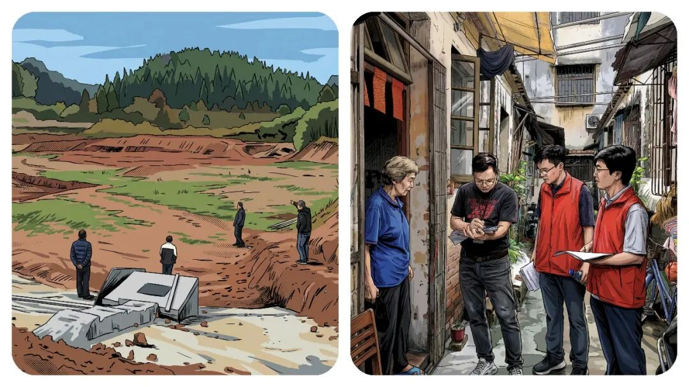
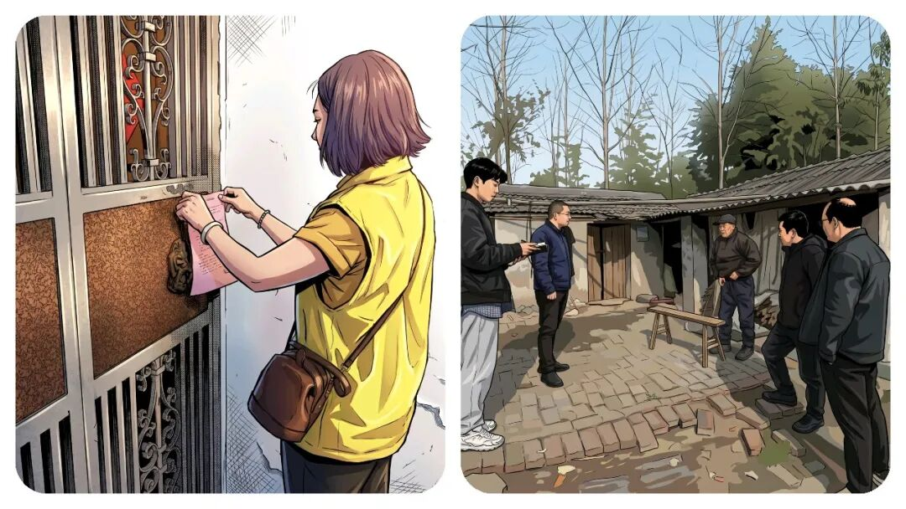
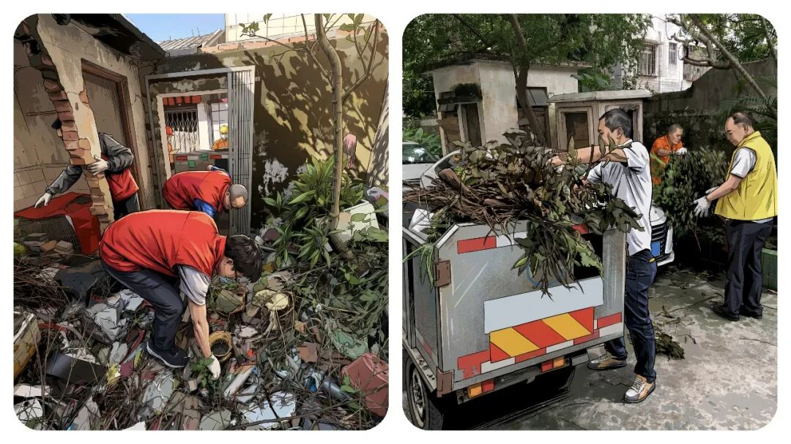
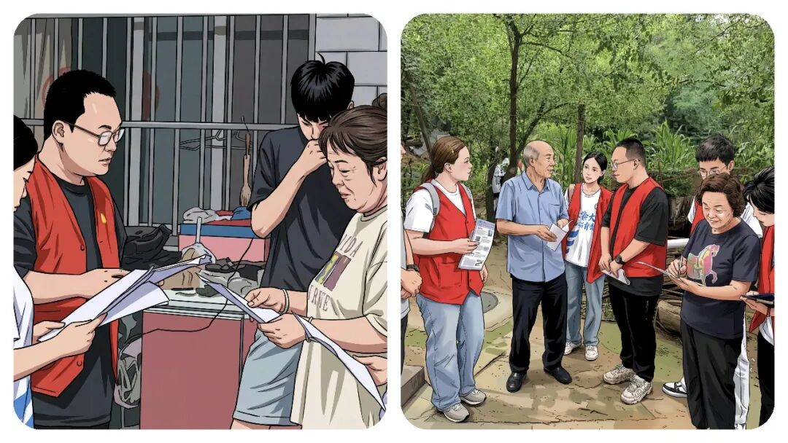

# 为什么“乡镇干部”的年轻人都想“躺平”？答案，比想象中现实。

# 为什么“乡镇干部”的年轻人都想“躺平”？答案，比想象中现实。

原创 点击关注👉🏻 点击关注👉🏻 田间烟火

在小说阅读器读本章

去阅读

在小说阅读器中沉浸阅读

点击上方

蓝字

关注我们

第一时间获取更新

田间烟火🔥

大家好，我是【田间烟火】～

今天我们来聊聊“乡镇事业编到底有多累…”

以前在县城和乡下乡镇，还是有不少年轻人都挤破头想考事业编，抢着往里进。

工资虽然不高，胜在稳定，有编制、有保障。

但这两年，越来越多的“乡镇工作人员”开始变得“无欲无求”，甚至有人干脆选择“躺平”。

这不是个别情绪，是许多乡镇年轻人正在经历的现实，特别是现在的90/00后。

为什么本该热火朝天干事创业的一线岗位，成了不少人嘴里的“混日子”？

和身边的朋友聊了聊，不少真心话让人感慨。

01

分工不均：多干少干差别小

反正，有很多人刚进编那几年，的确有理想有冲劲。

愿意顶着风雨下村到屯入户排查，也乐意熬夜整理台账。

一两次，几十次，也还好，但是一直持续这样，光靠热情支撑不住。

最让人无奈的，就是分工永远那么“神奇”：忙的永远是那几个人，闲的总是那么闲，反正领导逮到谁就是谁干，一直跟进到底～

乡镇办公室里常常有这样的画面，几个同事在会议室忙着对接检查，从早到晚做材料。

总有那么一两个，人影都不见到几次，或者呆坐喝茶、准时下班，过得自得其乐。

优秀考核？奖励晋升？

事少的人照样分到和忙碌的人一样的工资，年底奖金几乎无差别。

有些人问，既然多干多累没区别，干嘛还要格外卖力？

这种想法，可以说是，每个人的心声，你摆我也摆。

有同行在凌晨还在对使劲改数据，精选，调表，核对数据，然后还要报审，报送，第二天还要早到单位赶新任务。

也有同事每日按点打卡，拿一份稳定工资。

这中间的落差让不少肯负责的人心寒。

更有意思的是，做多错多，风险越多，不做就没得啥也不用干！

能拖就拖、能推就推，安全，传说中“保命”要紧。

02

晋升难度：事业编“天花板”低

现在聊到这个晋升，就更让人心塞和无奈。

很多考进事业编的年轻仔，工作很久后才发现，相比公务员那种有职级进步、有遴选通道，事业编制其实“天花板”很低。

有些岗位名额有限，管理岗位名额少，可能排队5年10年都没跳动。

别说能力强，机会本来就少。

薪水和岗位晋级的差异太明显，像那种相邻市区同一年参加工作的公务员和事业编，到了第五年，晋升和涨薪的速度已经完全不同。

据公开数据显示，山东某县乡镇，事业编和同级公务员，五年后差距能拉开近千元。

公务员起点更高，还能参加遴选、互相调动，往后更容易熬出头往上走乡镇事业编却常年原地走。

你是认认真真的干，还是能省则省地混日子，说实话，结果差别并不大。

03

缺乏反馈：努力看不到希望

我发现了，真正让人觉得煎熬的，并不是“忙”，而是看不到希望。

你全力以赴，想让群众工作做出成，但身边同事无动于衷，领导也多半默认太平无事就是好结果。

功劳难奖，过失没人担。

你多操心、多做事，却感受不到平衡的反馈。

久而久之，大家纷纷学会了“明哲保身”，不主动、不出头、不揽事，反而成了职场最佳生存法则。

谁还敢去趟浑水？

反过来看，其实并不是事业编没有前途，也不是所有乡镇都一团无精打采的气氛。

一些偏远小镇新推绩效细则，确实让踏实的人多拿点奖金，但范围不广，往往执行没多久又变回老样子。

又得地方，能多劳多得，有加班补贴。

不过也有在一线待过的老同事提醒，政策换一任领导容易打回原形，奖金很难保证每年落实。

并不是所有基层岗位的氛围都低气压。

以教育口为例，部分重点学校有激励机制，科研与教学成果挂钩加薪。

2019年北方某市部分乡镇小学教师，公开竞聘带动基层师资流动，一些偏远学校教师通过实际成果晋升。

但反过来，最常见的还是默默无闻和轮流等待。

这种“熬资历，镀金”的氛围，还在很多基础岗位蔓延。

04

根本原因：机制缺位磨平动力

问题在于，现在的年轻人追求的不光是钱，多数人也想得到尊重、凭能力走出来。

总有人问，为什么基层岗位总有那么多人在“混”、“等”？

答案很简单，机制激励弱，走关系看资历气氛重，干多干少没回报，久了自然没有动力。

不少网友讨论乡镇事业编的现状时，都提到一个特点：老一批人求稳、年轻一批想闯。

可现实下，想闯的往往被磨平了棱角，逐渐习惯于“不多事，少一件是一件”。

不是不想努力，是怕不断努力的人，反而掉队，不如稳扎稳打等机会。

某县宣传线的青年，靠执行力和沟通能力，被市里选调，三年内实现跨层级提拔。

但这种机会说到底属于极少数。

绝大多数人，依然是过一天算一天。

现在体制内“稳定”依旧是关键词。

对一些有家庭、想安稳的人来说，乡镇岗位还是刚需。

但对于更多渴望有成就感、想被认可的人，基层的“发挥空间”让他们有些失落。

要让大家重新燃起干劲，单靠宣传层面的“致敬基层”没用。

关键还是机制上要想办法，多劳多得，晋升透明，让付出的人能看到希望。

说到底，普通人的努力，如果不能被公正对待和尊重，再高的起点，也会慢慢失去原动力。

这才是越来越多乡镇事业编选择“无欲无求”的根本原因。

你身边有没有这种情况？

忙的永远那几个人，闲的永远那一批人？

欢迎评论区聊聊你的真实感受！

点点赞，你最好看～

---

原文：https://mp.weixin.qq.com/s?__biz=MzY4NDI4OTA3NA==&mid=2247487982&idx=1&sn=b0f1c658f72ea06fa3dd014432bf5f39&chksm=f3a76cb3c4d0e5a58ff272025d62a53045a3905cded4205332a9d29e6bbb9953873dfb32250e
