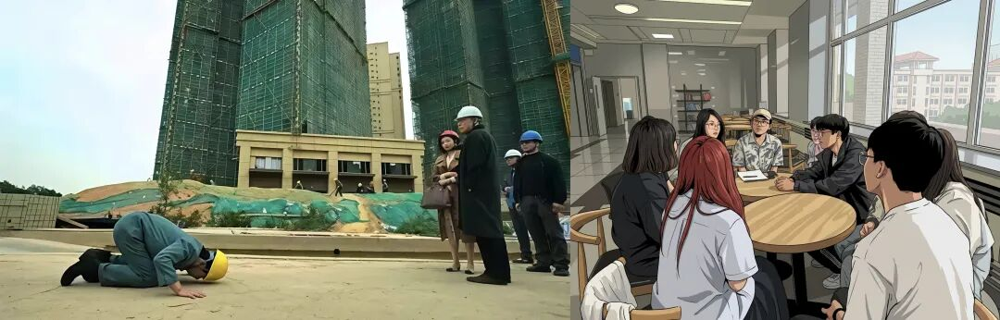
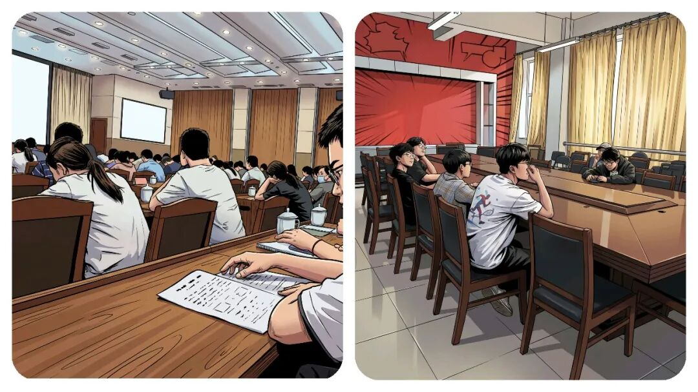
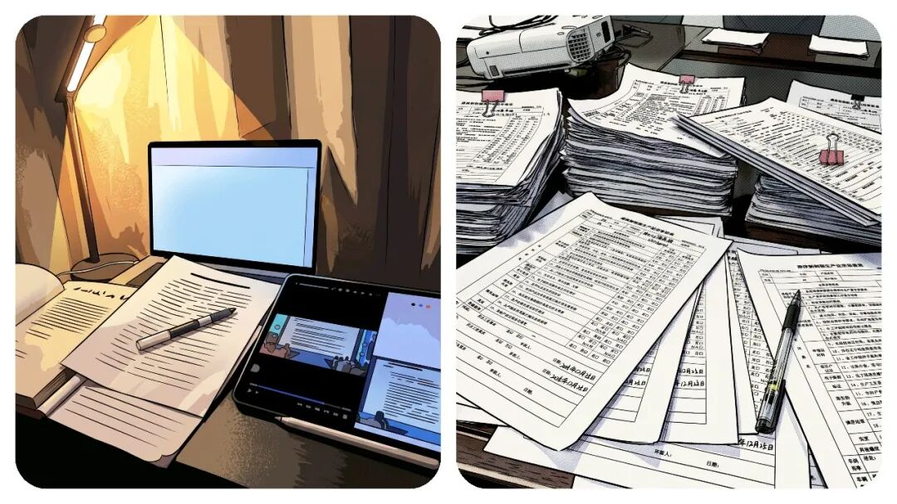
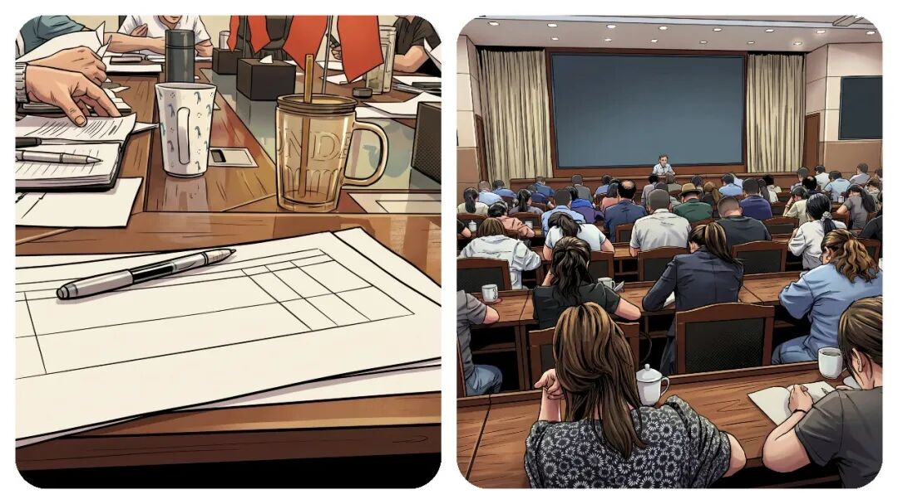

# 你知道，“乡镇干部”一天到底都在忙什么？聊聊最累的 3 项工作。

# 你知道，“乡镇干部”一天到底都在忙什么？聊聊最累的 3 项工作。

原创 点击关注👉🏻 点击关注👉🏻 田间烟火

在小说阅读器读本章

去阅读

在小说阅读器中沉浸阅读

点击上方蓝字关注我们

田间烟火🔥

大家好，我是【田间烟火🔥】～

我相信大家身处体制内，见到大家吐槽最多的问题其实不是事情难做，而是环环相扣的流程、重复的汇报和各种会议让人心累。

很多人说，真正花在干事的时间，其实只占一小部分，剩下的精力都消耗在“写方案、走流程、做总结”这些环节，到底怎么回事？

01

三类常见的流程消耗

重复超长的书面汇报

本来简简单单讲一件事，可能3分钟就能讲清楚。

可汇报起来非要搞成几页纸。

先说这项任务有多重要，然后再分点讲措施，既要“上高度”，又要“戴帽子”，最后还要展望未来。

每个角落都必须留痕，记录，存档，每句话都要有依据和佐证。

看起来挺严谨，实际上不少内容都没人真去落实，只为流程而办。

大同小异的重复报表

报表也是个非常累的烦恼。

一份数据，今天报，明天再报，单位报了还要层层上传。

报的内容其实大同小异，表格却换着花样要填，改个表头或者换个行列序，继续下发填报。

有人调侃，报到最后，数字怎么来的自己都说不清。

有些报表设计得离谱，基层只能硬着头皮凑数字。

这种情况在乡镇基层可以说是前几年的常态，结果呢，大家都在想办法应付，却没有时间深究数据背后真正的问题。

形式繁琐的无效会议

还有会议，原本一通电话就能解决的小事，非得开会。

会前要写方案、准备讲话稿，通知参会名单，安排会务人员，场地布置都得细致安排。

一场会议下来，前后准备比实际讨论还要花大力气。

汇报标准要统一，材料要精致，甚至连发言顺序都要敲定。

这套流程让不少人直呼“抓主要的事没时间，做配套的事花精力”。

02

“流程疲劳”的成因与现状

曾有人描述，自己一周干实事顶多半天，其余时间全用在文书工作、流程梳理、各种会议。

其实不只体制内，很多企业也有类似苦恼。

有些互联网公司，明明项目能快速上线，但每次立项、评审、总结都要做厚厚一份文档，领导要看到“理由、目标、下一步”，一天下来也疲惫。

不过在企业内，一旦业绩有压力，流程容易被割掉，体制内却常常“流程为王”。

有些报表，设计得还算合理，填报周期不长，数据要求贴合基层实际。

有的人干脆用Ai程序自动生成数据报送，省时省力。

流程优化也有些单位开始尝试，开始推动“减负增效”，会议材料合并精简，汇报只抓关键点。

但这种变化还只是个别试点，要想全行业推广还得慢慢推行。

说到底，大多数人其实更喜欢直接干事，结果清楚，流程简洁。

但现实中，“留痕管理”“监督整改”成了刚需。

像一些督办任务，每一步都要有材料存档，方便检查。

没人敢省略，不然出问题问责就没话说。

于是各级负责人其实也被流程绑住，不能随意简化。

不少人希望能“做事多于做材料”，但压力还在。

每年考核、绩效、目标任务一到，各种总结汇报立刻加码。

想躲都躲不了。

每个人都得边干边写，边报边改。

有时一份材料来回修改，牵涉十几个人，效率谁都懂是什么样子的。

这些现象并非中国独有，国外也有些跟我们相似的问题。

像国外一些传统企业，也常有汇报流程严密、会议繁多的问题，员工把大量时间耗在报告和例会上。

一些行政机构也有“痕迹留存”文化，但会为效率做优化，用电子化管理取代纸面总结。

不过体制内“流程加码”的现象，还是更突出些。

03

流程优化仍在进行中

也有人提出：制度严谨、流程规范本身没问题，关键在于怎么兼顾效率与合规。

像每次遇到突发事件或者应急事件，流程能否灵活调整、材料能否简化、会议能否线上解决，这些都是实际考验。

目前，从上到下都在谈“减负”，也有单位尝试推进“无纸化办公、自动化报送”。

也有的地区开发了报表合并系统，减少重复填报。

流程慢慢在优化，但距离“只用20%精力完成真正工作”的方案，还远得很。

有些乡镇基层单位因为任务清晰，工作量不重，反而没那么多文书折腾。

像乡村卫生所，平时不需要报太多复杂数据，会议也更为简短。

遇到重大任务需合规操作时，才会体验“流程疲劳”。

这算是“流程压力”的边界样本，说明流程累并不是所有人都一样深。

最后还是那句，大家想看到变化，想真正把精力花在干事上。

不管是流程瘦身还是制度创新，都得一步步来。

眼下，体制内大多数人还在“90%时间跑流程”的路上，想要改变，还得再等等。

如果您经常加班或者熬夜，到了晚上还是难以入眠，睡觉多梦比较多，可以试试下面这款👇🏻：睡前喝一杯！  

身处乡镇基层岗位，你每天花在走流程、写材料的时间占比多少？

不妨聊聊真实感受～

分享

收藏

点赞

在看

---

原文：https://mp.weixin.qq.com/s?__biz=MzY4NDI4OTA3NA==&mid=2247488624&idx=1&sn=6a7aa620f6bbcd83f1e7847637329f53&chksm=f3a7692dc4d0e03b9024c23bc67ce96388009005edac2d74d0760968bca99e7f3bf0ab015535
