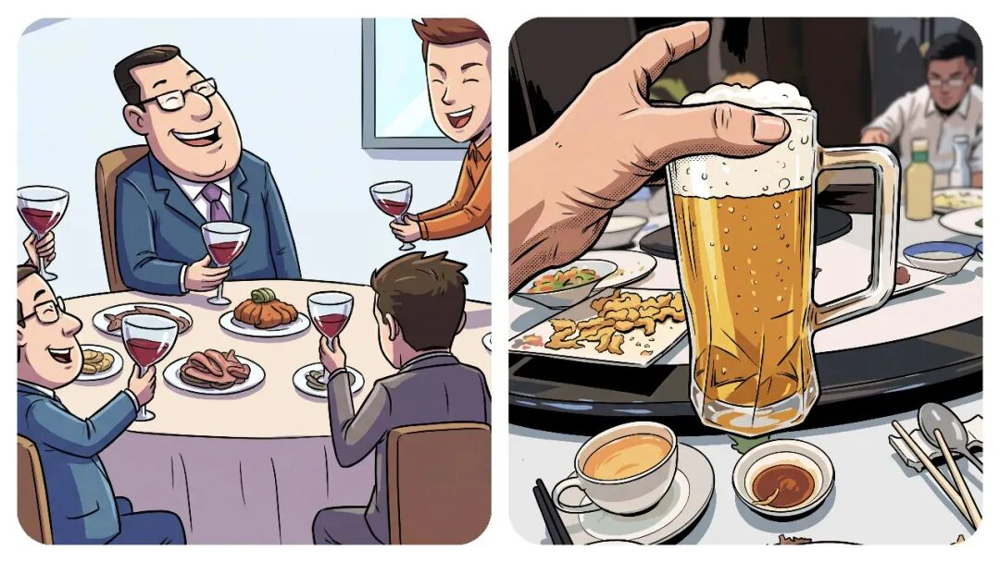
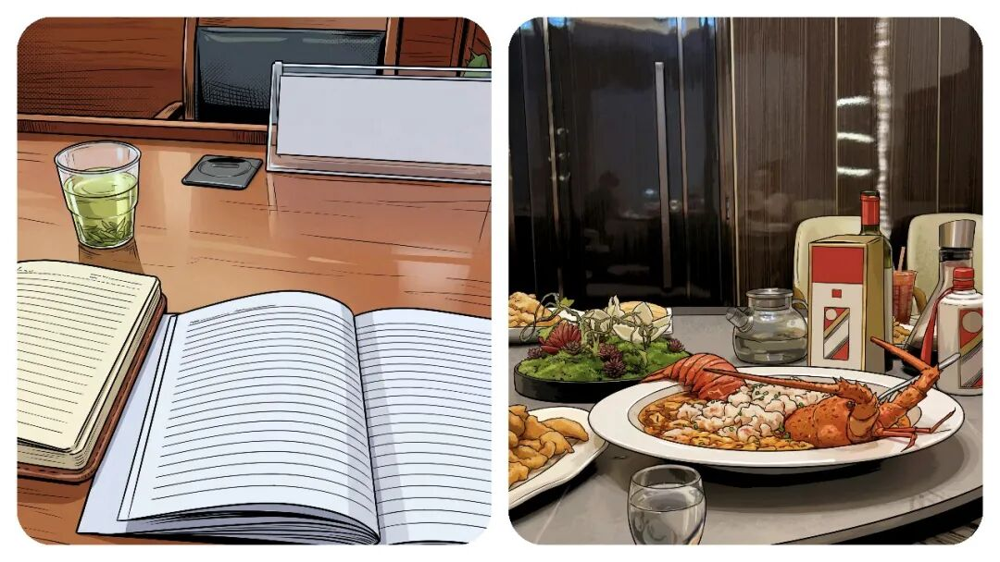
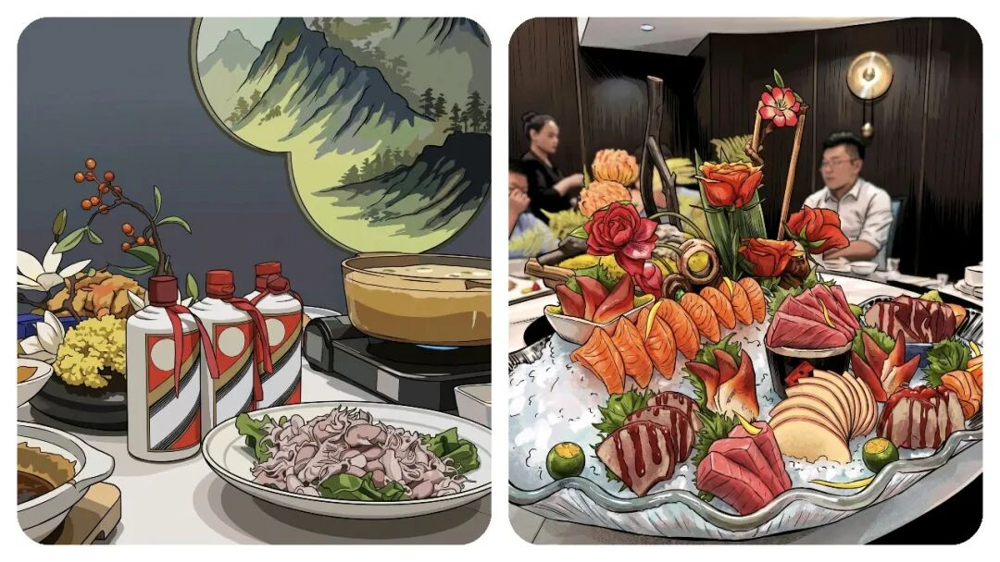
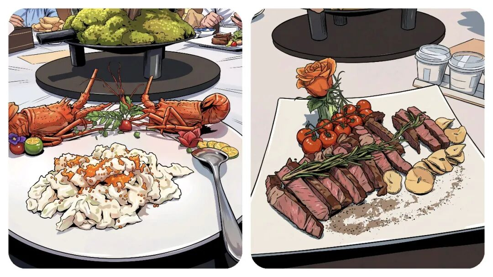
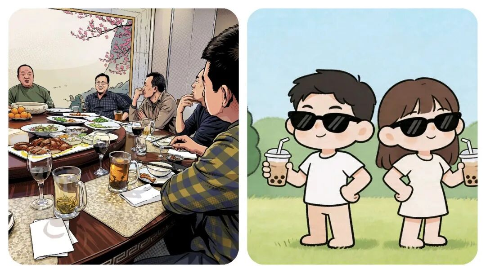

# 为什么体制内“饭局”不再受欢迎了？几年前靠“一顿饭”摆平一切，现在为什么不行了？

# 为什么体制内“饭局”不再受欢迎了？几年前靠“一顿饭”摆平一切，现在为什么不行了？

原创 点击关注👉🏻 点击关注👉🏻 田间烟火

在小说阅读器读本章

去阅读

在小说阅读器中沉浸阅读

点击上方蓝字关注我们

田间烟火🔥

大家好，我是【田间烟火🔥】～

今天我们来聊一个，以前经常出现了不良现象，现在为什么突然慢慢消失了？

体制内的饭局，以前几乎算是职场必修课。

新同事入职、调动、节日聚餐、升职，各种理由都能拉一桌人吃饭喝酒。

那时候不参加饭局，好像就是不会做人一样，不会敬酒更成了“软肋”，酒量不好直接影响竞争力，会被觉得你不懂人情世故。

这几年情况变了。

推饭聚会的人越来越多，饭局越来越有“成本”，带来的好处却越来越少。

很多人下班只想回家，没什么兴趣去陪笑脸听陈词滥调。

01

风险变高，违规吃喝监管趋严

以前吃饭就是社交，现在吃一次饭还要考虑一大堆风险，“风腐同查同治”已经不是口号了。

只要和管理对象、工程老板、利益关联人挂上钩，一顿饭就不再是普通饭，反而可能成了违规。

不少人觉得饭局里气氛热烈，实际上桌上藏着利益关系、权钱交易，隐患特别多。

自八项规定落地之后，各地对违规吃喝查得越来越细。

只要饭局和工作有点关系，谁也不敢掉以轻心。

更麻烦的是，时不时能看到新闻里某干部饭局后被查出资金、干部任用、工程项目的问题，最后牵连越来越大。

一顿本来应该是“联络感情”的饭，连带能牵出大案。

吃饭本身还有不少风险。

酒驾、醉驾、酒后失言、冲突、意外，几个词摆在那，如果真出事，没有人能替你承担责任。

过去同事要合群，领导要亲切，下属要懂事，饭桌上分工明确：夹菜、敬酒、活跃气氛、递话、接梗。

吃一顿饭，有时候比一场会议更累，出了问题却没人兜底。

02

厌恶戴面具的无效社交

其实大家不讨厌社交，更烦的是戴着面具的社交。

特别是中年干部们，白天单位事情已经耗光了精力，下班只想安安静静陪家人、放松休息。

再参加应酬，脸上还要带笑，听话茬，劝酒敷衍，心情自然好不了。

见惯了这些套路的人也不愿意再多花时间。

90后、00后对体制内饭局更是不“感冒”。

他们更重视自己的私人时间，下班以后干什么是自由，不喜欢把宝贵的空闲时间拿去应付无效的应酬。

该交办的工作交办，该配合的配合，但没有兴趣再额外参与累人的聚会。

职场年轻一代更信奉能力、规则、实际配合。

不信一次喝酒能建立长久关系，觉得关键还是要做事靠谱，关系才稳。

03

对人脉的认知发生改变

大家对人脉的看法也变了。

过去好像只要手机里存得多领导号码，朋友圈里有老板合影，饭桌上认识多少“老板”，就觉得这些是资源。

其实真的有用的关系，不靠酒精维系。

一起干过苦活、互相补台、关键时刻有人撑你，才算真正的人脉。

吃饭称兄道弟，过一天就各奔东西，不少时候不过是走个过程。

现在很多人开始看重工作上的信任、靠谱，觉得能力和合作才是真正的朋友。

04

饭局文化淡化是普遍趋势

有意思的是，这种饭局文化变化并不是体制内特有。

像那种高校里以前学生、老师吃饭也很有讲究，博士毕业吃饭、导师调动吃饭、甚至年前聚餐都要安排好。

近年来学校也推行厉行节约，老师和学生越来越多选择简单聚合，不再为“场面”费心。

类似的，许多上市公司、民营企业的部门聚餐传统，也逐渐淡化。

大家更看重业务本身，关系建设转向合作、平等，而不是推杯换盏。

不过变化也不绝对。

有报道说金融、地产等行业，高层聚餐依然盛行。

有些老板依然喜欢通过饭局谈项目、谈合作。

场合不同，要求也不同。

有企业还规定重要投标一定要请吃饭，核心岗位甚至按部就班安排酒局。

对于这些场合，有些老员工还是应付得来，不过新员工普遍不愿意配合。

有时并不因为酒量，而是觉得这些应酬没什么实质作用。

05

能力和信任才是长久立足的根本

现在不一样啦，时代变了。

体制内、企业、学校、机关的聚餐都越来越“务实”。

大家对无效饭局兴趣不高，对风险饭局更加谨慎。

强调能力、规则、合作，取代了过去的酒桌人脉。

工作要做、身体要顾，希望不能寄托在酒杯里。

建立起稳固的信任、靠谱的配合，才比一顿饭更长久。

其实不少人也开始反思：饭局真能帮你结识人脉、帮你升迁，还是只是让人习惯性地“刷脸”？

现实证明，一个靠谱的人，在工作中提供支持、补台、合作，别人自然记住你。

即便不喝酒，有能力、会配合、能撑事儿，才是真正被需要的人。

吃饭称兄道弟，转身各奔东西，这种表面形式已经被越来越多人看明白。

没必要参加无效的聚会，也不要把希望托付给一顿饭。

人脉不是喝出来的，底气和信任是做事做出来的。

对于这些变化，大家都已经在心里转过弯。

你觉得酒桌上的交情，能真正助力职场发展吗？

欢迎聊聊你的看法～

分享

收藏

点赞

在看

---

原文：https://mp.weixin.qq.com/s?__biz=MzY4NDI4OTA3NA==&mid=2247488673&idx=1&sn=41d3274760618e207c05c114883c2c33&chksm=f3a769fcc4d0e0ea795e935c55daa71c8797bc2cdecda9114cb8330e85df324e0e4ea828c3d1
