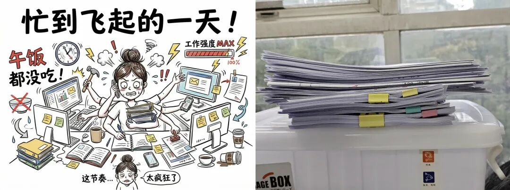
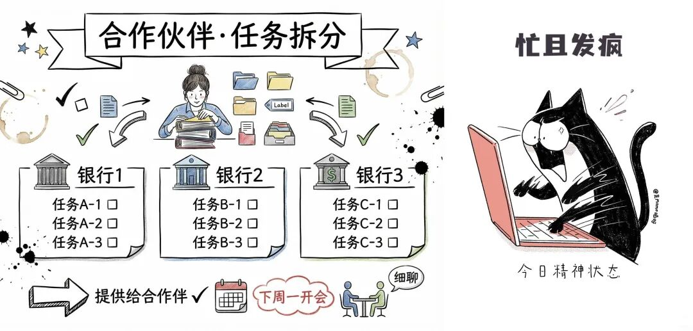
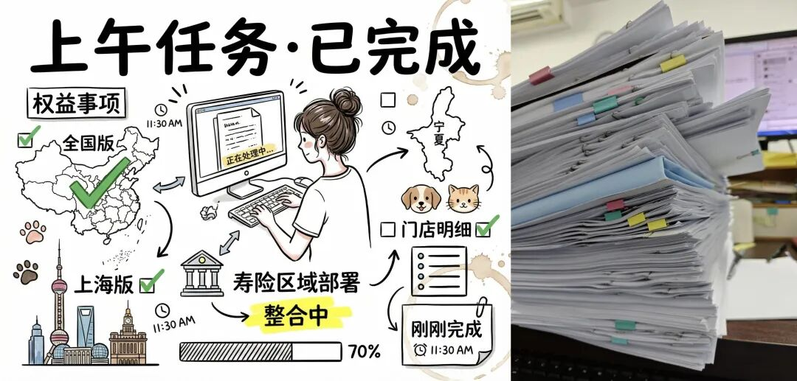
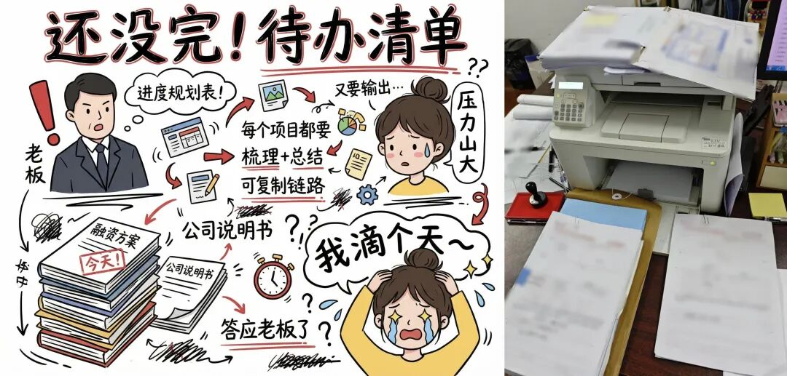
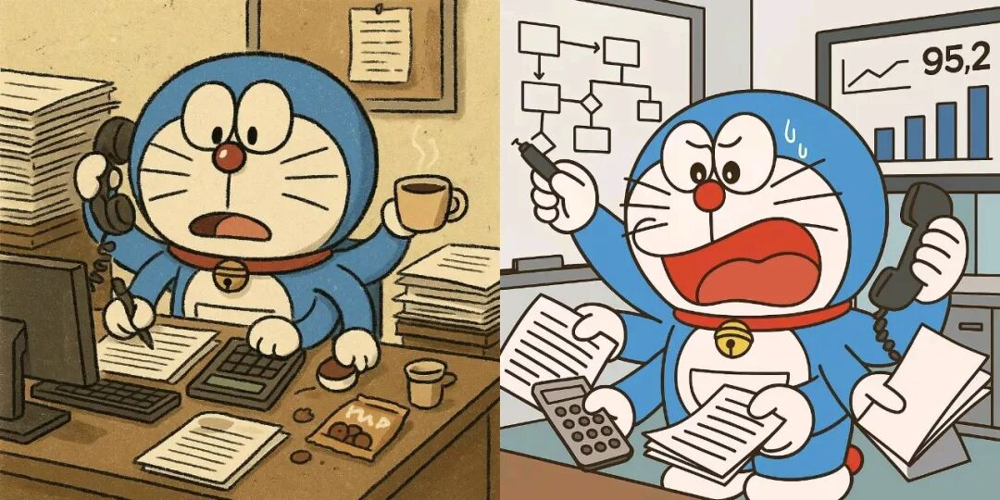

# 为什么现在体制内的人都想着退休，问题出在哪了？

# 为什么现在体制内的人都想着退休，问题出在哪了？

原创 点击关注👉🏻 点击关注👉🏻 田间烟火

在小说阅读器读本章

去阅读

在小说阅读器中沉浸阅读

点击上方

蓝字

关注

田间烟火🔥

大家好，我是【田间烟火🔥】～

今天我们来聊一个经常出现在耳边的话题：“我好想退休啊”，身边的人个个都想着退休，这到底是为什么呢？

体制内上班变“表演秀”，为啥大家急着退休？

大家有没有注意到，最近身边体制内的人总把“退休”挂在嘴边？

谁成功离开了，朋友圈都快要放烟花。

不是大家混不下去，问题在于，上班早就变了味儿。

表面一个个忙得像陀螺，实际上无聊、无力透着一股子荒诞。

为啥想快点退休？

说到底，不是怕工作本身，而是怕干的活没意义。

走进机关单位，三句话绕不开一种气氛，“开会倒是不少，材料管够，流程复杂”。

分工明明细到了指甲缝，结果一到落实，忙的全是些“自娱自乐”。

首先一个是：值班制度。

你以为新时代了这些老规矩该改改吧？

其实现在花样更多，部门值班、科室值班，连假期都停不歇。

啥时候都得在电话旁，三声铃没接上风险警告立到头顶。

有的单位大门紧锁安保不缺，硬是要“编内人员”24小时轮岗。

难怪有新职员自嘲，自己不是上班是“守灵”，领导查个岗，搞得鸡飞狗跳。

有些地方这种值班更多成了一道表面功夫。

大家知道，这么干到底能防什么？

安全感没见涨，倒是心累和假期抵消。

一通电话查岗，留下的到底是责任心，还是推卸推到极致的现象？

01

备受吐槽的工作留痕

自从“留痕管理”成标配，好像凡事都得有记录，有照片，有台账。

乡镇干部戏说，现在办公室的纸和笔花销涨得飞快，厚厚材料档案随时能砌个堡垒。

有会议有留痕，各级活动一个都不能少，材料越多仿佛越有成绩。

可实际有多少时间落在“真落实”上？

只要照片在，热闹场面在，管它底下成效如何。

有部门甚至喜欢给下属派发视频、点赞，转发、“云签到”任务，大家明着工作，背后其实是“小马拉大车”。

每项指标都有人督，每轮评比都要赛，拼的不是谁真把任务做细，反而是谁材料做得最漂亮。

说到底，表演秀气氛越来越足，务实工作却被搁一边儿。

倒不是所有地方都这样。

一些经济发达省份，过去几年尝试流程再造，减少材料检查和流程环节，至少让一线办事员拿出时间专心为业务单位解决问题。

虽然压力没全消除，但反而提升了成效感，也没闹出“人人向往退休”的气氛。

02

越搞越多的形式主义

可问题在很多细枝末节的“形式主义”反而越搞越多。网上培训算是新晋“重灾区”。

每月头几天，很多体制人都变身“刷机人”，网络课程、学习APP，规定时间要打卡，笔记要上传，检查还得“刷分”拼积分。

现在比较有好转了，这一现象。

结果大多数点开就放一边，忙私事或者直接把手机扔到一旁挂机器。

真正用心去听的没几个，倒是各级指导员忙坏了，有领导的考试，干脆下面人代劳应付过去。

问一句，这样的学习到底帮了谁？

也别怪下属心气儿散。领导不少靠“新手法”管理，自己其实没真上阵干过事。

年纪轻、没经验还好高骛远，喜欢各种“主题活动”“考核评比”“排名”折腾人。

过去觉得只要结果说话，现在流程得满档、过程全记录。

抓落实都在笔头纸头，抓细节都在照相机里。

不是夸张，甚至有被考核的单位要定期把本来做得不错的业务反复拆分，只为了每一环都能“留痕”备查。

不少人直言，“只要不触底，不出格，靠混靠拖，总有法子撑到退休”。

反倒是真心想干的，对这些流程折腾头大，到最后不是心灰意冷，就是自嘲“我来混日子”；

混子的学会推诿责任，从来没被罚过还混得轻松。

说好听点，这是为了大局、为群众监督，其实不少基层干部觉得只是增加负担。

每天光顾着拍照、打卡、材料美化，空有形式忙累半死。

效益和创新反倒没人关心，时间和资源被一层层消耗在做表面工作上。

有人回过头来说，十多年前机关里也有应付，但大多数干部还是把实事放第一位。

赶上重活累活，大家帮把手，不会出现忙一天做等于零的事。

现在谁还在乎实际成效？

摊上任务，只要“合规”“合流程”就算完成。

别的行业也有类似情况，以前很多国企搞安全检查、材料审核，也爱走形式。

一度出现过连续三年安全材料优秀，但实际设备和流程没有任何提升，员工觉得就是“写作文”。

后来有公司把检查方式简化，指标精简，才渐渐让大家把力气花在正事上。

可惜体制内系统大，多数地方还卡在“过程导向”里，谁敢轻易不走流程就怕出事背锅。

说到底，形式主义累的不是个别人，是一整套体系。

上面查得紧，领导怕出问题层层传递，基层干部只能卷进一道道流程。

大家嘴上不说，心里就盼着：

啥时候能退休？

啥时候能换出这口气？

身心俱疲成了现在体制人的常态，退休反而成了渴望的出口。

这种气氛，什么时候能改变？

欲望简单到只剩“快点退休”，其实本该是热爱工作和成就感共存的阶段。

真实的故事不是没干劲，是在无休止的“动作标准”中，把人变麻木。

如果你现在也是忙到起飞，连纸巾都懒得去买的话，可以试下这款纸巾👇🏻  

这个怪圈，有没有人能帮着跳出去？

身处基层职场，你是否也有忙而无果的疲惫感？

聊聊你的真实感受～

分享

收藏

点赞

在看

---

原文：https://mp.weixin.qq.com/s?__biz=MzY4NDI4OTA3NA==&mid=2247488884&idx=1&sn=da66a46645e52da228030ce195a6f0db&chksm=f3a76829c4d0e13fea00132f393b568a8e3842e8ae47bd0b7a9caf149638fbd1ff8b288599d8
