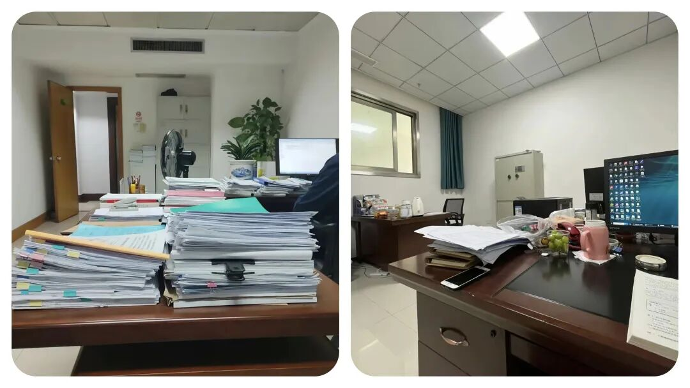

# 为什么“乡镇干部”越忙越乱？这 6 句负面沟通语，建议改掉

# 为什么“乡镇干部”越忙越乱？这 6 句负面沟通语，建议改掉

原创 点击关注👉🏻 点击关注👉🏻 田间烟火

在小说阅读器读本章

去阅读

在小说阅读器中沉浸阅读

田间烟火🔥

点击上方

蓝字

关注我们

大家好，我是【田间烟火🔥】～

我们今天聊一个问题：乡镇工作的内耗，往往藏在几句随口说的话里，你中招了吗？

一天里接十几个电话，群里消息不停跳，外面找你的是群众，里面等你的是协调。

很多乡镇同事说，真正让人心里一紧的，往往不是群众的抱怨，而是办公室里冒出的几句话，像开关，一按就卡住进度。

01

  

“我太忙了，没时间处理这个”

  

  

  

为什么这句话最伤协作？

忙是真的忙，问题在于这句话把门一关，事情就悬在空中了，没人接住，时限在走，焦虑就开始蔓延。

乡镇工作多是链条作业，一个环节说忙，后面就堆单。

更麻烦的是，外部任务有时限，像群众诉求、项目拨付，拖过时间就要解释，解释也要时间，压力叠加，谁受得了？

  

  

改进方向

换个说法和做法。

忙，可以说出具体时间点和优先级，比如今天下午两点前回你，不能接就把联系人抄上来。

不少互联网团队用服务时限提醒，谁接单谁报时，乡镇不必照搬，但共享一张任务清单、标清牵头与截止，也能少走弯路。

02

  

“这事不归我管，你找别人吧”

  

  

  

为什么这句话常见？

分工是对的，推给别人是疼的。

乡镇事多头，土地、执法、民政、经济都有边界，但群众看到的是政府整体，内部也需要有人牵头。

说不归我管，很可能是真分工，也可能是不愿担责，听者分不清，做事的人更乱。

  

  

改进方向

建机制压住推诿。

有的地方在政务大厅推一窗受理，窗口内部分流，不再让群众在部门间来回跑，内部再细分，群众不感知。

专项协同时，专班和临时群也有用，定一个牵头，谁去跑协调说清楚。

说到底，推不推，全看有没有人先站出来把任务接住一句我来牵头。

03

  

“以前都是这么做的，不用改”

  

  

  

这句话卡在什么地方？

这是个常出现的防御句。

既有办法省心省事，改了要学新流程，要担风险，还要和上下沟通，哪有那么多精力。

可政策在变，标准在更新，旧办法不一定合规，也可能早就低效了。

  

  

改进方向

先分场景，再谈优化。

像学校推电子审批，刚上线也有人不熟悉，后来跑签少了，老师学生省事，满意度反而上来。

有些乡镇把低频事项线上跑通，让窗口轻一点，线下留给复杂件，这样改就有意义。

反过来，遇到抢险救灾、食品安全这类硬预案，按既定流程执行更稳，贸然改法反而可能出错，所以不是改就对，不改就错，而是看事情的性质与风险。

04

  

“我觉得这样不行，你重新做”

  

  

  

为什么这句话刺痛人？

时间紧、资料多，方案做出来，一句不行全推翻，返工的不是纸，是人的精力和情绪。

更糟糕的是，没有明确不行在哪，怎么改也不知道。

忙的时候最怕盲改，越改越乱。

  

  

改进方向

反馈要具体，先讲问题点，再约节点，比一句推倒重来更有效。

可以用三步走，先确认目标，再列出三处关键调整，最后确定谁改到什么时候。

有的互联网团队做需求评审，先列问题清单再给结论，这种做法在机关同样适用。

说白了，不要用情绪否定，用信息修正。

05

  

“这是你的错，你要负责”

  

  

  

这句话会带来什么？

乡镇工作牵涉面广，任何一个环节掉链子，影响的可能是群众的补贴、项目的开工、企业的资信。

一句全责在你，背的是压力，也是对努力的否定。

如果问题是多方造成，这种定性会让人天然防御，下次人人都学会避险，积极性就难燃起来。

  

  

改进方向

先止损，再复盘，最后定责。

医院处置不良事件时常用非惩罚性上报，先纠正风险再寻找根因，避免一上来就追责导致瞒报，这思路对公共服务一样有启发。

但也有红线场景，当班漏岗、擅自停用设施这类，明确追责能立刻止损，这时候就要硬。

边界清楚，团队才不会在阴影里工作。

06

  

沟通背后是协作逻辑

  

回到日常沟通，为什么这些话一出现就让人心跳加速？

因为它们把责任、时间、流程切断了，留下悬念与不确定。

忙，是事实，推，是选择，否定，是方式，甩锅，是态度，旧办法，是习惯。

五个关键词，折射的都是协作上的短板。

有没有更好的表达方式？

把忙变成排期，把推变成牵头，把否定变成清单，把旧法变成试点，把定责变成复盘，语言一转，气氛就不一样。

说今天不归我直接办理，但我联系谁谁一起开个十分钟小会，今天定人定事定时。

说这个方案有三处不符合新要求，文末我加了修改建议，咱们按这个表再跑一版。

还有一个常被忽略的点，工具能帮忙。

不少地方上线协同平台，流转、催办、留痕都在系统里，谁接单、谁卡点一目了然，既减少误会，也减少口头上的拉扯。

平时工作里常说的复盘会、周例会，不是形式，重点是把结果和过程讲清楚，把下一步谁干什么落实到人名和时间，这些做法落到基层，也能派上用场。

再多说一句，支持性的语言并不矫情。

像我先去沟通一下口径，我来把资料打通一遍，我把问题列个清单发过来，我们今天把牵头人确定了，这些话能把情绪拉回到事情上。

听起来普通，但在琐碎高压的环境里，就是提气的那一下。

有人会问，压力这么大，口头上的一句话能有多大作用？

作用不在字面，而在后面有没有行动。

一句话接着一个动作，协作就顺，责任就清，群众也能更快看到结果。

说到底，大家都忙，越忙越要把话说对，把事做顺。

少一点“我太忙了”，多一点“几点前给你”，少一点“这事不归我”，多一点“我来牵头联系”，少一点“重做”，多一点“改这里”，走得就更快一些。

有人说“按老办法做事最稳妥”，你赞同这个说法吗？

点赞

转发

收藏

评论

---

原文：https://mp.weixin.qq.com/s?__biz=MzY4NDI4OTA3NA==&mid=2247489620&idx=1&sn=a961a9decde106d8eb3d5bc666f2cf8e&chksm=f3a76509c4d0ec1f7bd38f40e409d6e221326ac8689469f6b3147504ffb9634a185b88869710
