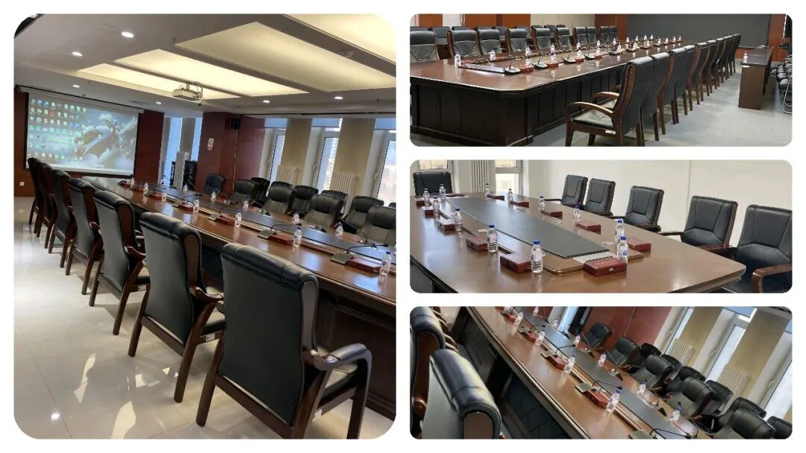
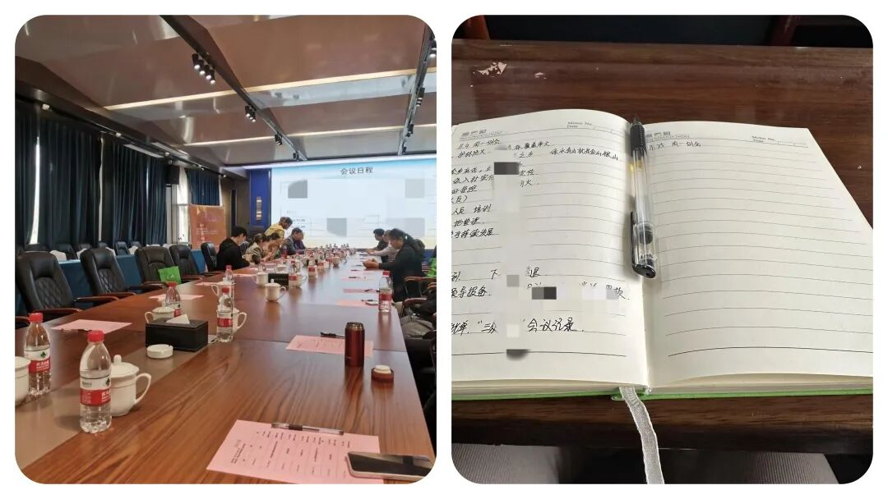
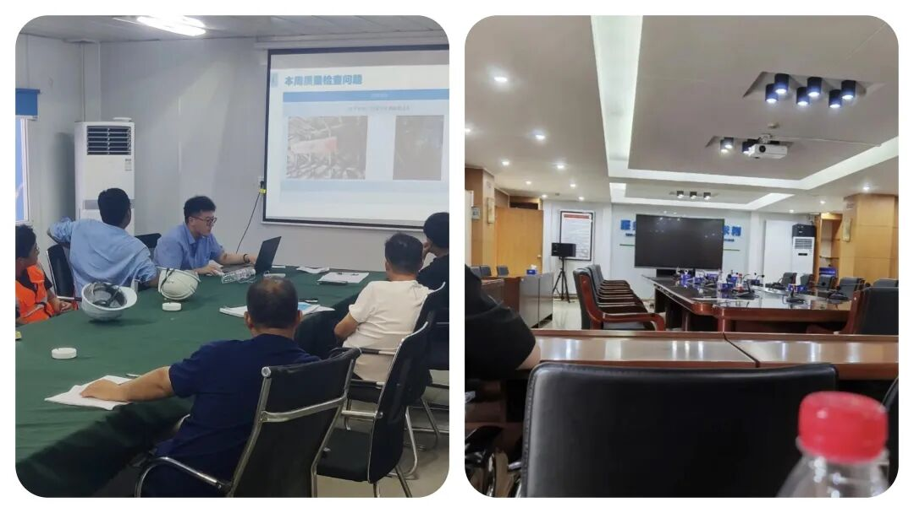
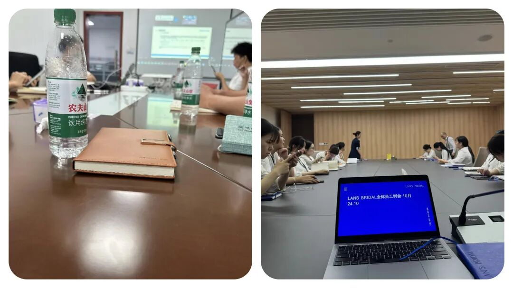

# 为什么单位里的人，都很反感开周例会？

# 为什么单位里的人，都很反感开周例会？

原创 点击关注👉🏻 点击关注👉🏻 田间烟火

在小说阅读器读本章

去阅读

在小说阅读器中沉浸阅读

点击上方

蓝字

关注我们

田间烟火🔥

大家好，我是【田间烟火🔥】～

你有没有遇到这种情况：每到周日晚上总会微信或者钉钉收到群通知：全体成员在\*\*\*楼，9：00召开全体会议....请按时参加！  

不少人一下心情低落，活还没干完，却总是要被拎去听一场似乎谁都能预料内容的例会，而且还要汇报一下上周或者近期工作开展情况。  

有人想，真的不能不开吗，难道这就是现代职场的“例会宿命”？

01

  

周例会的尴尬与吐槽：从无效形式说起

  
越来越多上班族吐槽：周例会逐渐成了无效社交现场。

原因不难猜，很多单位早已把会议变成形式，不管内容合不合用，每周一次雷打不动。

职场时间变珍贵，碎片被会议占去，效率反而拉低不少，怎么让人能喜欢？

不少周例会会出现这些窘境：

-   全员参会，信息五花八门，但其实只关乎那一小撮人的实际工作，剩下的人像看旁观秀，时不时还得做做样子发言；
    

-   明明能在群里两句话交代清楚，非要拉所有人进会议室耗时间；
    

-   流程简单粗暴，部门负责人报流水账，问题没有梳理，阻碍没讨论，最后缺谁配合、需要啥资源全无下文，散会之后啥也没解决，难题不断积压。
    

更让人头疼的是，会议一开容易刹不住车：原定半小时，聊着聊着变一小时，还时不时跑题到无关的八卦，“我再啰嗦几句，我再讲最后两句...”，一讲就是一个小时。

有的人只是想快速搞清楚重点，结果被拖进反复、低效的拉扯。

问题没突破，反倒让大家工作节奏被打断。

02

  

高效周例会的正面参考

  

不过，职场也不是全世界的例会都这样拖后腿。

字节跳动早期推行“高效会议十条”，严格限时、规定参与人选，不重要的干脆群里同步，项目核心、碰头问题才线下讨论。

同一周里，腾讯云原生团队按模块集中复盘，有卡点直接责任人领走落地，半小时清清爽爽，各种“会议焦虑”反而缓解不少。

两个对比放一起，是不是感觉效率可以强到另一个水平？

03

  

周例会本身的存在价值

  

问题在于，大家其实都知道例会有用，对齐节奏、梳理问题，尤其大团队更少不了。

真让团队“各自为战”，没人知道旁边组在做啥，碰到资源撞车，效率掉得更厉害。

集中投入一小时，统一思想、明确分工，能防止埋头苦干却方向乱跑。

很多项目落地，正是靠快速例会动态调整目标，防止目标一变没人跟上。

还有个常被忽视的好处，就是能及时“捞人”：很多细节问题如果一直拖，月末回顾才发现，返工费时不说，项目节奏还容易越拖越难。

把周例会当成“查漏补缺”的窗口，有机会早点修正失误，大家不需要事后狂加班去擦屁股。

04

  

高效周例会的调整方向

  

当然，高效例会并不是只讲流程，关键全在怎么开。

有的单位或者公司，直接用电子流程替换大部分线下沟通，有决策性的事项才开短会。

并不是说不见面团队就会散，更多靠完善的协作工具加持。

但差异也很明显：有的行业比如金融、创意营销，周例会没办法太“电子”，协同、头脑风暴、碰撞需求计划都得面对面。

只有把握好时机和深度，全员才能真正参与进来，不至于像流水线一样走过场。

回到“例会值不值得开”这个老问题，其实从不开不是正解，不开也不见得高效。

真正的关键，是怎么按需高效调整。

很多人现在呼吁“能不见面就线上群报”，其实落脚点都是节省真实可控的时间。

谁也不喜欢被强制拉进一场打卡型会议，没人关心是否目标明确、问题有方案、责任有兑现。

和朋友聊起这个话题时，他讲过自己经历：原来所在公司一到周一10点雷打不动开会，后来有两个月试点灵活制度，能线上群汇报的直接走文字，只有遇到实质问题需要协调决策才拉会。

一个周期后，“会议焦虑”消失了，大家反而敢提建议，效率大大提升。

不过，所有灵活机制都有边界：如果碰上组间风险点多、需要临场拍板，还是得“集合开小灶”并立刻定措施。

就像2022年跨行业新项目并行时，常规同步不足，一旦需求对不上口径，所有人集体“踩雷”。

此时例会成了救火员，帮大家统一视角、定时间表、直面挑战，没有例会反而吃亏。

  

05

  

优化周例会的实操建议

  

怎么让例会不再低效？

有几点实操经验：

-   严格筛选参会人员，谁负责啥问题谁到场，其他人按需同步就好；
    

-   会议定时、不拖沓，内容优先讲关键节点，每人及时汇报问题+预案，摒弃情绪宣泄，坚持结果导向；
    

-   把会上定的内容简单闭环，快速转化成动作，不让会议变成半空中悬着的方案，能几十分钟说清楚的，绝不浪费。
    

身边越来越多人认同，高质量的例会能倒逼自己成长，把每周当成一次业务对齐和学习机会。

如何拆解任务、辨析短板、推动自己主动思考，慢慢也变成积极动力。

说到底，大家怕的不是开会本身，而是强制消耗、没有产出的形式。

职场上会议不是消灭不掉的问题，只要有合作、有目标、有调整，会议就始终有其价值。

关键还是管理者和员工一起优化会议体验，不用死守“形式”，也别迷信全员都要到场。

把每一次会议变得有的放矢，大家的时间才值钱，努力才有结果。

每周一的例会，是你的工作助力还是负担？

欢迎在留言区分享看法～

---

原文：https://mp.weixin.qq.com/s?__biz=MzY4NDI4OTA3NA==&mid=2247489661&idx=1&sn=bddbb92af4fb2f2fe541d30fe617961c&chksm=f3a76520c4d0ec3659e6f5d0dcaaa157b13c8aa1d7f80b18716370d0a5bca11199d41cda9cbe
