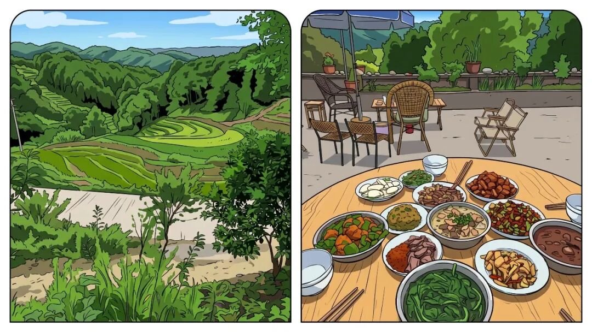
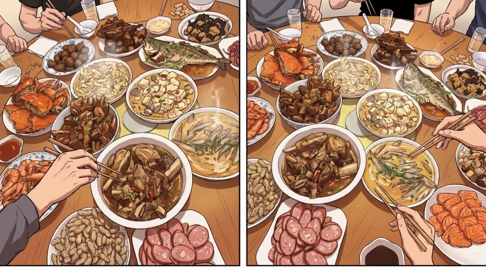
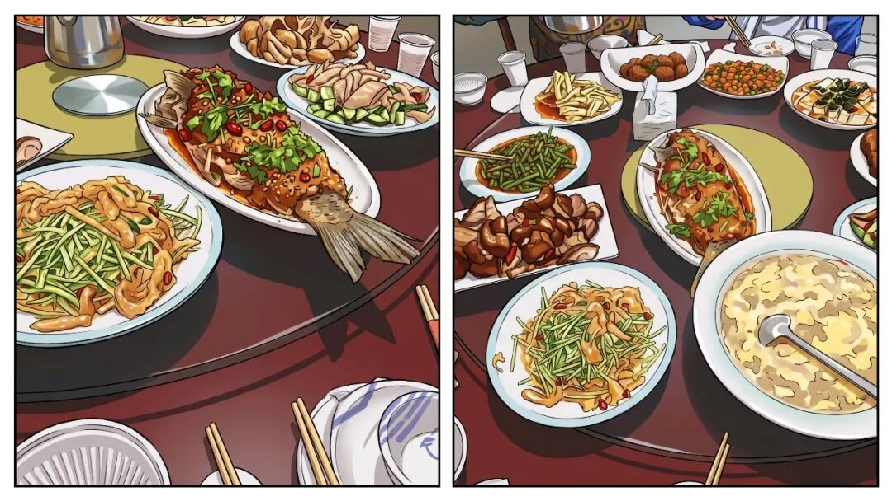
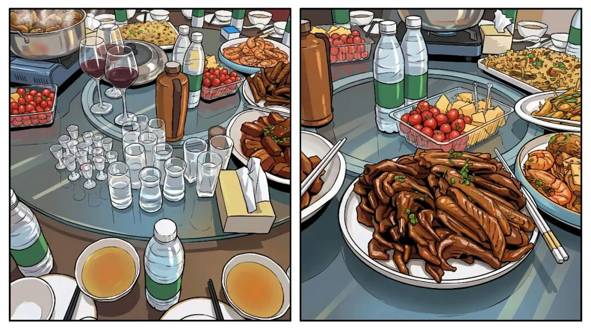
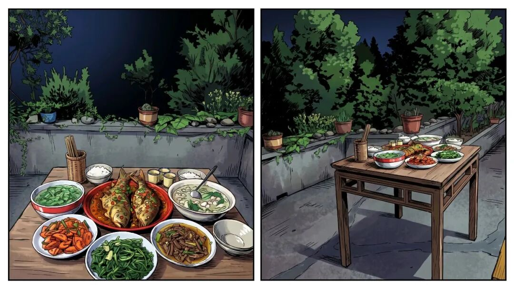
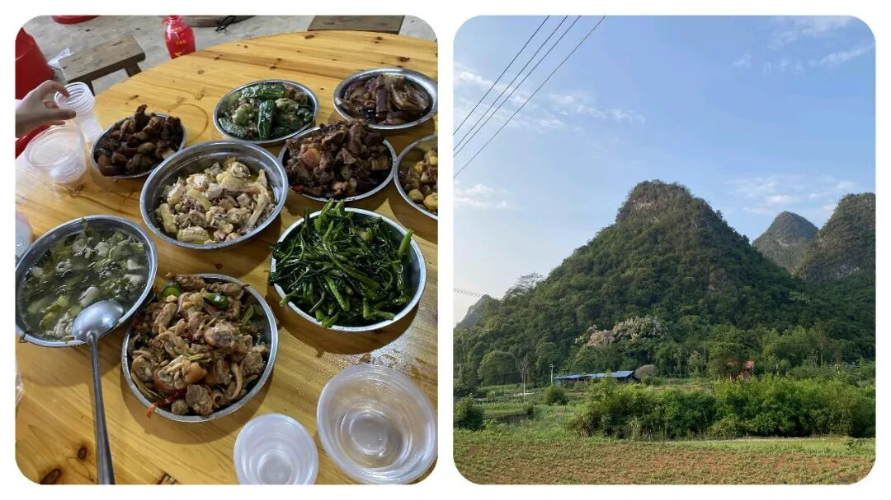

# 为什么“乡镇干部”下村工作，到饭点了受邀也不敢在村里吃饭？到底在怕什么？

# 为什么“乡镇干部”下村工作，到饭点了受邀也不敢在村里吃饭？到底在怕什么？

原创 点击关注👉🏻 点击关注👉🏻 田间烟火

在小说阅读器读本章

去阅读

在小说阅读器中沉浸阅读

点击上方蓝字关注我们

田间烟火🔥

大家好，我是【田间烟火🔥】～

大家有没有发现一个现象变少了：平时在外面吃饭或者在谁家里吃饭，在村里吃饭随便一坐就是开吃，到现在有人招呼“吃个饭再走呗...”，现在一听到这个，乡镇干部跑的得比兔子还快！

晚饭时间临近，乡镇干部进村办事，却没了那股“饭点聚一桌”的味道，正好有人准备去采买食材，大伙儿还没反应过来，车子已经开出了村口。

问起来，答案格外简单：回乡镇上吃饭更安心、压力小，还不用琢磨会不会被谁盯上。

01

  

基层“吃饭文化”的转变

  

这几年基层“吃饭文化”在变。

之前但凡正午饭点，村里接待干部，主人、客人围坐一桌，开饭才能算礼数周全。

哪怕山路远、交通不便，来客要赶回去吃，村干部还会劝：家常小菜，聊聊情况，大伙儿多亲近亲近。

现在呢，规矩变了，招待成了敏感事，能不吃就不吃，见面谈完事，食饭各管各的。

02

  

转变的背后原因

  

  

  

规避舆情与纪律风险

原因大家想想都知道，现在自媒体和智能时代。

和过去不同，现在手机随身，谁都不想饭后一条朋友圈、微信群照片惹一身麻烦。

村里招待乡镇干部，虽然说得过去，但难保没人想多了，事后再查还得解释半天。

碰上拍视频存证，一顿热情招待平白多了多少风险？

说到底，有没有违规没人真关心，被揪出来总是说不清道不明。

  

  

两元工作餐的示范

有一回，一个村办的活动，乡干部坚持不在村吃饭，理由很直接：乡里食堂标准价，两元钱的工作餐，吃饱还吃得放心。

相比村里，乡里饭菜清淡规律，没人挑刺。

村民虽觉不得劲，但都说小心驶得万年船。

03

  

各地的普遍转变

  

这个转变，其实各地都有。

前几年，有座南方县城推动“清廉食堂”，干部外出归来统一在机关用餐，工作餐简单，但透明公开。

相关通报一出来，村镇招待快停了。

饭桌上的“联络感情”慢慢让位于“事后再说”，办事别掺杂太多私情。

有时也有特别情况，碰上连轴转的下乡检查，离乡里几十公里的村头，时间紧，乡干部只在村里简单吃碗面，现场贴上菜单和付款记录。

但每个人心里也清楚，这只是特殊例外，位置近、规则明，大家心安。

乡镇干部怕被人“盯梢”，有人觉得太小心，有人说这是职责所在。

现在的现实是，一个不留神，照片传上网、“哨兵举报”机制介入，本来一分正事也没耽误，最后却成了被查对象。

这份压力让不少基层干部怕管饭式的“人情往来”。

和过去那种“饭桌谈心”摆开场面的热闹相比，如今干脆不碰红线。

狠狠克金了。

04

  

工作与饭桌文化的整体变化

  

工作习惯在变，饭桌文化也在变。

办完事一拍即合，各自返回；

“见饭招待”改成留办公号码、加微信。

做法简单多了，也少了芥蒂。

对比过去，干部们常说：以前村里酱牛肉、家常烧菜，确实味道鲜，现在更看重清爽利落，省事省心。

类似的变化不止在乡村。

有的城市机关推行自助餐厅和扫码结账，减少公务接待，这些措施让基层干部减轻心理负担。

还有些区县尝试“会议期间一律盒饭、公务出行自带干粮”，虽说简单了些，但工作氛围轻松许多。

05

  

转变中的待协调问题

  

但不是所有人都习惯。

有的老乡有疑问，乡镇干部来一趟，连面都不愿意吃，怕被说成“冷淡”。

有少数地方还出现“走秀式下访”，表面上避免吃饭，实则私下聚餐，反而更容易引发误解。

这提醒每个人，制度变化得有温度，关系也不能全拆断。

村干部嘴上说没事，心里多是“别让人家为难”。

见到乡干部走得干脆，体谅对方不愿惹事，有感情的只能移动到工作日常里头。

很多新老乡亲也说，效率提升了，关系未必见得淡，人心有时候不是靠饭桌拉近的。

〈文中插图仅供阅读，无不良引导，请勿对号入座〉

  

06

  

人情与规则的平衡

  

人情与规则之间，平衡越来越重要。

干部回乡里吃饭成常态，一线工作少了负担，也少了饭桌上的纠结。

以前习惯的“边吃边聊”，现在变成了“边走边办”。

大家都清楚，工作规范、少一点闲事，对村里、对干部都好。

归根到底，真实情况各有差别。

山区、边远村落，偶有“工作简餐”解决温饱，改不了全局。

政策变动下，主流还是吃好自己的饭，心安理得，别让饭桌成绊脚石。

其实，无论怎么操作，关键还是把正事办好，让干部、村民都能安心办事。

你觉得取消村级招待饭，是拉近还是疏远了干群关系？

评论区聊聊你的亲身见闻～

分享

收藏

点赞

在看

---

原文：https://mp.weixin.qq.com/s?__biz=MzY4NDI4OTA3NA==&mid=2247489826&idx=1&sn=88426d07a6bee5153dc4bcd26d190de2&chksm=f3a7647fc4d0ed693d0eba2340d0d88978aef317b234dada912ebe5f9bc42f22008d63312f42
