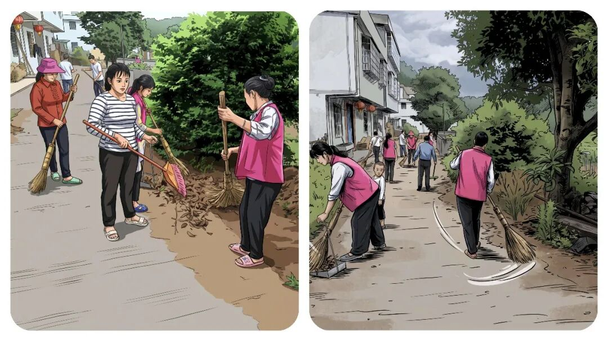
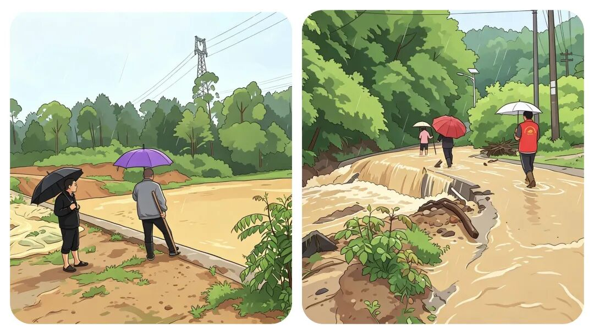
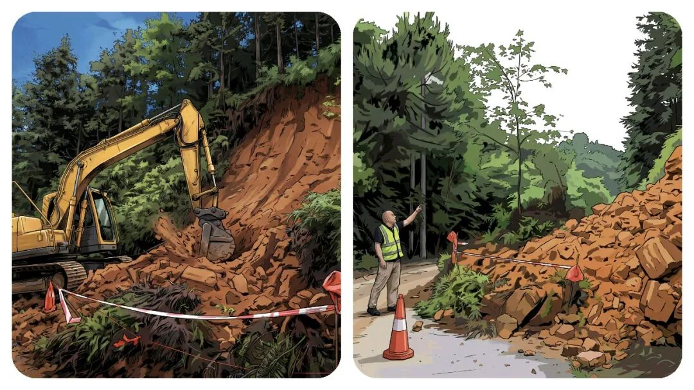
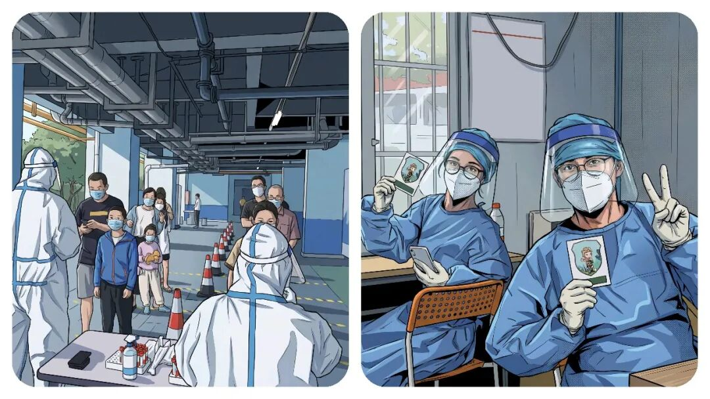
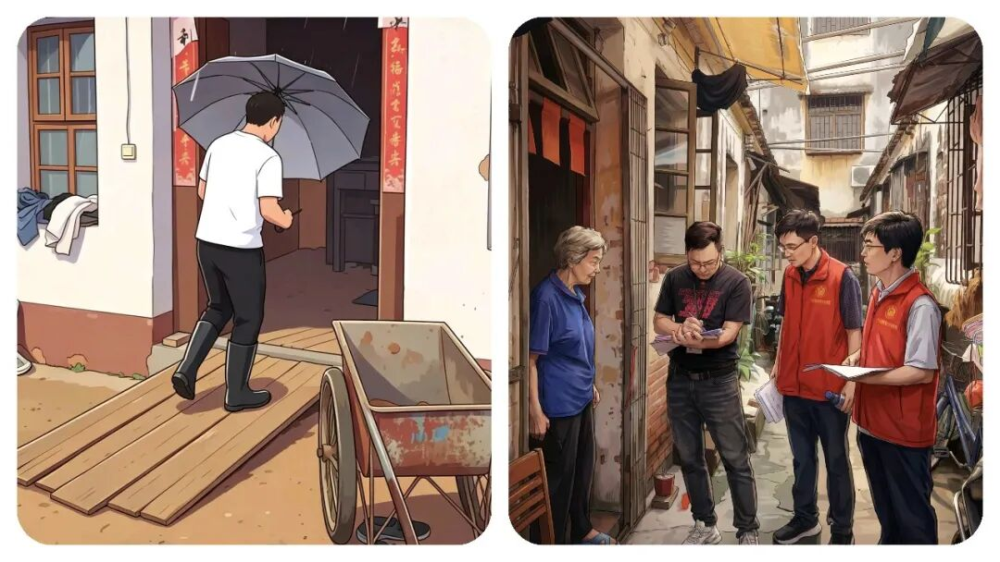
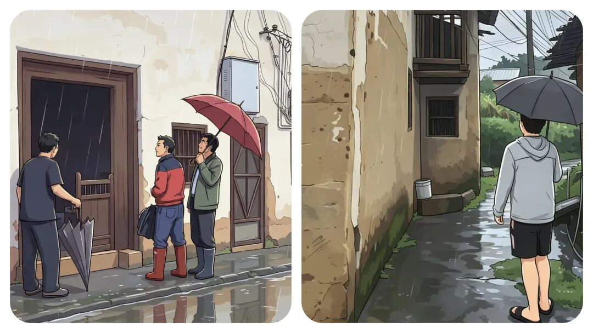
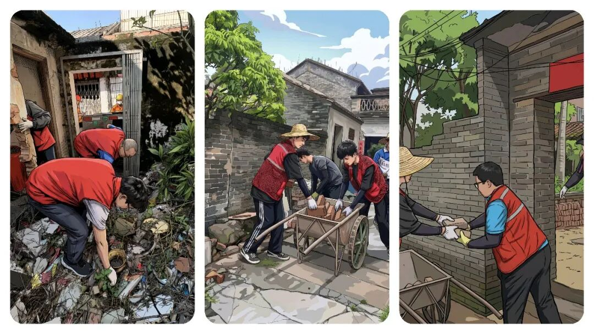

# 你真的了解“乡镇干部”吗？他们到底是干什么的？答案，比想象中现实。

# 你真的了解“乡镇干部”吗？他们到底是干什么的？答案，比想象中现实。

原创 点击关注👉🏻 点击关注👉🏻 田间烟火

在小说阅读器读本章

去阅读

在小说阅读器中沉浸阅读

点击上方蓝字关注我们

田间烟火🔥

大家好，我是【田间烟火🔥】～

不知道问过多少人，乡镇干部是干什么的？

路边聊天，常听人吐槽，说这些干部粗糙、不懂文明、爱吃拿卡要，整天无所事事。

这种评价，从网络热议到一些影视作品里，总有点偏冷和刻板。

但真要你换个角度，看看他们的日常，会不会想法有点变？

事实真的像他们“八卦”的那样吗？

来，接下来，我带你了解真实的乡镇干部！

  

01

  

乡镇干部的真实定位

  

环顾基层，乡镇干部其实是行政体系里的最末端，俗话说“上面千条线，下面一根针”，这些人是那根针，啥事都往他们身上压。

理论上，他们得对所有上级说行，对各级指令照单全收。

不管有多难、行不行，任务到了乡镇，答案只有一个：执行。

很简单，也很现实。

02

  

身兼数职的万能砖头

  

可光是服从还远远不够。

大多数乡镇干部得身兼多职，今天是“治安管家”，明天要变“安全宣传员”；

上午刚帮忙调个纠纷，下午又得巡河、巡田护路，还得当文明新风的推广志愿者。

一个人往往得顶好几个岗位，哪里缺人往哪里充。

没有哪个环节允许他们“不会”或者“不做”，只要任务下来了，谁都能自觉换上“马甲”，上阵就走。

说白了，这类干部就像砖头，随时随地往最需要的地方搬。

03

  

首当其冲的压力承担

  

出了乱子，乡镇干部是首当其冲。

辖区遇到意外、事故，问责铁定先找他们。

有时候，上级手头棘手的活，推不动就直接甩来，“本地负责、谁出事谁担”，再加上量化、倒排、考核联动，最后，压力全摔在最底层的这群人头上。

到头来，大家都知道问责是铁规，谁还敢有二话？

“干就完了”。

04

  

关键一线的逆行坚守

  

说他们是逆行者，一点不夸张。

疫情防控那阵子，乡镇干部初二就集合，不等过年，直接开工。

白天跑村口设卡，晚上走家入户查访。

一些防护衣、物资根本配不上，他们硬着头皮干。

有的同志一整天在户外值守，没顾上吃一口热饭，在冷风里随便扒拉两口。

所以，市县政策怎么落地、村里如何真执行，靠的还是他们没日没夜地转。

环保污染治理，大家都说环保是个苦差事。

你以为没人愿意过年上班？

但到了乡镇，干部往往是放弃休息，节日坚守一线。

有的县区，春节期间为了保证环保污染治理任务，一半镇村干部连续工作十多天，自己家桌上的饺子，年夜饭都没顾上动筷，等着他们的只有一个简易工作餐。

有的甚至是自己掏钱加班，调车巡查。

外头看是数据、指标，背后是人。

05

  

不为人知的隐性艰辛

  

还有个隐性的“苦”字。

很多乡镇干部常年下沉，夏天一身汗、冬天一身泥，火力全开。

中午连饭都顾不上吃，煮包方便面、啃几口凉馒头，走村串户一天跑几十公里。

晚上回到办公室，还要整理材料，常常一觉醒来，发现夜班还没结束。

遇到征地款没钱发、优抚帮困没经费，得自己想办法筹，跑上跑下凑预算，到手的工资，换来的只有一身疲惫和夜里刺骨的风。

相似的表现实在不少。

有的地方推进乡村治理中，某镇副镇长半年吃住在村，甚至自己亲人去世都没能马上回家。

据说他一句话让村民记了好几年：

“家在这，村里事最紧命”

有同事说，这样的坚守不是“干部像”，倒像是“家里壮劳力”。

其实他们的工资算不上高，有时候还要自己贴点成本。

06

  

外界的刻板误解

  

有人反问，“你们不是国家干部吗，怎么连基本的休息权利都没有？”。

也许很多人想象中的干部像城市机关一样，西装革履、空调房里喝茶办公。

可乡镇干部却常在泥土里忙上大半天，人手不够还得自己扛工具开沟巡河。

遇上下雨台风，帽子湿透、鞋进水也不能停；

村里有事，群众直接找上门来，抱怨、发脾气，甚至都骂出口了，干部也只有低头哄着解决。

他们还有点像“讨生活的人”。

财政钱紧，各项工作都伸手要资金，光靠上级拨款远远不够。

不少干部不得不找企业拉项目、联系社会捐赠，甚至省吃俭用凑一笔应急款支持民生。

下轮新任务一来，疲惫还没缓过来，他们又要重新开始四处张罗了。

07

  

客观看待存在的问题

  

不过话得说回头，有些地方也出了偏差。

有的乡镇干部确实出现不作为、吃拿卡要的现象，甚至有一些人还“躺平”。

我记得在网上看到过，被暗访曝光，有基层干部“打酱油”式混岗，群众投诉办事拖沓。

这也不是全然清白的行业。

但这类现象已经成为红线，近年加强了考核和巡查，处分问责都在加码。

大家真实状态，其实大多还是奔忙与坚守齐头。

08

  

基层的新风新变化

  

有的基层近两年推行多岗合一，“一人多岗”模式大大缓解了人手紧张，部分年轻干部自愿扎根基层，越来越多90后走进乡镇，不光有冲劲，也带来了一些新风。

有人感慨，现在的乡镇干部，正一点点扭转外界印象，从“老气横秋”变得有责任，也更接地气。

09

  

结语：一公里的实干与坚持

  

我们到底该怎么看待呢？

一句话，这群人虽说不完美，身上时刻揉着泥土、汗水，也难免有疏漏。

但绝大部分乡镇干部，确实是在替政策“落地”，为村里一件件琐事奔波。

他们的生活与艰辛，或许不如新闻和大片里那样光鲜，更多是平凡和无声。

村里基础如何改善，乡村治理能不能实实在在，就得靠最后这一公里的实干与坚持。

你听过对乡镇干部最大的误解是什么？

评论区说句公道话～  

分享

收藏

点赞

在看

修改于

---

原文：https://mp.weixin.qq.com/s?__biz=MzY4NDI4OTA3NA==&mid=2247490179&idx=1&sn=4bd71700e69f4c3305b499df52e712a7&chksm=f3a767dec4d0eec8b8f8b7cbde901160a32abe14b773abaa82c70c0e43f50f45e06e39a41ed6
