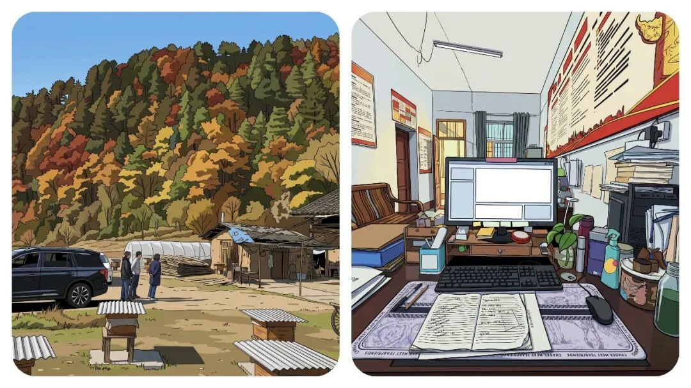
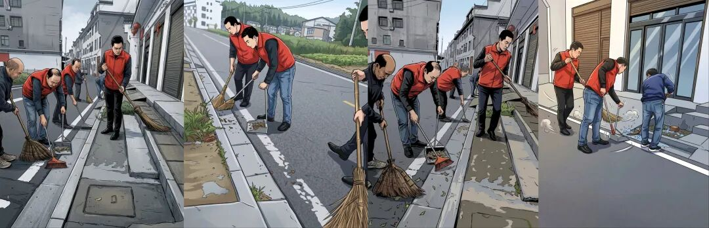
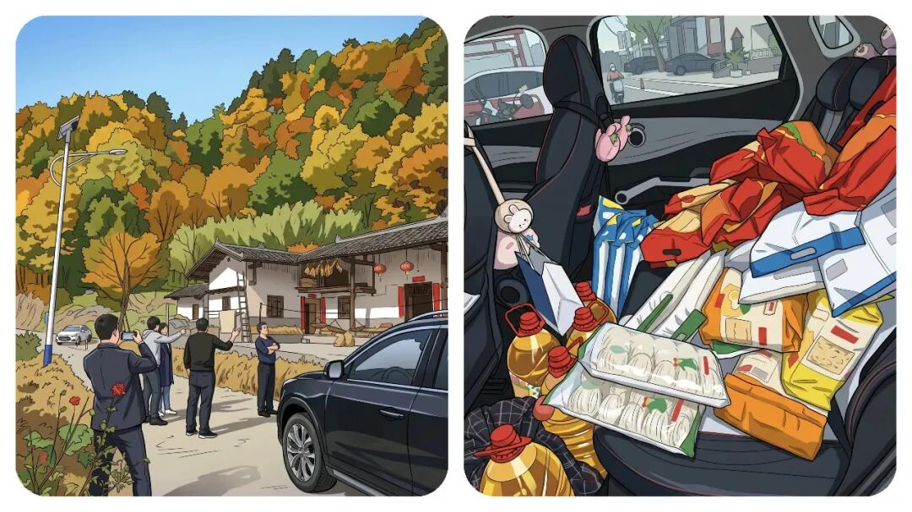

# “乡镇干部”下村工作，到底开谁的车去？答案，比想象中现实。

# “乡镇干部”下村工作，到底开谁的车去？答案，比想象中现实。

原创 点击关注👉🏻 点击关注👉🏻 田间烟火

在小说阅读器读本章

去阅读

在小说阅读器中沉浸阅读

点击上方**蓝字**关注我～

田间烟火🔥

大家好，我是【田间烟火🔥】～

我相信在乡镇工作的人都知道，公务员有车补，而事业编没有车补，但是为什么普遍现象是：“下村开展工作都在开“事业编”的私车”。

干部要下村干活，谁开车、开什么车，开谁的车、出了事谁担责，这几个问题天天绕着走，绕不开。

01

  

下村用车的现实困境

  

  

  

公车不够用

乡镇几十号人，手里的车屈指可数。

国土所也许很多地方都有专车不假，县里也配了巡逻车，看着不少，用起来就卡壳。

司机优先服务领导，工作组要入户、核查、巡田巡河，临时喊司机开一趟，下口子难。

有人干脆自己去开巡逻车，问题来了，单位车规矩多，没授权不能动，真开了出点刮擦，谁签字维修，谁背账，通常扯皮一大片。

更麻烦的是，巡逻车车况常年吃不准，跑村道抛锚了，耽误的是整组人的进度。

  

  

任务不能推

没有车就不用下村吗？

想想也知道不行。

任务完不成，年底考核拿不到优秀，绩效奖也要打折。

入户排查、低保核查、走访监测户、图斑核查或举证、地质灾害排查，环保督察巡查等这些活都是人盯人，躲不过去。

那就开自己的车吧。

大多数干部最后都这么选，省事，还能说走就走。

可车是自己的，油钱电钱是自己的，风险也是自己的。

有时候，一名干部为了躲一只小鸡，车掉进阴沟，车损小到没到保险起付线，修车几百块只能自掏腰包，心疼也没办法。

还有更现实的，一些包村距离十几二十公里，一周要跑几趟，算下来油费顶掉一周工资，干着公家的活，花着自己的钱，这心里能不打鼓吗？

有人会问，没有“车补”吗？

是，有。但是不是事业编的人有。

大多数乡镇事业编是没有这车补待遇，事业编为主的地方就更明显，制度上没有这个口子，下村干活自己扛。

油费、电费、维修、保养，算到月底，比谁都清楚。

  

  

风险没人担

私车公用，出了事先看个人保险。

起付线以下的全自己负责，超过了也要担心第二年保费上浮。

公车违规使用，一旦有事故，流程上还得追责，驾驶台账一对，麻烦事一串。

说到底，是出车人承压，没人愿意踩线办事。

02

  

各地的尝试和痛点

  

有没有办法？

一些地方开始摸索。

  

  

公车平台申请

有人搞公车平台申请，用车像打车一样，手机上排队，司机轮换值班，出车有单有据，有目标，有时间。

这种办法在市区街道跑得还顺，但放到乡镇，一天几十个入户任务叠加，路远沟深，平台的车排不过来，往往还是慢一步。

  

  

定向用车保障

也有的地方县里给驻村工作设了定向用车，固定司机和线路，保障重点时段，工作组不再到处借车。

  

  

配置电动车辆

有的城市给网格员配电动车和意外险，电池有补贴，坏了有维修点接单，日常巡查不至于掏腰包。

这个做法对城镇社区合适，距离短，密度高。

但乡镇跑十几二十公里，带着三四个人入户，电动车就不现实了，安全性也过不了关。

  

  

打车报销

也有人说，干脆打车报销行不行？

想啥？下村打车？

个别地方试过，限定里程、限定时段，发票统一走平台。

有报道说，短期内比养车省事，账目清楚。

但村路不好叫车是硬伤，手机上能叫来的，多半止步在乡口，最后还是要靠自己开到村里。

  

  

公车调度的新问题

那公车够了是不是就万事大吉？

有听说，某乡镇把巡逻车集中给河长办，汛期巡河要求频密，其他组一车难求，人手再多也跑不开。

节后巡河降频，巡逻车闲置多几天，但保养、保险照样花钱。

车有了，调度不到位，也会变成新的堵点。

还有一个隐性成本，谁来背时间损耗。

单位司机开一趟，往返就得半天，领导有安排随时要人，普通干部临时要车，排不上队；

自己开车，流程省了，可遇到乡道堵点、遇到突发情况，回头还要写情况说明，几乎每组都遇到过。

03

  

解决方向和基层探索

  

说到底，最难的是把责任、成本和效率摆在一条线上。

有人主张里程制报销，按公里数发补贴，上限封顶，既有边界又有激励。

有人把车辆集中管理，建立维修基金，刮擦和小修走基金，不让一线干部来回跑账。

还有地方统一给一线人员买出行意外险，至少把人身风险兜住。

听起来都不复杂，落地却常常卡在预算和流程上，谁批，批多少，怎么验真，这些都是细账。

那基层自己能做什么？

不少工作组开始自我协调，几组拼车走线，先跑最远的村，再回过头处理近点的入户，尽量一趟干完。

不少地方也在摸索巡逻车的授权制度，短时授权、归位验车、行车记录留痕，出了事有账可查，没事不怕担责。

还有人主动把路线和路况做成清单，集中反馈给镇里，修一段、通一段，减少抛锚和事故概率，这些小动作，反而最管用。

问题还是那个问题，下村是日常，车是硬需求。

公车少、没司机、没专车、私车贵，这几块挤在一起，哪块都难挪。

趋势上看，平台化调度、定向保障、里程补贴、意外险兜底，这些办法组合起来，能减一点负担。

但差异也很明显，城镇好用的办法，放到乡镇不一定跑得动，有些山区信号不稳，平台预约一到山坳就断线，结果呢，还是人盯车、车盯任务。

一句话，别把下村当成脚力活看，先把车、油、险这三件事想清楚。

干部愿意跑，也愿意把活干细，但路上这点成本和风险，不能一直让个人扛。

把钥匙和账本理顺了，很多矛盾就顺了。

你们乡镇日常下乡是开公车还是自开私车？

每月油费大概要贴多少？

评论区聊聊实情～

分享

收藏

点赞

在看

修改于

---

原文：https://mp.weixin.qq.com/s?__biz=MzY4NDI4OTA3NA==&mid=2247490233&idx=1&sn=d0c252732174165f55820c1da4d1a05a&chksm=f3a767e4c4d0eef22e14fa2c5b157cc7e64b9bb12cc79749228e8367bdef338790502034dbd8
