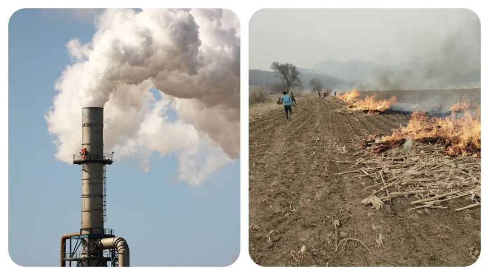
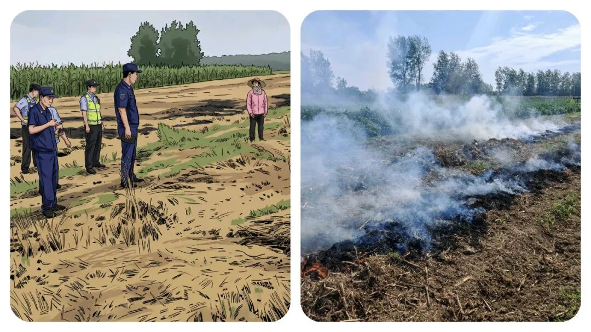
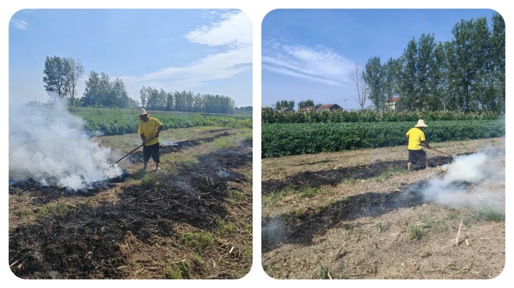
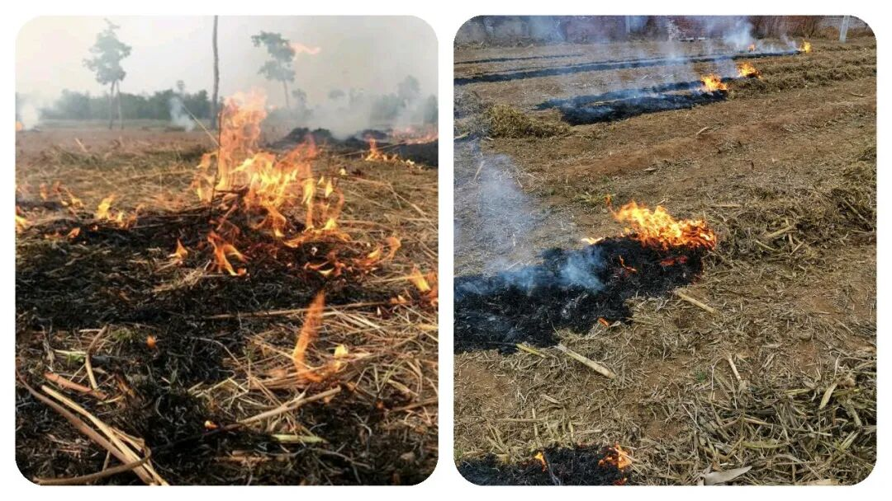
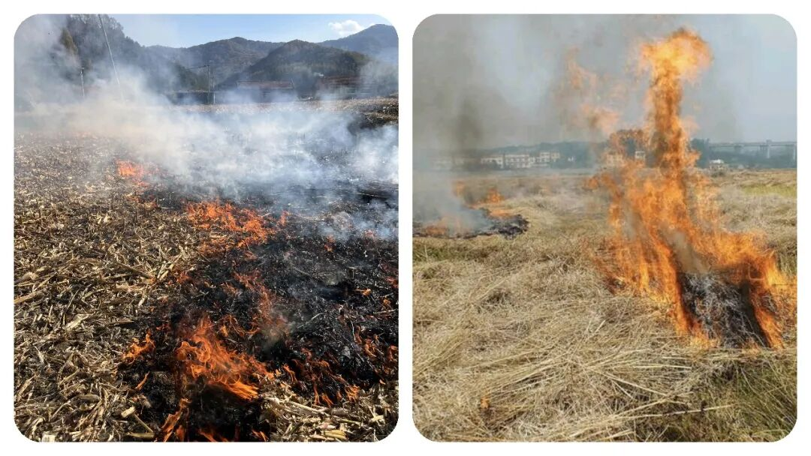

# 为什么乡镇要开展“秸秆禁烧”工作呢？到底该不该管？如何管？

# 为什么乡镇要开展“秸秆禁烧”工作呢？到底该不该管？如何管？

原创 点击关注👉🏻 点击关注👉🏻 田间烟火

在小说阅读器读本章

去阅读

在小说阅读器中沉浸阅读

点击上方蓝字关注我们

田间烟火🔥

大家好，我是【田间烟火🔥】～

我相信【秸秆禁烧】这4个字，在乡镇工作的朋友，应该可以说是非常的熟悉，也可能是每年春秋季最头疼的工作之一。

今天我们就来聊聊这个话题：“秸秆禁烧年年抓，为何田间依旧浓烟四起？到底该不该禁烧呢？又如何做呢？这是一个非常具有争议的话题。

每年春秋，北方广阔农田里的烟雾总能让人皱眉，大家都知道源头是什么——焚烧秸秆这事老生常谈。

可你真问一句：为啥明明政策连年升级，现场照样黑烟滚滚？

查查周围，有些地方距离机场、高速只有几百米，偏偏还是看得到明火，甚至航班都不得不备降、取消，一片混乱。

这到底是环保难，还是管理跟不上脚步？

01

  

政策落地难在哪

  

说起来，文件发得不算少，法条也新鲜刚出炉，《生态环境法典》明确了禁烧区和限烧区，照理比“一刀切”科学不少。

命令写明了，红线划好了，真能落地执行了吗？

有人觉得农民一定知晓政策，实际上，有些地方的干部根本没跟村民讲透，“到底烧不烧”“具体烧哪块”、“哪片田有窗口期”没说明白。

这就像工地分工，图纸没交底，干活靠猜，还能不出篓子？

  

  

监管存在明显空档

转头看看监管现场，尴尬的情况更直接。

机场旁边，农田里火苗直冒，哈尔滨机场去年因为雾霾导致48个航班备降、172个取消，这谁心里不怕？

可记者蹲五个月，发现关键时段基本没人看守，这就是典型的“空档期”。

表面上条条框框，实际上有些地带没有盯防，连临时指挥小组也没影子。

你说事因小失大，倒不是危言耸听，真出了大事，追责麻烦谁来扛？

  

  

农民有实际生产难题

但问题也不只在监管。

有农民直说“不烧咋种地”，这里面可不是敷衍几句能带过。

主要有两难，一是秸秆离开地的成本高，二是收了又不知道往哪送。

一些地方，搞有机肥或者牲畜饲料的厂子收不完这些秸秆，渠道堵住了，农民收割、装运、转运全靠自己，机器租赁、人工费用一套下来不划算，干脆现场点一把图省事。

就算政府有过补贴，手续麻烦、落实慢，还是堵在环节里。

有意思的是，别看北方农区有这个难题，南方部分地区却逐步减少了类似问题。

有的地方几年前就推广秸秆离田大工程，敦促企业做原材料回收，再结合补贴到户的操作，烟雾情况明显缓和，说明思路对路了能起效。

反过来看，一些大粮仓省份，虽说技术推广喊得响，但基层执行没跟上，露天焚烧依然抬头。

02

  

现有探索的得与失

  

科技也算个出口。

其实现在有不少地方在试验新招数，比如用秸秆提炼石墨烯材料，100公斤秸秆能出10公斤石墨烯，这项目不只是个新闻，是真能拉动上游产业。

现在科技发达了，用卫星遥感监测，哪个村、哪块地有火点，可以及时推送到乡镇干部手上，理论上管控压力能减小，关键得看有没有人真去核查和处置。

不过，也不能说每个地方都一团和气。

有的县区把环保指标看得比什么都重要，明面上零容忍，实际私下睁只眼闭只眼，甚至临时组织应付检查，一走了之。

这种“只管考核不管根本”的态度，带来“露头就打、检查一过又烧”的怪圈，还没解开。

03

  

问题根源在哪里

  

秸秆焚烧带来环保污染，大家都清楚。

但它更刺眼的地方还在农业结构和社会治理上。

现在农田劳动力老龄化，年轻人外出打工多，留下的老人图方便省力；

农机合作社不愿承担风险，宁肯跟风观望。

这种实际困难，单靠政策“下发”解决不了。

说到底，最核心的障碍不在技术和法律，而是基层管理。

如果干部能常下地，和村民聊明白，把禁烧的尺度和窗口期解释清楚，再配上科学回收和合理补贴，农民没动力违规。

偏偏部分基层喜欢坐办公室，开会比下地多，落到末端成了一纸空文。

还得提一点，并不是国家不想花钱。

有些地方投入不小，试点不少，结果一环没接上，养了一批只会统计的队伍。

投入和产出没形成闭环，烟照冒、账照亏。

对比其他地方，经济开发区，倒是通过财政、市场合力，把秸秆变废为宝。

要是真图省心，农民少干、企业多赚、环保也清洁，是不是更划算？

04

  

解决问题的核心

  

简单说，秸秆焚烧这个难题，绝不是禁令贴墙就能解决的问题。

谁能把监管、服务、技术和农民利益一块捋顺，谁就管得住火、守得住蓝天。

不只是等督查来了临时加班，也不是遇事就罚款了事，要想根治，还是得落在“有人真懂、有人真盯、还有利益出路”这三点上。

风烟滚滚的田头，背后其实是制度执行力的一道考题，答案从来不只是喊口号。

不少地方的经验教训说明，只要想办法打通利益链条，真把田间地头看成责任田，不让治理变成纸上谈兵，那些浓烟才可能真的消散。

你怎么看待“秸秆禁烧”工作？

欢迎留言聊聊～

分享

收藏

点赞

在看

---

原文：https://mp.weixin.qq.com/s?__biz=MzY4NDI4OTA3NA==&mid=2247490634&idx=1&sn=18f2af85569eacc3c17d4e079f5f7266&chksm=f3a76117c4d0e8019aee7a6850e4c07a1dcdea19b065a48e23b845acc318bdf67c9b72b9c951
