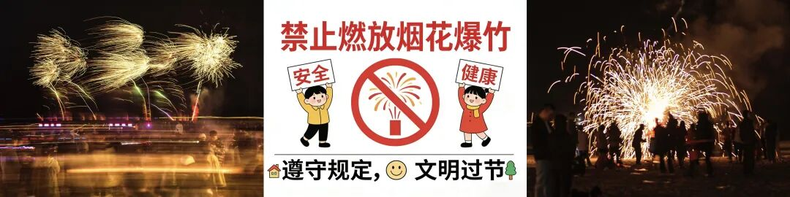
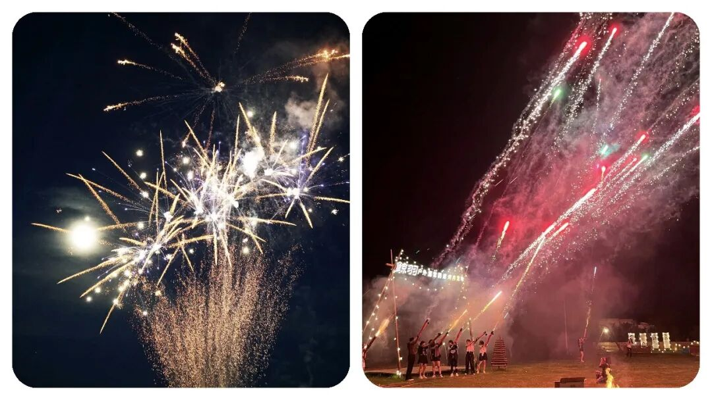
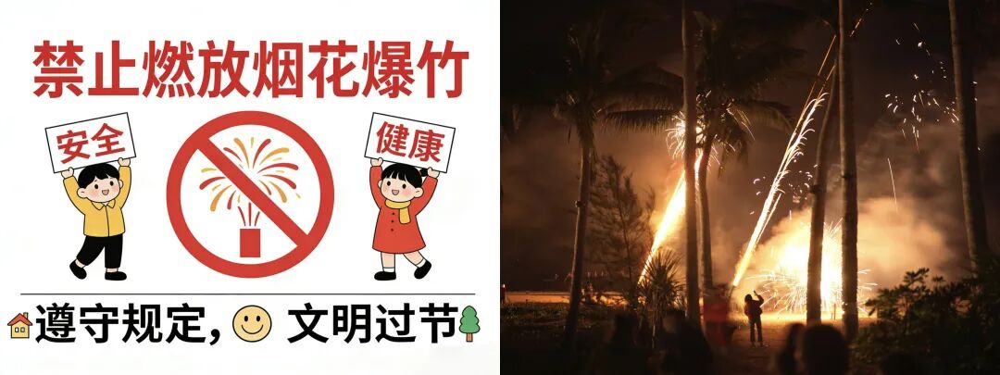
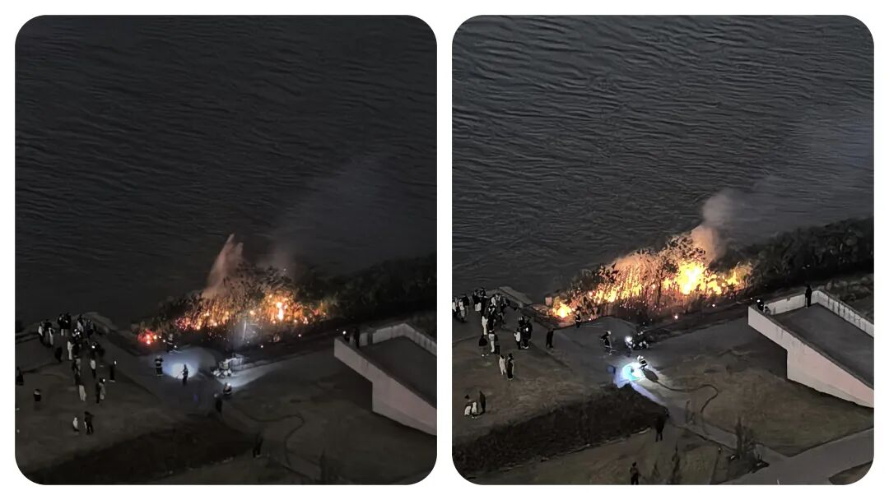
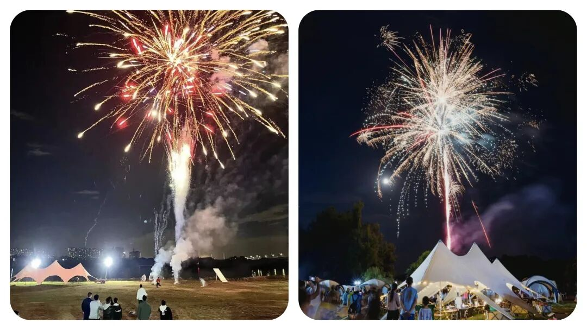
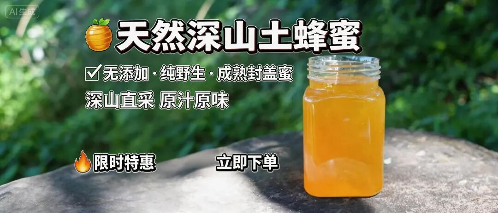

# 为什么城市农村都要“禁止燃放烟花爆竹”？到底该不该禁？怎么禁？

# 为什么城市农村都要“禁止燃放烟花爆竹”？到底该不该禁？怎么禁？

原创 点击关注👉🏻 点击关注👉🏻 田间烟火

在小说阅读器读本章

去阅读

在小说阅读器中沉浸阅读

田间烟火🔥

大家好，我是【田间烟火🔥】～

我们今天来聊聊这个大家都比较好奇的话题：

今日话题【禁止燃放烟花爆竹】～

这些年，你有没有发现，过年似乎少了点什么？

每年春节前，无论是城市还是农村都是在宣传禁止燃放烟花爆竹。

不少人都发现，现在各地越来越多地方全面禁止燃放烟花爆竹。

有人觉得可惜，年味淡了，也有人拍手叫好，觉得总算清静了。

春节，烟花爆竹的声音原本是氛围标配，但近几年，一到临近春节，“禁放令”反复提醒，城市、农村都一样，管得年年都紧。

01

  

禁放背后：频发的安全事故

  

为什么管得紧？

出事的例子到处都是。

近期，一起燃放烟花引发的意外才刚发生。

家住市区的两户人家，本来都没打算燃放烟花，但孩子偷偷买了，悄悄放在楼下。

另一家小孩喜欢热闹，去凑个热闹。

烟花一炸，碎片飞来，砸到了孩子眼睛。

据说送去了市里的医院，虽然没人命危险，医生说有一只眼睛可能会失明。

新年变成了噩梦，两家人都不好过。

这类事故，其实每年都能听到。

之前，还有成年人在操作烟花时，弄错了方向，烟花直接朝自己腾空射来。

网上有流传过视频，隔着屏幕都让人后背发凉。

事实上，烟花伤人细节往往简单又快，根本来不及反应。

轻则受伤，重则危及生命。

越是人口密集的城市，这种隐患越大。

  

  

居住环境变化放大安全隐患

环境条件变了，结果也变了。

在很多人看来，烟花就是过年不可少，少了烟花爆竹不热闹，节日味道也淡了。

老人们说，小时候家家户户争着放鞭炮，空气里都是火药味。

可那时周边人少，房子多是独栋或低矮楼，真出事伤及范围有限。

现在楼房密集，孩子们追着烟花跑，各类高层住宅，谁都害怕一支火花窜进窗户或阳台。

更现实的问题，烟花爆竹的安全还不止在燃放时。

有些人喜欢“踩着禁令”偷偷买卖烟花，常常是小作坊私下生产，这种“地下货”安全没保障。

去年发生过一次大面积爆炸，追查后发现，都是缺乏资质的小厂。

市场禁售，价格反而高。

这样的烟花看着都让人心慌。

02

  

除了安全，还有环境污染问题

  

除了直接伤害，烟花爆竹还能让空气质量一夜倒退。

每年除夕夜，高峰时段短短十几分钟，空气污染指数几乎翻倍增长。

武汉、北京、广州这些大城市组织过监测，一场烟花爆竹燃放，PM2.5立马爆表。

呼吸不畅，老人和小孩最难受。

大家都知道烟花一过，清新的空气变浑浊，第二天空气里都是火药灰。

有的人觉得，禁止燃放是两害相权取其轻。

宁愿不热闹，也别拿健康和安全开玩笑。

03

  

有限开放的尝试与严格管控的效果

  

可是，也有例外发生。

有一年，哈尔滨部分区域春节破例开放燃放，结果有的社区做足了安全指导，限制燃放时间和区域，事故情况几乎没有明显增加。

不过乡镇和城郊管理没跟上，乱放引发的小事故还是不少。

这说明，管理细致、限时限量，能降低风险，但不能完全防住所有问题。

不少地方今年春节实行更严格的禁令，专项巡查、举报奖励，动真格的多了。

有些地区，成立专班盯点巡查，商家一旦非法私卖烟花立马查封。

城市社区也会提前告知居民禁止燃放，一有发现直接通报处理。

相比过往“睁一只眼闭一只眼”的局面，现在违规难度高，违规成本重，效果确实明显。

04

  

年味的新可能与争议的走向

  

当然，年味怎么营造成了新问题。

过去不放烟花爆竹，总觉得冷清。

现在越来越多家庭开始换种方式，带全家出去旅游、陪老人孩子看电影、一起包饺子守岁。

孩子们约着去公园看灯展，有的地方还有声音和灯光的表演，气氛照样能烘托。

也有一部分小城市或农村，春节时候偶尔还是会传来零星爆竹声。

有的老人悄悄买点小鞭炮，觉得是老规矩，“不响不新年”。

但这样做的风险在增加，一旦出了事故，邻里之间往往少不了争执，孩子伤了大家揪心，家长和左邻右舍都要承担责任。

再往长远看，禁放不仅是为了安全和空气，现在烟花爆竹的制造过程也成了环境问题。

杭州、苏州这些地级市早几年就发布过“零烟花”政策，理由之一就是减少污染和噪音，还要揪出黑市买卖。

实际效果也不是一边倒。

一些县域农村，尽管官方明令禁止，私下还是有人点燃，但总体数量比过去少，这说明政策倒逼下，风气正慢慢改变。

燃放烟花爆竹到底要不要坚持？

说到底还是安全、环境、习惯哪头更重要。

有人觉得年味不能丢，也有人认为，年年出事故担不起。

未来或许哪天，燃放烟花真的成了“过去式”，大家年夜饭照吃，新的热闹也会慢慢被接受。

你们春节还会放烟花爆竹吗？

围观身边的人，有多少人还能坚持老传统，又有多少人觉得还是安全环保最重要？

这个问题不会那么快有答案，但现在更多人选择不再冒险。

修改于

---

原文：https://mp.weixin.qq.com/s?__biz=MzY4NDI4OTA3NA==&mid=2247490680&idx=1&sn=971397880439f65c0c43507917d65276&chksm=f3a76125c4d0e833ca25fce897dddcd1c8d53c383ae7d555cc22e2f2179f11064d7fe83f1394
