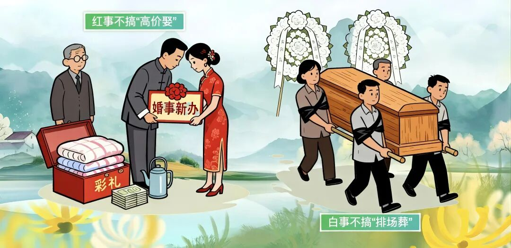
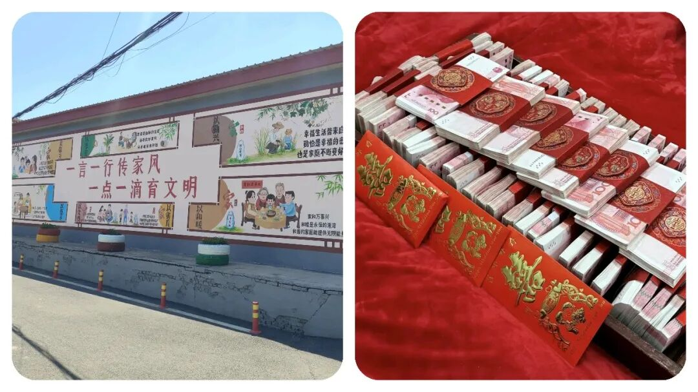

# 体制内人员回乡抬棺被“问责”？到底冤不冤？乡村“人情和规矩”到底该怎么选？

# 体制内人员回乡抬棺被“问责”？到底冤不冤？乡村“人情和规矩”到底该怎么选？

原创 点击关注👉🏻 点击关注👉🏻 田间烟火

在小说阅读器读本章

去阅读

在小说阅读器中沉浸阅读

点击上方蓝字关注我们

  

田间烟火🔥

大家好，我是【田间烟火🔥】～

今天我们来聊聊一下民间的人情世故：“如果你的亲人或者邻居亲戚去世，身为公职人员，你会去帮忙抬棺吗”？

看上去这是个简单不过的选择，但等到放在寿宁县鳌阳镇的现实中，却成了一场闹得沸沸扬扬的风波。

6月11日，这里一户人家办丧事，因为坚持走老习惯，在送葬时抬棺上街，结果惹来了一大堆麻烦。

镇上本来再三强调，丧事要简单办，相关家庭还专门签了承诺书，说不会抬棺过街。

但等到送葬那天，亲友队伍还是照做了。

没过多久，几名公职人员被问责，主家人也被拘留，殡仪馆驾驶员被停职。

风波一出，不少人觉得委屈。

只是在乡里帮自家亲戚抬棺，真有那么严重？

在福建，操办红白喜事，左邻右舍不帮忙，哪成得了？

尤其葬礼，大伙儿合力扛着走，才算是体面送别。

你若是亲叔去了，明明人在家门口按兵不动，时间长了，难道村里人还愿意帮你家办事？

本地规矩，红白喜事大家互帮互助，今天你帮我，明天我帮你。

这就是乡下的情分。

那白事又和结婚不一样。

结婚可以拉到酒店，吃席热闹，不去帮忙影响不大。

丧事办在家门口，怎么搬到酒店去？

酒店也没人敢让你抬棺进门。

遇上亲人过世，整条街上的人都会来搭一把手。

村干部如果袖手旁观，那还算亲戚吗？

背后议论马上传开。

01

  

乡情与规矩的两难选择

  

可问题在于，遇到新规要求简办，作为体制内公职人员，到底要听乡情还是守规矩？

这事其实比表面复杂多了。

不是没人懂规矩，也不是哪个老百姓想和官方赌气。

对于很多乡镇里的基层公职人员来说，这类人情给的压力，真能让人骑虎难下。

如果规矩太死板，一刀切，既要求公职人员板着脸回避，时间长了，他们不仅要被处分，老家的人情关系也会裂缝。

左一张情、右一张规矩，脚下这条线，真的很细。

记得有个地方，那年春节期间，为了疫情管控，不准聚餐办席。

结果村里一名老师吃了自家侄女的酒席，第二天就被处分。

群众说“太绝情”，领导觉得“不遵号令”。

最后大家都很窝心。

这和今天的寿宁事件，其实是同一种纠结。

抬头是规矩，低头是人情，两边都难得罪。

不过，也不是所有地方处理起来都一样。

有一些镇，动迁后，年轻干部流失严重。

到亲戚家帮忙干活，公私不分的事反倒少了，干部自己也尽量远离风头。

村里规矩淡了，乡里人情也松散了不少。

不能说哪边就一定对，关键是怎么看待“规则”和“温度”之间的界线。

02

  

争议背后的核心问题

  

翻回来，寿宁的这次处分，为啥争议那么大？

说到底，就是干部“怎么做都可能是错”。

帮忙吧，怕被通报罚；

不帮吧，又成冷情汉。

乡村的习惯不是一天两天就能变，也不能要求村干部一碗水端平、面面俱到。

很多人也明白，现在农村规矩在变，白事、宴席都比原先低调简单不少。

但祭祀这事，人情分分合合，总是绕不过。

真正的问题，其实不是乡里干部不明白新的政策，而是怎样把规矩和人情分清。

03

  

可参考的灵活处理方式

  

你可以像有些地区那样，干部告别“跑场宴”，提前立规矩，所有红白喜事都定标准，一家一户都能照章“办席”，既不冷落亲情，也不越线。

这种做法，反而减少了口水战，村里该帮忙的帮，规章也挂在墙上，谁也没话说。

04

  

如何平衡身份与乡情？

  

再说回寿宁事件，这场风波，表面看是丧礼风俗和政策之间较劲，实际上考验的，是公职人员面对底线和人情的选择。

作为普通人，当然会希望亲情最重要。

但公职身份注定和普通百姓不一样。

你只要一穿这身衣服，无论在哪，都可能被大家用更高的标准挑毛病。

你说委屈，但大家想看的，是“干部榜样”，而不是“我家的谁谁”。

真要说教训，就在于“做公做事”不能光靠情面。

这社会越讲规矩，大家办事才越踏实，但情分的温度也不能凉了。

形象、底线，哪个也甩不下。

这道理早就写在小事里，但每次一有风波，还是会有人闹心。

说到底，公职人员要扛起身份的压力，也不能忘了自己从哪个村出来。

大家该办的事照办，该守的规、该避的线也要没商量。

规则要硬，心却要软点，这是最难的考验。

身在乡村，做人做事不容易。

人情是桥，规矩是路，两样都不能断。

没经历过的人，很难讲清什么叫“骑在规矩和人情之间”。

像寿宁这事，只能算无奈，但未必就是结局。

走得长远，终究是边界清了，日子才轻松；

底线守住了，亲戚才相处安稳。

这才是干部和乡情可以和谐共处的最佳状态。

🍯点击下方👇🏻

  

对此，你怎么看待该事件呢？

评论区聊聊你的看法～

「本文仅供阅读，无不良引导，请理性阅读」

如有侵权告知秒删，素材事件源于：

《[关于寿宁县鳌阳镇移风易俗事件通报](https://mp.weixin.qq.com/s?__biz=MzA5MTc1MTIzNQ==&mid=2651026374&idx=1&sn=8be3d310c684b5574889190b2570541f&scene=21#wechat_redirect)》

分享

收藏

点赞

在看

修改于

---

原文：https://mp.weixin.qq.com/s?__biz=MzY4NDI4OTA3NA==&mid=2247490994&idx=1&sn=f7c6bcb30e0372eb0c16ae200cb81577&chksm=f3a760efc4d0e9f964cc9384fa4ae99a904de7b927518b026699de51505f5c2835a9c2e22837
