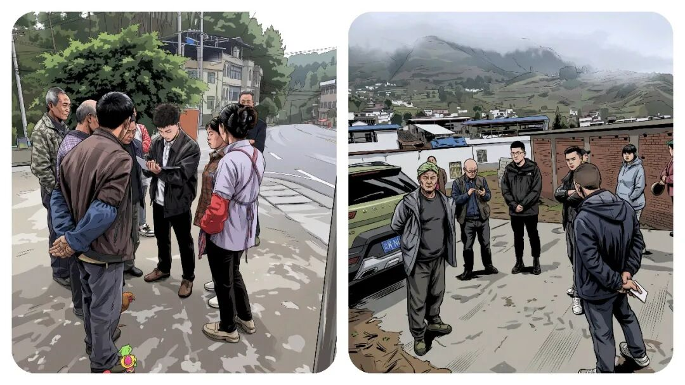
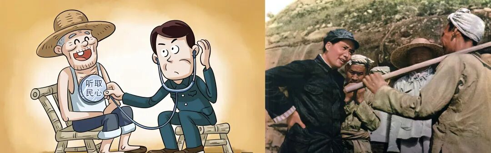
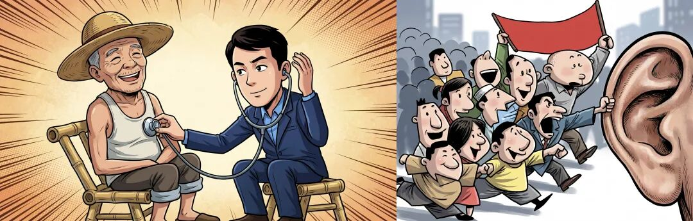
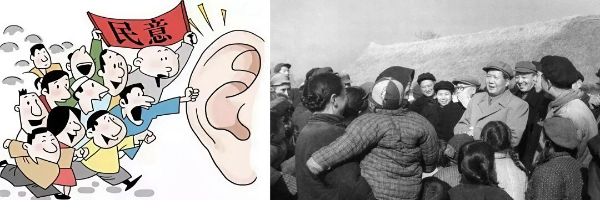

# 为什么“乡镇干部”在开展群众工作的时候，害怕群众“生气拍桌”？这 5 招，教你克服沟通焦虑。

# 为什么“乡镇干部”在开展群众工作的时候，害怕群众“生气拍桌”？这 5 招，教你克服沟通焦虑。

原创 点击关注👉🏻 点击关注👉🏻 田间烟火

在小说阅读器读本章

去阅读

在小说阅读器中沉浸阅读

点击上方

蓝字

关注我们

田间烟火🔥

大家好，我是【田间烟火🔥】～

开聊前，我先问大家一个问题：

你觉得乡镇年轻干部最怕的工作是什么？

-   A. 熬夜加班，写材料报台账
    

-   B. 下乡跑腿，奔波走村入户
    

-   C. 直面群众，处理情绪化矛盾
    

我在基层深耕多年，见过太多新人成长，熬过 A 、扛过 B ，最后发现 C 才是新人最大的难关！

为什么这么说呢？

不废话了，今天我们就来聊聊：

如果有群众“对着你拍桌子…”，你该怎么破除直面群众时内心的胆怯？你到底该如何破局呢？

01

  

新干部怕直面群众，是普遍现象

  

刚到乡镇工作的小伙伴，很多时候不是怕加班，不是怕业务难懂，最怕的是面对群众。

一边是陌生号码打来的电话，一边是老百姓站在门口要说事，结果一个激动起来，谁都顶不住。

这种状况说老实话，大多数人刚上岗都会遇到，毕竟一张嘴开口，面对的是各种诉求、甚至情绪激烈的责骂，有点心理阴影也正常，谁不是这么过来的？

对年轻干部，心理上的第一道关很难跨。

身边不少人吐槽，只要遇到情绪失控的老乡，腿软、脑袋空，嘴也说不出话。

有的人下乡久了，心理压力更大，只要一想到要单独下村都发怵。

这种情况不只是现在，早些年也一样。

现在有些小镇，年轻干部在调解邻里矛盾时，被群众围着骂、拍桌子发泄，就是常有的事。新手当场懵圈，有人甚至一度不敢再接群众来访。

大家都说，不会跟群众打交道就没法干下去。那到底怎么“脱敏”，怎么挺过这段阵痛？

02

  

破除胆怯的五个实用方法

  

  

  

认清定位：群众的火通常不是冲着你

多数时候，群众的火不是冲着你本人。

背后其实是憋了一肚子委屈，早就跑了几个部门没解决，到你这里，只是“最后一站”。

很多年轻人想，不是自己能力不够？

是不是有啥说错？

其实不是，人家恼的是事本身，你正好站在这儿。

明白了这点，心里就能稳一点。

一个现实例子，北京某社区居委新员工，刚入职就遭到退休居民拍桌子质问。后来他定了心，认清角色，慢慢能坦然面对。

  

  

学会倾听：别急着解释，先让群众说完

还有一种情况，“解释太快”容易让矛盾更大。

刚工作的人，往往急着讲政策，群众还没说两句就打断。

结果群众觉得不被尊重，火气更大。

首先得让老百姓把话说完，问题才容易解决。

你只点头或者递杯茶，先把情绪稳住，等声音小了，再慢慢谈事，效果要好得多。

  

  

守住底线：实话实说，给出明确节点

最常见的难题是“怕答应办不到”。

像经常出现的农村养老、土地纠纷，你不敢正面回答，结果群众觉得你推诿。

其实，只要说清楚：“这个事我没权限，但可以请示问问领导”，给出具体时间节点，说到做到，即使结果不理想，群众也会理解。

某地政务大厅，工作人员就用这种方式，群众虽有不满，但态度变得温和不少。

  

  

跟老同事学习：现场看一遍胜过自己练十遍

新手沉浸在业务学习里，并不懂怎么处理情绪。

其实，解决这个压力最有效的办法，就是找个老同事带你出门。

看他们怎么开场、接话、应对激烈场面，学久了，也就能慢慢适应。

某村调解员带新人，跑了十几趟现场，最后新人独自上阵，也能轻松应对。

  

  

打好政策基础：政策吃透了，底气自然来

胆怯不是实力问题，而是心理防线。

底气从哪里来？

政策要吃透。

有时一问三不知，群众就不信任你。

你把这个流程、文件、负责人的联系方式都背熟了，随手一查就能回应。

政策说清楚了，群众自然先“软三分”。

有一名乡镇社会事务员，刚上岗时被问到低保政策，语焉不详的时候群众不买账。后来把政策熟读，回答精准，交流顺利多了。

03

  

面对胆怯：这是成长的必经之路

  

说到反向情况，有些人一开始不是怯场，而是太“刚”了。

某村年轻新干部，坚定硬刚群众，结果没几天被投诉。

后来领导提醒，沟通靠“软”，不是硬碰硬。

事实说明，一味硬气，容易激化矛盾，反而不利处理。

当然，环境不同，压力大小也是有不一样的表现的。

大城市区街道，群众文化水平较高，沟通容易。

对于那些，偏远农村、居民诉求多、沟通难度大，需要更强心理素质。

也有人天生外向型，适应快；但大多数还是要靠历练消除心底的怯懦。

一次次摸爬滚打，慢慢就能成长。

再遇到激烈场面，不慌了，腿往前迈一步，就是进步。

成长过程里，胆怯不是错，只要勇敢向前，就能看到变化。

基层历练这几年，成了将来最珍贵的回忆。

对于那些想提升自己的干部们，别抱侥幸，也不能觉得自己特别“失败”。

这道心理关，大多数人都会经历，有的人需要时间长一些，有的人快一点。

无论如何，主动面对、不断尝试，才能真正适应基层工作。

等未来成了“老猫”，回头看这些阵痛，都是最真实的财富。

乡镇年轻干部的心理压力，不是难题，也不是奇怪。

面对群众的勇气和能力，需要磨炼。

简而言之，五步：认清定位、学会倾听、守住底线、跟老同事学习、打好政策基础，就是解法。

只要你一步步走过来，困难自然会消减。

每一次被骂、被指责，都是你变得更坚强的过程。

未来路还长，勇敢迈出去，这才是成长的真相。

🛒点击下方👇🏻

你刚下村时，有没有被群众情绪震慑、不敢沟通的经历？

欢迎评论区聊聊你的感受呗～

分享

收藏

点赞

在看

---

原文：https://mp.weixin.qq.com/s?__biz=MzY4NDI4OTA3NA==&mid=2247491155&idx=1&sn=6bd48a82039b5a0492ee49b4358df4e2&chksm=f3a7630ec4d0ea18711514c884286cc2eaf386ec094d80b064d03ed719554e06d0b8e5f4ee11
