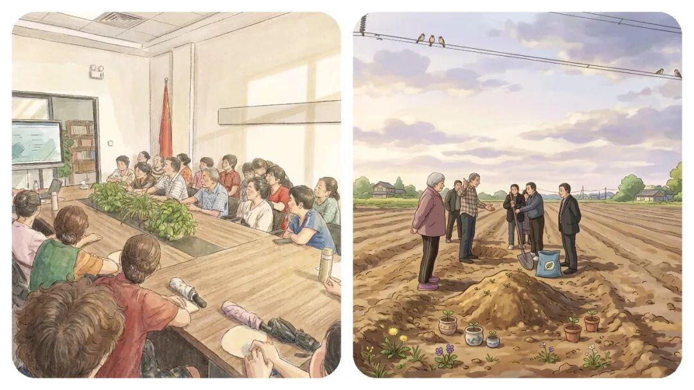
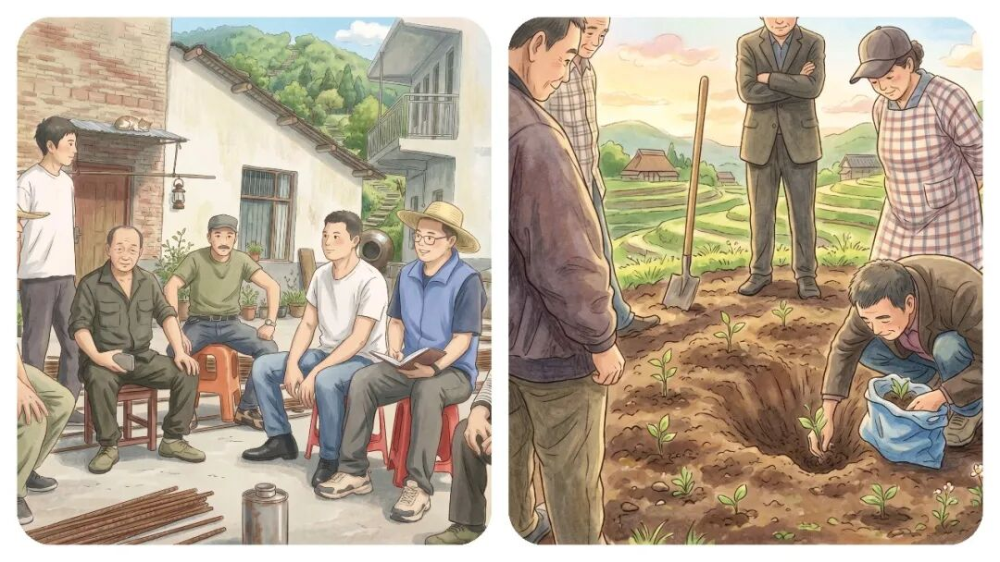
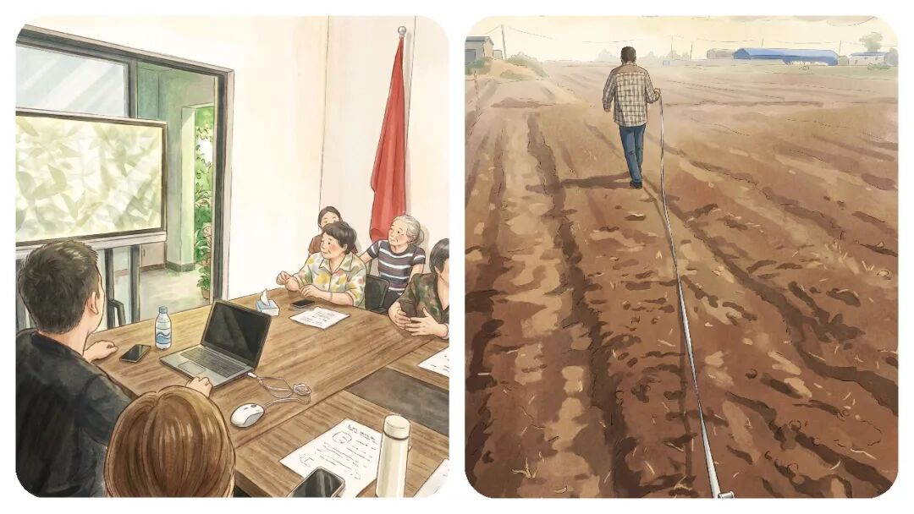
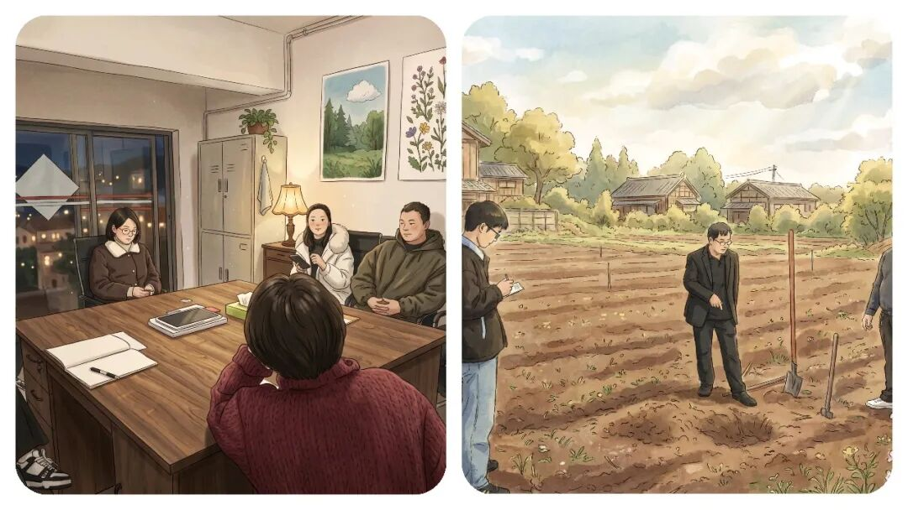
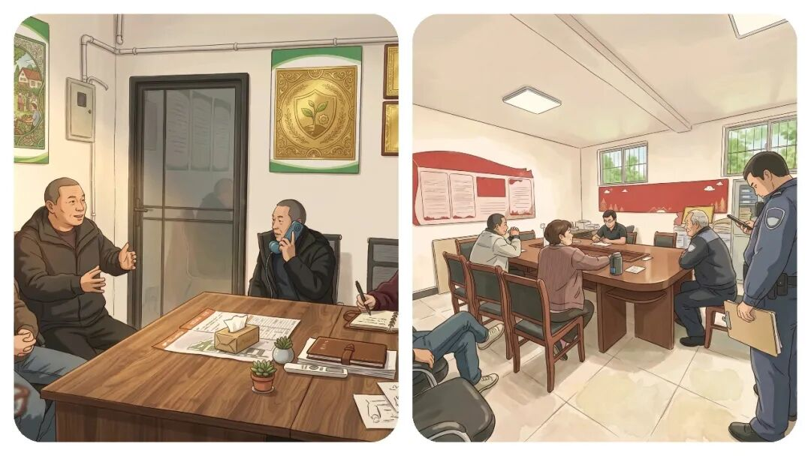

# 乡镇调解员每天都在干嘛？调解了无数次“矛盾纠纷”，发现“和稀泥”，才是最高境界！

# 乡镇调解员每天都在干嘛？调解了无数次“矛盾纠纷”，发现“和稀泥”，才是最高境界！

原创 点击关注👉🏻 点击关注👉🏻 田间烟火

在小说阅读器读本章

去阅读

在小说阅读器中沉浸阅读

点击上方

蓝字

关注我们

田间烟火🔥

大家好，我是【田间烟火🔥】～

先问大家一个问题：

你觉得社区调解解决矛盾，靠的是什么？

-   A. 讲道理，掰清谁对谁错
    

-   B. 两边安抚，简单劝和了事
    

-   C. 左右调和，看似“和稀泥”
    

我在基层做调解多年，经手过上百起邻里纠纷，试过A、做过B，最后才懂：真正能化解矛盾的，其实是C。

但基层调解的“和稀泥”，从不是敷衍糊弄，而是普通人不懂的高级处事技术。

今天结合我亲身处理的漏水、噪音、邻里纠纷真实案例，跟大家聊聊一下这个乡镇调解的真相～

很多人觉得社区调解员就是“说说道理，分分对错”，还有人觉得他们是“和事佬”，给两边都安慰。

有人甚至以为他们就是糊弄，遇到问题就搪塞过去。

可是，干过几年的人都明白，社区调解其实是门技术活，说到底，真正能解决问题的“和稀泥”不是偷懒，是把难题变软。

01

  

那些调解现场的真实矛盾

  

说说几个真实场景，看看调解员都碰过哪些“翻车”现场。

有一年夏天，三楼老A差点跟四楼老B打起来。

老A说自家墙皮掉了，楼上漏水，要求赔五千元。

老B更难，七十岁了，媳妇重症，儿子不管后事，自己手头只有点棺材本。

两边都喊着“有理”，都没钱也没退路。

调解员上门讲半天法律、做邻里劝说，还是闹到老A拍桌子，老B躺地哭要“了结”。

谁去都头大。

再看看噪音这个常见矛盾。

五楼孩子学琴，四楼老人心脏不好。

没商量，就变成震楼器大战。

双方在群里对骂，其他人纷纷“选边站”，整栋楼乱成一锅粥。

调解员一到，发现各自都堵着气，要的是对方认错。

道理都讲不通，面子问题怎么解？

邻里纠纷越来越多，宠物问题又是一类。

二楼阿姐养的狗在一楼门口尿了，小伙子一脚踢狗，阿姐要赔五千精神损失，小伙子要求道歉，互相揪住不放。

调解员面对哭着抱狗的阿姐、冷笑的小伙，只能想办法降温。

有人问，这种事能调吗？

社区调解靠法庭那一套没用。

讲多少法律，谁也不服。

调解员要的是“过得去”，让双方能有个交代，不被彻底伤着。

02

  

有效调解的三板斧

  

总结下来，砍过三板斧：灭火、给面子、拉队伍。

  

  

第一步：先灭火

“灭火”是真正的第一步。

很多新人急着讲规矩，调查责任。

这时候，两边都只想发泄，根本听不进去。

所以调解员进门先递水，陪着诉苦，让当事人把委屈和气先发出来。

你陪他骂半个钟，他舒服点了，才愿意谈条件。

漏水那个案例，老A本来要五千赔偿，骂过一轮之后，只想补个墙，闹心就好。

钱不是问题，气顺了才有谈判空间。

  

  

第二步：给足面子

“给面子”是中国人最在意的点。

矛盾能拖很久，多半是咽不下那口气。

往前看，五楼妈妈被骂没素质，难开口认错；

四楼大叔装“震楼器”，口头不认怂。

调解员分别单独聊，承认各自技术和难处，主动让对方下台阶。

最后五楼调整了练琴时间，四楼停了“震楼器”，群里互相感谢。

两家人都觉得自己没吃亏，这才是真的“和稀泥”的高明，不是糊弄，是让大家面上都能过去。

  

  

第三步：拉队伍造氛围

还有拉队伍造氛围。

一对二的调解，气场太弱。

调解员带楼门长、维修师傅、社区慈善基金上阵，三方帮忙，金额压到合理底线，动之以情，补以实惠。

老A出了三百，老B出五百，社区再补五百，墙就补上了。

最后，两家还一起吃顿饭，关系不但没恶化，反而融洽不少。

看似简单，其实调解员是“全能协调者”，需要随时组局，有的放矢。

03

  

调解的边界：不是所有矛盾都能调

  

但不是所有事情都能调得好。

隔壁社区去年碰到小夫妻闹离婚，男方要分房产，女方要抚养权，僵持不下。

调解员努力四轮，还是没能让双方和解，女方还把水杯摔在脚边。

半年后女方再来，已经心态平和。

说到底，有些裂缝是社会现象，靠调解员没法一次解决。

现实里，像婚姻、金钱这样“落地”的纠纷，有时只能让时间过一遍。

如果纠纷升级到刑事，像这样家暴、故意伤害，调解员会直接报警，让专业力量介入。

经济纠纷如大额债务、合同问题，建议走法院诉讼渠道。

边界很清楚：民事纠纷尽力调，刑事立即报，经济建议诉。

不逞能，不背锅，保护自己同样重要。

04

  

给新手调解员的建议

  

基层调解员不是万能帖，要懂得分寸。

新手调解员要记住三句话：

1.  别急着当判官，居民不是来听法律课，是来找人撑腰。先情绪共鸣，再理性分析。
    
2.  手头备好工具箱，手机存维修师傅、法律援助、心理咨询、社区慈善等各种资源。现场出方案比回去“问问”靠谱太多。
    
3.  保护自己。遇到敏感事，两人在场，提前录音，冲突激烈就先撤离。基层经验告诉大家，调解中误伤与投诉常有，要学会自我防护。
    
4.  
    

05

  

最好的调解员是时间

  

有趣的是，那个踹狗的小伙子结婚了，还主动邀请调解员去婚礼。

问起当年为狗尿跟阿姐闹大，他苦笑说觉得当时太年轻，事情闹得太过。

几年过去，大家都明白一件事，时间才是最大调解员。

调解员做的，就是帮居民在时间里，少受点伤。

社区调解员其实就是“和稀泥高手”，但他们的和稀泥不是胡来，而是让矛盾双方在现实里找到可接受的出口。

有时候，调解当场没能成功，不等于以后就没效果。

情分在，比结果更重要。

面对居民，一线工作者要顺着情绪，带着工具箱，守好自己的安全。

社区不容易，调解员更不容易。

现实里，没有解决不了的结，只有时间和努力够不够长。

调解看似简单，实则要兼顾人情、底线、多方资源。

🛒点击下方👇🏻

  

你认为邻里纠纷最难处理的点是什么？

评论区聊聊呗～

  

分享

收藏

点赞

在看

---

原文：https://mp.weixin.qq.com/s?__biz=MzY4NDI4OTA3NA==&mid=2247491319&idx=1&sn=9271952630c10371d8af350b1490090a&chksm=f3a763aac4d0eabc02448c411930ef5d7fcc1831dd70d0fda51f8abc35b33c469bbd82c58a14
