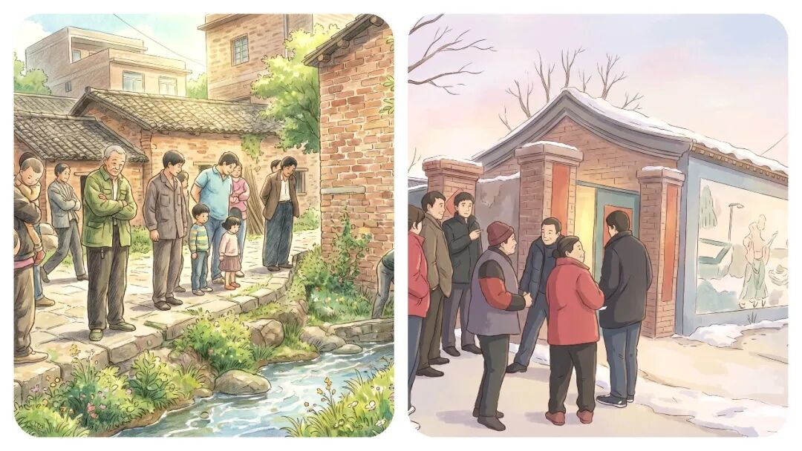
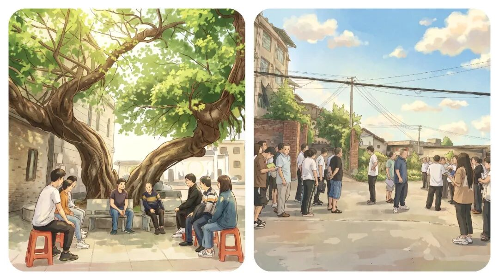
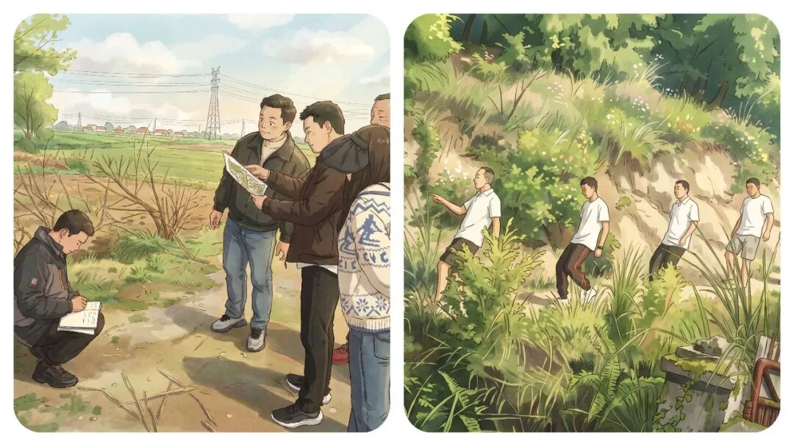
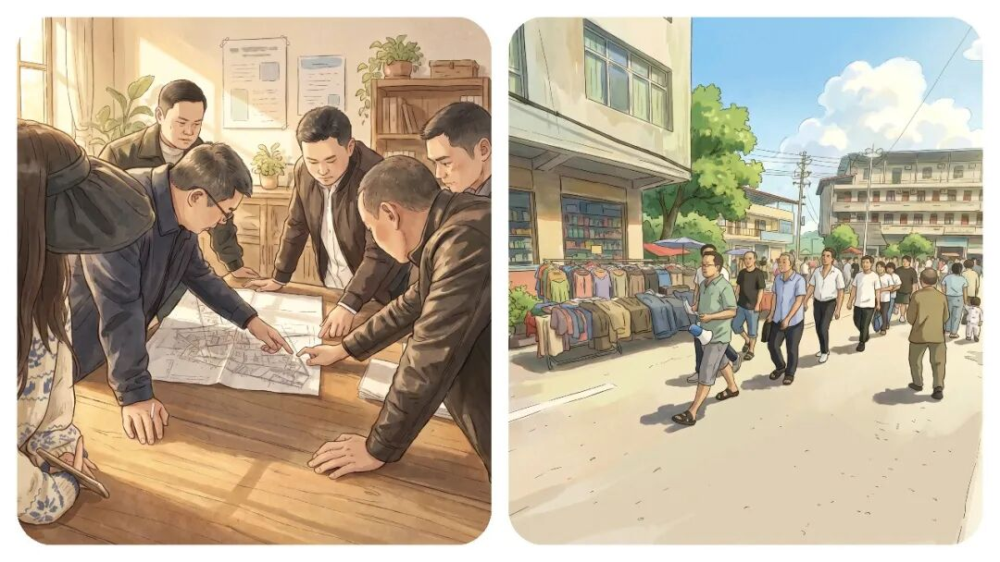

# 你有没有发现，“乡镇干部”脾气越来越爆了，到底是什么原因？

# 你有没有发现，“乡镇干部”脾气越来越爆了，到底是什么原因？

原创 点击关注👉🏻 点击关注👉🏻 田间烟火

在小说阅读器读本章

去阅读

在小说阅读器中沉浸阅读

点击上方蓝字关注我们

田间烟火🔥

大家好，我是【田间烟火🔥】～

不知道你有没有发现？现在身边的同事，脾气越来越暴躁了？

这到底是怎么了？路边偶遇、小区办事，谁没碰到点小摩擦？

现在大家都觉得，基层越来越容易起争执。

不少人感慨，随便一句不对付、等个窗口两分钟，气氛就上火，眼看小事都能闹出大动静。  

平常赶集、上下班通勤，狭路相逢，原本随便让一下就过去的事，有时一句话说得急，瞬间就顶牛。  

其实参与的人大多没恶意，只不过情绪来了收不住，旁边人也懒得劝，生怕卷进麻烦。

01

  

基层火药桶：小事为何变大事？

  

你说这是什么原因？

问题还真不只是脾气直率或者较真难缠。

很多时候，大家不是故意找茬，而是多年琐事积压，压力太大没地方排。

村民为收成、孩子学业操心，工人心里想着收入不稳，生活本就不容易。

碰到一点点小事，心里憋着的压抑，自然就找个出口，发泄出来。

  

  

窗口矛盾：双方压力的集中爆发

尤其是办事窗口、代办点更明显。

双方都带着烦躁情绪，沟通常常小问题被无限放大。

工作人员一岗多责、天天迎检、走访、填台账，干活像转陀螺，窗口只有几个人，各类事情一股脑涌进来，还得耐心细致解释。

长期超负荷，谁能一直保持温柔耐心？

在苏州某村，去年办社保窗口就一度出现持续争吵。

有群众催得急，工作人员耐心解释几句，对方不满，场面差点失控。

后来地方分流办理、提前预约，让窗口压力分散，矛盾自然减少。

这种经验，其实不少地方都开始在用。

但反过来，上海某街道推行办事自助，减少人工窗口后，群众反而不适应，自助设备不能解决所有琐事，生硬流程加剧了情绪紧张。

有时候简化流程能缓解压力，有时候却会带来新不满。

说到底，适度调整才靠谱。

02

  

情绪传导：压力叠加的恶性循环

  

再说基层工作人员，天天接待情绪焦虑群众，被追问被催促，精神压力大，缓冲空间越来越小。

但条件稍好地区，乡镇，工作人员可以轮岗、分时休息，缓解了不少疲劳。

可多数乡镇干部和村居工作人员没这个条件，琐事连轴转，既要当客服又要做协调员，压力只能自个儿消化。

氛围大变，大家容易一上来就带着火气。

群众遇到问题不愿等，把正常答复当成敷衍。

干部解释几句，群众听不对味就不舒服。

情绪互相传导，小事较劲，大事变麻烦。

03

  

该怎么解决：从分流压力到互相包容

  

怎么办？

这时候，别硬碰硬，更不能急着辩对错。

遇到火气上头的人，先稳情绪，慢慢解释。

材料没准备齐、流程复杂，现场焦急时，工作人员要先安抚，分开步骤讲清楚。

不是简单讨好，而是认清大家都不容易，别互相添麻烦。

有的地方做得不错，云南某县，把高峰办理时间错峰分流，岗位任务协调，工作人员压力减轻，群众交流更平和。

只要办事流程不堵塞，矛盾就减少，说明关键还是压力负担。

但并不是每个乡镇都能轻易做到。

有些地方人手紧、事务多，想改善也不容易。

像河北某村，今年试图改进窗口管理，效果不算理想，群众等候还是多、情绪摩擦也会爆发。

这个问题不是一招就能解决的，需要持续细化。

04

  

核心根源：压力叠加，不是人心变坏

  

眼下大家都敏感急躁，干部也是，群众也是。

不是说性格变直，而是压力太大。

说话容易带着火气，抬杠变多，最后心情更糟。

如果发现自己越来越容易发火，最好早点调整状态，别等矛盾激化再后悔。

生活工作节奏变快，收入不稳、生活开支涨，干部任务重、责任压力大。

日常一句无心话语、一次等待，都变成情绪导火索。

如果能认清这一点，遇到群众带火气过来，别跟着情绪走。

自己压力大时也别把烦躁情绪转嫁给群众。

说白了，负面情绪总要找地方宣泄，但不能都转移到人际交往上。

基层工作本就复杂繁琐，不管是干部还是群众，都不愿成为矛盾冲突的一方。

矛盾、戾气增多根源是压力叠加、节奏紧绷，不是某一方变差。

想让基层关系更顺畅，遇事多冷静换位思考，少些对立，多点包容，哪怕压力大，也别互相消耗。

简单点说，压力管理和流程优先，才让“小火药桶”散掉，沟通才变回温和。

🛒点击下方👇🏻

  

现在不管办事还是邻里相处，一点小事就容易上火，你平时缓解负面情绪都有什么好办法？评论区交流一下呗～

---

原文：https://mp.weixin.qq.com/s?__biz=MzY4NDI4OTA3NA==&mid=2247491335&idx=1&sn=92bc420099eb94f8c30069b0bee61bbe&chksm=f3a7625ac4d0eb4cba3ce9d8c49936234952bdde6dc16dd9b3b72148ef5dde11a101ebfad5e4
